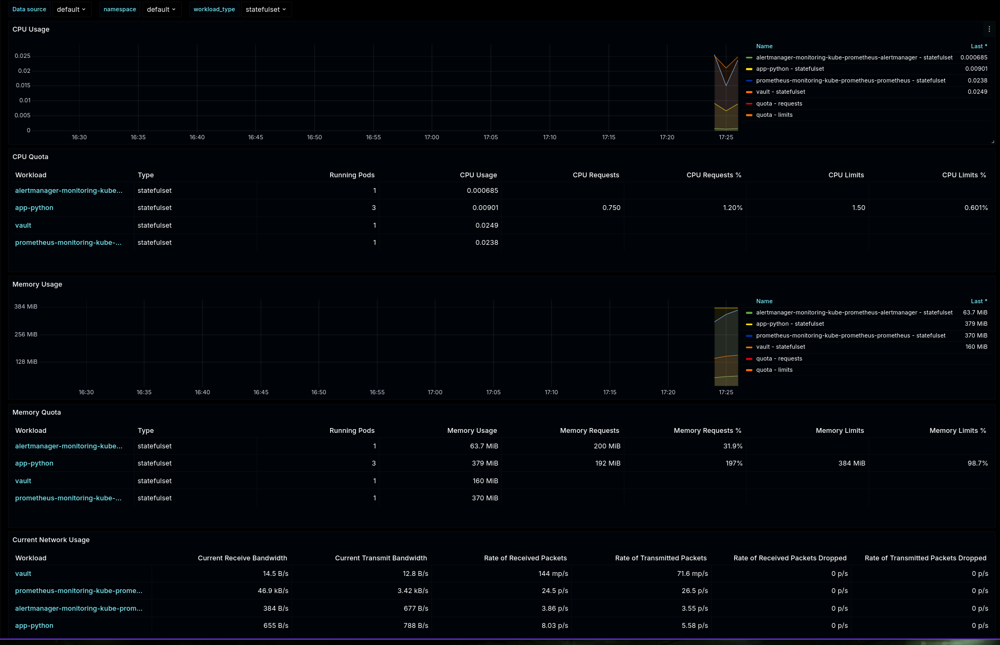
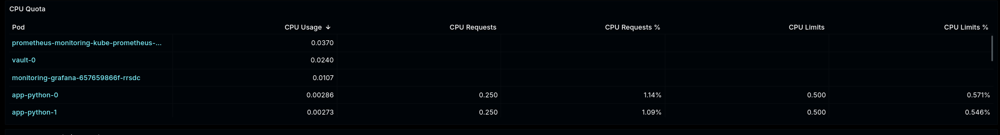
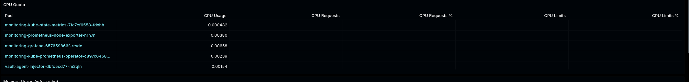
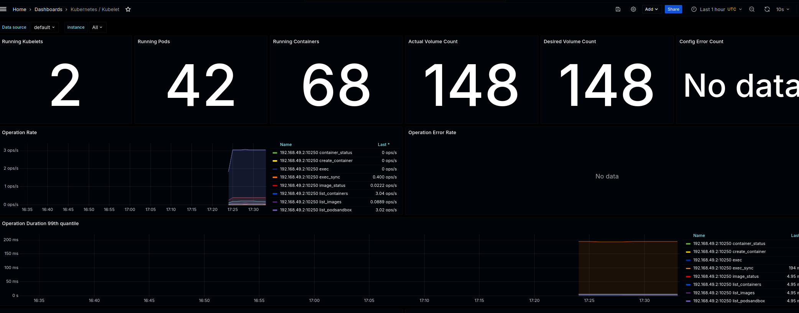
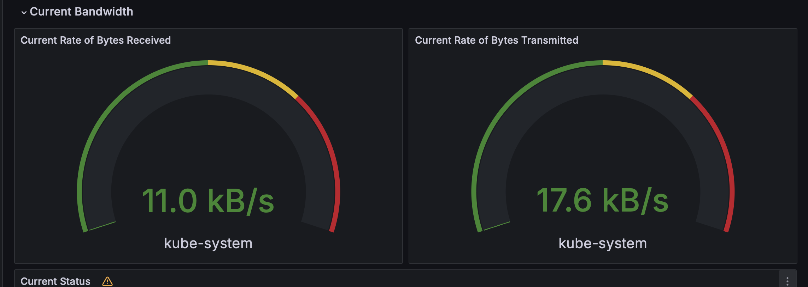
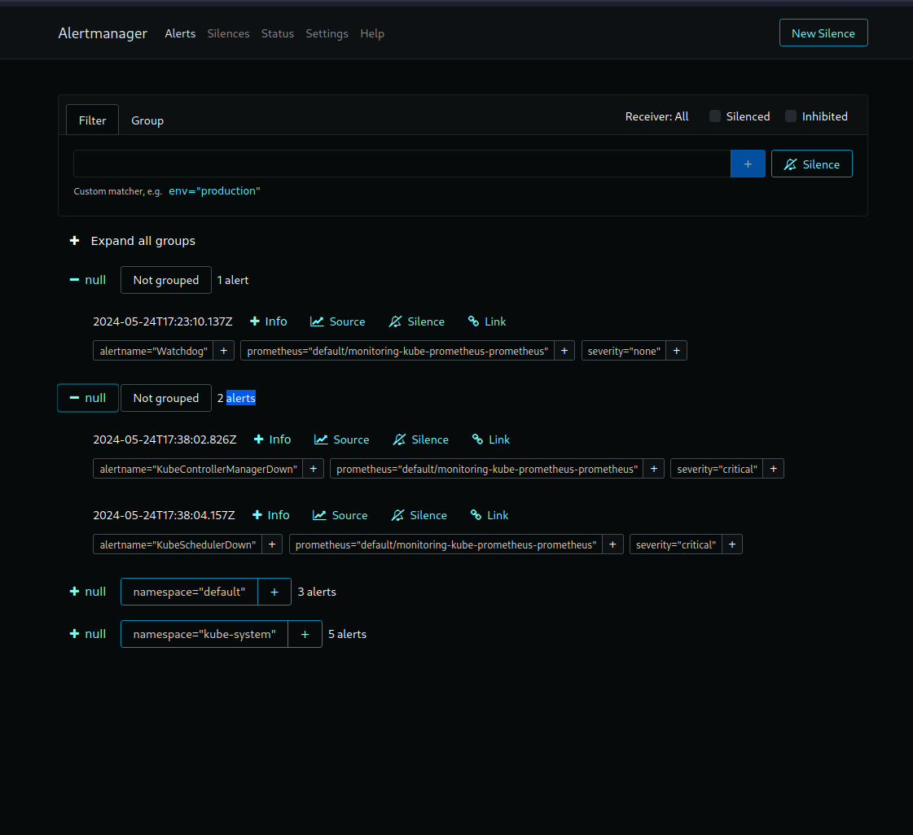

# Monitoring

## Components

### Prometheus operator
is used to automatically deploy, configure, and manage Prometheus and other monitoring tools.

### Prometheus
is used to collect time-series data (metrics). Can scrape metrics for multiple services.

### Alertmanager
receives alerts from Prometheus. It also can group, deduplicate, and route alerts to different destinations.

### Prometheus node-exporter
provides OS metrics such as CPU info to prometheus

### Prometheus blackbox-exporter
is a tool used for monitoring targets that Prometheus can't directly scrape, thus the name "blackbox". Uses HTTP and other protocols to access external targets.

### Prometheus Adapter for Kubernetes Metrics APIs
translates between Prometheus and Kubernetes' Custom Metrics API. Basically an adapter that bridges the two tools.

### kube-state-metrics
exposes the state of Kubernetes objects (Deployments, Pods, Nodes, etc) as Prometheus metrics.

### Grafana
is used for visualization, dashboards, graphs, analysis.


## kubectl get po,sts,svc,pvc,cm

```
NAME                                                              READY   STATUS              RESTARTS   AGE
pod/alertmanager-kube-prometheus-stack-1-alertmanager-0           0/2     Init:0/1            0          7s
pod/app-python-0                                                  2/2     Running             0          14m
pod/app-python-1                                                  2/2     Running             0          14m
pod/app-python-2                                                  2/2     Running             0          14m
pod/kube-prometheus-stack-1-grafana-56b4848b88-9nr5n              0/3     ContainerCreating   0          39s
pod/kube-prometheus-stack-1-kube-state-metrics-69cf46f66d-nlpxd   1/1     Running             0          39s
pod/kube-prometheus-stack-1-operator-64f8d95854-hcb78             1/1     Running             0          39s
pod/kube-prometheus-stack-1-prometheus-node-exporter-b46vd        1/1     Running             0          39s
pod/prometheus-kube-prometheus-stack-1-prometheus-0               0/2     Init:0/1            0          7s
pod/vault-0                                                       1/1     Running             0          3h22m
pod/vault-agent-injector-dbfc5cd77-m2qln                          1/1     Running             0          3h22m

NAME                                                                 READY   AGE
statefulset.apps/alertmanager-kube-prometheus-stack-1-alertmanager   0/1     7s
statefulset.apps/app-python                                          3/3     14m
statefulset.apps/prometheus-kube-prometheus-stack-1-prometheus       0/1     7s
statefulset.apps/vault                                               1/1     3h22m

NAME                                                       TYPE        CLUSTER-IP       EXTERNAL-IP   PORT(S)                      AGE
service/alertmanager-operated                              ClusterIP   None             <none>        9093/TCP,9094/TCP,9094/UDP   7s
service/app-python                                         NodePort    10.109.7.77      <none>        8000:32728/TCP               14m
service/kube-prometheus-stack-1-alertmanager               ClusterIP   10.104.108.171   <none>        9093/TCP,8080/TCP            39s
service/kube-prometheus-stack-1-grafana                    ClusterIP   10.97.147.209    <none>        80/TCP                       39s
service/kube-prometheus-stack-1-kube-state-metrics         ClusterIP   10.110.200.7     <none>        8080/TCP                     39s
service/kube-prometheus-stack-1-operator                   ClusterIP   10.99.28.5       <none>        443/TCP                      39s
service/kube-prometheus-stack-1-prometheus                 ClusterIP   10.96.231.128    <none>        9090/TCP,8080/TCP            39s
service/kube-prometheus-stack-1-prometheus-node-exporter   ClusterIP   10.97.217.94     <none>        9100/TCP                     39s
service/kubernetes                                         ClusterIP   10.96.0.1        <none>        443/TCP                      13h
service/prometheus-operated                                ClusterIP   None             <none>        9090/TCP                     7s
service/vault                                              ClusterIP   10.102.220.197   <none>        8200/TCP,8201/TCP            3h22m
service/vault-agent-injector-svc                           ClusterIP   10.103.38.119    <none>        443/TCP                      3h22m
service/vault-internal                                     ClusterIP   None             <none>        8200/TCP,8201/TCP            3h22m

NAME                                                                  DATA   AGE
configmap/app-python-configmap                                        1      14m
configmap/kube-prometheus-stack-1-alertmanager-overview               1      39s
configmap/kube-prometheus-stack-1-apiserver                           1      39s
configmap/kube-prometheus-stack-1-cluster-total                       1      39s
configmap/kube-prometheus-stack-1-controller-manager                  1      39s
configmap/kube-prometheus-stack-1-etcd                                1      39s
configmap/kube-prometheus-stack-1-grafana                             1      39s
configmap/kube-prometheus-stack-1-grafana-config-dashboards           1      39s
configmap/kube-prometheus-stack-1-grafana-datasource                  1      39s
configmap/kube-prometheus-stack-1-grafana-overview                    1      39s
configmap/kube-prometheus-stack-1-k8s-coredns                         1      39s
configmap/kube-prometheus-stack-1-k8s-resources-cluster               1      39s
configmap/kube-prometheus-stack-1-k8s-resources-multicluster          1      39s
configmap/kube-prometheus-stack-1-k8s-resources-namespace             1      39s
configmap/kube-prometheus-stack-1-k8s-resources-node                  1      39s
configmap/kube-prometheus-stack-1-k8s-resources-pod                   1      39s
configmap/kube-prometheus-stack-1-k8s-resources-workload              1      39s
configmap/kube-prometheus-stack-1-k8s-resources-workloads-namespace   1      39s
configmap/kube-prometheus-stack-1-kubelet                             1      39s
configmap/kube-prometheus-stack-1-namespace-by-pod                    1      39s
configmap/kube-prometheus-stack-1-namespace-by-workload               1      39s
configmap/kube-prometheus-stack-1-node-cluster-rsrc-use               1      39s
configmap/kube-prometheus-stack-1-node-rsrc-use                       1      39s
configmap/kube-prometheus-stack-1-nodes                               1      39s
configmap/kube-prometheus-stack-1-nodes-darwin                        1      39s
configmap/kube-prometheus-stack-1-persistentvolumesusage              1      39s
configmap/kube-prometheus-stack-1-pod-total                           1      39s
configmap/kube-prometheus-stack-1-prometheus                          1      39s
configmap/kube-prometheus-stack-1-proxy                               1      39s
configmap/kube-prometheus-stack-1-scheduler                           1      39s
configmap/kube-prometheus-stack-1-workload-total                      1      39s
configmap/kube-root-ca.crt                                            1      13h
configmap/prometheus-kube-prometheus-stack-1-prometheus-rulefiles-0   35     7s
```

## Dashboards

### Cpu and memory usage



### Pods with high/low cpu usage in the default namespace





### Kubelet



### Network Usage



### Alerts



# Init Containers

## kubectl exec pod/app-python-0 -- cat /workdir/index.html

```
Defaulted container "app-python" out of: app-python, vault-agent, install (init), vault-agent-init (init)
<html><head></head><body><header>
<title>http://info.cern.ch</title>
</header>

<h1>http://info.cern.ch - home of the first website</h1>
<p>From here you can:</p>
<ul>
<li><a href="http://info.cern.ch/hypertext/WWW/TheProject.html">Browse the first website</a></li>
<li><a href="http://line-mode.cern.ch/www/hypertext/WWW/TheProject.html">Browse the first website using the line-mode browser simulator</a></li>
<li><a href="http://home.web.cern.ch/topics/birth-web">Learn about the birth of the web</a></li>
<li><a href="http://home.web.cern.ch/about">Learn about CERN, the physics laboratory where the web was born</a></li>
</ul>
</body></html>
```
