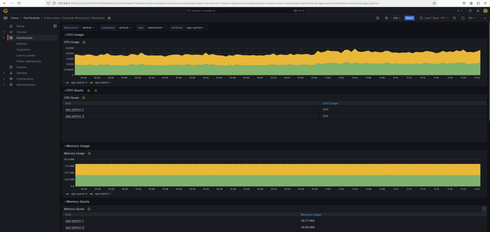
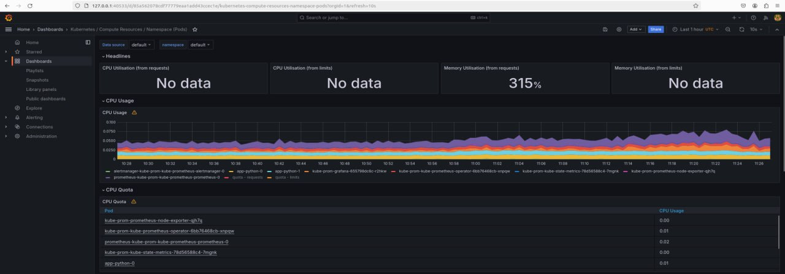
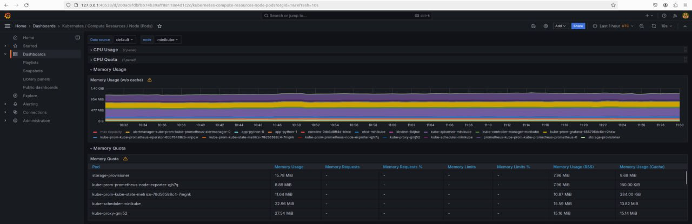
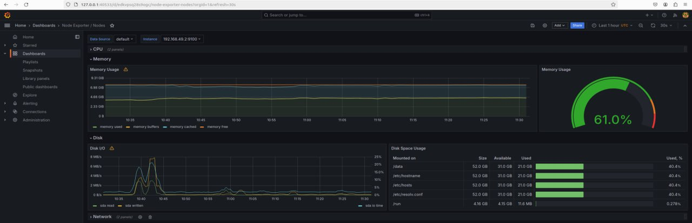
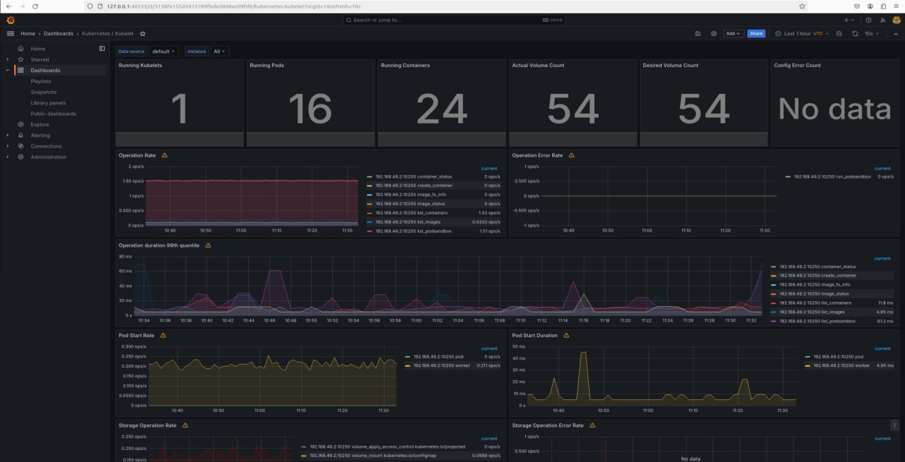
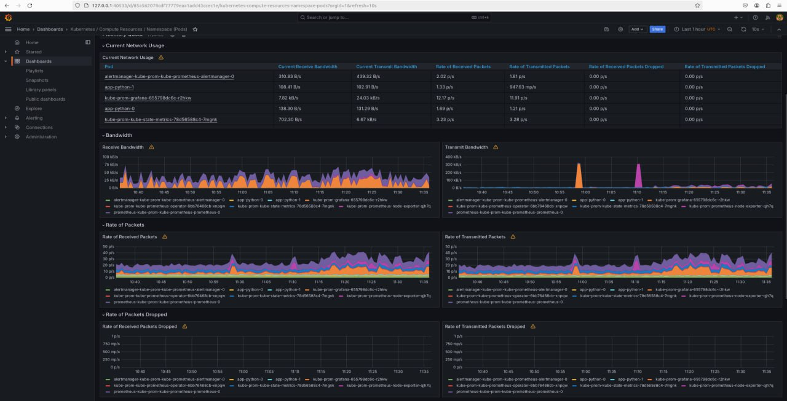
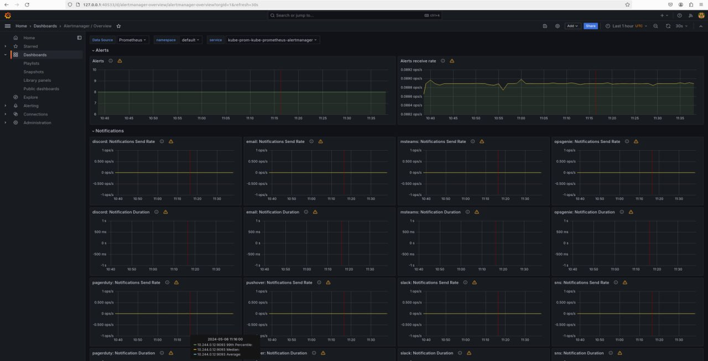
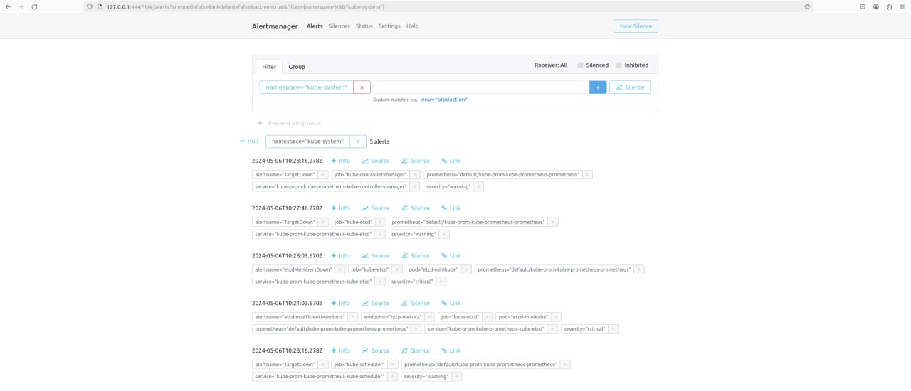

# Kubernetes Monitoring and Init Containers

## Task 1

### Components of the Kube Prometheus Stack

- **The Prometheus Operator:** manages and operates Prometheus and related monitoring components using Kubernetes resources.
- **Highly available Prometheus:** monitoring and alerting tool. Scrapes metrics from monitored targets.
- **Highly available Alertmanager:** handles alerts sent by Prometheus.
- **Prometheus node-exporter:** collects hardware and operating system metrics from the host machine, passing them to Prometheus.
- **Prometheus blackbox-exporter:** allows to monitor network endpoints and perform monitoring by simulating requests to services.
- **Prometheus Adapter for Kubernetes Metrics APIs:** allows Prometheus to query metrics from Kubernetes' metrics APIs, such as kube-state-metrics. Through it Prometheus collects Kubernetes-specific metrics, such as pods resource usage.
- **kube-state-metrics:** listens to the Kubernetes API server and generates metrics about the state of Kubernetes objects, providing insights into the health and performance of the Kubernetes cluster.
- **Grafana:** analytics and visualization platform. It provides a customizable dashboard for visualizing metrics collected by Prometheus and other data sources.

### Output of `kubectl get po,sts,svc,pvc,cm`

```commandLine
# List of pods

NAME                                                        READY   STATUS    RESTARTS   AGE
pod/alertmanager-kube-prom-kube-prometheus-alertmanager-0   2/2     Running   0          12m
pod/app-python-0                                            1/1     Running   0          15m
pod/app-python-1                                            1/1     Running   0          15m
pod/kube-prom-grafana-655798dc6c-r2hkw                      3/3     Running   0          13m
pod/kube-prom-kube-prometheus-operator-6bb76468cb-xnpqw     1/1     Running   0          13m
pod/kube-prom-kube-state-metrics-78d56588c4-7mgnk           1/1     Running   0          13m
pod/kube-prom-prometheus-node-exporter-qjh7q                1/1     Running   0          13m
pod/prometheus-kube-prom-kube-prometheus-prometheus-0       2/2     Running   0          12m

# List of stateful sets

NAME                                                                   READY   AGE
statefulset.apps/alertmanager-kube-prom-kube-prometheus-alertmanager   1/1     12m
statefulset.apps/app-python                                            2/2     15m
statefulset.apps/prometheus-kube-prom-kube-prometheus-prometheus       1/1     12m

# List of services

NAME                                             TYPE           CLUSTER-IP       EXTERNAL-IP   PORT(S)                      AGE
service/alertmanager-operated                    ClusterIP      None             <none>        9093/TCP,9094/TCP,9094/UDP   12m
service/app-python                               LoadBalancer   10.106.140.147   <pending>     5000:30493/TCP               15m
service/kube-prom-grafana                        ClusterIP      10.109.79.124    <none>        80/TCP                       13m
service/kube-prom-kube-prometheus-alertmanager   ClusterIP      10.98.205.48     <none>        9093/TCP,8080/TCP            13m
service/kube-prom-kube-prometheus-operator       ClusterIP      10.109.91.90     <none>        443/TCP                      13m
service/kube-prom-kube-prometheus-prometheus     ClusterIP      10.105.28.9      <none>        9090/TCP,8080/TCP            13m
service/kube-prom-kube-state-metrics             ClusterIP      10.108.140.170   <none>        8080/TCP                     13m
service/kube-prom-prometheus-node-exporter       ClusterIP      10.110.208.128   <none>        9100/TCP                     13m
service/kubernetes                               ClusterIP      10.96.0.1        <none>        443/TCP                      17m
service/prometheus-operated                      ClusterIP      None             <none>        9090/TCP                     12m

# List of persistent volumes

NAME                                            STATUS   VOLUME                                     CAPACITY   ACCESS MODES   STORAGECLASS   AGE
persistentvolumeclaim/app-volume-app-python-0   Bound    pvc-7b2f5c6d-af78-4a9e-bd3c-87e6d21a09e3   1Gi        RWO            standard       15m
persistentvolumeclaim/app-volume-app-python-1   Bound    pvc-4f6d7e8c-d13a-4b29-95c8-2eabf3186f45   1Gi        RWO            standard       15m

# List of services

NAME                                                                    DATA   AGE
configmap/app-config                                                    1      15m
configmap/kube-prom-grafana                                             1      13m
configmap/kube-prom-grafana-config-dashboards                           1      13m
configmap/kube-prom-kube-prometheus-alertmanager-overview               1      13m
configmap/kube-prom-kube-prometheus-apiserver                           1      13m
configmap/kube-prom-kube-prometheus-cluster-total                       1      13m
configmap/kube-prom-kube-prometheus-controller-manager                  1      13m
configmap/kube-prom-kube-prometheus-etcd                                1      13m
configmap/kube-prom-kube-prometheus-grafana-datasource                  1      13m
configmap/kube-prom-kube-prometheus-grafana-overview                    1      13m
configmap/kube-prom-kube-prometheus-k8s-coredns                         1      13m
configmap/kube-prom-kube-prometheus-k8s-resources-cluster               1      13m
configmap/kube-prom-kube-prometheus-k8s-resources-multicluster          1      13m
configmap/kube-prom-kube-prometheus-k8s-resources-namespace             1      13m
configmap/kube-prom-kube-prometheus-k8s-resources-node                  1      13m
configmap/kube-prom-kube-prometheus-k8s-resources-pod                   1      13m
configmap/kube-prom-kube-prometheus-k8s-resources-workload              1      13m
configmap/kube-prom-kube-prometheus-k8s-resources-workloads-namespace   1      13m
configmap/kube-prom-kube-prometheus-kubelet                             1      13m
configmap/kube-prom-kube-prometheus-namespace-by-pod                    1      13m
configmap/kube-prom-kube-prometheus-namespace-by-workload               1      13m
configmap/kube-prom-kube-prometheus-node-cluster-rsrc-use               1      13m
configmap/kube-prom-kube-prometheus-node-rsrc-use                       1      13m
configmap/kube-prom-kube-prometheus-nodes                               1      13m
configmap/kube-prom-kube-prometheus-nodes-darwin                        1      13m
configmap/kube-prom-kube-prometheus-persistentvolumesusage              1      13m
configmap/kube-prom-kube-prometheus-pod-total                           1      13m
configmap/kube-prom-kube-prometheus-prometheus                          1      13m
configmap/kube-prom-kube-prometheus-proxy                               1      13m
configmap/kube-prom-kube-prometheus-scheduler                           1      13m
configmap/kube-prom-kube-prometheus-workload-total                      1      13m
configmap/kube-root-ca.crt                                              1      17m
configmap/prometheus-kube-prom-kube-prometheus-prometheus-rulefiles-0   35     12m
```

### Utilize Grafana Dashboards

#### CPU and Memory consumption of StatefulSet



#### Pods with higher and lower CPU usage in the default namespace



#### Node memory usage in percentage and megabytes





#### Number of pods and containers managed by the Kubelet service



#### Network usage of Pods in the default namespace



#### Alertmanager





## Task 2

```commandLine
kubectl exec pod/app-python-0 -- cat /work-dir/index.html
Defaulted container "app-python" out of: app-python, install (init)
<html><head></head><body><header>
<title>http://info.cern.ch</title>
</header>

<h1>http://info.cern.ch - home of the first website</h1>
<p>From here you can:</p>
<ul>
<li><a href="http://info.cern.ch/hypertext/WWW/TheProject.html">Browse the first website</a></li>
<li><a href="http://line-mode.cern.ch/www/hypertext/WWW/TheProject.html">Browse the first website using the line-mode browser simulator</a></li>
<li><a href="http://home.web.cern.ch/topics/birth-web">Learn about the birth of the web</a></li>
<li><a href="http://home.web.cern.ch/about">Learn about CERN, the physics laboratory where the web was born</a></li>
</ul>
</body></html>
```
