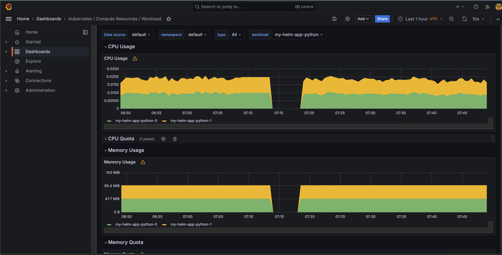
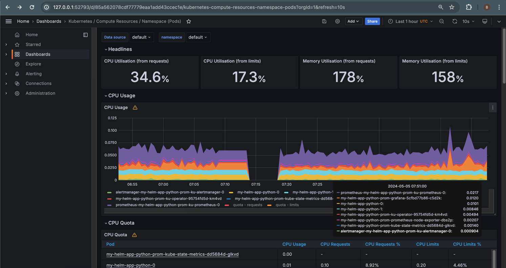
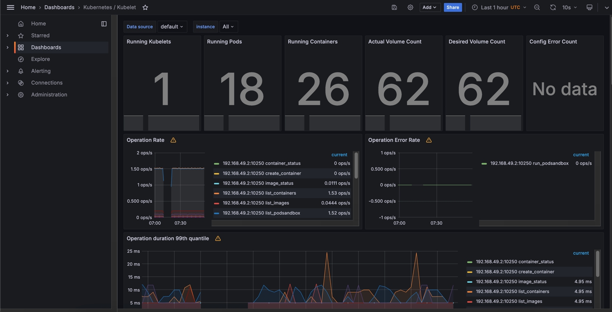
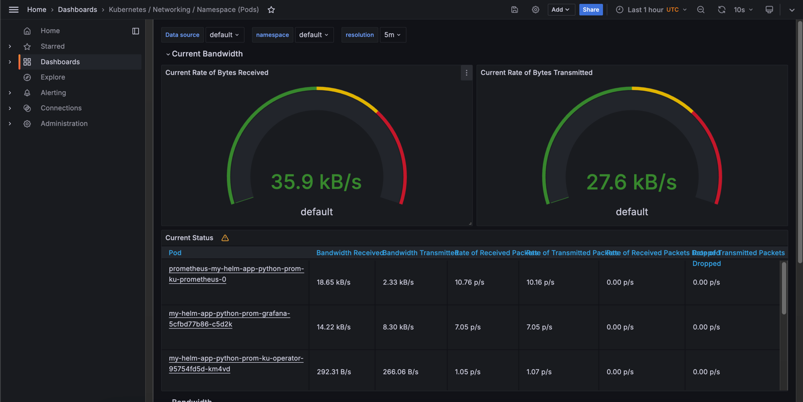
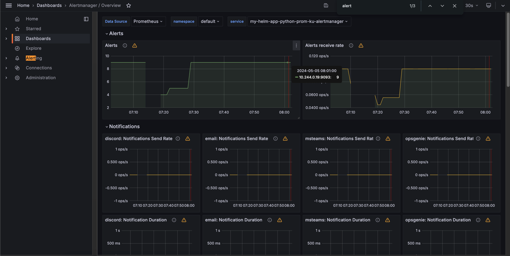
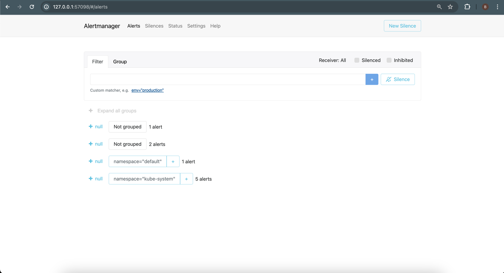

## Task 1

### 1.3
`The Prometheus Operator` -  simplifies the deployment and configuration of Prometheus, Alertmanager, and related monitoring components.

`Highly available Prometheus`- collects and stores the metrics as time series data. 

`Highly available Alertmanager`- handles alerts sent by clients. It utilizes `Grouping` (to group many alerts into one single), `Inhibition` (for mute alerts, when there is already firing one),
`Silences` (mute all alerts for time), `Client behavior`, `High Availability` (can be configured with flags `cluster-* flags.`)


`Prometheus node-exporter`- for exporting OS and hardware metrics into prometheus (prometheus scraps it from node_exporter daemon). 

`Prometheus blackbox-exporter`- generates metrics that depend on the response time of internal or external endpoints, such as HTTP/S, TCP, ICMP, DNS.

`Prometheus Adapter for Kubernetes Metrics APIs`- is a service that exposes metrics stored in Prometheus in the form of a metrics API

`kube-state-metrics`- daemon that watch the k8s API server and generates metrics about the state of the objects.

`Grafana`- allows to visualize, query, alert on the data from different sources.

### 1.4 

```bash
$ kubectl get po,sts,svc,pvc,cm
```

Here are pods with two replica for python app and pods for components explained in `1.3` 
```bash
NAME                                                           READY   STATUS    RESTARTS   AGE
pod/alertmanager-my-helm-app-python-prom-ku-alertmanager-0     2/2     Running   0          35m
pod/my-helm-app-python-0                                       1/1     Running   0          41m
pod/my-helm-app-python-1                                       1/1     Running   0          41m
pod/my-helm-app-python-prom-grafana-5cfbd77b86-c5d2k           3/3     Running   0          35m
pod/my-helm-app-python-prom-ku-operator-95754fd5d-km4vd        1/1     Running   0          35m
pod/my-helm-app-python-prom-kube-state-metrics-dd5684d-glkvd   1/1     Running   0          35m
pod/my-helm-app-python-prom-prometheus-node-exporter-dbs2p     1/1     Running   0          35m
pod/prometheus-my-helm-app-python-prom-ku-prometheus-0         2/2     Running   0          35m
```

Stateful sets, alert manager and prometheus need persistent storage for storing data.
```bash
NAME                                                                    READY   AGE
statefulset.apps/alertmanager-my-helm-app-python-prom-ku-alertmanager   1/1     35m
statefulset.apps/my-helm-app-python                                     2/2     41m
statefulset.apps/prometheus-my-helm-app-python-prom-ku-prometheus       1/1     35m
```

Services for exposing network application
```bash
NAME                                                       TYPE           CLUSTER-IP       EXTERNAL-IP   PORT(S)                      AGE
service/alertmanager-operated                              ClusterIP      None             <none>        9093/TCP,9094/TCP,9094/UDP   35m
service/kubernetes                                         ClusterIP      10.96.0.1        <none>        443/TCP                      78m
service/my-helm-app-python                                 LoadBalancer   10.97.9.60       <pending>     8080:32238/TCP               41m
service/my-helm-app-python-prom-grafana                    ClusterIP      10.105.131.196   <none>        80/TCP                       35m
service/my-helm-app-python-prom-ku-alertmanager            ClusterIP      10.97.194.7      <none>        9093/TCP,8080/TCP            35m
service/my-helm-app-python-prom-ku-operator                ClusterIP      10.106.187.12    <none>        443/TCP                      35m
service/my-helm-app-python-prom-ku-prometheus              ClusterIP      10.111.156.208   <none>        9090/TCP,8080/TCP            35m
service/my-helm-app-python-prom-kube-state-metrics         ClusterIP      10.111.73.137    <none>        8080/TCP                     35m
service/my-helm-app-python-prom-prometheus-node-exporter   ClusterIP      10.110.116.228   <none>        9100/TCP                     35m
service/prometheus-operated                                ClusterIP      None             <none>        9090/TCP                     35m
```

Our volumes that we created on previous labs
```bash
NAME                                                STATUS   VOLUME                                     CAPACITY   ACCESS MODES   STORAGECLASS   AGE
persistentvolumeclaim/mydata-my-helm-app-python-0   Bound    pvc-6d4af876-fc3b-4b93-bf63-357b9c9b6ea6   1Gi        RWO            standard       55m
persistentvolumeclaim/mydata-my-helm-app-python-1   Bound    pvc-d7b043b3-d170-437a-88cf-784ee5fb429d   1Gi        RWO            standard       41m
```

Config maps for configurations
```bash
NAME                                                                     DATA   AGE
configmap/helm-python-app-config-map                                     1      41m
configmap/kube-root-ca.crt                                               1      78m
configmap/my-helm-app-python-prom-grafana                                1      35m
configmap/my-helm-app-python-prom-grafana-config-dashboards              1      35m
configmap/my-helm-app-python-prom-ku-alertmanager-overview               1      35m
configmap/my-helm-app-python-prom-ku-apiserver                           1      35m
configmap/my-helm-app-python-prom-ku-cluster-total                       1      35m
configmap/my-helm-app-python-prom-ku-controller-manager                  1      35m
configmap/my-helm-app-python-prom-ku-etcd                                1      35m
configmap/my-helm-app-python-prom-ku-grafana-datasource                  1      35m
configmap/my-helm-app-python-prom-ku-grafana-overview                    1      35m
configmap/my-helm-app-python-prom-ku-k8s-coredns                         1      35m
configmap/my-helm-app-python-prom-ku-k8s-resources-cluster               1      35m
configmap/my-helm-app-python-prom-ku-k8s-resources-multicluster          1      35m
configmap/my-helm-app-python-prom-ku-k8s-resources-namespace             1      35m
configmap/my-helm-app-python-prom-ku-k8s-resources-node                  1      35m
configmap/my-helm-app-python-prom-ku-k8s-resources-pod                   1      35m
configmap/my-helm-app-python-prom-ku-k8s-resources-workload              1      35m
configmap/my-helm-app-python-prom-ku-k8s-resources-workloads-namespace   1      35m
configmap/my-helm-app-python-prom-ku-kubelet                             1      35m
configmap/my-helm-app-python-prom-ku-namespace-by-pod                    1      35m
configmap/my-helm-app-python-prom-ku-namespace-by-workload               1      35m
configmap/my-helm-app-python-prom-ku-node-cluster-rsrc-use               1      35m
configmap/my-helm-app-python-prom-ku-node-rsrc-use                       1      35m
configmap/my-helm-app-python-prom-ku-nodes                               1      35m
configmap/my-helm-app-python-prom-ku-nodes-darwin                        1      35m
configmap/my-helm-app-python-prom-ku-persistentvolumesusage              1      35m
configmap/my-helm-app-python-prom-ku-pod-total                           1      35m
configmap/my-helm-app-python-prom-ku-prometheus                          1      35m
configmap/my-helm-app-python-prom-ku-proxy                               1      35m
configmap/my-helm-app-python-prom-ku-scheduler                           1      35m
configmap/my-helm-app-python-prom-ku-workload-total                      1      35m
configmap/prometheus-my-helm-app-python-prom-ku-prometheus-rulefiles-0   35     35m
```

### 1.5
a) Check CPU and Memory consumption of your StatefulSet.


b) Identify Pods with higher and lower CPU usage in the default namespace.

Highest is `prometheus`

Lowest is `kube-state-metrics` 


c) Monitor node memory usage in percentage and megabytes.


d) Count the number of pods and containers managed by the Kubelet service.
pods-  18, containers - 26


e) Evaluate network usage of Pods in the default namespace


f) Determine the number of active alerts; also check the Web UI with minikube service monitoring-kube-prometheus-alertmanager.

active alerts - 9



## Task 2
```bash
$ kubectl get po

NAME                                                       READY   STATUS    RESTARTS   AGE
alertmanager-my-helm-app-python-prom-ku-alertmanager-0     2/2     Running   0          13h
my-helm-app-python-0                                       1/1     Running   0          2m8s
my-helm-app-python-1                                       1/1     Running   0          2m8s
my-helm-app-python-prom-grafana-5cfbd77b86-c5d2k           3/3     Running   0          13h
my-helm-app-python-prom-ku-operator-95754fd5d-km4vd        1/1     Running   0          13h
my-helm-app-python-prom-kube-state-metrics-dd5684d-glkvd   1/1     Running   0          13h
my-helm-app-python-prom-prometheus-node-exporter-dbs2p     1/1     Running   0          13h
prometheus-my-helm-app-python-prom-ku-prometheus-0         2/2     Running   0          13h

```

```bash
$ kubectl exec my-helm-app-python-0 -- cat /work-dir/index.html

Defaulted container "helm-app-python" out of: helm-app-python, install (init)
<html><head></head><body><header>
<title>http://info.cern.ch</title>
</header>

<h1>http://info.cern.ch - home of the first website</h1>
<p>From here you can:</p>
<ul>
<li><a href="http://info.cern.ch/hypertext/WWW/TheProject.html">Browse the first website</a></li>
<li><a href="http://line-mode.cern.ch/www/hypertext/WWW/TheProject.html">Browse the first website using the line-mode browser simulator</a></li>
<li><a href="http://home.web.cern.ch/topics/birth-web">Learn about the birth of the web</a></li>
<li><a href="http://home.web.cern.ch/about">Learn about CERN, the physics laboratory where the web was born</a></li>
</ul>
</body></html>

```