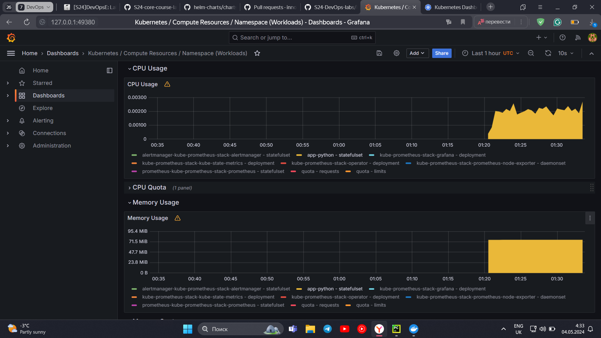
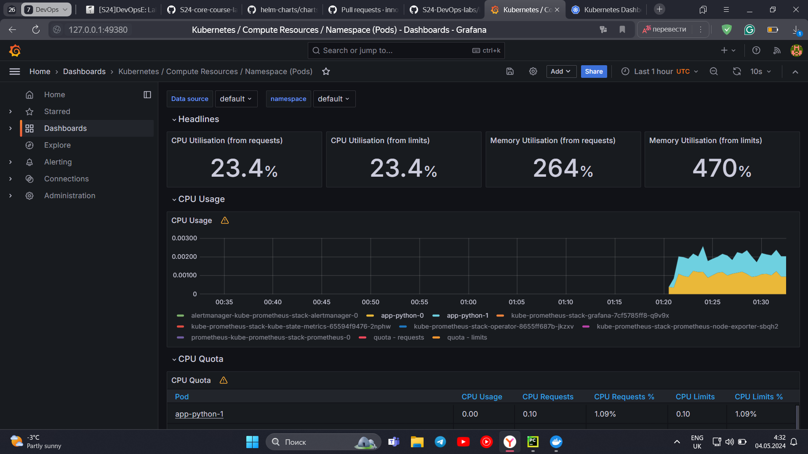
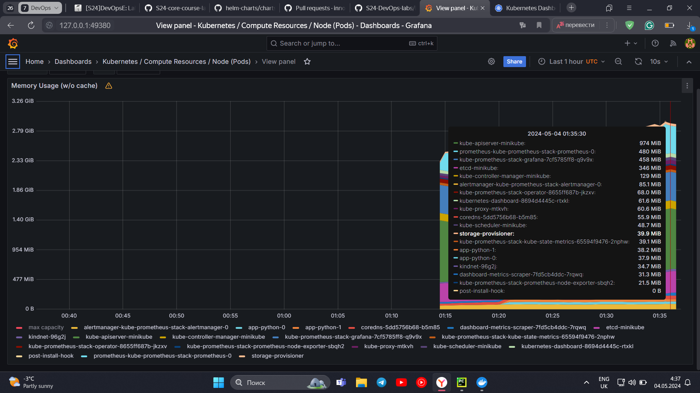
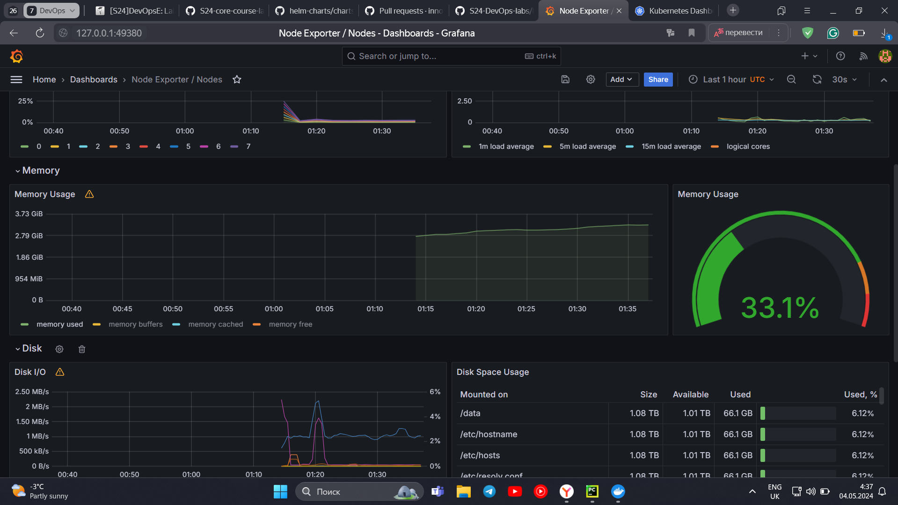
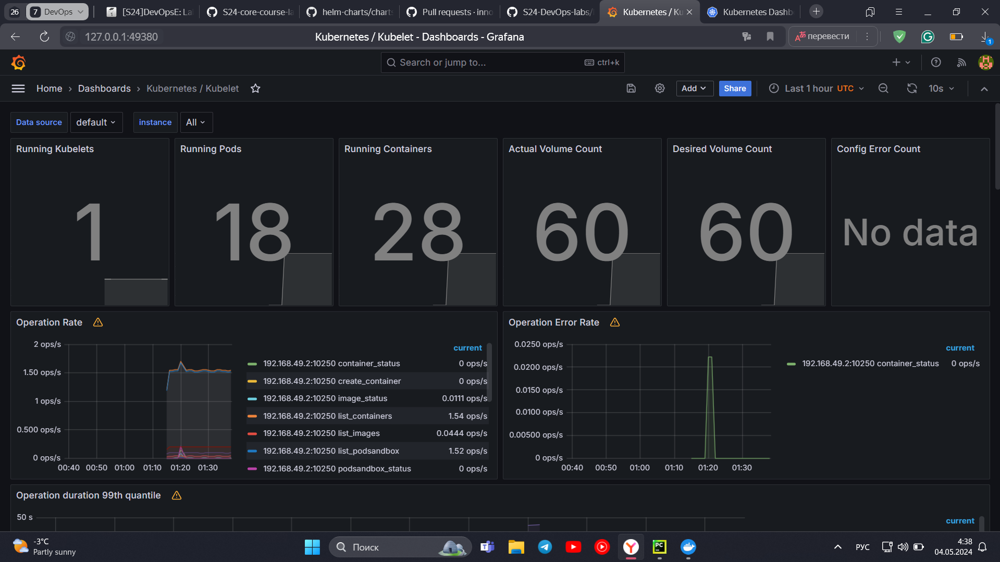
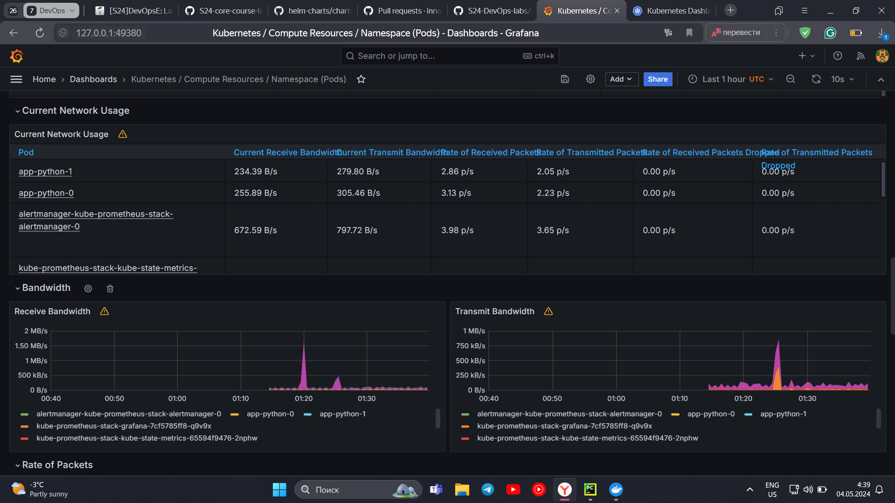
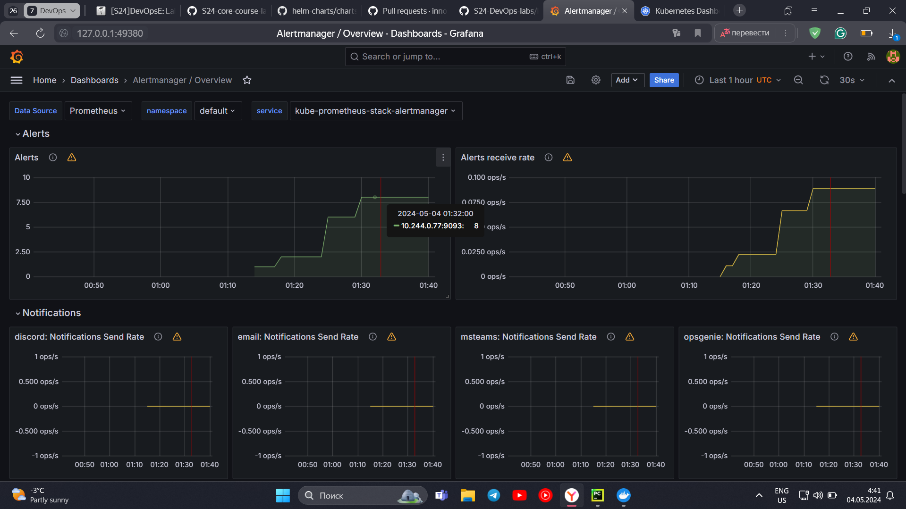
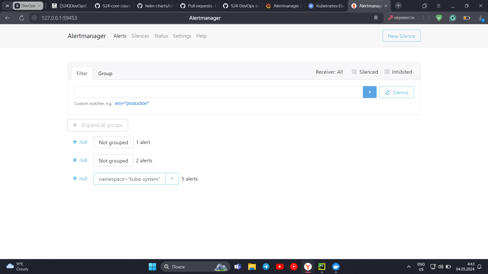

# Kubernetes Monitoring and Init Containers

## Kubernetes Cluster Monitoring with Prometheus

### The components of the Kube Prometheus Stack

- **The Prometheus Operator**: Simplifies the deployment and management of
  Prometheus
  instances in Kubernetes.
- **Highly available Prometheus**: Collects and stores metrics from various
  targets
  in the Kubernetes cluster.
- **Highly available Alertmanager**: Handles alerting and notification based on
  alerts received from Prometheus.
- **Prometheus node-exporter**: Collects hardware and operating system metrics
  from
  Kubernetes nodes.
- **Prometheus blackbox-exporter**: Performs checks on external services or
  endpoints
  to monitor their availability and responsiveness.
- **Prometheus Adapter for Kubernetes Metrics APIs**: Collects resource metrics
  from
  Kubernetes and exposes them via custom metrics APIs.
- **kube-state-metrics**: Generates metrics about the state of Kubernetes
  objects,
  providing insights into the cluster's health.
- **Grafana**: Visualizes the collected metrics in customizable dashboards and
  allows
  for in-depth analysis of the Kubernetes cluster.

```bash
(venv) PS C:\Users\smash\PyCharmProjects\S24-core-course-labs\k8s> kubectl get po,sts,svc,pvc,cm

NAME                                                            READY   STATUS      RESTARTS   AGE
pod/alertmanager-kube-prometheus-stack-alertmanager-0           2/2     Running     0          10m
pod/app-python-0                                                1/1     Running     0          2m37s
pod/app-python-1                                                1/1     Running     0          2m37s
pod/kube-prometheus-stack-grafana-7cf5785ff8-q9v9x              3/3     Running     0          11m
pod/kube-prometheus-stack-kube-state-metrics-65594f9476-2nphw   1/1     Running     0          11m
pod/kube-prometheus-stack-operator-8655ff687b-jkzxv             1/1     Running     0          11m
pod/kube-prometheus-stack-prometheus-node-exporter-sbqh2        1/1     Running     0          11m
pod/post-install-hook                                           0/1     Completed   0          2m37s
pod/pre-install-hook                                            0/1     Completed   0          2m52s
pod/prometheus-kube-prometheus-stack-prometheus-0               2/2     Running     0          10m

NAME                                                               READY   AGE
statefulset.apps/alertmanager-kube-prometheus-stack-alertmanager   1/1     10m
statefulset.apps/app-python                                        2/2     2m37s
statefulset.apps/prometheus-kube-prometheus-stack-prometheus       1/1     10m

NAME                                                     TYPE        CLUSTER-IP       EXTERNAL-IP   PORT(S)                      AGE
service/alertmanager-operated                            ClusterIP   None             <none>        9093/TCP,9094/TCP,9094/UDP   10m
service/app-python                                       NodePort    10.102.162.187   <none>        8080:32605/TCP               2m37s
service/kube-prometheus-stack-alertmanager               ClusterIP   10.104.202.21    <none>        9093/TCP,8080/TCP            11m
service/kube-prometheus-stack-grafana                    ClusterIP   10.103.188.180   <none>        80/TCP                       11m
service/kube-prometheus-stack-kube-state-metrics         ClusterIP   10.102.58.173    <none>        8080/TCP                     11m
service/kube-prometheus-stack-operator                   ClusterIP   10.111.193.250   <none>        443/TCP                      11m
service/kube-prometheus-stack-prometheus                 ClusterIP   10.104.131.62    <none>        9090/TCP,8080/TCP            11m
service/kube-prometheus-stack-prometheus-node-exporter   ClusterIP   10.100.60.174    <none>        9100/TCP                     11m
service/kubernetes                                       ClusterIP   10.96.0.1        <none>        443/TCP                      31d
service/prometheus-operated                              ClusterIP   None             <none>        9090/TCP                     10m

NAME                                                                DATA   AGE
configmap/configmap                                                 2      2m37s
configmap/kube-prometheus-stack-alertmanager-overview               1      11m
configmap/kube-prometheus-stack-apiserver                           1      11m
configmap/kube-prometheus-stack-cluster-total                       1      11m
configmap/kube-prometheus-stack-controller-manager                  1      11m
configmap/kube-prometheus-stack-etcd                                1      11m
configmap/kube-prometheus-stack-grafana                             1      11m
configmap/kube-prometheus-stack-grafana-config-dashboards           1      11m
configmap/kube-prometheus-stack-grafana-datasource                  1      11m
configmap/kube-prometheus-stack-grafana-overview                    1      11m
configmap/kube-prometheus-stack-k8s-coredns                         1      11m
configmap/kube-prometheus-stack-k8s-resources-cluster               1      11m
configmap/kube-prometheus-stack-k8s-resources-multicluster          1      11m
configmap/kube-prometheus-stack-k8s-resources-namespace             1      11m
configmap/kube-prometheus-stack-k8s-resources-node                  1      11m
configmap/kube-prometheus-stack-k8s-resources-pod                   1      11m
configmap/kube-prometheus-stack-k8s-resources-workload              1      11m
configmap/kube-prometheus-stack-k8s-resources-workloads-namespace   1      11m
configmap/kube-prometheus-stack-kubelet                             1      11m
configmap/kube-prometheus-stack-namespace-by-pod                    1      11m
configmap/kube-prometheus-stack-namespace-by-workload               1      11m
configmap/kube-prometheus-stack-node-cluster-rsrc-use               1      11m
configmap/kube-prometheus-stack-node-rsrc-use                       1      11m
configmap/kube-prometheus-stack-nodes                               1      11m
configmap/kube-prometheus-stack-nodes-darwin                        1      11m
configmap/kube-prometheus-stack-persistentvolumesusage              1      11m
configmap/kube-prometheus-stack-pod-total                           1      11m
configmap/kube-prometheus-stack-prometheus                          1      11m
configmap/kube-prometheus-stack-proxy                               1      11m
configmap/kube-prometheus-stack-scheduler                           1      11m
configmap/kube-prometheus-stack-workload-total                      1      11m
configmap/kube-root-ca.crt                                          1      31d
configmap/prometheus-kube-prometheus-stack-prometheus-rulefiles-0   35     10m
```

### Utilizing Grafana dashboards

#### CPU and Mem Usage



#### Pods CPU Usage



#### Node Memory Usage





#### Pods managed by Kubelet



#### Network usage



#### Active Alerts





## Init Containers

```bash
(venv) PS C:\Users\smash\PyCharmProjects\S24-core-course-labs\k8s> kubectl exec pod/app-python-0 -- head -n 5 /work-dir/index.html       

Defaulted container "app-python" out of: app-python, get-page (init)
<html><head></head><body><header>
<title>http://info.cern.ch</title>
</header>

<h1>http://info.cern.ch - home of the first website</h1>
```
