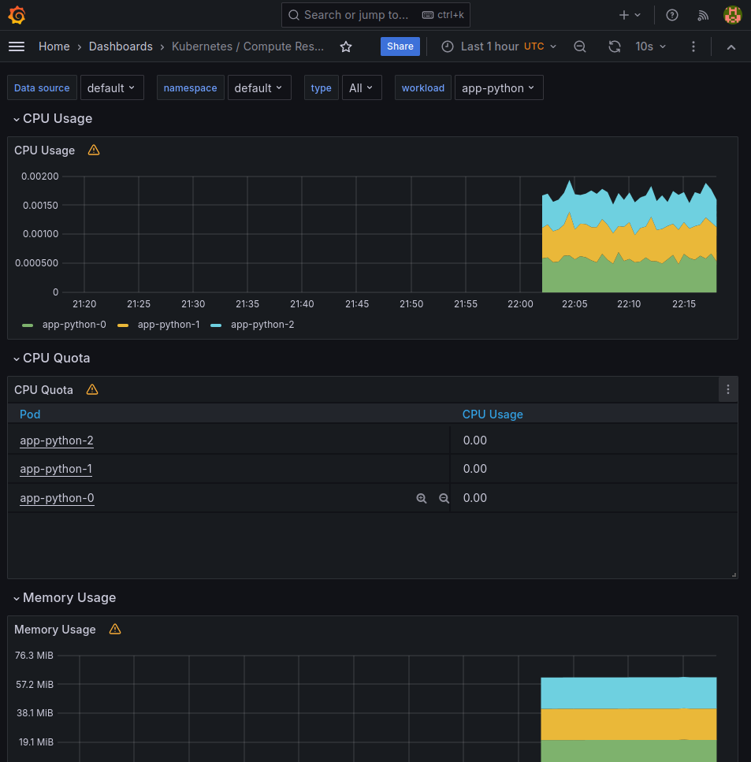
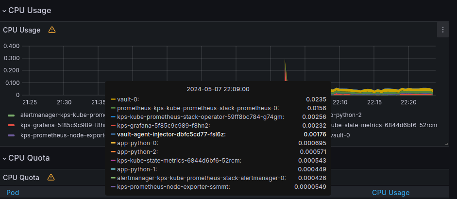
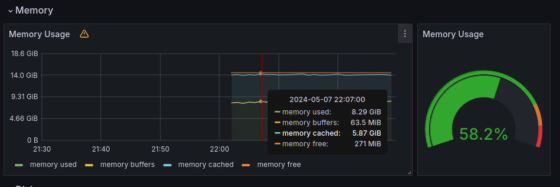
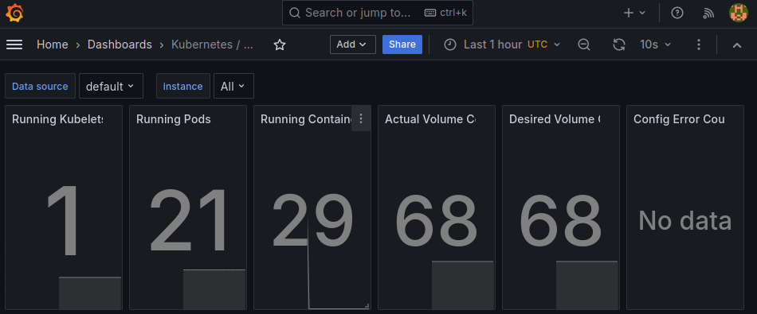
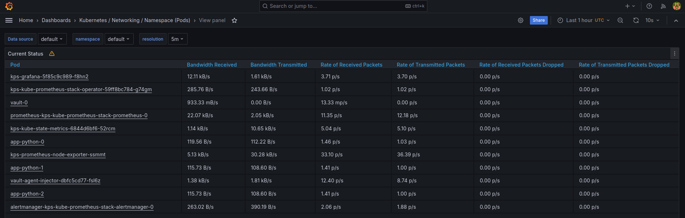
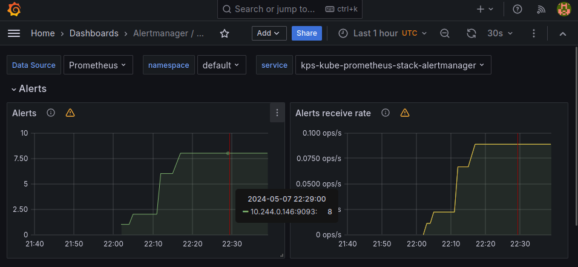
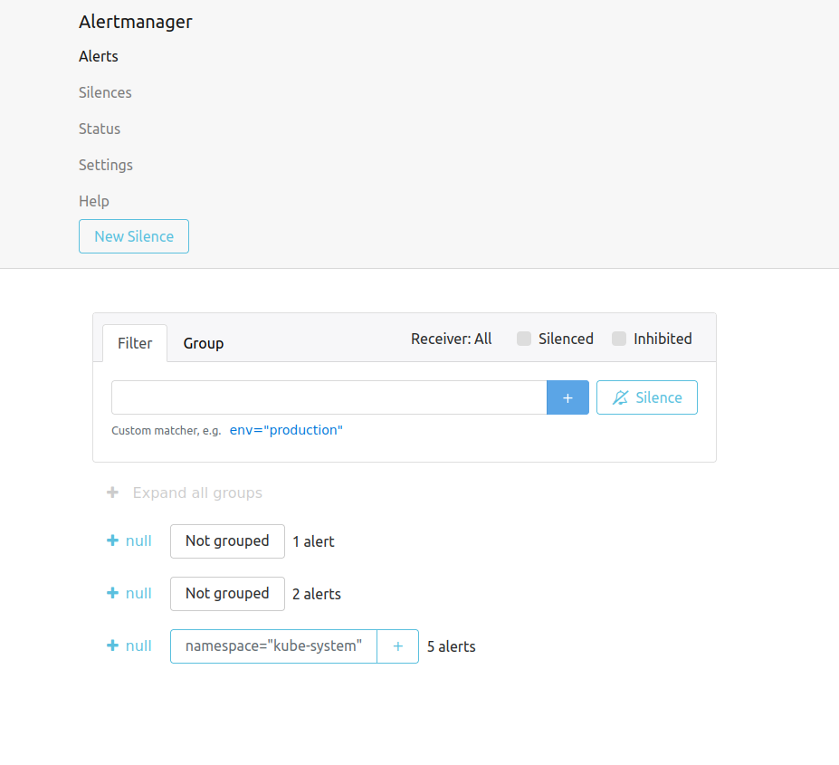
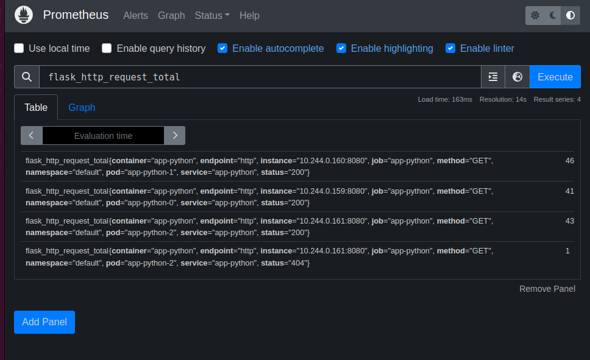

# Stack explanation

+ `Prometheus operator` configures prometheus based on kubernetes cluster monitoring stack.
+ `Prometheus`: metrics collector
+ `Alert manager`: handles alerts from clients such as prometheus and sends them to receivers
+ `Node exporter`: exports hardware metrics on host node
+ `Blackbox exporter`: probes application endpoints
+ `Prometheus adapter for kubernetes metrics apis`: gathers metrics from prometheus and exposes them to kubernetes api
+ `kube-state-metrics`: generates metrics about object(deployments, nodes, pods) health
+ `Grafana`: observability and visualisation platform from multiple sources

# Install monitoring-kube-prometheus

```shell
user@user-PC:~/S24-core-course-labs/k8s$ helm repo add prometheus-community https://prometheus-community.github.io/helm-charts
"prometheus-community" has been added to your repositories
user@user-PC:~/S24-core-course-labs/k8s$ helm repo update
Hang tight while we grab the latest from your chart repositories...
...Unable to get an update from the "hashicorp" chart repository (https://helm.releases.hashicorp.com):
	failed to fetch https://helm.releases.hashicorp.com/index.yaml : 403 Forbidden
...Successfully got an update from the "prometheus-community" chart repository
...Successfully got an update from the "bitnami" chart repository
Update Complete. ⎈Happy Helming!⎈
user@user-PC:~/S24-core-course-labs/k8s$ helm install kps prometheus-community/kube-prometheus-stack
NAME: kps
LAST DEPLOYED: Wed May  8 00:49:22 2024
NAMESPACE: default
STATUS: deployed
REVISION: 1
NOTES:
kube-prometheus-stack has been installed. Check its status by running:
  kubectl --namespace default get pods -l "release=kps"

Visit https://github.com/prometheus-operator/kube-prometheus for instructions on how to create & configure Alertmanager and Prometheus instances using the Operator.
```

```shell
user@user-PC:~/S24-core-course-labs/k8s$ kubectl get po,sts,svc,pvc,cm


=== ACTIVE PODS INFO ===


NAME                                                        READY   STATUS    RESTARTS   AGE
pod/alertmanager-kps-kube-prometheus-stack-alertmanager-0   2/2     Running   0          73s
pod/app-python-0                                            1/1     Running   1          6d22h
pod/app-python-1                                            1/1     Running   1          6d22h
pod/app-python-2                                            1/1     Running   1          6d22h
pod/kps-grafana-5f85c9c989-xh8vq                            3/3     Running   0          82s
pod/kps-kube-prometheus-stack-operator-59ff8bc784-pxphz     1/1     Running   0          82s
pod/kps-kube-state-metrics-6844d6bf6-wwv27                  1/1     Running   0          82s
pod/kps-prometheus-node-exporter-989nc                      1/1     Running   0          82s
pod/prometheus-kps-kube-prometheus-stack-prometheus-0       2/2     Running   0          73s
pod/vault-0                                                 1/1     Running   4          20d
pod/vault-agent-injector-dbfc5cd77-fsl6z                    1/1     Running   4          20d


=== ACTIVE STATEFULSETS INFO ===


NAME                                                                   READY   AGE
statefulset.apps/alertmanager-kps-kube-prometheus-stack-alertmanager   1/1     73s
statefulset.apps/app-python                                            3/3     6d22h
statefulset.apps/prometheus-kps-kube-prometheus-stack-prometheus       1/1     73s
statefulset.apps/vault                                                 1/1     20d


=== ACTIVE SERVICES INFO ===


NAME                                             TYPE        CLUSTER-IP       EXTERNAL-IP   PORT(S)                      AGE
service/alertmanager-operated                    ClusterIP   None             <none>        9093/TCP,9094/TCP,9094/UDP   73s
service/app-python                               NodePort    10.99.159.47     <none>        8080:31797/TCP               6d22h
service/kps-grafana                              ClusterIP   10.109.255.131   <none>        80/TCP                       82s
service/kps-kube-prometheus-stack-alertmanager   ClusterIP   10.100.60.60     <none>        9093/TCP,8080/TCP            82s
service/kps-kube-prometheus-stack-operator       ClusterIP   10.109.111.29    <none>        443/TCP                      82s
service/kps-kube-prometheus-stack-prometheus     ClusterIP   10.99.165.215    <none>        9090/TCP,8080/TCP            82s
service/kps-kube-state-metrics                   ClusterIP   10.106.144.130   <none>        8080/TCP                     82s
service/kps-prometheus-node-exporter             ClusterIP   10.98.150.118    <none>        9100/TCP                     82s
service/kubernetes                               ClusterIP   10.96.0.1        <none>        443/TCP                      34d
service/prometheus-operated                      ClusterIP   None             <none>        9090/TCP                     73s
service/vault                                    ClusterIP   10.110.128.127   <none>        8200/TCP,8201/TCP            20d
service/vault-agent-injector-svc                 ClusterIP   10.100.52.199    <none>        443/TCP                      20d
service/vault-internal                           ClusterIP   None             <none>        8200/TCP,8201/TCP            20d


=== ACTIVE PERSISTENT VOLUME CLAIMS FOR APP_PYTHON ===


NAME                                        STATUS   VOLUME                                     CAPACITY   ACCESS MODES   STORAGECLASS   AGE
persistentvolumeclaim/visits-app-python-0   Bound    pvc-af2214fa-49f9-4821-9377-191af9e48ecc   10Mi       RWO            standard       6d23h
persistentvolumeclaim/visits-app-python-1   Bound    pvc-1067d3b7-db1b-49e4-85d7-2c5c0afd1210   10Mi       RWO            standard       6d23h
persistentvolumeclaim/visits-app-python-2   Bound    pvc-08c72f41-0566-4c0c-94ed-cf4746e0e0cb   10Mi       RWO            standard       6d23h


=== CONFIGMAPS FOR app-python AND kube-prometheus-stack ===


NAME                                                                    DATA   AGE
configmap/config                                                        1      6d22h
configmap/kps-grafana                                                   1      82s
configmap/kps-grafana-config-dashboards                                 1      82s
configmap/kps-kube-prometheus-stack-alertmanager-overview               1      82s
configmap/kps-kube-prometheus-stack-apiserver                           1      82s
configmap/kps-kube-prometheus-stack-cluster-total                       1      82s
configmap/kps-kube-prometheus-stack-controller-manager                  1      82s
configmap/kps-kube-prometheus-stack-etcd                                1      82s
configmap/kps-kube-prometheus-stack-grafana-datasource                  1      82s
configmap/kps-kube-prometheus-stack-grafana-overview                    1      82s
configmap/kps-kube-prometheus-stack-k8s-coredns                         1      82s
configmap/kps-kube-prometheus-stack-k8s-resources-cluster               1      82s
configmap/kps-kube-prometheus-stack-k8s-resources-multicluster          1      82s
configmap/kps-kube-prometheus-stack-k8s-resources-namespace             1      82s
configmap/kps-kube-prometheus-stack-k8s-resources-node                  1      82s
configmap/kps-kube-prometheus-stack-k8s-resources-pod                   1      82s
configmap/kps-kube-prometheus-stack-k8s-resources-workload              1      82s
configmap/kps-kube-prometheus-stack-k8s-resources-workloads-namespace   1      82s
configmap/kps-kube-prometheus-stack-kubelet                             1      82s
configmap/kps-kube-prometheus-stack-namespace-by-pod                    1      82s
configmap/kps-kube-prometheus-stack-namespace-by-workload               1      82s
configmap/kps-kube-prometheus-stack-node-cluster-rsrc-use               1      82s
configmap/kps-kube-prometheus-stack-node-rsrc-use                       1      82s
configmap/kps-kube-prometheus-stack-nodes                               1      82s
configmap/kps-kube-prometheus-stack-nodes-darwin                        1      82s
configmap/kps-kube-prometheus-stack-persistentvolumesusage              1      82s
configmap/kps-kube-prometheus-stack-pod-total                           1      82s
configmap/kps-kube-prometheus-stack-prometheus                          1      82s
configmap/kps-kube-prometheus-stack-proxy                               1      82s
configmap/kps-kube-prometheus-stack-scheduler                           1      82s
configmap/kps-kube-prometheus-stack-workload-total                      1      82s
configmap/kube-root-ca.crt                                              1      34d
configmap/prometheus-kps-kube-prometheus-stack-prometheus-rulefiles-0   35     73s
user@user-PC:~/S24-core-course-labs/k8s$ 

```

# Grafana dashboards

1. CPU: 0.2% total, MEM: 61.8MB. 
2. Highest: vault-0, lowest: kps-prometheus-node-exporter-ssmmt. 
3. Memory usage: 8.29GiB, 58.2% 
4. Running pods: 21. Running containers: 29 
5. Network usage: 
6. Active alerts count: 8.  

# Init container

Result of running three init containers

```shell
user@user-PC:~/S24-core-course-labs/k8s$ kubectl exec pod/app-python-0 -c app-python -- cat /init-cont/index.html
<html><head></head><body><header>
<title>http://info.cern.ch</title>
</header>

<h1>http://info.cern.ch - home of the first website</h1>
<p>From here you can:</p>
<ul>
<li><a href="http://info.cern.ch/hypertext/WWW/TheProject.html">Browse the first website</a></li>
<li><a href="http://line-mode.cern.ch/www/hypertext/WWW/TheProject.html">Browse the first website using the line-mode browser simulator</a></li>
<li><a href="http://home.web.cern.ch/topics/birth-web">Learn about the birth of the web</a></li>
<li><a href="http://home.web.cern.ch/about">Learn about CERN, the physics laboratory where the web was born</a></li>
</ul>
</body></html>
aaaaa
bbbbb

```

# App metrics

App-python service metrics fetch from prometheus.
