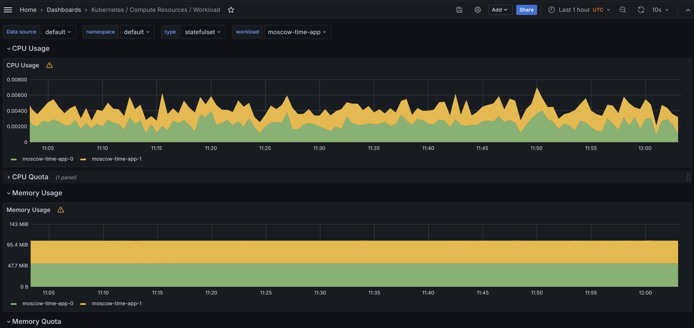
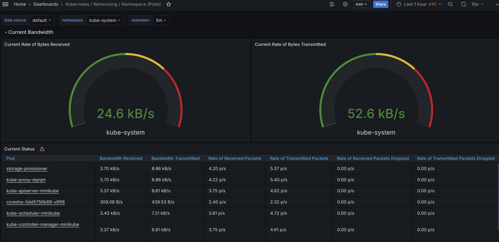

## Components of the Kube Prometheus Stack
* Grafana uses data, collected by Prometheus, and build graphs and dashboards based on it 
* Prometheus collects metrics from different sources 
* Prometheus Operator simplifies the management of instances of Prometheus in Kubernetes cluster
* Kube State Metrics provides metrics about state of Kubernetes's objects
* Node Exporter collects metrics from Kubernetes nodes
* Alertmanager handles Prometheus alerts and sends notifications


## kubectl get po,sts,svc,pvc,cm
* po - shows the running and completed pods and their statuses
* sts - shows the list of stateful sets and statuses of their replicas
* svc - shows the list of services, their type and cluster-ip
* pvc - defines the reqiurements of an application and are used to provision persistent storage for pods
* cm - shows configuration data

```bash
NAME                                                         READY   STATUS      RESTARTS   AGE
pod/alertmanager-monitoring-kube-prometheus-alertmanager-0   2/2     Running     0          98s
pod/monitoring-grafana-657659866f-4hsht                      3/3     Running     0          103s
pod/monitoring-kube-prometheus-operator-69f78db664-xvjxl     1/1     Running     0          103s
pod/monitoring-kube-state-metrics-7fc7cf6558-mkgm7           1/1     Running     0          103s
pod/monitoring-prometheus-node-exporter-fh8jc                1/1     Running     0          103s
pod/moscow-time-app-0                                        1/1     Running     0          64s
pod/moscow-time-app-1                                        1/1     Running     0          64s
pod/pod-install-hook                                         0/1     Completed   0          65s
pod/pre-install-hook                                         0/1     Completed   0          65s
pod/prometheus-monitoring-kube-prometheus-prometheus-0       2/2     Running     0          98s
pod/web-0                                                    1/1     Running     0          3m1s
pod/web-1                                                    1/1     Running     0          2m46s

NAME                                                                    READY   AGE
statefulset.apps/alertmanager-monitoring-kube-prometheus-alertmanager   1/1     98s
statefulset.apps/moscow-time-app                                        2/2     65s
statefulset.apps/prometheus-monitoring-kube-prometheus-prometheus       1/1     98s
statefulset.apps/web                                                    2/2     6d13h

NAME                                              TYPE        CLUSTER-IP       EXTERNAL-IP   PORT(S)                      AGE
service/alertmanager-operated                     ClusterIP   None             <none>        9093/TCP,9094/TCP,9094/UDP   98s
service/kubernetes                                ClusterIP   10.96.0.1        <none>        443/TCP                      35d
service/monitoring-grafana                        ClusterIP   10.102.129.149   <none>        80/TCP                       103s
service/monitoring-kube-prometheus-alertmanager   ClusterIP   10.104.156.213   <none>        9093/TCP,8080/TCP            103s
service/monitoring-kube-prometheus-operator       ClusterIP   10.105.79.252    <none>        443/TCP                      103s
service/monitoring-kube-prometheus-prometheus     ClusterIP   10.100.25.251    <none>        9090/TCP,8080/TCP            103s
service/monitoring-kube-state-metrics             ClusterIP   10.98.174.57     <none>        8080/TCP                     103s
service/monitoring-prometheus-node-exporter       ClusterIP   10.96.228.63     <none>        9100/TCP                     103s
service/moscow-time-app                           NodePort    10.96.108.127    <none>        80:31904/TCP                 65s
service/nginx                                     ClusterIP   None             <none>        80/TCP                       6d13h
service/prometheus-operated                       ClusterIP   None             <none>        9090/TCP                     98s

NAME                              STATUS   VOLUME                                     CAPACITY   ACCESS MODES   STORAGECLASS   AGE
persistentvolumeclaim/www-web-0   Bound    pvc-adab25a5-7f96-48dd-a41d-53f972b3d987   1Gi        RWO            standard       6d13h
persistentvolumeclaim/www-web-1   Bound    pvc-b38bf27e-7d42-4a97-863f-4cce332d8bed   1Gi        RWO            standard       6d13h

NAME                                                                     DATA   AGE
configmap/kube-root-ca.crt                                               1      35d
configmap/monitoring-grafana                                             1      103s
configmap/monitoring-grafana-config-dashboards                           1      103s
configmap/monitoring-kube-prometheus-alertmanager-overview               1      103s
configmap/monitoring-kube-prometheus-apiserver                           1      103s
configmap/monitoring-kube-prometheus-cluster-total                       1      103s
configmap/monitoring-kube-prometheus-controller-manager                  1      103s
configmap/monitoring-kube-prometheus-etcd                                1      103s
configmap/monitoring-kube-prometheus-grafana-datasource                  1      103s
configmap/monitoring-kube-prometheus-grafana-overview                    1      103s
configmap/monitoring-kube-prometheus-k8s-coredns                         1      103s
configmap/monitoring-kube-prometheus-k8s-resources-cluster               1      103s
configmap/monitoring-kube-prometheus-k8s-resources-multicluster          1      103s
configmap/monitoring-kube-prometheus-k8s-resources-namespace             1      103s
configmap/monitoring-kube-prometheus-k8s-resources-node                  1      103s
configmap/monitoring-kube-prometheus-k8s-resources-pod                   1      103s
configmap/monitoring-kube-prometheus-k8s-resources-workload              1      103s
configmap/monitoring-kube-prometheus-k8s-resources-workloads-namespace   1      103s
configmap/monitoring-kube-prometheus-kubelet                             1      103s
configmap/monitoring-kube-prometheus-namespace-by-pod                    1      103s
configmap/monitoring-kube-prometheus-namespace-by-workload               1      103s
configmap/monitoring-kube-prometheus-node-cluster-rsrc-use               1      103s
configmap/monitoring-kube-prometheus-node-rsrc-use                       1      103s
configmap/monitoring-kube-prometheus-nodes                               1      103s
configmap/monitoring-kube-prometheus-nodes-darwin                        1      103s
configmap/monitoring-kube-prometheus-persistentvolumesusage              1      103s
configmap/monitoring-kube-prometheus-pod-total                           1      103s
configmap/monitoring-kube-prometheus-prometheus                          1      103s
configmap/monitoring-kube-prometheus-proxy                               1      103s
configmap/monitoring-kube-prometheus-scheduler                           1      103s
configmap/monitoring-kube-prometheus-workload-total                      1      103s
configmap/prometheus-monitoring-kube-prometheus-prometheus-rulefiles-0   35     95s
configmap/visits-configmap                                               1      6d2h
```

## Questions
a. Check CPU and Memory consumption of your StatefulSet.
CPU usage: ~0.00
Memory Usage: ~52.20

b. Identify Pods with higher and lower CPU usage in the default namespace.
The higher CPU usage:
prometheus-monitoring-kube-prometheus-prometheus-0
The lower CPU usage: alertmanager-monitoring-kube-prometheus-alertmanager-0

c. Monitor node memory usage in percentage and megabytes.

d. Count the number of pods and containers managed by the Kubelet service.
Pods: 20
Containers: 39

e. Evaluate network usage of Pods in the default namespace.

f. Determine the number of active alerts; also check the Web UI with minikube service monitoring-kube-prometheus-alertmanager.
8 alerts


## Output of kubectl exec pod/moscow-time-app-0 -- cat /work-dir/index.html
```bash
Defaulted container "moscow-time-app" out of: moscow-time-app, install (init), container-1 (init)
<html><head></head><body><header>
<title>http://info.cern.ch</title>
</header>

<h1>http://info.cern.ch - home of the first website</h1>
<p>From here you can:</p>
<ul>
<li><a href="http://info.cern.ch/hypertext/WWW/TheProject.html">Browse the first website</a></li>
<li><a href="http://line-mode.cern.ch/www/hypertext/WWW/TheProject.html">Browse the first website using the line-mode browser simulator</a></li>
<li><a href="http://home.web.cern.ch/topics/birth-web">Learn about the birth of the web</a></li>
<li><a href="http://home.web.cern.ch/about">Learn about CERN, the physics laboratory where the web was born</a></li>
</ul>
</body></html>
```