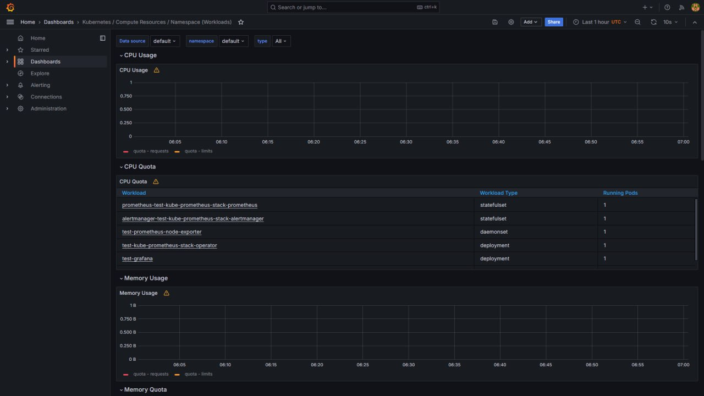
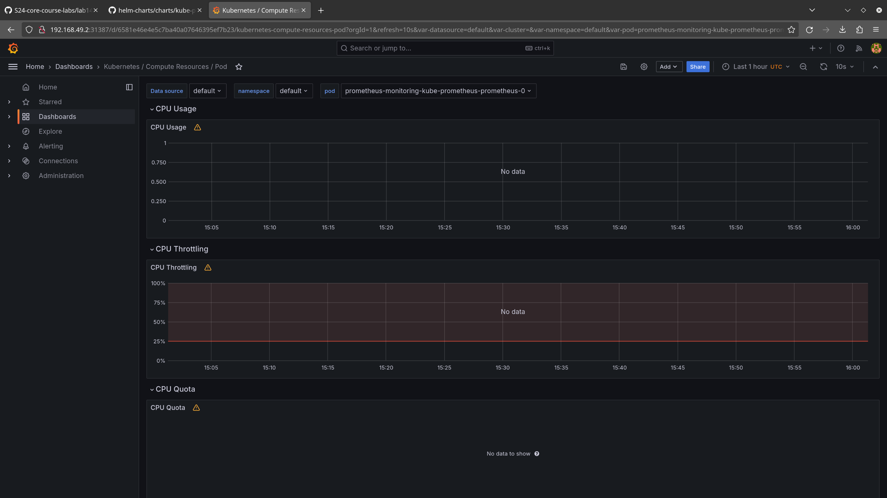
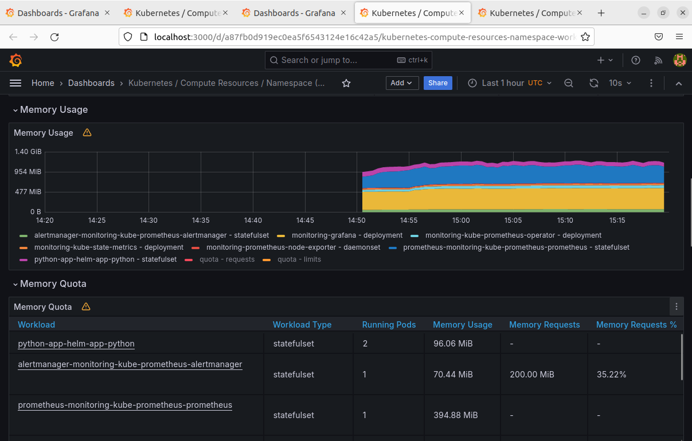
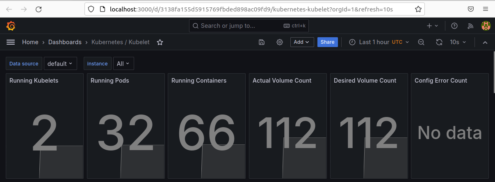
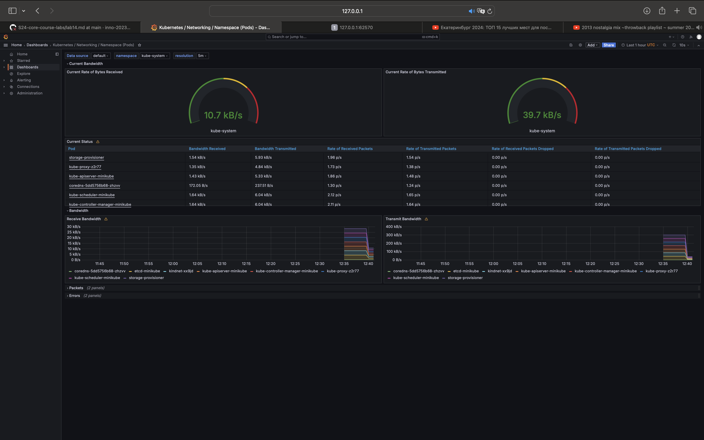
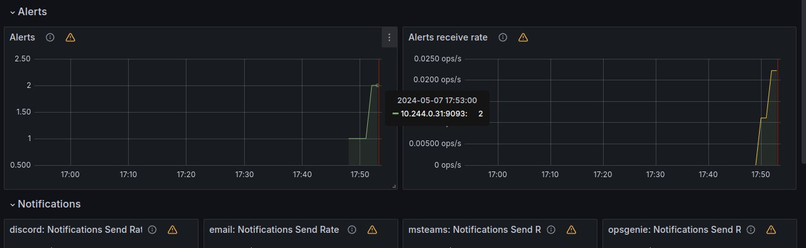
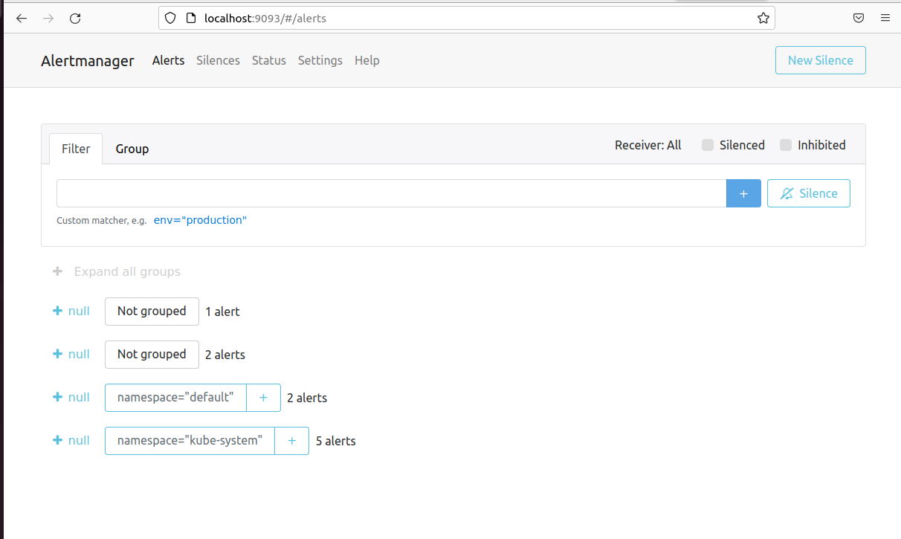

## Kubernetes Cluster Monitoring with Prometheus

### Components

- The Prometheus Operator: Simplifies management and deployment of Prometheus instances in Kubernetes.
- Prometheus: System for collecting and storing cluster metrics.
- Alertmanager: Manages and routes alerts generated by Prometheus.
- Prometheus node-exporter: Collects hardware and OS metrics from Kubernetes nodes for monitoring.
- Prometheus blackbox-exporter: Probes blackbox endpoints and exports results as metrics.
- Prometheus Adapter for Kubernetes Metrics APIs: Adapts metrics between Kubernetes Metrics API and Prometheus.
- kube-state-metrics: get metrics from Kubernetes cluster for monitoring.
- Grafana: Visualization for querying and visualizing of Prometheus.

```commandline
$ kubectl get po,sts,svc,pvc,cm

NAME                                                         READY   STATUS    RESTARTS   AGE
pod/alertmanager-test-kube-prometheus-stack-alertmanager-0   2/2     Running   0          4m44s
pod/prometheus-test-kube-prometheus-stack-prometheus-0       2/2     Running   0          4m44s
pod/test-grafana-dc4fd8479-tl8f8                             3/3     Running   0          4m57s
pod/test-kube-prometheus-stack-operator-d66444cd8-zlbww      1/1     Running   0          4m57s
pod/test-kube-state-metrics-6f68f85d56-p5mzn                 1/1     Running   0          4m57s
pod/test-prometheus-node-exporter-nzkm7                      1/1     Running   0          4m57s

NAME                                                                    READY   AGE
statefulset.apps/alertmanager-test-kube-prometheus-stack-alertmanager   1/1     4m44s
statefulset.apps/prometheus-test-kube-prometheus-stack-prometheus       1/1     4m44s

NAME                                              TYPE        CLUSTER-IP       EXTERNAL-IP   PORT(S)                      AGE
service/alertmanager-operated                     ClusterIP   None             <none>        9093/TCP,9094/TCP,9094/UDP   4m44s
service/kubernetes                                ClusterIP   10.96.0.1        <none>        443/TCP                      21m
service/prometheus-operated                       ClusterIP   None             <none>        9090/TCP                     4m44s
service/test-grafana                              ClusterIP   10.108.64.214    <none>        80/TCP                       4m57s
service/test-kube-prometheus-stack-alertmanager   ClusterIP   10.107.196.205   <none>        9093/TCP,8080/TCP            4m57s
service/test-kube-prometheus-stack-operator       ClusterIP   10.106.161.60    <none>        443/TCP                      4m57s
service/test-kube-prometheus-stack-prometheus     ClusterIP   10.105.147.134   <none>        9090/TCP,8080/TCP            4m57s
service/test-kube-state-metrics                   ClusterIP   10.96.219.209    <none>        8080/TCP                     4m57s
service/test-prometheus-node-exporter             ClusterIP   10.107.212.107   <none>        9100/TCP                     4m57s

NAME                                                                     DATA   AGE
configmap/kube-root-ca.crt                                               1      21m
configmap/prometheus-test-kube-prometheus-stack-prometheus-rulefiles-0   35     4m44s
configmap/test-grafana                                                   1      4m57s
configmap/test-grafana-config-dashboards                                 1      4m57s
configmap/test-kube-prometheus-stack-alertmanager-overview               1      4m57s
configmap/test-kube-prometheus-stack-apiserver                           1      4m57s
configmap/test-kube-prometheus-stack-cluster-total                       1      4m57s
configmap/test-kube-prometheus-stack-controller-manager                  1      4m57s
configmap/test-kube-prometheus-stack-etcd                                1      4m57s
configmap/test-kube-prometheus-stack-grafana-datasource                  1      4m57s
configmap/test-kube-prometheus-stack-grafana-overview                    1      4m57s
configmap/test-kube-prometheus-stack-k8s-coredns                         1      4m57s
configmap/test-kube-prometheus-stack-k8s-resources-cluster               1      4m57s
configmap/test-kube-prometheus-stack-k8s-resources-multicluster          1      4m57s
configmap/test-kube-prometheus-stack-k8s-resources-namespace             1      4m57s
configmap/test-kube-prometheus-stack-k8s-resources-node                  1      4m57s
configmap/test-kube-prometheus-stack-k8s-resources-pod                   1      4m57s
configmap/test-kube-prometheus-stack-k8s-resources-workload              1      4m57s
configmap/test-kube-prometheus-stack-k8s-resources-workloads-namespace   1      4m57s
configmap/test-kube-prometheus-stack-kubelet                             1      4m57s
configmap/test-kube-prometheus-stack-namespace-by-pod                    1      4m57s
configmap/test-kube-prometheus-stack-namespace-by-workload               1      4m57s
configmap/test-kube-prometheus-stack-node-cluster-rsrc-use               1      4m57s
configmap/test-kube-prometheus-stack-node-rsrc-use                       1      4m57s
configmap/test-kube-prometheus-stack-nodes                               1      4m57s
configmap/test-kube-prometheus-stack-nodes-darwin                        1      4m57s
configmap/test-kube-prometheus-stack-persistentvolumesusage              1      4m57s
configmap/test-kube-prometheus-stack-pod-total                           1      4m57s
configmap/test-kube-prometheus-stack-prometheus                          1      4m57s
configmap/test-kube-prometheus-stack-proxy                               1      4m57s
configmap/test-kube-prometheus-stack-scheduler                           1      4m57s
configmap/test-kube-prometheus-stack-workload-total                      1      4m57s
```

This output shows:

- list of pods from Kube Prometheus Stack
- list of stateful sets from Kube Prometheus Stack
- list of services from Kube Prometheus Stack
- list of config maps from Kube Prometheus Stack

### Screenshots













