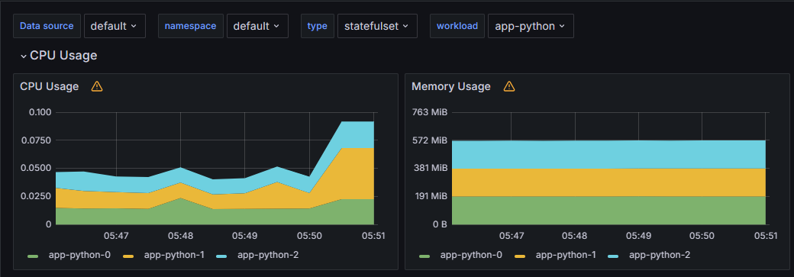
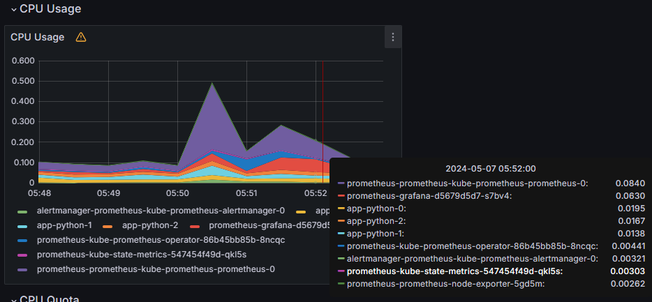
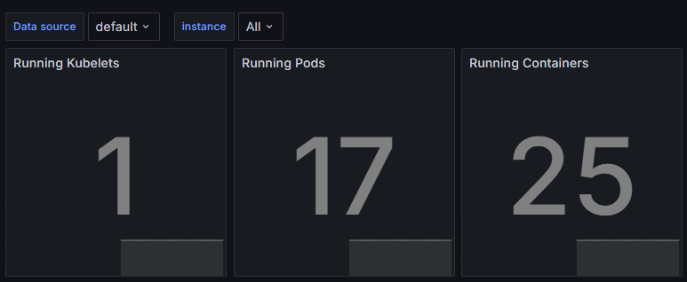
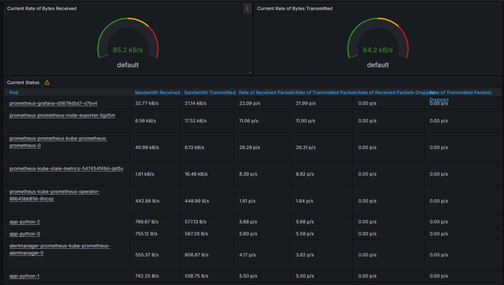
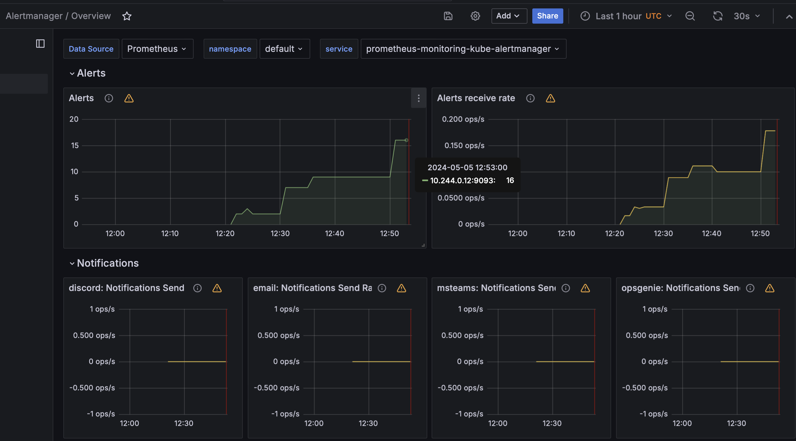
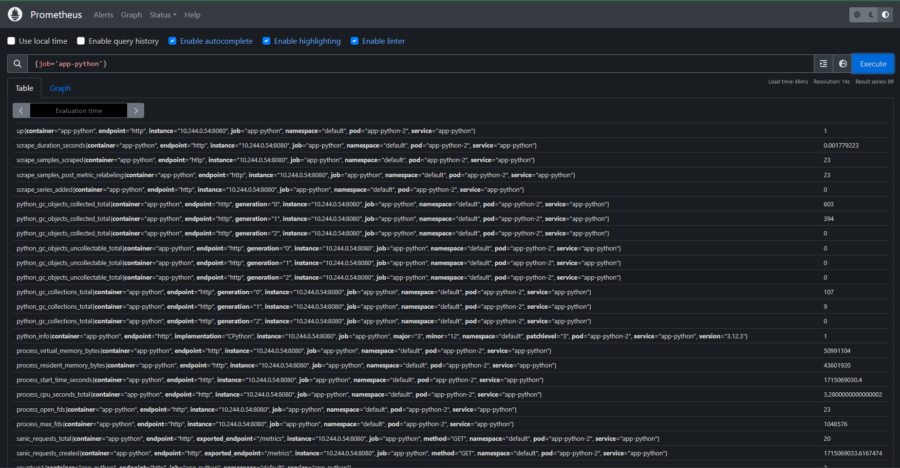

# Kubernetes Cluster Monitoring

Kube Prometheus Stack:

1. __Prometheus Operator__ - manages Prometheus deployment using custom resources
2. __Prometheus__ - collects metrics from the cluster
3. __Alertmanager__ - handles alerts from Prometheus
4. __Node-exporter__ - collects hardware and os metrics from nodes
5. __Prometheus Adapter__ - connects Metric API to Prometheus, allowing Kubernetes to use the data from Prometheus
6. __Kube State Metrics__ - generates metrics from the state of Kubernetes objects
7. __Grafana__ - visualizes the collected metric

```shell
$ kubectl get po,sts,svc,pvc,cm
NAME                                                         READY   STATUS    RESTARTS        AGE
pod/alertmanager-prometheus-stack-kube-prom-alertmanager-0   2/2     Running   2 (5m23s ago)   13m
pod/app-python-0                                             1/1     Running   0               67s
pod/app-python-1                                             1/1     Running   0               67s
pod/app-python-2                                             1/1     Running   0               67s
pod/prometheus-prometheus-stack-kube-prom-prometheus-0       2/2     Running   2 (5m23s ago)   13m
pod/prometheus-stack-grafana-5976f5cdf4-cbz79                3/3     Running   3 (5m17s ago)   13m
pod/prometheus-stack-kube-prom-operator-994c8d698-krxns      1/1     Running   1 (5m23s ago)   13m
pod/prometheus-stack-kube-state-metrics-dc5dc9bb-r95ww       1/1     Running   1 (5m25s ago)   13m
pod/prometheus-stack-prometheus-node-exporter-8rfgt          1/1     Running   1 (5m22s ago)   13m

NAME                                                                    READY   AGE
statefulset.apps/alertmanager-prometheus-stack-kube-prom-alertmanager   1/1     13m
statefulset.apps/app-python                                             3/3     68s
statefulset.apps/prometheus-prometheus-stack-kube-prom-prometheus       1/1     13m

NAME                                                TYPE        CLUSTER-IP       EXTERNAL-IP   PORT(S)                      AGE
service/alertmanager-operated                       ClusterIP   None             <none>        9093/TCP,9094/TCP,9094/UDP   13m
service/app-python                                  ClusterIP   10.104.141.22    <none>        8080/TCP                     68s
service/kubernetes                                  ClusterIP   10.96.0.1        <none>        443/TCP                      18m
service/prometheus-operated                         ClusterIP   None             <none>        9090/TCP                     13m
service/prometheus-stack-grafana                    ClusterIP   10.105.233.48    <none>        80/TCP                       13m
service/prometheus-stack-kube-prom-alertmanager     ClusterIP   10.104.6.77      <none>        9093/TCP,8080/TCP            13m
service/prometheus-stack-kube-prom-operator         ClusterIP   10.109.153.101   <none>        443/TCP                      13m
service/prometheus-stack-kube-prom-prometheus       ClusterIP   10.110.207.130   <none>        9090/TCP,8080/TCP            13m
service/prometheus-stack-kube-state-metrics         ClusterIP   10.100.184.18    <none>        8080/TCP                     13m
service/prometheus-stack-prometheus-node-exporter   ClusterIP   10.96.244.124    <none>        9100/TCP                     13m

NAME                                        STATUS   VOLUME                                     CAPACITY   ACCESS MODES   STORAGECLASS   AGE
persistentvolumeclaim/visits-app-python-0   Bound    pvc-de981b1b-7075-46d5-923d-d16da503348f   10Mi       RWO            standard       11m
persistentvolumeclaim/visits-app-python-1   Bound    pvc-846b446e-e919-41db-9704-7f7bf89b00ca   10Mi       RWO            standard       11m
persistentvolumeclaim/visits-app-python-2   Bound    pvc-c521d359-1195-4324-8119-38d53f3f1950   10Mi       RWO            standard       11m

NAME                                                                     DATA   AGE
configmap/app-python-config                                              1      68s
configmap/kube-root-ca.crt                                               1      18m
configmap/prometheus-prometheus-stack-kube-prom-prometheus-rulefiles-0   35     13m
configmap/prometheus-stack-grafana                                       1      13m
configmap/prometheus-stack-grafana-config-dashboards                     1      13m
configmap/prometheus-stack-kube-prom-alertmanager-overview               1      13m
configmap/prometheus-stack-kube-prom-apiserver                           1      13m
configmap/prometheus-stack-kube-prom-cluster-total                       1      13m
configmap/prometheus-stack-kube-prom-controller-manager                  1      13m
configmap/prometheus-stack-kube-prom-etcd                                1      13m
configmap/prometheus-stack-kube-prom-grafana-datasource                  1      13m
configmap/prometheus-stack-kube-prom-grafana-overview                    1      13m
configmap/prometheus-stack-kube-prom-k8s-coredns                         1      13m
configmap/prometheus-stack-kube-prom-k8s-resources-cluster               1      13m
configmap/prometheus-stack-kube-prom-k8s-resources-multicluster          1      13m
configmap/prometheus-stack-kube-prom-k8s-resources-namespace             1      13m
configmap/prometheus-stack-kube-prom-k8s-resources-node                  1      13m
configmap/prometheus-stack-kube-prom-k8s-resources-pod                   1      13m
configmap/prometheus-stack-kube-prom-k8s-resources-workload              1      13m
configmap/prometheus-stack-kube-prom-k8s-resources-workloads-namespace   1      13m
configmap/prometheus-stack-kube-prom-kubelet                             1      13m
configmap/prometheus-stack-kube-prom-namespace-by-pod                    1      13m
configmap/prometheus-stack-kube-prom-namespace-by-workload               1      13m
configmap/prometheus-stack-kube-prom-node-cluster-rsrc-use               1      13m
configmap/prometheus-stack-kube-prom-node-rsrc-use                       1      13m
configmap/prometheus-stack-kube-prom-nodes                               1      13m
configmap/prometheus-stack-kube-prom-nodes-darwin                        1      13m
configmap/prometheus-stack-kube-prom-persistentvolumesusage              1      13m
configmap/prometheus-stack-kube-prom-pod-total                           1      13m
configmap/prometheus-stack-kube-prom-prometheus                          1      13m
configmap/prometheus-stack-kube-prom-proxy                               1      13m
configmap/prometheus-stack-kube-prom-scheduler                           1      13m
configmap/prometheus-stack-kube-prom-workload-total                      1      13m
```

Stack:

- pods with application and `kube-prometheus-stack` elements (alertmanager, prometheus, prom-operator, grafana, node-exporter and kube-state-metrics)
- statefulsets of application, alertmanager and prometheus
- services of application and every part of the stack
- pvcs of application
- configmaps of application, k8s certificates, grafana and prometheus

## Information about cluster

1. Check CPU and Memory consumption of your StatefulSet.

    

2. Identify Pods with higher and lower CPU usage in the default namespace. (`prometheus` and `node-exporter`)

    

3. Monitor node memory usage in percentage and megabytes.

    

4. Count the number of pods and containers managed by the Kubelet service.

    

5. Evaluate network usage of Pods in the default namespace.

    

6. Determine the number of active alerts; also check the Web UI with `minikube service monitoring-kube-prometheus-alertmanager`. (8 alerts)

    

### Metrics from app

Proof:



## Init Containers

Proof:

```shell
$ kubectl exec pod/app-python-0 -- cat /init-dir/index.html
Defaulted container "app-python" out of: app-python, init (init)
<html><head></head><body><header>
<title>http://info.cern.ch</title>
</header>

<h1>http://info.cern.ch - home of the first website</h1>
<p>From here you can:</p>
<ul>
<li><a href="http://info.cern.ch/hypertext/WWW/TheProject.html">Browse the first website</a></li>
<li><a href="http://line-mode.cern.ch/www/hypertext/WWW/TheProject.html">Browse the first website using the line-mode browser simulator</a></li>
<li><a href="http://home.web.cern.ch/topics/birth-web">Learn about the birth of the web</a></li>
<li><a href="http://home.web.cern.ch/about">Learn about CERN, the physics laboratory where the web was born</a></li>
</ul>
</body></html>
```

### Multiple init containers

Proof:

```shell
$ kubectl exec pod/app-python-2 -- cat /init-dir/index.html
Defaulted container "app-python" out of: app-python, init (init), init-2 (init), init-3 (init)
<html><head></head><body><header>
<title>http://info.cern.ch</title>
</header>

<h1>http://info.cern.ch - home of the first website</h1>
<p>From here you can:</p>
<ul>
<li><a href="http://info.cern.ch/hypertext/WWW/TheProject.html">Browse the first website</a></li>
<li><a href="http://line-mode.cern.ch/www/hypertext/WWW/TheProject.html">Browse the first website using the line-mode browser simulator</a></li>
<li><a href="http://home.web.cern.ch/topics/birth-web">Learn about the birth of the web</a></li>
<li><a href="http://home.web.cern.ch/about">Learn about CERN, the physics laboratory where the web was born</a></li>
</ul>
</body></html>
init 2 output
init 3 output
```
