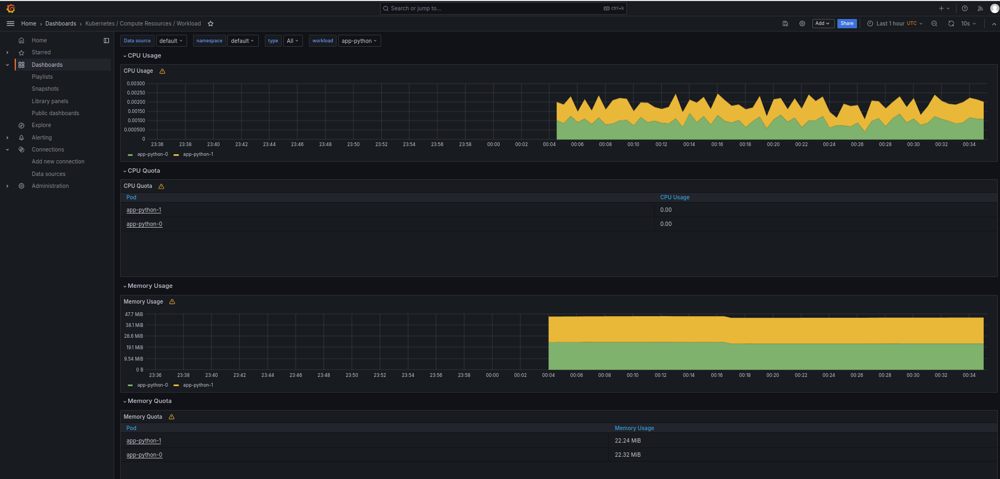
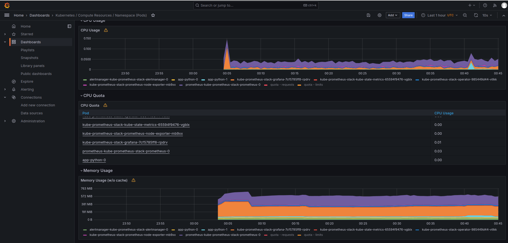
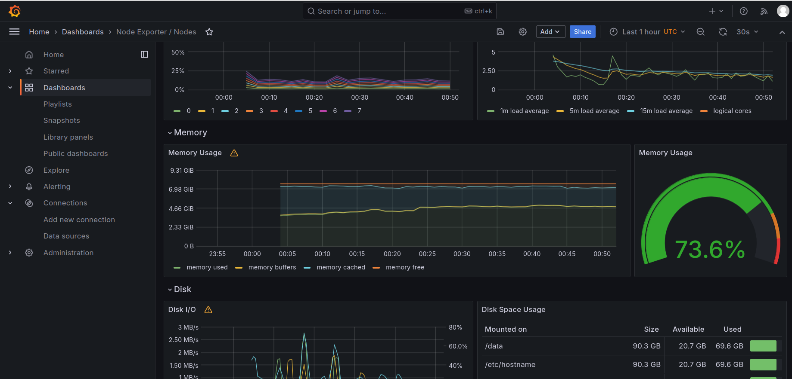
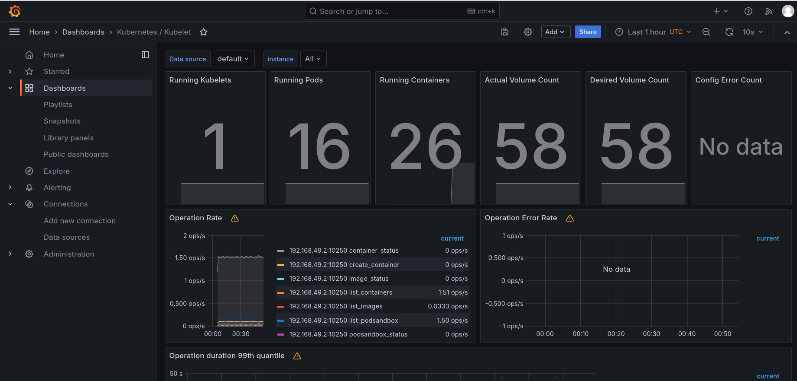
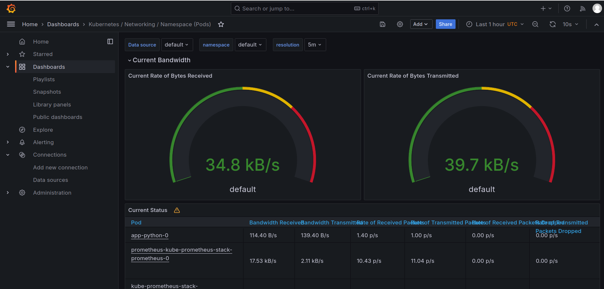
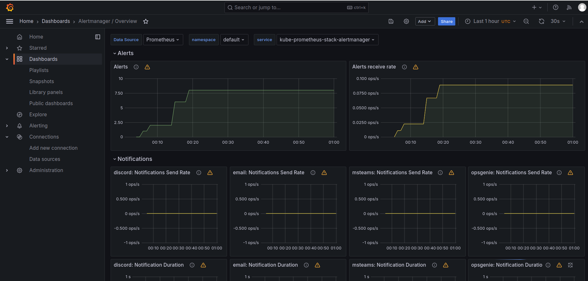
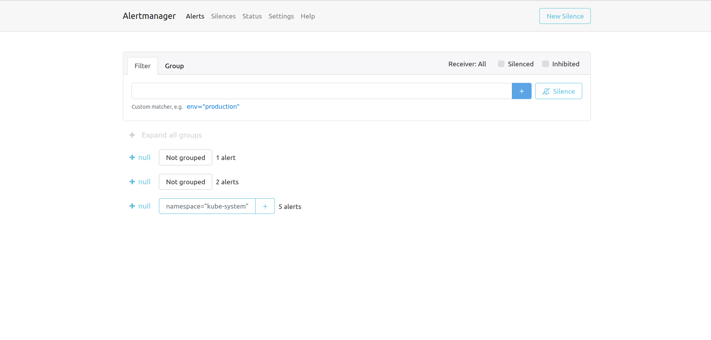

# Lab 14

## Task1

- ***Components details***

    1. **Prometheus Operator:** It automates the deployment, configuration, and management of Prometheus instances, making it easier to scale and maintain monitoring capabilities.

    2. **Prometheus:** collect and store metrics from various sources.

    3. **Alertmanager:** handles alerts generated by Prometheus and routes them to appropriate channels such as email.

    4. **Prometheus Node Exporter:** gathers system-level metrics from Kubernetes nodes, providing insights into CPU, memory, disk usage, and network activity.

    5. **Prometheus Blackbox Exporter:** It performs HTTP, TCP, and ICMP probes to check the availability and responsiveness of services.

    6. **Prometheus Adapter for Kubernetes Metrics APIs:** Gets metrics from kubernetes and provides them to Prometheus.

    7. **kube-state-metrics:** collects and exposes detailed information about the state of Kubernetes objects allowing the operators the monitor their health and performance.

    8. **Grafana:** visualization tool that complements Prometheus by enabling users to create customizable dashboards for visualizing and analyzing metrics.

- ***Installation***
    
    ```terminal
    $ helm repo add prometheus-community https://prometheus-community.github.io/helm-charts
    
    $ helm repo update 

    $ helm install kube-prometheus-stack prometheus-community/kube-prometheus-stack
    NAME: kube-prometheus-stack
    LAST DEPLOYED: Wed May  8 01:34:47 2024
    NAMESPACE: default
    STATUS: deployed
    REVISION: 1
    NOTES:
    kube-prometheus-stack has been installed. Check its status by running:
    kubectl --namespace default get pods -l "release=kube-prometheus-stack"

    Visit https://github.com/prometheus-operator/kube-prometheus for instructions on how to create & configure Alertmanager and Prometheus instances using the Operator.

    $ kubectl --namespace default get pods -l "release=kube-prometheus-stack"
    NAME                                                        READY   STATUS    RESTARTS   AGE
    kube-prometheus-stack-kube-state-metrics-65594f9476-4gvqb   1/1     Running   0          110s
    kube-prometheus-stack-operator-985449d44-q5z6w              1/1     Running   0          110s
    kube-prometheus-stack-prometheus-node-exporter-qrk56        1/1     Running   0          111s

    $ helm secrets install app-python ./app-python -n default -f ./secrets.yaml
    NAME: app-python
    LAST DEPLOYED: Wed May  8 01:54:01 2024
    NAMESPACE: default
    STATUS: deployed
    REVISION: 1
    NOTES:
    1. Get the application URL by running these commands:
        NOTE: It may take a few minutes for the LoadBalancer IP to be available.
            You can watch the status of by running 'kubectl get --namespace default svc -w app-python'
    export SERVICE_IP=$(kubectl get svc --namespace default app-python --template "{{ range (index .status.loadBalancer.ingress 0) }}{{.}}{{ end }}")
    echo http://$SERVICE_IP:5000
    removed './secrets.yaml.dec'

    ```

- ***`kubectl get po,sts,svc,pvc,cm`***
    ```
    $ kubectl get po,sts,svc,pvc,cm

    # List of running pods in the cluster

    sarhan@sarhan-HP:~/projects/DevOps/k8s$ kubectl get po,sts,svc,pvc,cm
    NAME                                                            READY   STATUS    RESTARTS        AGE
    pod/alertmanager-kube-prometheus-stack-alertmanager-0           2/2     Running   0               6m32s
    pod/app-python-0                                                1/1     Running   2 (4m21s ago)   16m
    pod/app-python-1                                                1/1     Running   1               16m
    pod/kube-prometheus-stack-grafana-7cf5785ff8-rpdrv              3/3     Running   1 (66s ago)     7m8s
    pod/kube-prometheus-stack-kube-state-metrics-65594f9476-vgblx   1/1     Running   0               7m8s
    pod/kube-prometheus-stack-operator-985449d44-vtlkk              1/1     Running   0               7m8s
    pod/kube-prometheus-stack-prometheus-node-exporter-mb9xx        1/1     Running   0               7m8s
    pod/prometheus-kube-prometheus-stack-prometheus-0               2/2     Running   0               6m30s

    # list of statefulsets
    NAME                                                               READY   AGE
    statefulset.apps/alertmanager-kube-prometheus-stack-alertmanager   1/1     6m32s
    statefulset.apps/app-python                                        2/2     16m
    statefulset.apps/prometheus-kube-prometheus-stack-prometheus       1/1     6m31s

    # list of the services and their details (AGE, TYPE, ...)
    NAME                                                     TYPE           CLUSTER-IP      EXTERNAL-IP   PORT(S)                      AGE
    service/alertmanager-operated                            ClusterIP      None            <none>        9093/TCP,9094/TCP,9094/UDP   6m32s
    service/app-python                                       LoadBalancer   10.98.246.250   <pending>     5000:30351/TCP               16m
    service/kube-prometheus-stack-alertmanager               ClusterIP      10.96.147.220   <none>        9093/TCP,8080/TCP            7m10s
    service/kube-prometheus-stack-grafana                    ClusterIP      10.108.20.228   <none>        80/TCP                       7m10s
    service/kube-prometheus-stack-kube-state-metrics         ClusterIP      10.96.28.139    <none>        8080/TCP                     7m10s
    service/kube-prometheus-stack-operator                   ClusterIP      10.97.101.226   <none>        443/TCP                      7m10s
    service/kube-prometheus-stack-prometheus                 ClusterIP      10.96.23.143    <none>        9090/TCP,8080/TCP            7m10s
    service/kube-prometheus-stack-prometheus-node-exporter   ClusterIP      10.110.202.24   <none>        9100/TCP                     7m10s
    service/kubernetes                                       ClusterIP      10.96.0.1       <none>        443/TCP                      31m
    service/prometheus-operated                              ClusterIP      None            <none>        9090/TCP                     6m31s

    # list of persistent volumes
    NAME                                     STATUS   VOLUME                                     CAPACITY   ACCESS MODES   STORAGECLASS   AGE
    persistentvolumeclaim/www-app-python-0   Bound    pvc-7cea5181-f8af-4ed9-9a5f-42764fa02382   1Gi        RWO            standard       16m
    persistentvolumeclaim/www-app-python-1   Bound    pvc-467b556a-1824-4194-9113-76cd42d39941   1Gi        RWO            standard       16m

    # list of config maps 
    NAME                                                                DATA   AGE
    configmap/config                                                    1      16m
    configmap/kube-prometheus-stack-alertmanager-overview               1      7m10s
    configmap/kube-prometheus-stack-apiserver                           1      7m10s
    configmap/kube-prometheus-stack-cluster-total                       1      7m10s
    configmap/kube-prometheus-stack-controller-manager                  1      7m10s
    configmap/kube-prometheus-stack-etcd                                1      7m10s
    configmap/kube-prometheus-stack-grafana                             1      7m10s
    configmap/kube-prometheus-stack-grafana-config-dashboards           1      7m10s
    configmap/kube-prometheus-stack-grafana-datasource                  1      7m10s
    configmap/kube-prometheus-stack-grafana-overview                    1      7m10s
    configmap/kube-prometheus-stack-k8s-coredns                         1      7m10s
    configmap/kube-prometheus-stack-k8s-resources-cluster               1      7m10s
    configmap/kube-prometheus-stack-k8s-resources-multicluster          1      7m10s
    configmap/kube-prometheus-stack-k8s-resources-namespace             1      7m10s
    configmap/kube-prometheus-stack-k8s-resources-node                  1      7m10s
    configmap/kube-prometheus-stack-k8s-resources-pod                   1      7m10s
    configmap/kube-prometheus-stack-k8s-resources-workload              1      7m10s
    configmap/kube-prometheus-stack-k8s-resources-workloads-namespace   1      7m10s
    configmap/kube-prometheus-stack-kubelet                             1      7m10s
    configmap/kube-prometheus-stack-namespace-by-pod                    1      7m10s
    configmap/kube-prometheus-stack-namespace-by-workload               1      7m10s
    configmap/kube-prometheus-stack-node-cluster-rsrc-use               1      7m10s
    configmap/kube-prometheus-stack-node-rsrc-use                       1      7m10s
    configmap/kube-prometheus-stack-nodes                               1      7m10s
    configmap/kube-prometheus-stack-nodes-darwin                        1      7m10s
    configmap/kube-prometheus-stack-persistentvolumesusage              1      7m10s
    configmap/kube-prometheus-stack-pod-total                           1      7m10s
    configmap/kube-prometheus-stack-prometheus                          1      7m10s
    configmap/kube-prometheus-stack-proxy                               1      7m10s
    configmap/kube-prometheus-stack-scheduler                           1      7m10s
    configmap/kube-prometheus-stack-workload-total                      1      7m10s
    configmap/kube-root-ca.crt                                          1      31m
    configmap/prometheus-kube-prometheus-stack-prometheus-rulefiles-0   35     6m33s
    ```

- ***Grafana Dashboards:***
1. Check CPU and Memory consumption of your StatefulSet.
    - app-python-0 CPU consumption is 0.001 and memory 22.32 MiB
    - app-python-1 CPU consumption is 0.002 and memory 22.24 MiB

    

2. Identify Pods with higher and lower CPU usage in the default namespace.
    Higher CPU usage: prometheus-kube-prometheus-stack-prometheus-0
    Lowr CPU usage: most of the time it's alertmanager-0 pod.
    

3. Monitor node memory usage in percentage and megabytes.
    - memory used: 4.88
    - percentage: 73.6
    

4. Count the number of pods and containers managed by the Kubelet service.
    - Pods: 16
    - Containers: 26
    

5. Evaluate network usage of Pods in the default namespace.
    - Download: 34.8
    - Upload: 39.7
    

6. Determine the number of active alerts; also check the Web UI with `minikube service monitoring-kube-prometheus-alertmanager`.
    - Active Alerts: 8
    
    

    