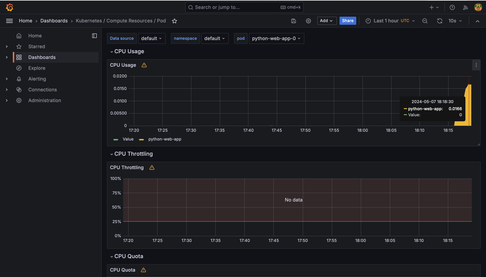
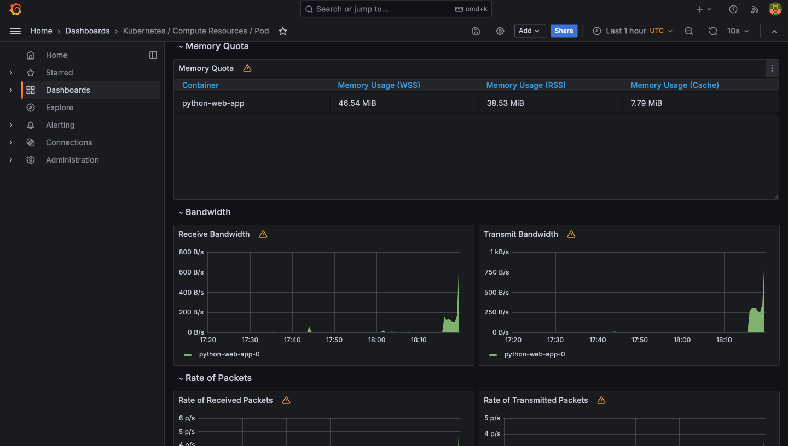
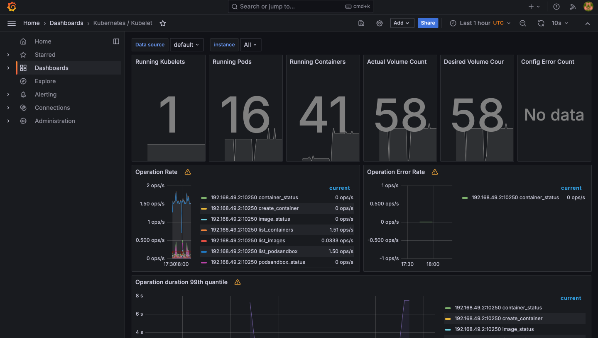
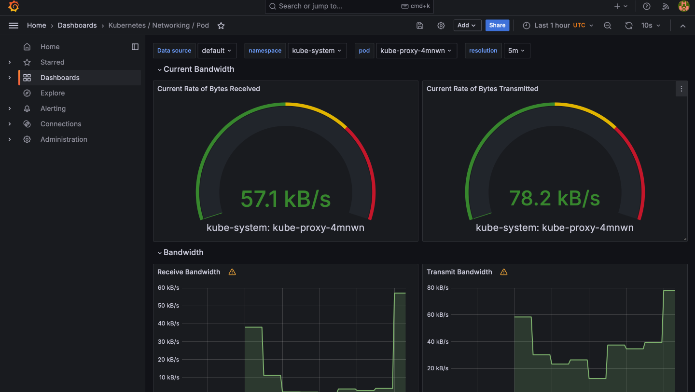
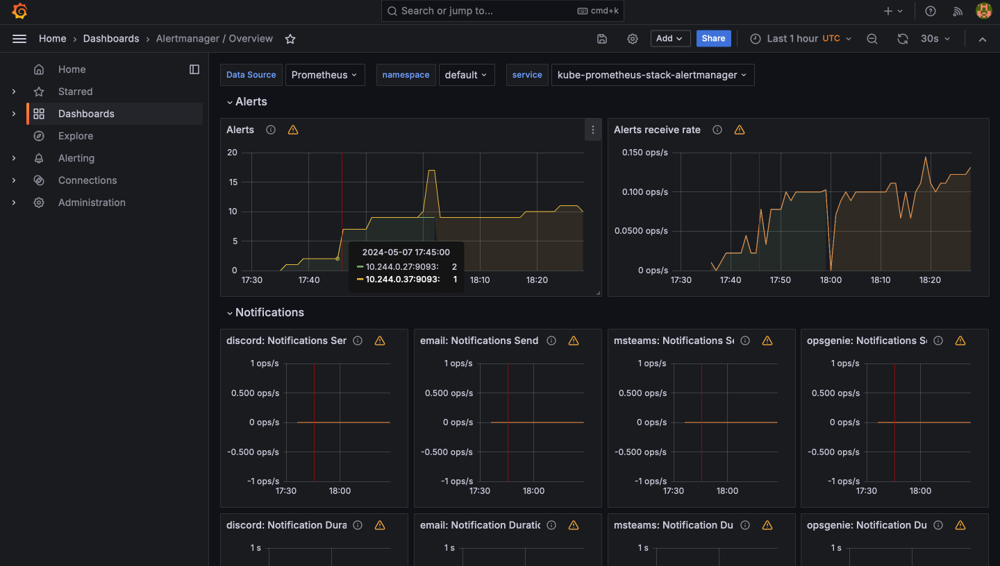
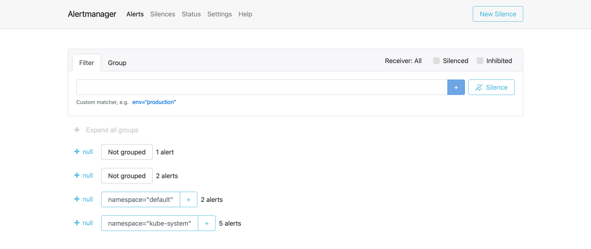

# Task 1: Kubernetes Cluster Monitoring with Prometheus

## Understanding the Components of the Kube Prometheus Stack

1. **Prometheus**:
Prometheus is like a diligent watcher for your applications in a Kubernetes environment. It scrapes metrics from your services, helping you understand how they're performing. Think of it as a digital health tracker for your applications.

2. **Alertmanager**:
Alertmanager is like your personal assistant, but for alerts. It receives alerts from Prometheus when something isn't quite right with your applications and takes action based on predefined rules. It's the one who taps you on the shoulder when it's time to pay attention to something important.

3. **Grafana**:
Grafana is your artistic sidekick. It takes all the data collected by Prometheus and turns it into beautiful, easy-to-understand dashboards and graphs. So instead of staring at boring numbers, you get to see visually pleasing charts that tell you exactly what's happening with your applications.

4. **kube-state-metrics**:
kube-state-metrics is like a backstage pass to your Kubernetes cluster. It gathers information about the state of your cluster, like how many pods are running or how much CPU and memory they're using. This information is then used by Prometheus to keep an eye on the health of your applications.

5. **node-exporter**:
Node-exporter is like a scout that explores each node in your Kubernetes cluster and gathers important information about its health and performance. It collects data like CPU usage, memory usage, and disk space, which Prometheus can then use to monitor the overall health of your cluster.

6. **kube-prometheus**:
kube-prometheus is like a treasure chest that contains all the tools you need for monitoring your Kubernetes environment with Prometheus. It bundles together Prometheus, Alertmanager, Grafana, kube-state-metrics, and node-exporter, making it easy to set up and manage your monitoring stack.

7. **Prometheus Operator**:
The Prometheus Operator is like your personal automation assistant for managing Prometheus instances in Kubernetes. It takes care of tasks like deploying, configuring, and scaling Prometheus instances, so you can focus on more important things, like building awesome applications.

8. **Thanos**:
Thanos is like a superhero for your Prometheus monitoring setup. It extends Prometheus with features like long-term storage, global query capabilities, and high availability, making it easier to scale your monitoring solution as your Kubernetes environment grows.

By understanding the roles and functions of these components, you'll be well-equipped to monitor and maintain your Kubernetes applications effectively.

```
(base) yanapavlova@MacBook-Air-Ana k8s % kubectl get po,sts,svc,pvc,cm                
NAME                                                            READY   STATUS    RESTARTS      AGE
pod/alertmanager-kube-prometheus-stack-alertmanager-0           2/2     Running   2 (17m ago)   42m
pod/kube-prometheus-stack-grafana-7cf5785ff8-hg9hc              3/3     Running   3 (17m ago)   42m
pod/kube-prometheus-stack-kube-state-metrics-65594f9476-txgj9   1/1     Running   2 (16m ago)   42m
pod/kube-prometheus-stack-operator-985449d44-pnzc4              1/1     Running   2 (16m ago)   42m
pod/kube-prometheus-stack-prometheus-node-exporter-62cjx        1/1     Running   1 (17m ago)   42m
pod/prometheus-kube-prometheus-stack-prometheus-0               2/2     Running   2 (17m ago)   42m
pod/python-web-app-0                                            1/1     Running   0             40s
pod/python-web-app-1                                            1/1     Running   0             40s

NAME                                                               READY   AGE
statefulset.apps/alertmanager-kube-prometheus-stack-alertmanager   1/1     42m
statefulset.apps/prometheus-kube-prometheus-stack-prometheus       1/1     42m
statefulset.apps/python-web-app                                    2/2     40s

NAME                                                     TYPE        CLUSTER-IP       EXTERNAL-IP   PORT(S)                      AGE
service/alertmanager-operated                            ClusterIP   None             <none>        9093/TCP,9094/TCP,9094/UDP   42m
service/kube-prometheus-stack-alertmanager               ClusterIP   10.107.187.217   <none>        9093/TCP,8080/TCP            42m
service/kube-prometheus-stack-grafana                    ClusterIP   10.110.143.213   <none>        80/TCP                       42m
service/kube-prometheus-stack-kube-state-metrics         ClusterIP   10.96.98.35      <none>        8080/TCP                     42m
service/kube-prometheus-stack-operator                   ClusterIP   10.98.210.242    <none>        443/TCP                      42m
service/kube-prometheus-stack-prometheus                 ClusterIP   10.109.56.34     <none>        9090/TCP,8080/TCP            42m
service/kube-prometheus-stack-prometheus-node-exporter   ClusterIP   10.100.234.76    <none>        9100/TCP                     42m
service/kubernetes                                       ClusterIP   10.96.0.1        <none>        443/TCP                      13d
service/prometheus-operated                              ClusterIP   None             <none>        9090/TCP                     42m
service/python-web-app                                   ClusterIP   10.108.59.120    <none>        80/TCP                       40s

NAME                                          STATUS   VOLUME                                     CAPACITY   ACCESS MODES   STORAGECLASS   AGE
persistentvolumeclaim/data-python-web-app-0   Bound    pvc-ef53c9d0-a618-47c3-ba8b-f012d2bb5348   1Gi        RWO            standard       6d23h
persistentvolumeclaim/data-python-web-app-1   Bound    pvc-742a6b20-7d67-46ea-a082-1dc1a793fb14   1Gi        RWO            standard       6d23h

NAME                                                                DATA   AGE
configmap/config                                                    1      40s
configmap/kube-prometheus-stack-alertmanager-overview               1      42m
configmap/kube-prometheus-stack-apiserver                           1      42m
configmap/kube-prometheus-stack-cluster-total                       1      42m
configmap/kube-prometheus-stack-controller-manager                  1      42m
configmap/kube-prometheus-stack-etcd                                1      42m
configmap/kube-prometheus-stack-grafana                             1      42m
configmap/kube-prometheus-stack-grafana-config-dashboards           1      42m
configmap/kube-prometheus-stack-grafana-datasource                  1      42m
configmap/kube-prometheus-stack-grafana-overview                    1      42m
configmap/kube-prometheus-stack-k8s-coredns                         1      42m
configmap/kube-prometheus-stack-k8s-resources-cluster               1      42m
configmap/kube-prometheus-stack-k8s-resources-multicluster          1      42m
configmap/kube-prometheus-stack-k8s-resources-namespace             1      42m
configmap/kube-prometheus-stack-k8s-resources-node                  1      42m
configmap/kube-prometheus-stack-k8s-resources-pod                   1      42m
configmap/kube-prometheus-stack-k8s-resources-workload              1      42m
configmap/kube-prometheus-stack-k8s-resources-workloads-namespace   1      42m
configmap/kube-prometheus-stack-kubelet                             1      42m
configmap/kube-prometheus-stack-namespace-by-pod                    1      42m
configmap/kube-prometheus-stack-namespace-by-workload               1      42m
configmap/kube-prometheus-stack-node-cluster-rsrc-use               1      42m
configmap/kube-prometheus-stack-node-rsrc-use                       1      42m
configmap/kube-prometheus-stack-nodes                               1      42m
configmap/kube-prometheus-stack-nodes-darwin                        1      42m
configmap/kube-prometheus-stack-persistentvolumesusage              1      42m
configmap/kube-prometheus-stack-pod-total                           1      42m
configmap/kube-prometheus-stack-prometheus                          1      42m
configmap/kube-prometheus-stack-proxy                               1      42m
configmap/kube-prometheus-stack-scheduler                           1      42m
configmap/kube-prometheus-stack-workload-total                      1      42m
configmap/kube-root-ca.crt                                          1      13d
configmap/prometheus-kube-prometheus-stack-prometheus-rulefiles-0   35     42m
```

## Grafana Dashboards

### CPU and Memory consumption

```
CPU: 0.0166%
Memory: 45.15Mb
```




### CPU Quota - Min and Max

```
Max: prometheus-kube-prometheus-stack-prometheus-0 0.09
Min: alertmanager-kube-prometheus-stack-alertmanager-0 0.01
```


### Node memory usage in percentage and megabytes


### Pods and containers count

```
Pods: 16
Containers: 41
```



### Network

```
Download speed: 57.1 Kb/s
Upload speed: 78.2 Kb/s
```



### Alert Manager

```
Alerts: 10
```





# Task 2: Init Containers

```
(base) yanapavlova@MacBook-Air-Ana k8s % kubectl exec python-web-app-0  -- cat /app/data/web-site.html 
Defaulted container "python-web-app" out of: python-web-app, download-file (init)
<!doctype html>
<html>
<head>
    <title>Example Domain</title>

    <meta charset="utf-8" />
    <meta http-equiv="Content-type" content="text/html; charset=utf-8" />
    <meta name="viewport" content="width=device-width, initial-scale=1" />
    <style type="text/css">
    body {
        background-color: #f0f0f2;
        margin: 0;
        padding: 0;
        font-family: -apple-system, system-ui, BlinkMacSystemFont, "Segoe UI", "Open Sans", "Helvetica Neue", Helvetica, Arial, sans-serif;
        
    }
    div {
        width: 600px;
        margin: 5em auto;
        padding: 2em;
        background-color: #fdfdff;
        border-radius: 0.5em;
        box-shadow: 2px 3px 7px 2px rgba(0,0,0,0.02);
    }
    a:link, a:visited {
        color: #38488f;
        text-decoration: none;
    }
    @media (max-width: 700px) {
        div {
            margin: 0 auto;
            width: auto;
        }
    }
    </style>    
</head>

<body>
<div>
    <h1>Example Domain</h1>
    <p>This domain is for use in illustrative examples in documents. You may use this
    domain in literature without prior coordination or asking for permission.</p>
    <p><a href="https://www.iana.org/domains/example">More information...</a></p>
</div>
</body>
</html>
```