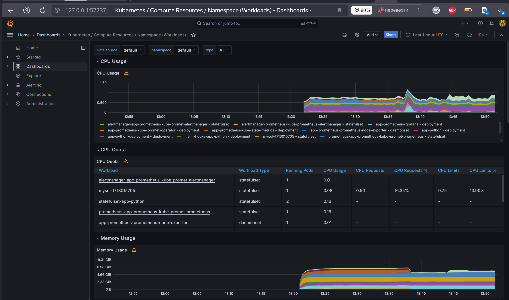
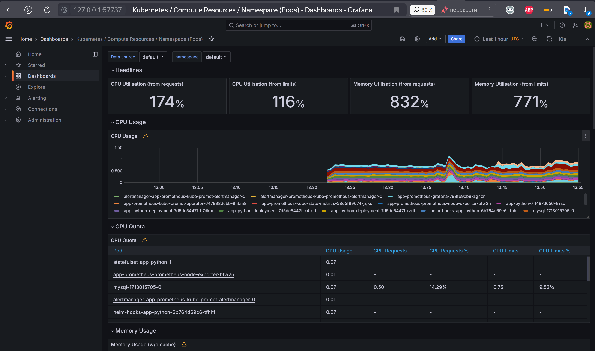
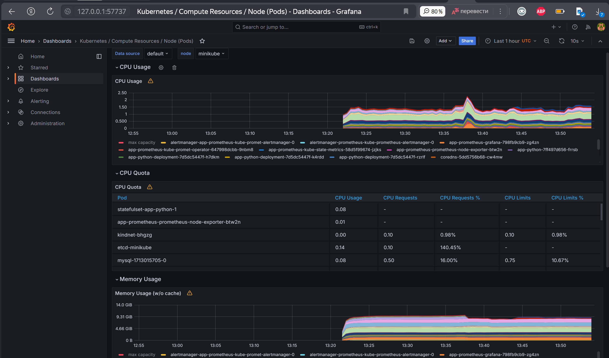
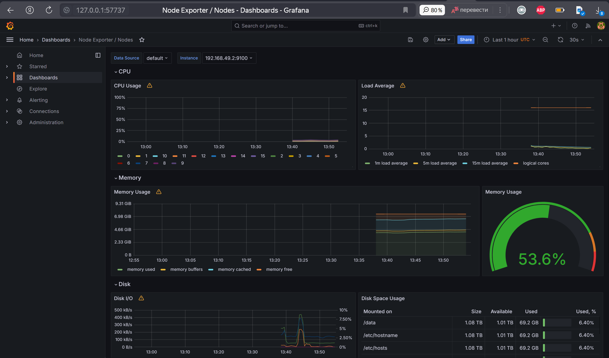
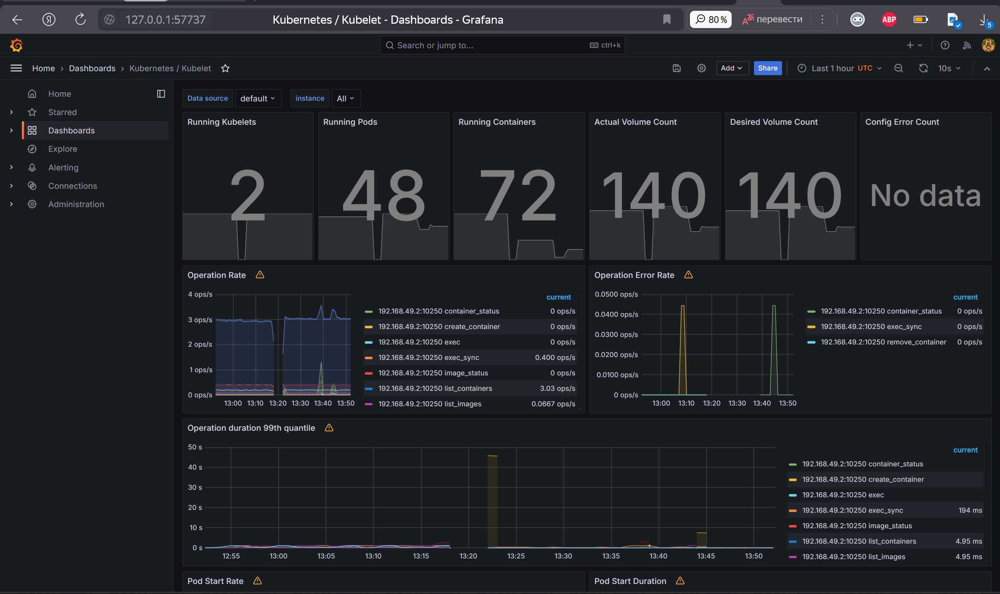
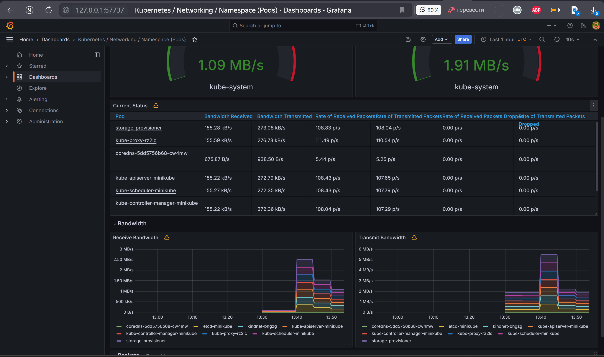
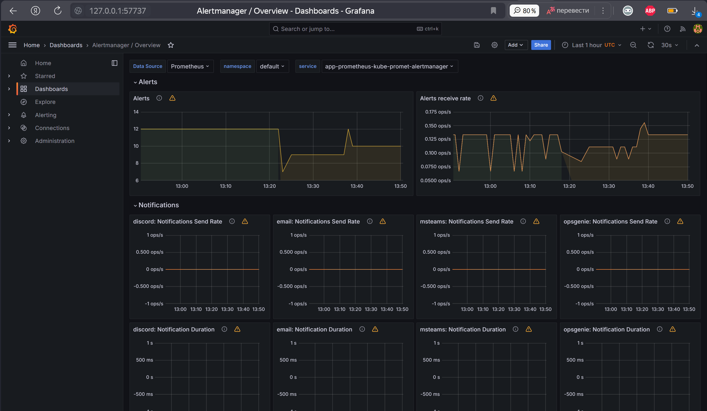
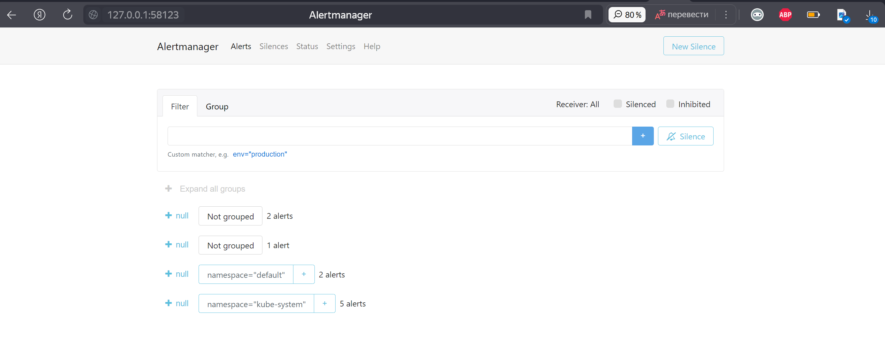

# Kubernetes Monitoring and Init Containers

## Kubernetes Cluster Monitoring with Prometheus

### The components of the Kube Prometheus Stack

1. The Prometheus Operator: It automates the configuration and scaling of Prometheus, making it easier to collect and store metrics from various targets in the cluster.

2. Highly available Prometheus: This component is responsible for collecting and storing metrics from different targets in the Kubernetes cluster. 

3. Highly available Alertmanager: The Alertmanager component handles alerting and notification based on alerts received from Prometheus. 

4. Prometheus node-exporter: This component collects hardware and operating system metrics from Kubernetes nodes. 

5. Prometheus blackbox-exporter: The blackbox-exporter performs checks on external services or endpoints to monitor their availability and responsiveness.

6. Prometheus Adapter for Kubernetes Metrics APIs: This component collects resource metrics from Kubernetes itself and exposes them via custom metrics APIs.

7. kube-state-metrics: kube-state-metrics provides insights into the health and operation of the cluster by collecting information about the desired and current state of various Kubernetes resources.

8. Grafana: Grafana allows users to visualize and analyze the performance and health of the Kubernetes cluster in real-time.

```
C:\Users\Анастасия\OneDrive\Документы\GitHub\S24-DevOps-labs\k8s>kubectl get po,sts,svc,pvc,cm
NAME                                                         READY   STATUS      RESTARTS   AGE
pod/alertmanager-app-prometheus-kube-promet-alertmanager-0   2/2     Running     2          114m
pod/app-prometheus-grafana-798fb9cb9-zg4zn                   3/3     Running     3          114m
pod/app-prometheus-kube-promet-operator-647998dcbb-9nbm8     1/1     Running     1          114m
pod/app-prometheus-kube-state-metrics-58d5f99674-jzjks       1/1     Running     1          114m
pod/app-prometheus-prometheus-node-exporter-btw2n            1/1     Running     0          114m
pod/app-python-7ff497d656-frrsb                              1/1     Running     5          34d
pod/app-python-deployment-7d5dc5447f-h7dkm                   1/1     Running     5          34d
pod/app-python-deployment-7d5dc5447f-k4rdd                   1/1     Running     5          34d
pod/app-python-deployment-7d5dc5447f-rzrlf                   1/1     Running     5          34d
pod/helm-hooks-app-python-6b764d69c6-tfhhf                   1/1     Running     4          23d
pod/mysql-1713015705-0                                       1/1     Running     4          23d
pod/postinstall-hook                                         0/1     Completed   0          73s
pod/preinstall-hook                                          0/1     Completed   0          101s
pod/prometheus-app-prometheus-kube-promet-prometheus-0       2/2     Running     2          114m
pod/statefulset-app-python-0                                 1/1     Running     0          74s
pod/statefulset-app-python-1                                 1/1     Running     0          73s

NAME                                                                    READY   AGE
statefulset.apps/alertmanager-app-prometheus-kube-promet-alertmanager   1/1     114m
statefulset.apps/prometheus-app-prometheus-kube-promet-prometheus       1/1     114m
statefulset.apps/statefulset-app-python                                 2/2     74s

NAME                                              TYPE           CLUSTER-IP       EXTERNAL-IP   PORT(S)                      AGE
service/alertmanager-operated                     ClusterIP      None             <none>        9093/TCP,9094/TCP,9094/UDP   114m
service/app-prometheus-grafana                    ClusterIP      10.105.23.37     <none>        80/TCP                       114m
service/app-prometheus-kube-promet-alertmanager   ClusterIP      10.111.156.144   <none>        9093/TCP,8080/TCP            114m
service/app-prometheus-kube-promet-operator       ClusterIP      10.99.238.146    <none>        443/TCP                      114m
service/app-prometheus-kube-promet-prometheus     ClusterIP      10.100.77.205    <none>        9090/TCP,8080/TCP            114m
service/app-prometheus-kube-state-metrics         ClusterIP      10.103.23.28     <none>        8080/TCP                     114m
service/app-prometheus-prometheus-node-exporter   ClusterIP      10.110.198.2     <none>        9100/TCP                     114m
service/app-python                                LoadBalancer   10.101.86.14     <pending>     5000:32326/TCP               34d
service/app-python-service                        LoadBalancer   10.96.141.79     <pending>     5000:31147/TCP               34d
service/helm-hooks-app-python                     ClusterIP      10.102.14.227    <none>        5000/TCP                     23d
service/kubernetes                                ClusterIP      10.96.0.1        <none>        443/TCP                      34d
service/mysql-1713015705                          ClusterIP      10.108.68.212    <none>        3306/TCP                     24d
service/mysql-1713015705-headless                 ClusterIP      None             <none>        3306/TCP                     24d
service/prometheus-operated                       ClusterIP      None             <none>        9090/TCP                     114m
service/statefulset-app-python                    NodePort       10.106.41.111    <none>        5000:31215/TCP               74s


NAME                                                                     DATA   AGE
configmap/app-prometheus-grafana                                         1      114m
configmap/app-prometheus-grafana-config-dashboards                       1      114m
configmap/app-prometheus-kube-promet-alertmanager-overview               1      114m
configmap/app-prometheus-kube-promet-apiserver                           1      114m
configmap/app-prometheus-kube-promet-cluster-total                       1      114m
configmap/app-prometheus-kube-promet-controller-manager                  1      114m
configmap/app-prometheus-kube-promet-etcd                                1      114m
configmap/app-prometheus-kube-promet-grafana-datasource                  1      114m
configmap/app-prometheus-kube-promet-grafana-overview                    1      114m
configmap/app-prometheus-kube-promet-k8s-coredns                         1      114m
configmap/app-prometheus-kube-promet-k8s-resources-cluster               1      114m
configmap/app-prometheus-kube-promet-k8s-resources-multicluster          1      114m
configmap/app-prometheus-kube-promet-k8s-resources-namespace             1      114m
configmap/app-prometheus-kube-promet-k8s-resources-node                  1      114m
configmap/app-prometheus-kube-promet-k8s-resources-pod                   1      114m
configmap/app-prometheus-kube-promet-k8s-resources-workload              1      114m
configmap/app-prometheus-kube-promet-k8s-resources-workloads-namespace   1      114m
configmap/app-prometheus-kube-promet-kubelet                             1      114m
configmap/app-prometheus-kube-promet-namespace-by-pod                    1      114m
configmap/app-prometheus-kube-promet-namespace-by-workload               1      114m
configmap/app-prometheus-kube-promet-node-cluster-rsrc-use               1      114m
configmap/app-prometheus-kube-promet-node-rsrc-use                       1      114m
configmap/app-prometheus-kube-promet-nodes                               1      114m
configmap/app-prometheus-kube-promet-nodes-darwin                        1      114m
configmap/app-prometheus-kube-promet-persistentvolumesusage              1      114m
configmap/app-prometheus-kube-promet-pod-total                           1      114m
configmap/app-prometheus-kube-promet-prometheus                          1      114m
configmap/app-prometheus-kube-promet-proxy                               1      114m
configmap/app-prometheus-kube-promet-scheduler                           1      114m
configmap/app-prometheus-kube-promet-workload-total                      1      114m
configmap/config                                                         1      74s
configmap/kube-root-ca.crt                                               1      34d
configmap/mysql-1713015705                                               1      24d
configmap/prometheus-app-prometheus-kube-promet-prometheus-rulefiles-0   35     113m
```

### Utilizing Grafana dashboards

#### CPU and Mem Usage



#### Pods CPU Usage



#### Node Memory Usage




#### Pods managed by Kubelet



#### Network usage



#### Active Alerts






## Init Containers

```
C:\Users\Анастасия\OneDrive\Документы\GitHub\S24-DevOps-labs\k8s>kubectl exec pod/statefulset-app-python-0 -- head -n 5 /work-dir/index.html
Defaulted container "app-python" out of: app-python, get-page (init)
<html><head></head><body><header>
<title>http://info.cern.ch</title>
</header>

<h1>http://info.cern.ch - home of the first website</h1>
```