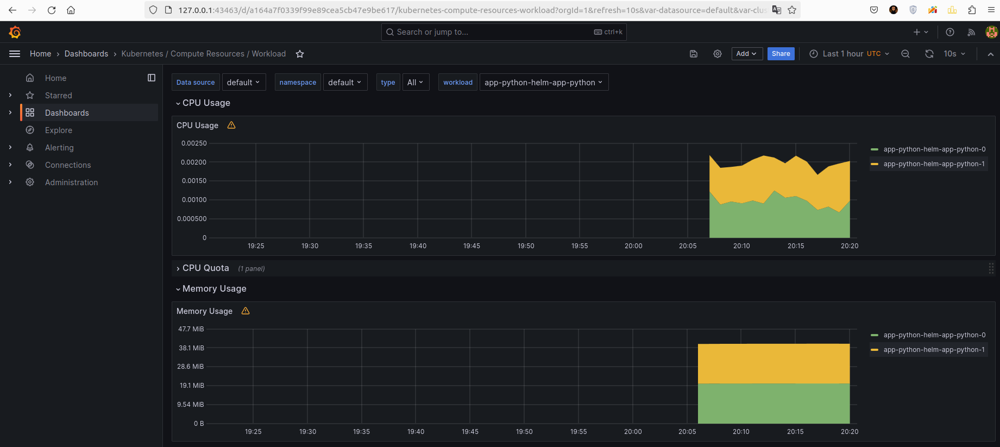
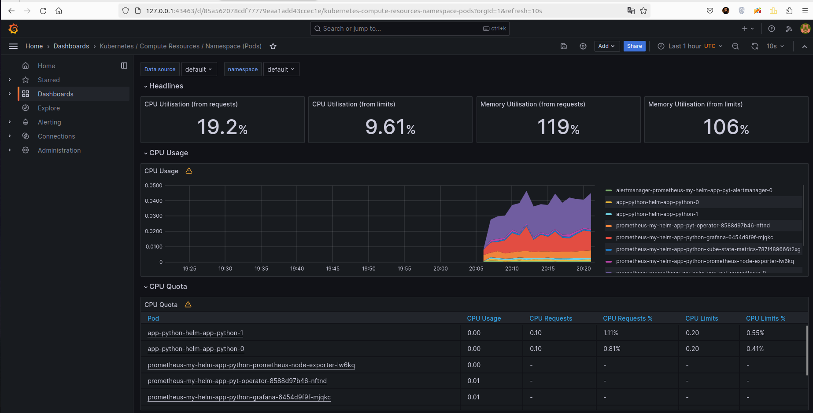
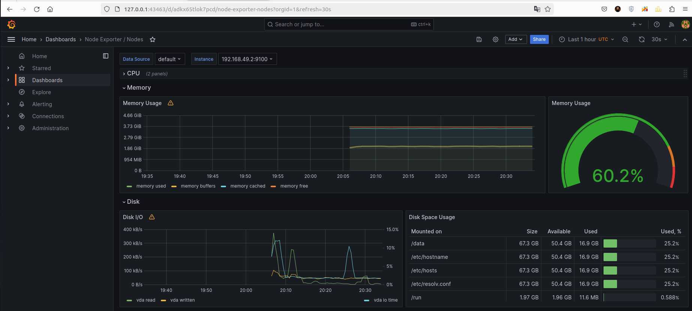
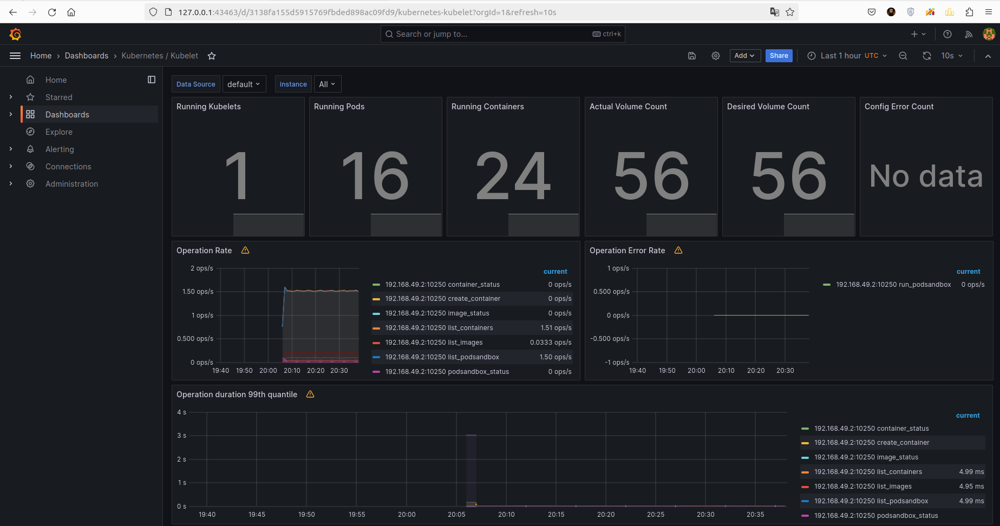
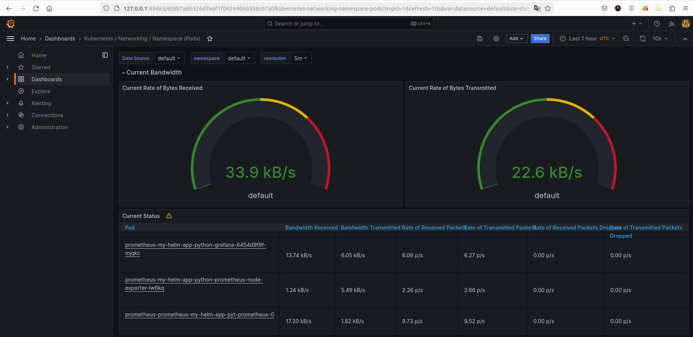
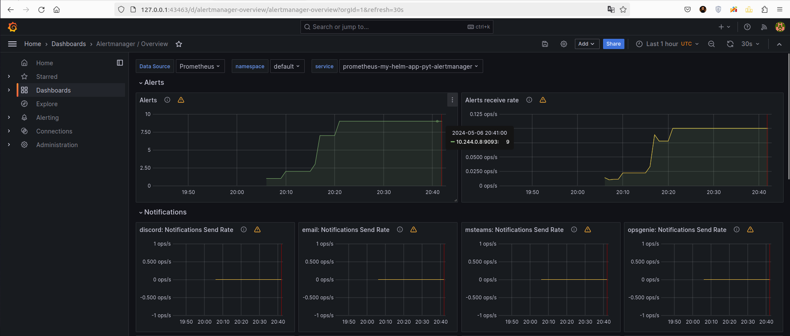
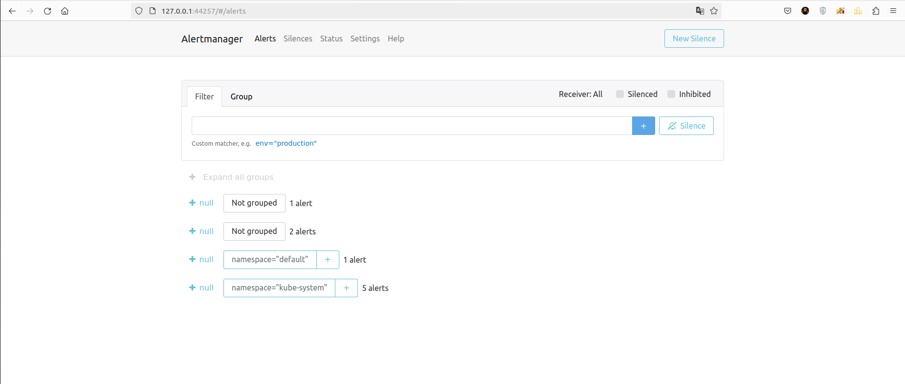

# Kubernetes Monitoring and Init Containers

## Kubernetes Cluster Monitoring with Prometheus

### Description of Components 
- **Prometheus**: Collects and stores data about your cluster's operations as time-series data.

- **Prometheus Operator**: Makes it easier to set up and manage Prometheus and its components within Kubernetes. Think of it as your helper for keeping Prometheus well-configured and updated.

- **Grafana**: Turns the data collected by Prometheus into visual dashboards that are easy to read and understand. It's great for seeing trends over time and quickly spotting problems.

- **Alertmanager**: Manages the alerts sent out by Prometheus. It makes sure you only get the necessary alerts. It groups similar alerts, mutes duplicates, and sends notifications through methods like email or Slack.

- **Node Exporter**: Gathers detailed stats about the physical and OS-level conditions on each node (like CPU usage or memory). It's like having a health checkup for each server.

- **Kube State Metrics**: Looks at your Kubernetes cluster and provides metrics about the state of its objects. This means you can get insights into everything from how many Pods are running to resource usage.

- **Prometheus Blackbox Exporter**: Checks how well your network services are responding from the outside. For example, it can test if your website is up and how fast it loads from different locations.

- **Prometheus Adapter**: Bridges Prometheus with Kubernetes' own metrics 
system. This lets Kubernetes use data from Prometheus to make decisions, like scaling applications based on traffic.

### Helm Chart Installation 
```shell
wilson@wilson ~/D/S/k8s (lab14)> kubectl get po,sts,svc,pvc,cm
NAME                                                                  READY   STATUS    RESTARTS   AGE
pod/alertmanager-prometheus-my-helm-app-pyt-alertmanager-0            2/2     Running   0          19m
pod/app-python-helm-app-python-0                                      1/1     Running   0          115s
pod/app-python-helm-app-python-1                                      1/1     Running   0          115s
pod/prometheus-my-helm-app-pyt-operator-8588d97b46-5gjnr              1/1     Running   0          19m
pod/prometheus-my-helm-app-python-grafana-6454d9f9f-7fcfc             3/3     Running   0          19m
pod/prometheus-my-helm-app-python-kube-state-metrics-787f489665cgrt   1/1     Running   0          19m
pod/prometheus-my-helm-app-python-prometheus-node-exporter-g9nmq      1/1     Running   0          19m
pod/prometheus-prometheus-my-helm-app-pyt-prometheus-0                2/2     Running   0          19m

NAME                                                                    READY   AGE
statefulset.apps/alertmanager-prometheus-my-helm-app-pyt-alertmanager   1/1     19m
statefulset.apps/app-python-helm-app-python                             2/2     115s
statefulset.apps/prometheus-prometheus-my-helm-app-pyt-prometheus       1/1     19m

NAME                                                             TYPE           CLUSTER-IP       EXTERNAL-IP   PORT(S)                      AGE
service/alertmanager-operated                                    ClusterIP      None             <none>        9093/TCP,9094/TCP,9094/UDP   19m
service/app-python-helm-app-python                               LoadBalancer   10.108.57.56     <pending>     5000:30235/TCP               115s
service/kubernetes                                               ClusterIP      10.96.0.1        <none>        443/TCP                      21m
service/prometheus-my-helm-app-pyt-alertmanager                  ClusterIP      10.105.154.252   <none>        9093/TCP,8080/TCP            19m
service/prometheus-my-helm-app-pyt-operator                      ClusterIP      10.97.228.43     <none>        443/TCP                      19m
service/prometheus-my-helm-app-pyt-prometheus                    ClusterIP      10.108.82.205    <none>        9090/TCP,8080/TCP            19m
service/prometheus-my-helm-app-python-grafana                    ClusterIP      10.102.51.201    <none>        80/TCP                       19m
service/prometheus-my-helm-app-python-kube-state-metrics         ClusterIP      10.101.22.57     <none>        8080/TCP                     19m
service/prometheus-my-helm-app-python-prometheus-node-exporter   ClusterIP      10.100.51.189    <none>        9100/TCP                     19m
service/prometheus-operated                                      ClusterIP      None             <none>        9090/TCP                     19m

NAME                                                        STATUS   VOLUME                                     CAPACITY   ACCESS MODES   STORAGECLASS   AGE
persistentvolumeclaim/mydata-app-python-helm-app-python-0   Bound    pvc-4ffbc903-53a9-48bc-8f2b-746aaf17e963   1Gi        RWO            standard       115s
persistentvolumeclaim/mydata-app-python-helm-app-python-1   Bound    pvc-e6db920a-135b-4d19-8382-5dba20c9c528   1Gi        RWO            standard       115s

NAME                                                                     DATA   AGE
configmap/kube-root-ca.crt                                               1      21m
configmap/prometheus-my-helm-app-pyt-alertmanager-overview               1      19m
configmap/prometheus-my-helm-app-pyt-apiserver                           1      19m
configmap/prometheus-my-helm-app-pyt-cluster-total                       1      19m
configmap/prometheus-my-helm-app-pyt-controller-manager                  1      19m
configmap/prometheus-my-helm-app-pyt-etcd                                1      19m
configmap/prometheus-my-helm-app-pyt-grafana-datasource                  1      19m
configmap/prometheus-my-helm-app-pyt-grafana-overview                    1      19m
configmap/prometheus-my-helm-app-pyt-k8s-coredns                         1      19m
configmap/prometheus-my-helm-app-pyt-k8s-resources-cluster               1      19m
configmap/prometheus-my-helm-app-pyt-k8s-resources-multicluster          1      19m
configmap/prometheus-my-helm-app-pyt-k8s-resources-namespace             1      19m
configmap/prometheus-my-helm-app-pyt-k8s-resources-node                  1      19m
configmap/prometheus-my-helm-app-pyt-k8s-resources-pod                   1      19m
configmap/prometheus-my-helm-app-pyt-k8s-resources-workload              1      19m
configmap/prometheus-my-helm-app-pyt-k8s-resources-workloads-namespace   1      19m
configmap/prometheus-my-helm-app-pyt-kubelet                             1      19m
configmap/prometheus-my-helm-app-pyt-namespace-by-pod                    1      19m
configmap/prometheus-my-helm-app-pyt-namespace-by-workload               1      19m
configmap/prometheus-my-helm-app-pyt-node-cluster-rsrc-use               1      19m
configmap/prometheus-my-helm-app-pyt-node-rsrc-use                       1      19m
configmap/prometheus-my-helm-app-pyt-nodes                               1      19m
configmap/prometheus-my-helm-app-pyt-nodes-darwin                        1      19m
configmap/prometheus-my-helm-app-pyt-persistentvolumesusage              1      19m
configmap/prometheus-my-helm-app-pyt-pod-total                           1      19m
configmap/prometheus-my-helm-app-pyt-prometheus                          1      19m
configmap/prometheus-my-helm-app-pyt-proxy                               1      19m
configmap/prometheus-my-helm-app-pyt-scheduler                           1      19m
configmap/prometheus-my-helm-app-pyt-workload-total                      1      19m
configmap/prometheus-my-helm-app-python-grafana                          1      19m
configmap/prometheus-my-helm-app-python-grafana-config-dashboards        1      19m
configmap/prometheus-prometheus-my-helm-app-pyt-prometheus-rulefiles-0   35     19m
configmap/py-configmap                                                   1      115s
```

- Installed Pods
    - **My Applications**: Two pods for my Python application.
    - **Kube-Prometheus**: Pods for Alertmanager, Prometheus Operator, Grafana, Kube-State Metrics, Node Exporter, and Prometheus.
- Installed Stateful Sets
    - **My Applications**: One stateful set for my Python application.
    - **Kube-Prometheus**: Two stateful sets for Alertmanager and Prometheus.
- Installed Services
    - **My Applications**: One LoadBalancer service for external access to my Python app.
    - **Kube-Prometheus**: Services for internal access and communication of Prometheus components.
- Allocated Persistent Volumes
    - **My Applications**: Persistent volumes for each Python application pod.
- Installed Config Maps
    - **Kube-Prometheus**: Config maps for configuring and running Prometheus components and alerts.

### Grafana Dashboards
#### CPU and Memory consumption
```
0.2% CPU time, and 40.3 MiB memory
```


#### Pods with higher and lower CPU usage in the default namespace
```
Highest usage: prometheus
Lowest usage: alertmanager
```


#### Node memory usage in percentage and megabytes
```
60.2%
```


#### Number of pods and containers managed by the Kubelet service
```
Number of pods: 16
Number of containers: 24
```


#### Network usage of Pods in the default namespace 
```
33.9 kB/s download, 22.6 kB/s upload
```


#### Number of active alerts
```
9 alerts
```

**Web-UI**


## Init Containers
```shell
wilson@wilson ~/D/S/k8s (lab14)> kubectl exec app-python-helm-app-python-0 -- cat /working-dir/index.html

Defaulted container "helm-app-python" out of: helm-app-python, install (init)
<!doctype html>
<html>
<head>
    <title>Example Domain</title>

    <meta charset="utf-8" />
    <meta http-equiv="Content-type" content="text/html; charset=utf-8" />
    <meta name="viewport" content="width=device-width, initial-scale=1" />
    <style type="text/css">
    body {
        background-color: #f0f0f2;
        margin: 0;
        padding: 0;
        font-family: -apple-system, system-ui, BlinkMacSystemFont, "Segoe UI", "Open Sans", "Helvetica Neue", Helvetica, Arial, sans-serif;
        
    }
    div {
        width: 600px;
        margin: 5em auto;
        padding: 2em;
        background-color: #fdfdff;
        border-radius: 0.5em;
        box-shadow: 2px 3px 7px 2px rgba(0,0,0,0.02);
    }
    a:link, a:visited {
        color: #38488f;
        text-decoration: none;
    }
    @media (max-width: 700px) {
        div {
            margin: 0 auto;
            width: auto;
        }
    }
    </style>    
</head>

<body>
<div>
    <h1>Example Domain</h1>
    <p>This domain is for use in illustrative examples in documents. You may use this
    domain in literature without prior coordination or asking for permission.</p>
    <p><a href="https://www.iana.org/domains/example">More information...</a></p>
</div>
</body>
</html>
```