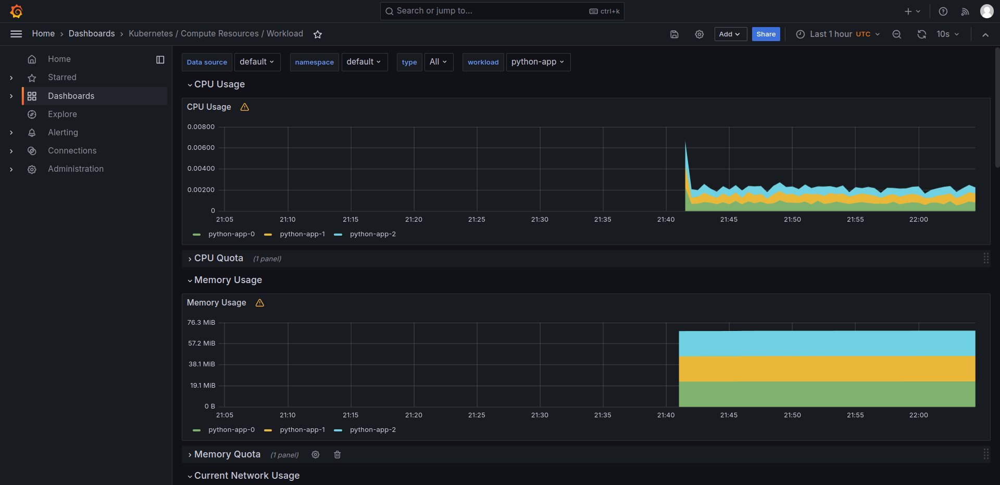
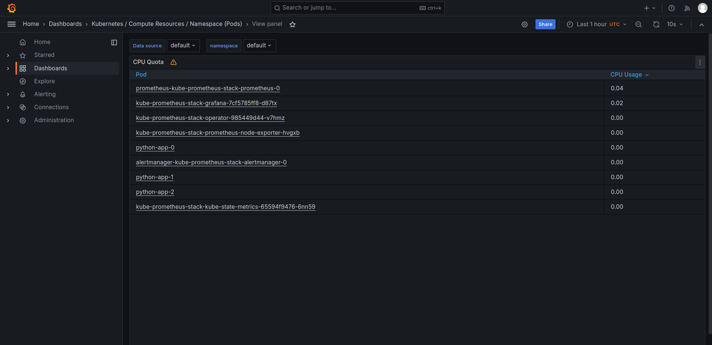
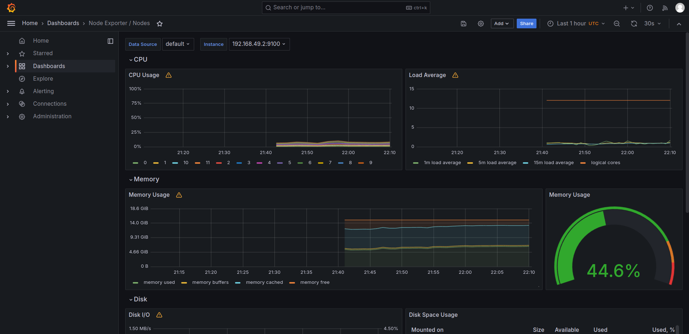
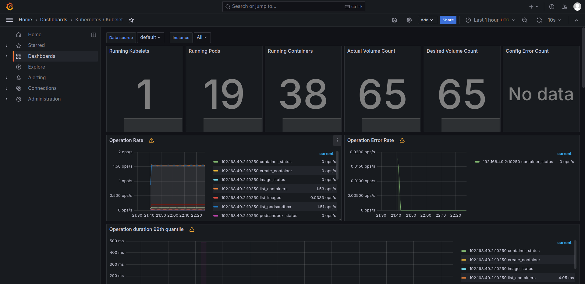
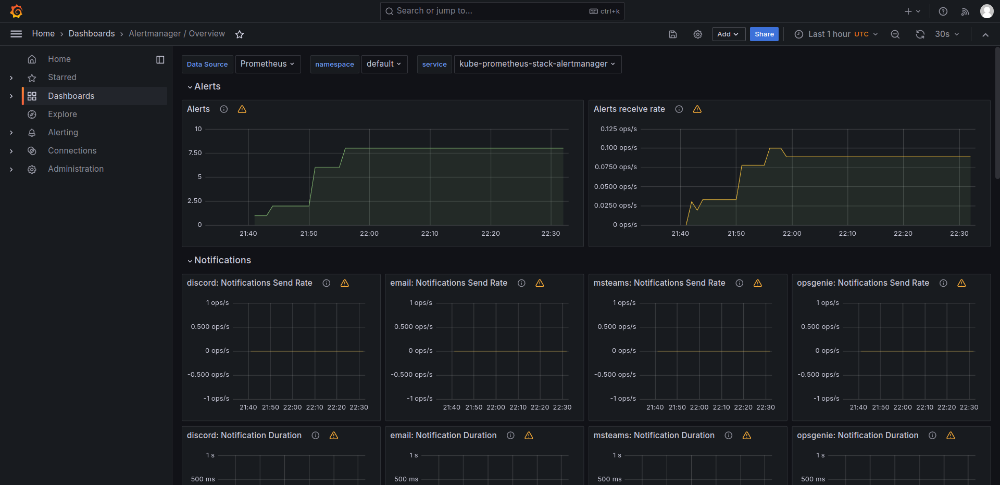
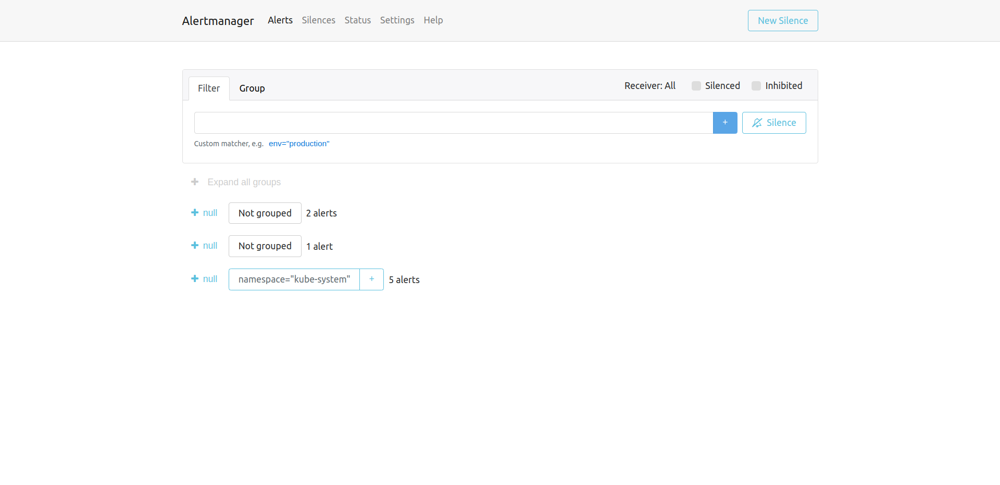

# Components of the Kube Prometheus Stack

- The Prometheus Operator

This component is responsible for simplification and automation of cofiguring Prometheus-based Kubernetes configurations.
It allows to deploy and manage Prometheus and related components, configure the fundamental settings of Prometheus, and generate monitoring target configurations.

- Highly available Prometheus

Prometheus itself - the application for event monitoring and metrics recording.

- Highly available Alertmanager

Alertmanager is responsible for managing alerts received from client apps (e.g. Prometheus). It sends them to the appropriate receiver integrations.

- Prometheus node-exporter

This is exporter for hardware and OS metrics. It is for *nix systems. It exposes a variety of hardvare and kernel metrics.

- Prometheus blackbox-exporter

It allows blackbox probing over different protocols, such as HTTP/S, TCP, ICMP, DNS. It means that it allows to monitor external services or endpoints for performance and availability.

- Prometheus Adapter for Kubernetes Metrics APIs

This is an implementation of Kubernetes Metrics API

- kube-state-metrics

KSM is a service that listens to Kubernetes API and generate metrics about the state of the objects (deployments, pods, nodes).

- Grafana

It is interactive web application that visualizes data from various connected data sources, such as Prometheus, Loki.
It can draw graphs, charts, tables based on provided data.

## Output of `kubectl get po,sts,svc,pvc,cm`

```bash

# List of pods in the cluster

NAME                                                            READY   STATUS      RESTARTS   AGE
pod/alertmanager-kube-prometheus-stack-alertmanager-0           2/2     Running     0          35m
pod/kube-prometheus-stack-grafana-7cf5785ff8-d87tx              3/3     Running     0          35m
pod/kube-prometheus-stack-kube-state-metrics-65594f9476-6nn59   1/1     Running     0          35m
pod/kube-prometheus-stack-operator-985449d44-v7hmz              1/1     Running     0          35m
pod/kube-prometheus-stack-prometheus-node-exporter-hvgxb        1/1     Running     0          35m
pod/postinstall-hook                                            0/1     Completed   0          32m
pod/preinstall-hook                                             0/1     Completed   0          34m
pod/prometheus-kube-prometheus-stack-prometheus-0               2/2     Running     0          35m
pod/python-app-0                                                1/1     Running     0          32m
pod/python-app-1                                                1/1     Running     0          32m
pod/python-app-2                                                1/1     Running     0          32m

# List of statefulsets

NAME                                                               READY   AGE
statefulset.apps/alertmanager-kube-prometheus-stack-alertmanager   1/1     35m
statefulset.apps/prometheus-kube-prometheus-stack-prometheus       1/1     35m
statefulset.apps/python-app                                        3/3     32m

# List of services with their type, IP, External IP and port

NAME                                                     TYPE        CLUSTER-IP       EXTERNAL-IP   PORT(S)                      AGE
service/alertmanager-operated                            ClusterIP   None             <none>        9093/TCP,9094/TCP,9094/UDP   35m
service/kube-prometheus-stack-alertmanager               ClusterIP   10.97.251.203    <none>        9093/TCP,8080/TCP            35m
service/kube-prometheus-stack-grafana                    ClusterIP   10.105.163.1     <none>        80/TCP                       35m
service/kube-prometheus-stack-kube-state-metrics         ClusterIP   10.100.60.218    <none>        8080/TCP                     35m
service/kube-prometheus-stack-operator                   ClusterIP   10.105.28.155    <none>        443/TCP                      35m
service/kube-prometheus-stack-prometheus                 ClusterIP   10.101.190.36    <none>        9090/TCP,8080/TCP            35m
service/kube-prometheus-stack-prometheus-node-exporter   ClusterIP   10.99.69.97      <none>        9100/TCP                     35m
service/kubernetes                                       ClusterIP   10.96.0.1        <none>        443/TCP                      36d
service/prometheus-operated                              ClusterIP   None             <none>        9090/TCP                     35m
service/python-app                                       NodePort    10.102.136.170   <none>        80:31487/TCP                 32m

# List of persistent volume claims with name, status, volume, capacity, access mode, storage class, age

NAME                                                   STATUS   VOLUME                                     CAPACITY   ACCESS MODES   STORAGECLASS   AGE
persistentvolumeclaim/python-app-volume-python-app-0   Bound    pvc-0f3c619a-5d40-4a29-8867-5d34164663bd   10M        RWO            standard       6d12h
persistentvolumeclaim/python-app-volume-python-app-1   Bound    pvc-14e90efa-d2e7-4fd7-ba2a-c35eb3e24413   10M        RWO            standard       6d12h
persistentvolumeclaim/python-app-volume-python-app-2   Bound    pvc-a259e409-1702-48e4-99ff-c9330a3d2c88   10M        RWO            standard       6d12h

# List of config maps. First one is from our python app chart

NAME                                                                DATA   AGE
configmap/config-map                                                1      32m
configmap/kube-prometheus-stack-alertmanager-overview               1      35m
configmap/kube-prometheus-stack-apiserver                           1      35m
configmap/kube-prometheus-stack-cluster-total                       1      35m
configmap/kube-prometheus-stack-controller-manager                  1      35m
configmap/kube-prometheus-stack-etcd                                1      35m
configmap/kube-prometheus-stack-grafana                             1      35m
configmap/kube-prometheus-stack-grafana-config-dashboards           1      35m
configmap/kube-prometheus-stack-grafana-datasource                  1      35m
configmap/kube-prometheus-stack-grafana-overview                    1      35m
configmap/kube-prometheus-stack-k8s-coredns                         1      35m
configmap/kube-prometheus-stack-k8s-resources-cluster               1      35m
configmap/kube-prometheus-stack-k8s-resources-multicluster          1      35m
configmap/kube-prometheus-stack-k8s-resources-namespace             1      35m
configmap/kube-prometheus-stack-k8s-resources-node                  1      35m
configmap/kube-prometheus-stack-k8s-resources-pod                   1      35m
configmap/kube-prometheus-stack-k8s-resources-workload              1      35m
configmap/kube-prometheus-stack-k8s-resources-workloads-namespace   1      35m
configmap/kube-prometheus-stack-kubelet                             1      35m
configmap/kube-prometheus-stack-namespace-by-pod                    1      35m
configmap/kube-prometheus-stack-namespace-by-workload               1      35m
configmap/kube-prometheus-stack-node-cluster-rsrc-use               1      35m
configmap/kube-prometheus-stack-node-rsrc-use                       1      35m
configmap/kube-prometheus-stack-nodes                               1      35m
configmap/kube-prometheus-stack-nodes-darwin                        1      35m
configmap/kube-prometheus-stack-persistentvolumesusage              1      35m
configmap/kube-prometheus-stack-pod-total                           1      35m
configmap/kube-prometheus-stack-prometheus                          1      35m
configmap/kube-prometheus-stack-proxy                               1      35m
configmap/kube-prometheus-stack-scheduler                           1      35m
configmap/kube-prometheus-stack-workload-total                      1      35m
configmap/kube-root-ca.crt                                          1      36d
configmap/prometheus-kube-prometheus-stack-prometheus-rulefiles-0   35     35m
```

1. Check CPU and Memory consumption of your StatefulSet.

CPU usage = ~0.002
Memory usage = ~70 MiB



2. Identify Pods with higher and lower CPU usage in the default namespace.

- highest CPU usage: `prometheus-kube-prometheus-stack-prometheus-0`

- lowest CPU usage: `kube-prometheus-stack-kube-state-metrics-65594f9476-6nn59`



3. Monitor node memory usage in percentage and megabytes.



4. Count the number of pods and containers managed by the Kubelet service.

- Number of pods = 19
- Number of containers = 38




5. Evaluate network usage of Pods in the default namespace.


6. Determine the number of active alerts; also check the Web UI with `minikube service monitoring-kube-prometheus-alertmanager`.

- Number of alerts = 9





## Output of `kubectl exec pod/python-app-0 -- cat /work-dir/index.html`

```html
Defaulted container "python-app" out of: python-app, install (init)

<html><head></head><body><header>
<title>http://info.cern.ch</title>
</header>

<h1>http://info.cern.ch - home of the first website</h1>
<p>From here you can:</p>
<ul>
<li><a href="http://info.cern.ch/hypertext/WWW/TheProject.html">Browse the first website</a></li>
<li><a href="http://line-mode.cern.ch/www/hypertext/WWW/TheProject.html">Browse the first website using the line-mode browser simulator</a></li>
<li><a href="http://home.web.cern.ch/topics/birth-web">Learn about the birth of the web</a></li>
<li><a href="http://home.web.cern.ch/about">Learn about CERN, the physics laboratory where the web was born</a></li>
</ul>
</body></html>
```