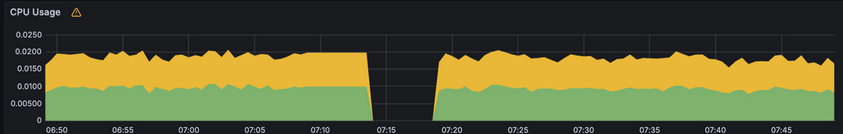
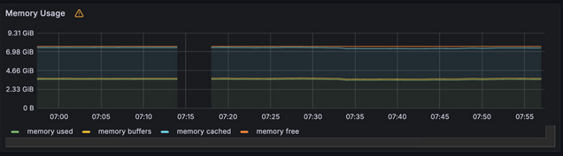
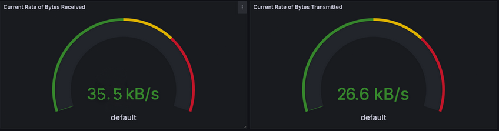
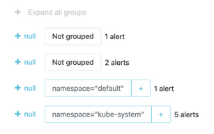

## Task1

### 1.3
- `The Prometheus Operator` streamlines the setup and management of Prometheus, Alertmanager, and associated monitoring elements.
- `Highly available Prometheus` system effectively gathers and archives time series metrics.
- `Highly available Alertmanager` setup manages alerts from clients, employing features like Grouping (consolidating multiple alerts into one), Inhibition (suppressing alerts when others are already active), Silences (temporarily muting alerts), Client behavior, and High Availability (configurable via cluster-* flags).
- `Prometheus node-exporter` facilitates the exporting of OS and hardware metrics to Prometheus, which scrapes data from the node_exporter daemon.
- `Prometheus blackbox-exporter` generates metrics based on response times from internal or external endpoints, such as HTTP/S, TCP, ICMP, and DNS.
- `The Prometheus Adapter for Kubernetes Metrics APIs` exposes Prometheus-stored metrics through a metrics API service.
- `kube-state-metrics` is a daemon that monitors the Kubernetes API server and generates metrics reflecting the state of objects within the cluster.
- `Grafana` enables visualization, querying, and alerting on data sourced from various origins.

### 1.4

- Two replica pods for python app and pods for different components from `Kube Prometheus Stack` 
```bash
NAME                                                        READY   STATUS        RESTARTS   AGE
pod/alertmanager-app-kube-prometheus-stack-alertmanager-0   2/2     Running       0          24s
pod/app-grafana-b44fcc68d-lf8rn                             3/3     Running       0          26s
pod/app-kube-prometheus-stack-operator-5b8fcc6cb8-s4kf6     1/1     Running       0          26s
pod/app-kube-state-metrics-bb9d866d8-ptckt                  1/1     Running       0          26s
pod/app-my-app-0                                            1/1     Running       0          2m10s
pod/app-my-app-1                                            1/1     Running       0          2m10s
pod/app-prometheus-node-exporter-dmdt7                      1/1     Running       0          26s
pod/prometheus-app-kube-prometheus-stack-prometheus-0       2/2     Running       0          24s
```
- Persistent storages for `stateful sets`, `alert manager` and `prometheus`
```bash
NAME                                                                   READY   AGE
statefulset.apps/my-app                                                2/2     23m
statefulset.apps/alertmanager-app-kube-prometheus-stack-alertmanager   1/1     3m23s
statefulset.apps/prometheus-app-kube-prometheus-stack-prometheus       1/1     3m23s
```
- Services to expose network application
```bash
NAME                                                TYPE           CLUSTER-IP       EXTERNAL-IP   PORT(S)                      AGE
service/alertmanager-operated                       ClusterIP      None             <none>        9093/TCP,9094/TCP,9094/UDP   15m
service/kubernetes                                  ClusterIP      10.96.0.1        <none>        443/TCP                      9h
service/my-app                                      LoadBalancer   10.110.226.152   <pending>     5000:31418/TCP               23m
service/my-app-prom-grafana                         ClusterIP      10.105.131.196   <none>        80/TCP                       15m
service/my-app-prom-ku-alertmanager                 ClusterIP      10.97.194.7      <none>        9093/TCP,5000/TCP            15m
service/my-app-prom-ku-operator                     ClusterIP      10.106.187.12    <none>        443/TCP                      15m
service/my-app-prom-ku-prometheus                   ClusterIP      10.111.156.208   <none>        9090/TCP,5000/TCP            15m
service/my-app-prom-kube-state-metrics              ClusterIP      10.111.73.137    <none>        5000/TCP                     15m
service/my-app-prom-prometheus-node-exporter        ClusterIP      10.110.116.228   <none>        9100/TCP                     15m
service/prometheus-operated                         ClusterIP      None             <none>        9090/TCP                     15m
```
- Volumes from previous labs
```bash
NAME                                        STATUS   VOLUME                                     CAPACITY   ACCESS MODES   STORAGECLASS   AGE
persistentvolumeclaim/mydata-app-my-app-0   Bound    pvc-e753094f-53ab-4229-b275-1cd4c5ba094c   1Gi        RWO            standard       8h
persistentvolumeclaim/mydata-app-my-app-1   Bound    pvc-156c5a47-18ee-4eca-991d-cb86c9b7813f   1Gi        RWO            standard       8h
```
- Config maps
```bash
NAME                                                         DATA   AGE
configmap/helm-app-config-map                                1      23m
configmap/my-app-prom-grafana                                1      15m
configmap/my-app-prom-grafana-config-dashboards              1      15m
configmap/my-app-prom-ku-alertmanager-overview               1      15m
configmap/my-app-prom-ku-apiserver                           1      15m
configmap/my-app-prom-ku-cluster-total                       1      15m
configmap/my-app-prom-ku-controller-manager                  1      15m
configmap/my-app-prom-ku-etcd                                1      15m
configmap/my-app-prom-ku-grafana-datasource                  1      15m
configmap/my-app-prom-ku-grafana-overview                    1      15m
configmap/my-app-prom-ku-k8s-coredns                         1      15m
configmap/my-app-prom-ku-k8s-resources-cluster               1      15m
configmap/my-app-prom-ku-k8s-resources-multicluster          1      15m
configmap/my-app-prom-ku-k8s-resources-namespace             1      15m
configmap/my-app-prom-ku-k8s-resources-node                  1      15m
configmap/my-app-prom-ku-k8s-resources-pod                   1      15m
configmap/my-app-prom-ku-k8s-resources-workload              1      15m
configmap/my-app-prom-ku-k8s-resources-workloads-namespace   1      15m
configmap/my-app-prom-ku-kubelet                             1      15m
configmap/my-app-prom-ku-namespace-by-pod                    1      15m
configmap/my-app-prom-ku-namespace-by-workload               1      15m
configmap/my-app-prom-ku-node-cluster-rsrc-use               1      15m
configmap/my-app-prom-ku-node-rsrc-use                       1      15m
configmap/my-app-prom-ku-nodes                               1      15m
configmap/my-app-prom-ku-nodes-darwin                        1      15m
configmap/my-app-prom-ku-persistentvolumesusage              1      15m
configmap/my-app-prom-ku-pod-total                           1      15m
configmap/my-app-prom-ku-prometheus                          1      15m
configmap/my-app-prom-ku-proxy                               1      15m
configmap/my-app-prom-ku-scheduler                           1      15m
configmap/my-app-prom-ku-workload-total                      1      15m
configmap/kube-root-ca.crt                                   1      9h
configmap/prometheus-my-app-prom-ku-prometheus-rulefiles-0   35     15m
```

### 1.5
a) Check CPU and Memory consumption of your StatefulSet.


b) Identify Pods with higher and lower CPU usage in the default namespace.

Highest is: `prometheus-my-helm-app-prom-ku-prometheus-0`

Lowest is: `alertmanager-my-helm-app-prom-ku-alertmanager-0`


c) Monitor node memory usage in percentage and megabytes.

50,2%

d) Count the number of pods and containers managed by the Kubelet service.

Number of pods:  19

Number of containers: 28

e) Evaluate network usage of Pods in the default namespace


f) Determine the number of active alerts; also check the Web UI with minikube service monitoring-kube-prometheus-alertmanager.



9 active alerts

## Task 2

```bash
$ kubectl exec my-app-0 -- cat /work-dir/index.html
```
```html
Defaulted container "app" out of: app, install (init)
<html><head></head><body><header>
<title>http://info.cern.ch</title>
</header>

<h1>http://info.cern.ch - home of the first website</h1>
<p>From here you can:</p>
<ul>
<li><a href="http://info.cern.ch/hypertext/WWW/TheProject.html">Browse the first website</a></li>
<li><a href="http://line-mode.cern.ch/www/hypertext/WWW/TheProject.html">Browse the first website using the line-mode browser simulator</a></li>
<li><a href="http://home.web.cern.ch/topics/birth-web">Learn about the birth of the web</a></li>
<li><a href="http://home.web.cern.ch/about">Learn about CERN, the physics laboratory where the web was born</a></li>
</ul>
</body></html>
```