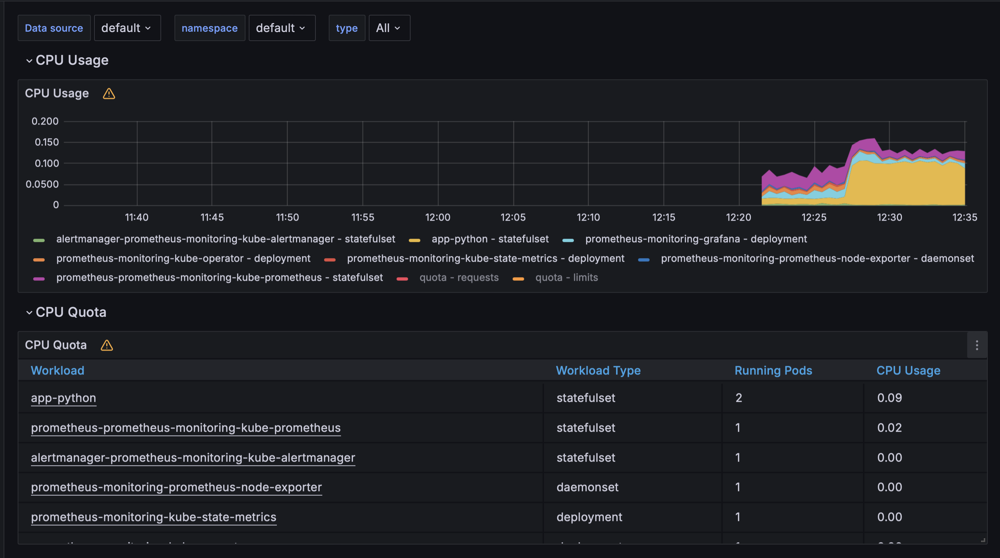
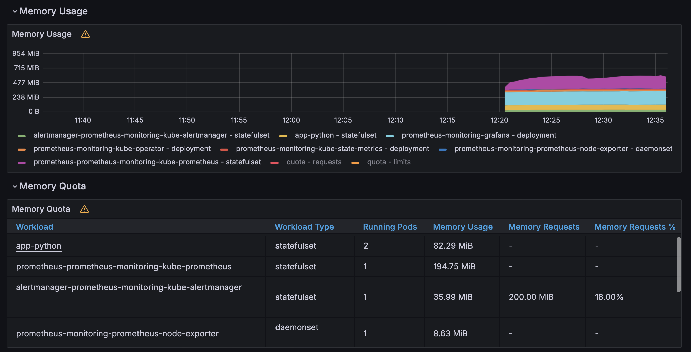
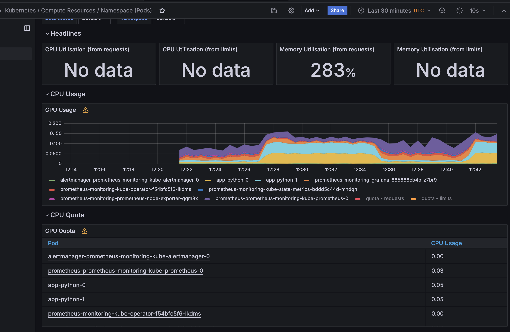
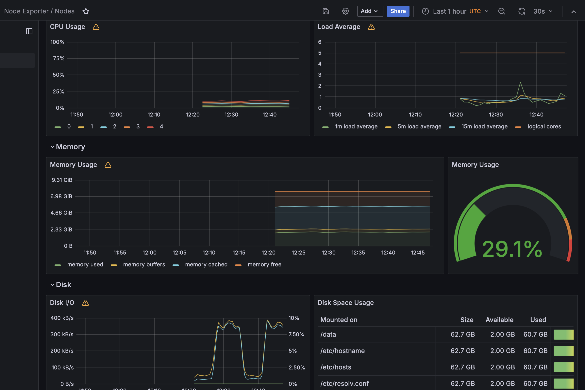
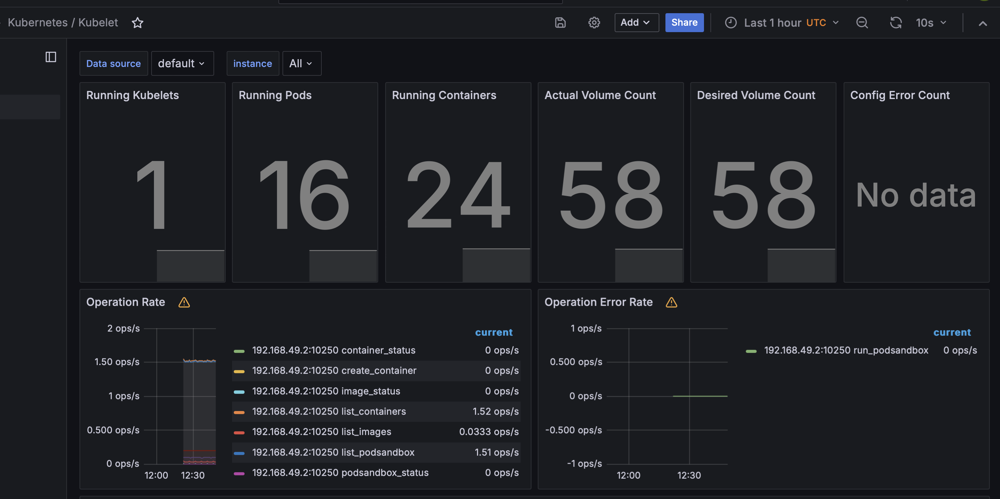
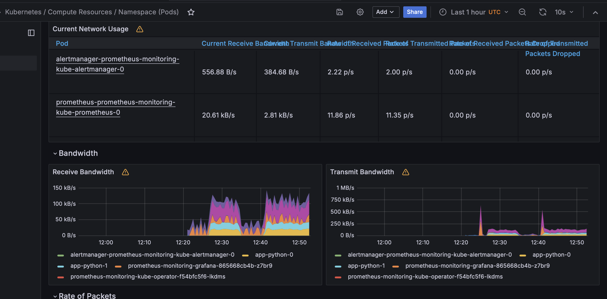

# Lab 14

### Components of the Kube Prometheus Stack:
- **Grafana**: A visualization tool that transforms metrics data into customizable dashboards, enabling detailed analysis and monitoring of the Kubernetes environment.
- **Prometheus Operator**: This element simplifies the configuration setup and continuous management of Prometheus configurations within a Kubernetes environment.
- **Highly Available Prometheus**: This configuration ensures the reliable collection and storage of metrics from different sources across the Kubernetes cluster, providing redundancy and increased operational uptime.
- **Prometheus Node-Exporter**: This tool is employed to collect essential hardware and operating system metrics from the nodes within a Kubernetes cluster.
- **Prometheus Blackbox-Exporter**: Its role involves conducting tests on external services or endpoints to evaluate their uptime and responsiveness, ensuring that external services meet expected performance standards.
- **Highly Available Alertmanager**: This oversees the generation of alerts and notifications triggered by conditions detected by Prometheus, ensuring robust fault detection and alerting capabilities.
- **Prometheus Adapter for Kubernetes Metrics APIs**: This adapter retrieves resource usage data from Kubernetes, making it accessible through Kubernetes custom metrics APIs, thereby facilitating scaling decisions based on these metrics.
- **Kube-State-Metrics**: This component generates comprehensive metrics detailing the status of various Kubernetes objects, aiding in a thorough understanding of the cluster's state and health.

Output of `kubectl get po,sts,svc,pvc,cm`:
```bash
NAME                                                           READY   STATUS    RESTARTS   AGE
pod/alertmanager-prometheus-monitoring-kube-alertmanager-0     2/2     Running   0          103s
pod/app-python-0                                               1/1     Running   0          11m
pod/app-python-1                                               1/1     Running   0          11m
pod/prometheus-monitoring-grafana-865668cb4b-sj8wd             3/3     Running   0          2m21s
pod/prometheus-monitoring-kube-operator-f54bfc5f6-bgsht        1/1     Running   0          2m21s
pod/prometheus-monitoring-kube-state-metrics-bddd5c44d-gtt7l   1/1     Running   0          2m21s
pod/prometheus-monitoring-prometheus-node-exporter-bc9cj       1/1     Running   0          2m21s
pod/prometheus-prometheus-monitoring-kube-prometheus-0         2/2     Running   0          102s

NAME                                                                    READY   AGE
statefulset.apps/alertmanager-prometheus-monitoring-kube-alertmanager   1/1     103s
statefulset.apps/app-python                                             2/2     11m
statefulset.apps/prometheus-prometheus-monitoring-kube-prometheus       1/1     102s

NAME                                                     TYPE        CLUSTER-IP       EXTERNAL-IP   PORT(S)                      AGE
service/alertmanager-operated                            ClusterIP   None             <none>        9093/TCP,9094/TCP,9094/UDP   103s
service/app-python                                       NodePort    10.97.236.227    <none>        5001:31675/TCP               11m
service/kubernetes                                       ClusterIP   10.96.0.1        <none>        443/TCP                      13m
service/prometheus-monitoring-grafana                    ClusterIP   10.108.163.213   <none>        80/TCP                       2m21s
service/prometheus-monitoring-kube-alertmanager          ClusterIP   10.106.200.190   <none>        9093/TCP,8080/TCP            2m21s
service/prometheus-monitoring-kube-operator              ClusterIP   10.103.245.255   <none>        443/TCP                      2m21s
service/prometheus-monitoring-kube-prometheus            ClusterIP   10.96.231.168    <none>        9090/TCP,8080/TCP            2m21s
service/prometheus-monitoring-kube-state-metrics         ClusterIP   10.100.56.206    <none>        8080/TCP                     2m21s
service/prometheus-monitoring-prometheus-node-exporter   ClusterIP   10.110.159.11    <none>        9100/TCP                     2m21s
service/prometheus-operated                              ClusterIP   None             <none>        9090/TCP                     102s

NAME                                     STATUS   VOLUME                                     CAPACITY   ACCESS MODES   STORAGECLASS   AGE
persistentvolumeclaim/vol-app-python-0   Bound    pvc-89bf9f72-5933-4559-b0c4-70c454eb5f4c   2Gi        RWO            standard       11m
persistentvolumeclaim/vol-app-python-1   Bound    pvc-76e204c6-3c17-4276-962f-fd9b744f9f89   2Gi        RWO            standard       11m

NAME                                                                     DATA   AGE
configmap/config                                                         1      11m
configmap/kube-root-ca.crt                                               1      13m
configmap/prometheus-monitoring-grafana                                  1      2m21s
configmap/prometheus-monitoring-grafana-config-dashboards                1      2m21s
configmap/prometheus-monitoring-kube-alertmanager-overview               1      2m21s
configmap/prometheus-monitoring-kube-apiserver                           1      2m21s
configmap/prometheus-monitoring-kube-cluster-total                       1      2m21s
configmap/prometheus-monitoring-kube-controller-manager                  1      2m21s
configmap/prometheus-monitoring-kube-etcd                                1      2m21s
configmap/prometheus-monitoring-kube-grafana-datasource                  1      2m21s
configmap/prometheus-monitoring-kube-grafana-overview                    1      2m21s
configmap/prometheus-monitoring-kube-k8s-coredns                         1      2m21s
configmap/prometheus-monitoring-kube-k8s-resources-cluster               1      2m21s
configmap/prometheus-monitoring-kube-k8s-resources-multicluster          1      2m21s
configmap/prometheus-monitoring-kube-k8s-resources-namespace             1      2m21s
configmap/prometheus-monitoring-kube-k8s-resources-node                  1      2m21s
configmap/prometheus-monitoring-kube-k8s-resources-pod                   1      2m21s
configmap/prometheus-monitoring-kube-k8s-resources-workload              1      2m21s
configmap/prometheus-monitoring-kube-k8s-resources-workloads-namespace   1      2m21s
configmap/prometheus-monitoring-kube-kubelet                             1      2m21s
configmap/prometheus-monitoring-kube-namespace-by-pod                    1      2m21s
configmap/prometheus-monitoring-kube-namespace-by-workload               1      2m21s
configmap/prometheus-monitoring-kube-node-cluster-rsrc-use               1      2m21s
configmap/prometheus-monitoring-kube-node-rsrc-use                       1      2m21s
configmap/prometheus-monitoring-kube-nodes                               1      2m21s
configmap/prometheus-monitoring-kube-nodes-darwin                        1      2m21s
configmap/prometheus-monitoring-kube-persistentvolumesusage              1      2m21s
configmap/prometheus-monitoring-kube-pod-total                           1      2m21s
configmap/prometheus-monitoring-kube-prometheus                          1      2m21s
configmap/prometheus-monitoring-kube-proxy                               1      2m21s
configmap/prometheus-monitoring-kube-scheduler                           1      2m21s
configmap/prometheus-monitoring-kube-workload-total                      1      2m21s
configmap/prometheus-prometheus-monitoring-kube-prometheus-rulefiles-0   35     103s
```

### Information about cluster:
I used the following command to make requests
```bash
while [ 1 ];  do curl {IP of app python} done
```

[//]: # (- CPU and Memory consumption of StatefulSet: **CPU - 8.94%, Memory - 30.4%**)

[//]: # (- Identify Pods with higher and lower CPU usage in the default namespace: **app-python-0** )

[//]: # (- Monitor node memory usage in percentage and megabytes: )

[//]: # (- The number of pods and containers managed by the Kubelet service: **23**)

[//]: # (- Network usage of Pods in the default namespace:)

[//]: # (- The number of active alerts: **9**)

 #### CPU and Memory Usage

 
 

 #### Pods CPU Usage

 

 #### Node Memory Usage

 

 

 #### Pods managed by Kubelet

 

 #### Network usage

 

 #### Alerts
 

## Init container

Get the content using the following command:
```bash
kubectl exec app-python-0 -- cat /init-container/index.html
```
Output: 
```bash
<html><head></head><body><header>
<title>http://info.cern.ch</title>
</header>

<h1>http://info.cern.ch - home of the first website</h1>
<p>From here you can:</p>
<ul>
<li><a href="http://info.cern.ch/hypertext/WWW/TheProject.html">Browse the first website</a></li>
<li><a href="http://line-mode.cern.ch/www/hypertext/WWW/TheProject.html">Browse the first website using the line-mode browser simulator</a></li>
<li><a href="http://home.web.cern.ch/topics/birth-web">Learn about the birth of the web</a></li>
<li><a href="http://home.web.cern.ch/about">Learn about CERN, the physics laboratory where the web was born</a></li>
</ul>
</body></html>
```

## Init container queue
```bash
kubectl exec app-python-0 -- cat /init-container/queue
```
Output:
```bash
1
2
3
```