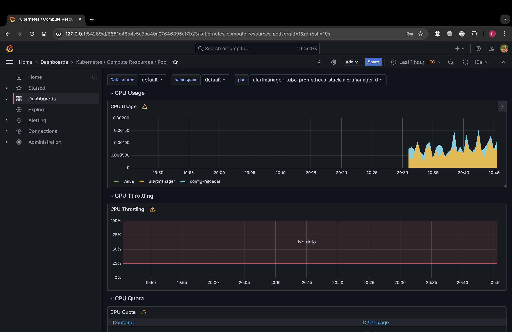
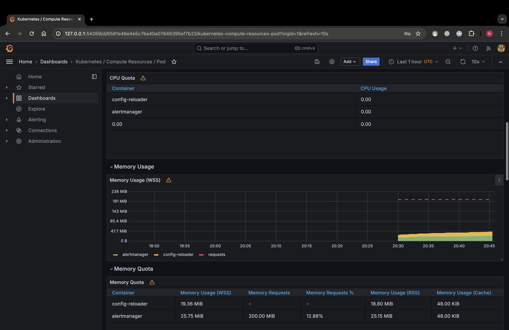
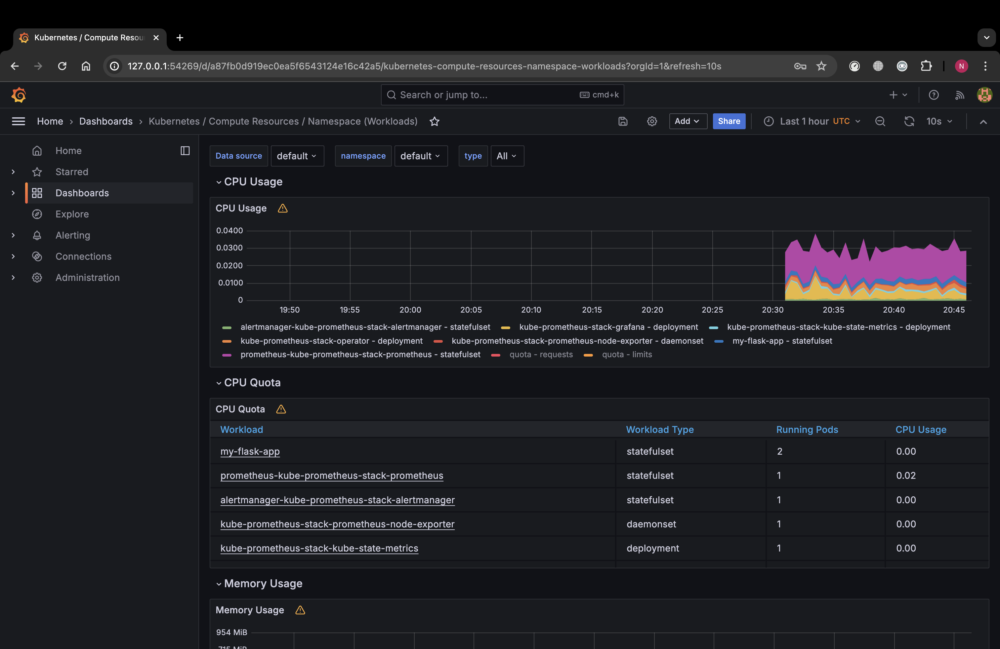
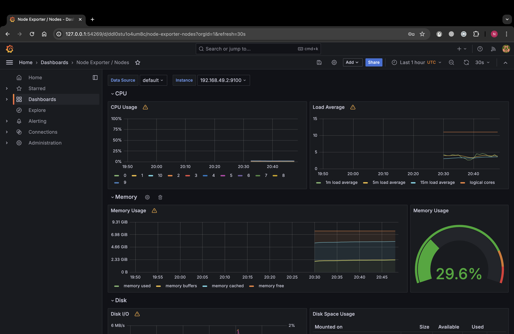
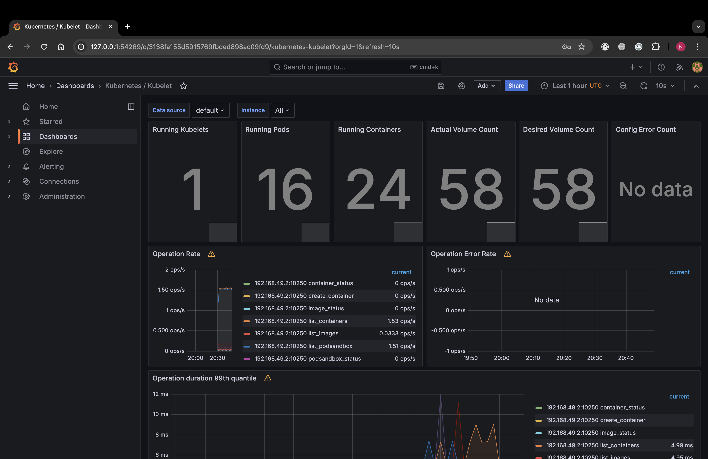
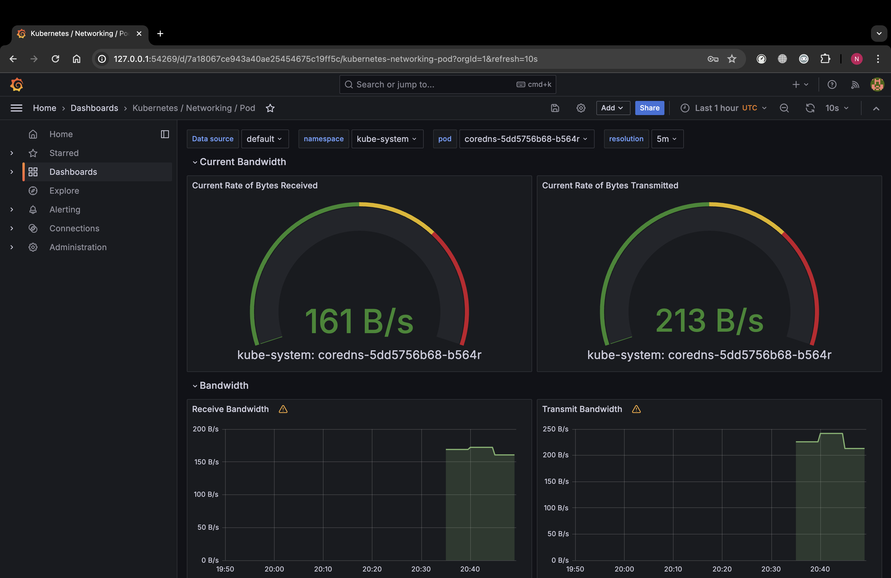
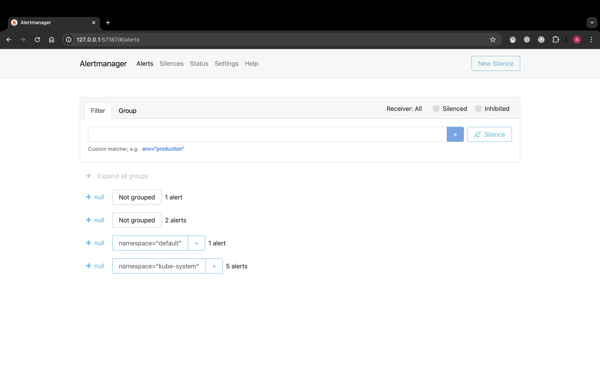

# Lab 14: Kubernetes Monitoring and Init Containers

The Kube Prometheus Stack is a collection of Kubernetes manifests combined with a set of preconfigured Grafana dashboards and Prometheus rules which are tailored for monitoring Kubernetes clusters. The stack provides a powerful toolkit for cluster monitoring and is notable for its ease of deployment and extensibility. Here's a breakdown of its main components:

1. **Prometheus**: This is the core component responsible for collecting and storing metrics. It scrapes metrics from configured endpoints at specified intervals, evaluates rule expressions, displays the results, and can trigger alerts if certain conditions are met.

2. **Prometheus Operator**: Simplifies the deployment and configurational tasks of Prometheus. It introduces several custom resource definitions (CRDs) for managing Prometheus and related resources within a Kubernetes cluster, such as ServiceMonitors and PrometheusRule objects.

3. **Alertmanager**: Integrates with Prometheus to handle alerts that are fired by defined rules within Prometheus. Alertmanager groups, deduplicates, and routes the alerts to the appropriate receiver (like email, PagerDuty, Slack, etc.) and handles silencing, inhibition, and aggregation logic.

4. **Node Exporter**: Runs on cluster nodes and exports various hardware and OS metrics that Prometheus can scrape, such as CPU usage, memory utilization, disk space, and network stats.

5. **Kube State Metrics**: Provides cluster-level metrics such as the state of deployments, nodes, and pods, which are not exposed by the individual components themselves. It listens to the Kubernetes API server and generates metrics about the state of the objects.

6. **Grafana**: A multi-platform open source analytics and interactive visualization tool. It allows you to query, visualize, alert on, and understand your metrics as well as create, explore, and share dashboards which can use Prometheus as a data source.

7. **Prometheus Adapter**: An implementation of the Kubernetes custom metrics API and external metrics API using Prometheus. This allows Horizontal Pod Autoscaler (HPA) and custom metrics to be used in Kubernetes based on Prometheus metrics.

8. **Prometheus Pushgateway**: Allows ephemeral and batch jobs to expose their metrics to Prometheus. Since these kinds of jobs may not exist long enough to be scraped, they can instead push their metrics to the Pushgateway.

9. **ServiceMonitors**: Kubernetes Custom Resource Definitions that specify how groups of services should be monitored by Prometheus. The Prometheus Operator uses these to configure Prometheus to scrape the specified endpoints.

10. **PrometheusRules**: Another CRD that defines rules for Prometheus alerting and recording, allowing users to define alerts or calculated metrics based on Prometheus data.

By combining these components, the Kube Prometheus Stack offers a comprehensive solution for monitoring Kubernetes clusters, making it easier to maintain the health, performance, and reliability of both the cluster and the applications running on it.

### Output for ```kubectl get po,sts,svc,pvc,cm```
```commandline
(venv) nikitazorin@MacBook-Pro-Nikita k8s % kubectl get po,sts,svc,pvc,cm                                         
NAME                                                            READY   STATUS              RESTARTS   AGE
pod/alertmanager-kube-prometheus-stack-alertmanager-0           0/2     Init:0/1            0          18s
pod/kube-prometheus-stack-grafana-7cf5785ff8-8gxfm              0/3     ContainerCreating   0          27s
pod/kube-prometheus-stack-kube-state-metrics-65594f9476-rrcdj   0/1     ContainerCreating   0          27s
pod/kube-prometheus-stack-operator-985449d44-j747p              1/1     Running             0          27s
pod/kube-prometheus-stack-prometheus-node-exporter-gtgnb        1/1     Running             0          27s
pod/my-flask-app-0                                              1/1     Running             0          118s
pod/my-flask-app-1                                              1/1     Running             0          116s
pod/prometheus-kube-prometheus-stack-prometheus-0               0/2     Init:0/1            0          18s

NAME                                                               READY   AGE
statefulset.apps/alertmanager-kube-prometheus-stack-alertmanager   0/1     18s
statefulset.apps/my-flask-app                                      2/2     118s
statefulset.apps/prometheus-kube-prometheus-stack-prometheus       0/1     18s

NAME                                                     TYPE           CLUSTER-IP       EXTERNAL-IP   PORT(S)                      AGE
service/alertmanager-operated                            ClusterIP      None             <none>        9093/TCP,9094/TCP,9094/UDP   18s
service/kube-prometheus-stack-alertmanager               ClusterIP      10.104.164.109   <none>        9093/TCP,8080/TCP            27s
service/kube-prometheus-stack-grafana                    ClusterIP      10.98.202.17     <none>        80/TCP                       27s
service/kube-prometheus-stack-kube-state-metrics         ClusterIP      10.105.87.159    <none>        8080/TCP                     27s
service/kube-prometheus-stack-operator                   ClusterIP      10.108.222.187   <none>        443/TCP                      27s
service/kube-prometheus-stack-prometheus                 ClusterIP      10.110.118.253   <none>        9090/TCP,8080/TCP            27s
service/kube-prometheus-stack-prometheus-node-exporter   ClusterIP      10.98.100.85     <none>        9100/TCP                     27s
service/kubernetes                                       ClusterIP      10.96.0.1        <none>        443/TCP                      22m
service/my-flask-app                                     LoadBalancer   10.104.70.255    <pending>     5000:30223/TCP               118s
service/prometheus-operated                              ClusterIP      None             <none>        9090/TCP                     18s

NAME                                        STATUS   VOLUME                                     CAPACITY   ACCESS MODES   STORAGECLASS   AGE
persistentvolumeclaim/data-my-flask-app-0   Bound    pvc-39e017d1-6958-4aba-a9b1-774d146ad0f4   2Gi        RWO            standard       11m
persistentvolumeclaim/data-my-flask-app-1   Bound    pvc-7f21d477-fec7-487a-89c0-02204621d166   2Gi        RWO            standard       116s

NAME                                                                DATA   AGE
configmap/kube-prometheus-stack-alertmanager-overview               1      27s
configmap/kube-prometheus-stack-apiserver                           1      27s
configmap/kube-prometheus-stack-cluster-total                       1      27s
configmap/kube-prometheus-stack-controller-manager                  1      27s
configmap/kube-prometheus-stack-etcd                                1      27s
configmap/kube-prometheus-stack-grafana                             1      27s
configmap/kube-prometheus-stack-grafana-config-dashboards           1      27s
configmap/kube-prometheus-stack-grafana-datasource                  1      27s
configmap/kube-prometheus-stack-grafana-overview                    1      27s
configmap/kube-prometheus-stack-k8s-coredns                         1      27s
configmap/kube-prometheus-stack-k8s-resources-cluster               1      27s
configmap/kube-prometheus-stack-k8s-resources-multicluster          1      27s
configmap/kube-prometheus-stack-k8s-resources-namespace             1      27s
configmap/kube-prometheus-stack-k8s-resources-node                  1      27s
configmap/kube-prometheus-stack-k8s-resources-pod                   1      27s
configmap/kube-prometheus-stack-k8s-resources-workload              1      27s
configmap/kube-prometheus-stack-k8s-resources-workloads-namespace   1      27s
configmap/kube-prometheus-stack-kubelet                             1      27s
configmap/kube-prometheus-stack-namespace-by-pod                    1      27s
configmap/kube-prometheus-stack-namespace-by-workload               1      27s
configmap/kube-prometheus-stack-node-cluster-rsrc-use               1      27s
configmap/kube-prometheus-stack-node-rsrc-use                       1      27s
configmap/kube-prometheus-stack-nodes                               1      27s
configmap/kube-prometheus-stack-nodes-darwin                        1      27s
configmap/kube-prometheus-stack-persistentvolumesusage              1      27s
configmap/kube-prometheus-stack-pod-total                           1      27s
configmap/kube-prometheus-stack-prometheus                          1      27s
configmap/kube-prometheus-stack-proxy                               1      27s
configmap/kube-prometheus-stack-scheduler                           1      27s
configmap/kube-prometheus-stack-workload-total                      1      27s
configmap/kube-root-ca.crt                                          1      21m
configmap/my-flask-app-configmap                                    1      118s
configmap/prometheus-kube-prometheus-stack-prometheus-rulefiles-0   35     18s
```

### Grafana results
- CPU and Memory consumption


- CPU usage

- Node memory usage

- Number of pods and containers managed by the Kubelet service

- Network usage of Pods in the default namespace

- Number of active alerts


