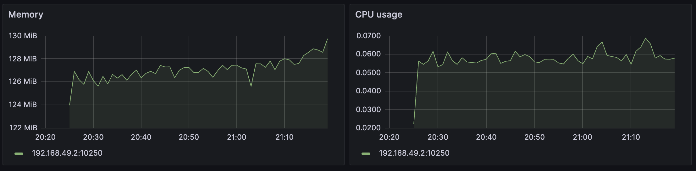
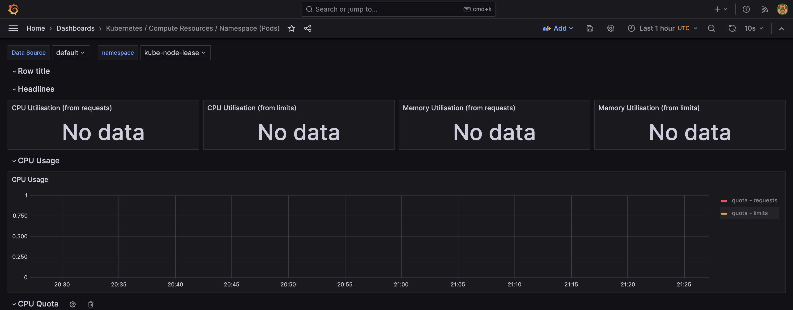
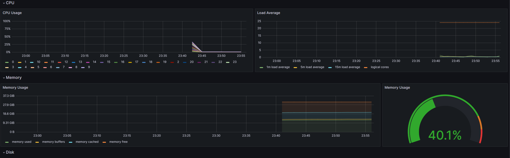
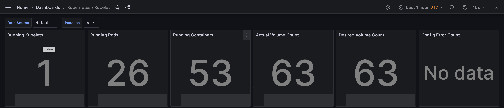
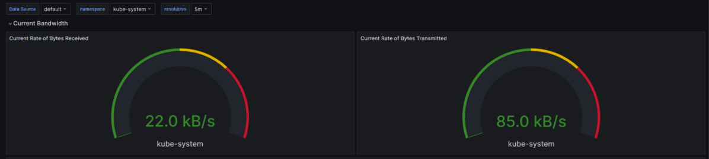
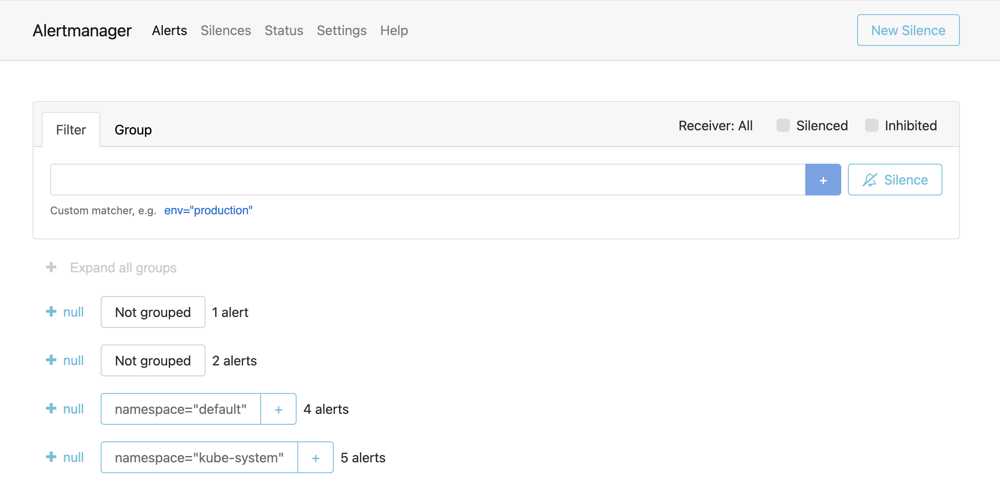

## Explanation of monitoring stack components

### Prometheus Operator

- Purpose: Manages Prometheus components efficiently.

### Prometheus

- Purpose: Gathers metrics for system monitoring.

### Alertmanager

- Purpose: Manages alerts from client apps.

### Prometheus node-exporter

- Purpose: Obtains OS/hardware metrics.

### Prometheus blackbox-exporter

- Purpose: Conducts HTTP and TCP tests on endpoints to check if they're accessible and to gauge how quickly they respond.

### Prometheus Adapter for Kubernetes Metrics APIs

- Purpose: Enables collaboration between Kubernetes and Prometheus.

### kube-state-metrics

- Purpose: Assists in gathering Kubernetes component metrics.

### Grafana

- Purpose: Grafana visualizes data for effective monitoring.

## Output and explanation of `kubectl get po,sts,svc,pvc,cm`

```sh
NAME                                             READY   STATUS    RESTARTS   AGE
pod/alertmanager-kube-stack-alertmanager-0      2/2     Running   4          98m
pod/app-python-0                                1/1     Running   24         88m
pod/app-python-1                                1/1     Running   24         88m
pod/app-python-deployment-2a3d34e7-0            1/1     Running   87         34m ago
pod/app-python-deployment-2a3d34e7-1            1/1     Running   90         34m ago
pod/app-python-deployment-2a3d34e7-2            1/1     Running   90         34m ago
pod/kube-stack-grafana-7664d8545c-xsqjt        3/3     Running   6          106m
pod/kube-stack-kube-state-metrics-5c6549bfd5-vl7z7 1/1  Running   5          106m
pod/kube-stack-operator-76bf64f57d-bvr7t       1/1     Running   4          106m
pod/kube-stack-prometheus-node-exporter-gs4cq  1/1     Running   3          106m
pod/prometheus-kube-stack-prometheus-0          2/2     Running   4          98m

NAME                                             READY   AGE
statefulset.apps/alertmanager-kube-stack-alertmanager 1/1  98m
statefulset.apps/app-python                    2/2     88m
statefulset.apps/prometheus-kube-stack-prometheus 1/1   98m

NAME                                             TYPE         CLUSTER-IP       EXTERNAL-IP   PORT(S)          AGE
service/alertmanager-operated                   ClusterIP    None             <none>        9093/TCP,9094/TCP,9094/UDP 98m
service/app-python                              LoadBalancer 10.96.56.242     <pending>     5000:31930/TCP   88m
service/kube-stack-alertmanager                 ClusterIP    10.103.224.32    <none>        9093/TCP,8080/TCP 106m
service/kube-stack-grafana                      ClusterIP    10.97.101.80     <none>        80/TCP           106m
service/kube-stack-kube-state-metrics           ClusterIP    10.107.18.141    <none>        8080/TCP         106m
service/kube-stack-operator                     ClusterIP    10.106.149.223   <none>        443/TCP          106m
service/kube-stack-prometheus                   ClusterIP    10.98.133.149    <none>        9090/TCP,8080/TCP 106m
service/kube-stack-prometheus-node-exporter     ClusterIP    10.104.185.149   <none>        9100/TCP         106m
service/kubernetes                              ClusterIP    10.96.0.1        <none>        443/TCP          18d
service/prometheus-operated                     ClusterIP    None             <none>        9090/TCP         98m

NAME                                             STATUS   VOLUME                                     CAPACITY   ACCESS MODES   STORAGECLASS   AGE
persistentvolumeclaim/data-app-python-0         Bound    pvc-b39a681a-0841-47da-afcf-e628c6796587   1Gi        RWO            standard       5d1h
persistentvolumeclaim/data-app-python-1         Bound    pvc-89e7bf49-a404-49ee-ae19-2ffe5aa910c6   1Gi        RWO            standard       5d1h

NAME                                             DATA   AGE
configmap/kube-stack-alertmanager-overview      1      106m
configmap/kube-stack-apiserver                  1      106m
configmap/kube-stack-cluster-total              1      106m
configmap/kube-stack-controller-manager         1      106m
configmap/kube-stack-etcd                       1      106m
configmap/kube-stack-grafana                    1      106m
configmap/kube-stack-grafana-config-dashboards  1      106m
configmap/kube-stack-grafana-datasource         1      106m
configmap/kube-stack-grafana-overview           1      106m
configmap/kube-stack-k8s-coredns                1      106m
configmap/kube-stack-k8s-resources-cluster      1      106m
configmap/kube-stack-k8s-resources-multicluster 1      106m
configmap/kube-stack-k8s-resources-namespace    1      106m
configmap/kube-stack-k8s-resources-node         1      106m
configmap/kube-stack-k8s-resources-pod          1      106m
configmap/kube-stack-k8s-resources-workload     1      106m
configmap/kube-stack-k8s-resources-workloads-namespace 1 106m
configmap/kube-stack-kubelet                    1      106m
configmap/kube-stack-namespace-by-pod           1      106m
configmap/kube-stack-namespace-by-workload      1      106m
configmap/kube-stack-node-cluster-rsrc-use      1      106m
configmap/kube-stack-node-rsrc-use              1      106m
configmap/kube-stack-nodes                      1      106m
configmap/kube-stack-nodes-darwin               1      106m
configmap/kube-stack-persistentvolumesusage     1      106m
configmap/kube-stack-pod-total                  1      106m
configmap/kube-stack-prometheus                 1      106m
configmap/kube-stack-proxy                      1      106m
configmap/kube-stack-scheduler                  1      106m
configmap/kube-stack-workload-total             1      106m
configmap/kube-root-ca.crt                      1      18d
configmap/prometheus-kube-stack-prometheus-rulefiles-0 35 98m
```

**Explanation:**

-  #### Pods (po):
  - `alertmanager-kube-stack-alertmanager-0`: Manages the Alertmanager component of the kube-stack.
  - `app-python-0`, `app-python-1`: Pods hosting a Python application, deployed during Lab 13.
  - `app-python-deployment-2a3d34e7-0`, `app-python-deployment-2a3d34e7-1`, `app-python-deployment-2a3d34e7-2`: Pods hosting Python applications created in earlier labs related to Kubernetes.
  - `kube-stack-grafana-7664d8545c-xsqjt`: Grafana for visualization and monitoring purposes.
  - `kube-stack-kube-state-metrics-5c6549bfd5-vl7z7`: Collects metrics about the state of Kubernetes objects.
  - `kube-stack-operator-76bf64f57d-bvr7t`: Manages the Prometheus Operator.
  - `kube-stack-prometheus-node-exporter-gs4cq`: Collects host machine metrics.
  - `prometheus-kube-stack-prometheus-0`: Core monitoring component.

- #### StatefulSets (sts):
  - `alertmanager-kube-stack-alertmanager`: Manages the Alertmanager component of the kube-stack.
  - `prometheus-kube-stack-prometheus`: Manages the Prometheus component of the kube-stack.
  - `app-python`: Custom StatefulSet deployed during Lab 13.

- #### Services (svc):
  - `alertmanager-operated`: ClusterIP service facilitating communication with Alertmanager pods.
  - `app-python`: LoadBalancer service exposing the Python application on port 5000.
  - `kube-stack-alertmanager`, `kube-stack-grafana`, `kube-stack-kube-state-metrics`, `kube-stack-operator`, `kube-stack-prometheus`, and `kube-stack-prometheus-node-exporter`: Internal communication services for the kube-stack components.

- #### PersistentVolumeClaims (pvc):
  - `data-app-python-0` and `data-app-python-1`: Bound to volumes for storing data used by the Python application pods.

- #### ConfigMaps (cm):
  - Various ConfigMaps (`kube-stack-<name>` and `prometheus-kube-stack-prometheus-rulefiles-0`) containing configuration data for different components of the kube-stack.

## Answers

### 1. Check CPU and Memory consumption of your StatefulSet.



### 2. Identify Pods with higher and lower CPU usage in the default namespace.



### 3. Monitor node memory usage in percentage and megabytes.



### 4. Count the number of pods and containers managed by the Kubelet service.



### 5. Evaluate network usage of Pods in the default namespace.



### 6. Determine the number of active alerts; also check the Web UI with `minikube service monitoring-kube-prometheus-alertmanager`.


