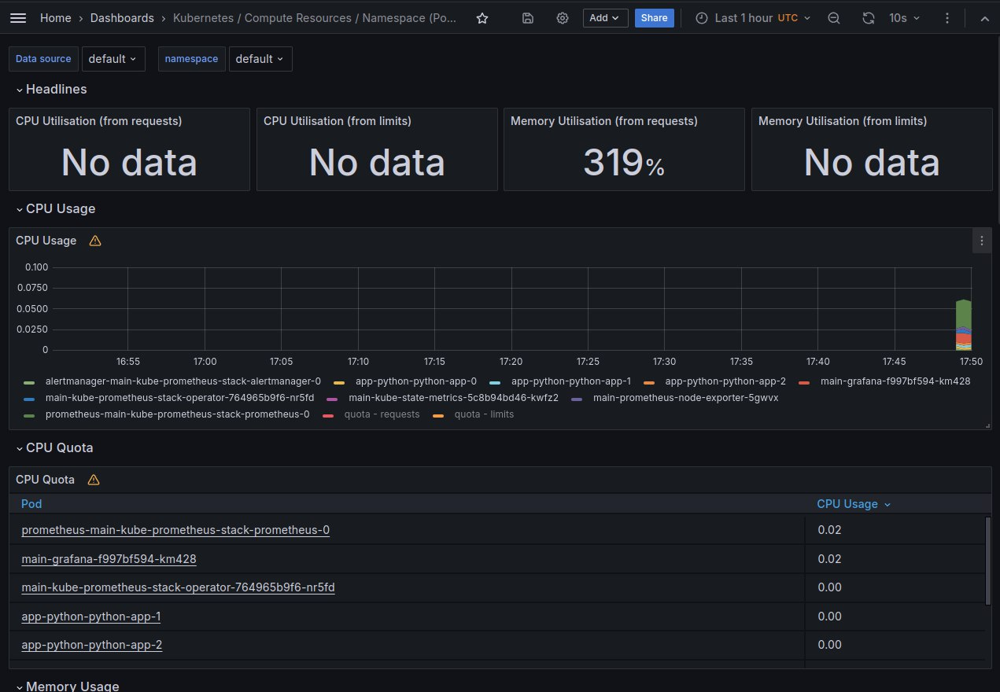
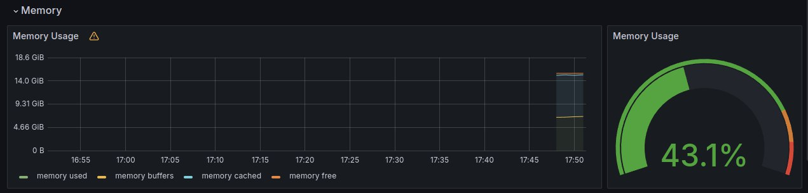
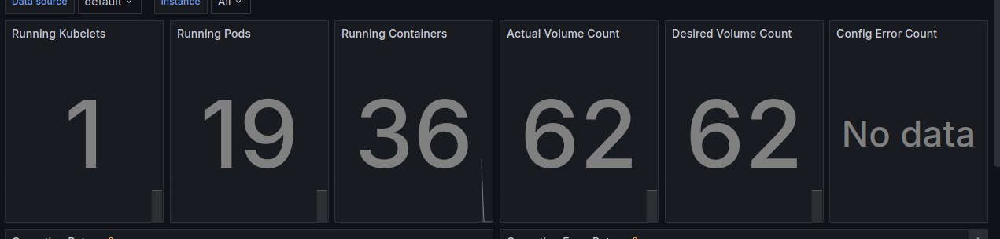

# Lab 14: Kubernetes Monitoring and Init Containers
## Task 1

### Monitoring stack components
- Prometheus with high availability: Collecting metrics for monitoring systems
- Alertmanager with high availability: Managing alerts from client applications
- Node Exporter for Prometheus: Gathering hardware and operating system metrics
- Kubernetes Metrics API Adapter for Prometheus: Integrating Kubernetes and Prometheus
- Grafana: Visualizing data for monitoring purposes
- Prometheus Operator: Managing Prometheus components
- kube-state-metrics: Assisting in gathering metrics for Kubernetes components

Results of `kubectl get po,sts,svc,pvc`

```bash
NAME                                                         READY   STATUS    RESTARTS   AGE
pod/alertmanager-main-kube-prometheus-stack-alertmanager-0   2/2     Running   0          3m6s
pod/main-grafana-f997bf594-nnwmc                             3/3     Running   0          3m16s
pod/main-kube-prometheus-stack-operator-12401b1ad6-11tja     1/1     Running   0          3m16s
pod/main-kube-state-metrics-1a8b94ad14-llmhv                 1/1     Running   0          3m16s
pod/main-prometheus-node-exporter-vr5wt                      1/1     Running   0          3m16s
pod/prometheus-main-kube-prometheus-stack-prometheus-0       2/2     Running   0          3m6s
pod/NAME                                                         READY   STATUS    RESTARTS   AGE
pod/alertmanager-main-kube-prometheus-stack-alertmanager-0   2/2     Running   0          3m6s
pod/main-grafana-f997bf594-nnwmc                             3/3     Running   0          3m16s
pod/main-kube-prometheus-stack-operator-12401b1ad6-11tja     1/1     Running   0          3m16s
pod/main-kube-state-metrics-1a8b94ad14-llmhv                 1/1     Running   0          3m16s
pod/main-prometheus-node-exporter-vr5wt                      1/1     Running   0          3m16s
pod/prometheus-main-kube-prometheus-stack-prometheus-0       2/2     Running   0          3m6s
pod/app-python-python-app-0                                  1/1     Running   0          2m9s
pod/app-python-python-app-1                                  1/1     Running   0          2m5s
pod/app-python-python-app-2                                  1/1     Running   0          115s

NAME                                                                    READY   AGE
statefulset.apps/alertmanager-main-kube-prometheus-stack-alertmanager   1/1     3m6s
statefulset.apps/prometheus-main-kube-prometheus-stack-prometheus       1/1     3m6s
statefulset.apps/app-python                                             3/3     2m9s


NAME                                              TYPE        CLUSTER-IP       EXTERNAL-IP   PORT(S)                      AGE
service/alertmanager-operated                     ClusterIP   None             <none>        9093/TCP,9094/TCP,9094/UDP   1m59s
service/kubernetes                                ClusterIP   10.96.0.1        <none>        443/TCP                      42d
service/main-grafana                              ClusterIP   10.105.250.46    <none>        80/TCP                       3m50s
service/main-kube-prometheus-stack-alertmanager   ClusterIP   10.105.16.40     <none>        9093/TCP,8080/TCP            3m50s
service/main-kube-prometheus-stack-operator       ClusterIP   10.107.215.230   <none>        443/TCP                      3m50s
service/main-kube-prometheus-stack-prometheus     ClusterIP   10.106.219.100   <none>        9090/TCP,5001/TCP            3m50s
service/main-kube-state-metrics                   ClusterIP   10.110.153.226   <none>        5001/TCP                     3m50s
service/main-prometheus-node-exporter             ClusterIP   10.104.88.74     <none>        9100/TCP                     3m50s
service/prometheus-operated                       ClusterIP   None             <none>        9090/TCP                     3m50s
service/python-app                                ClusterIP   10.105.54.92     <none>        5001/TCP                     1m59s

NAME                                            STATUS   VOLUME                                     CAPACITY   ACCESS MODES   STORAGECLASS   AGE
persistentvolumeclaim/data-mysql-1712692961-0   Bound    pvc-79b447cb-edb7-4d47-ab8f-b0da97d5e939   8Gi        RWO            standard       26d

NAME                                                                DATA   AGE
configmap/config                                                    1      1m11s
configmap/kube-prometheus-stack-alertmanager-overview               1      3m50s
configmap/kube-prometheus-stack-apiserver                           1      3m50s
configmap/kube-prometheus-stack-cluster-total                       1      3m50s
configmap/kube-prometheus-stack-controller-manager                  1      3m50s
configmap/kube-prometheus-stack-etcd                                1      3m50s
configmap/kube-prometheus-stack-grafana                             1      3m50s
configmap/kube-prometheus-stack-grafana-config-dashboards           1      3m50s
configmap/kube-prometheus-stack-grafana-datasource                  1      3m50s
configmap/kube-prometheus-stack-grafana-overview                    1      3m50s
configmap/kube-prometheus-stack-k8s-coredns                         1      3m50s
configmap/kube-prometheus-stack-k8s-resources-cluster               1      3m50s
configmap/kube-prometheus-stack-k8s-resources-multicluster          1      3m50s
configmap/kube-prometheus-stack-k8s-resources-namespace             1      3m50s
configmap/kube-prometheus-stack-k8s-resources-node                  1      3m50s
configmap/kube-prometheus-stack-k8s-resources-pod                   1      3m50s
configmap/kube-prometheus-stack-k8s-resources-workload              1      3m50s
configmap/kube-prometheus-stack-k8s-resources-workloads-namespace   1      3m50s
configmap/kube-prometheus-stack-kubelet                             1      3m50s
configmap/kube-prometheus-stack-namespace-by-pod                    1      3m50s
configmap/kube-prometheus-stack-namespace-by-workload               1      3m50s
configmap/kube-prometheus-stack-node-cluster-rsrc-use               1      3m50s
configmap/kube-prometheus-stack-node-rsrc-use                       1      3m50s
configmap/kube-prometheus-stack-nodes                               1      3m50s
configmap/kube-prometheus-stack-nodes-darwin                        1      3m50s
configmap/kube-prometheus-stack-persistentvolumesusage              1      3m50s
configmap/kube-prometheus-stack-pod-total                           1      3m50s
configmap/kube-prometheus-stack-prometheus                          1      3m50s
configmap/kube-prometheus-stack-proxy                               1      3m50s
configmap/kube-prometheus-stack-scheduler                           1      3m50s
configmap/kube-prometheus-stack-workload-total                      1      3m50s
configmap/kube-root-ca.crt                                          1      2d
configmap/prometheus-kube-prometheus-stack-prometheus-rulefiles-0   35     3m50s                                             1      2m9s
```

## Grafana Dashboard screenshots:

a. Check CPU and Memory consumption


b. Pods with higher and lower CPU usage in the default namespace



c. Node memory usage in percentage and megabytes



d. Number of pods and containers



e. Network usage of Pod


f. Number of active alerts


