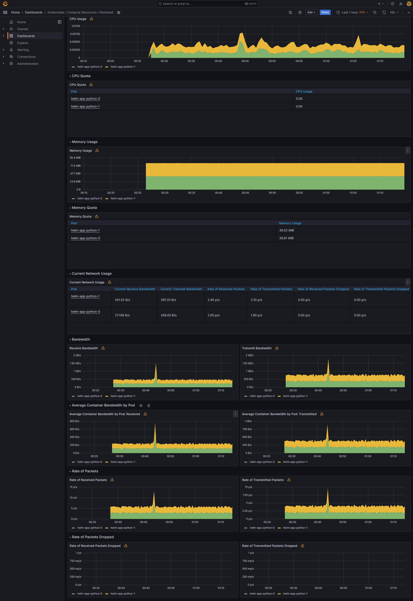
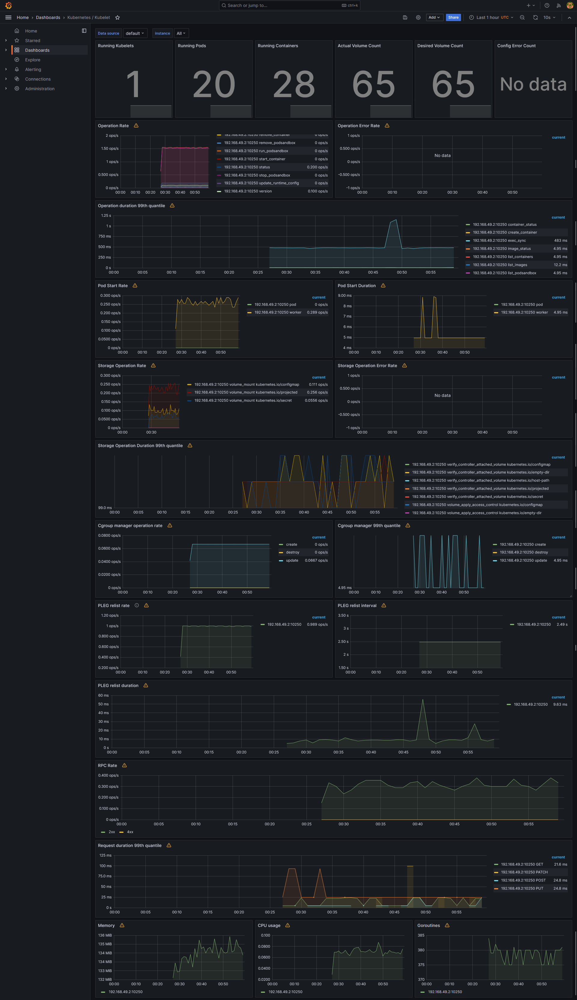

# Lab 14: Kubernetes Monitoring and Init Containers

### Components of the Kube Prometheus Stack

1. **The Prometheus Operator**: It makes the deployment and management of Prometheus and related monitoring components within Kubernetes clusters easier. It utilizes Kubernetes custome resourses to define and manage Prometheus, Alertmanager etc.
2. **Alert Manager**: It handles alerts generated by client applications like Prometheus within the k8s ecosystem. It can handle alert deduplication, grouping and routing, too.
3. **Node exporter**: It collects hardware metrics (also OS metrics) from kernel. It makes these metrics available on HTTP endpoints that can be scraped. 
4. **Blackbox Exporter**: It allows Prometheus to check different endpoints for monitoring and checking the health of external services. 
5. **Prometheus Adapter for Kubernetes Metrics API**: It works like a connection betweek Kubernetes and Prometheus. It allows to use metrics from Prometheus to apply auto-scaling of pods. 
6. **Grafana**: It's a monitoring tool; it gives us visuals (graphs/charts etc.). It can be used as the main source of dashboards. 
7. **Prometheus**: It allows to collect time-based data and metrics at regular intervals. It can help us get some insights about the performance of our system. 

### Installing the Helm Charts

- Using Kube Prometheus Stack
    ```bash
    helm repo add prometheus-community https://prometheus-community.github.io/helm-charts
    ```
    ```bash
    $ helm repo update
    Hang tight while we grab the latest from your chart repositories...
    ...Successfully got an update from the "hashicorp" chart repository
    ...Successfully got an update from the "prometheus-community" chart repository
    ...Successfully got an update from the "bitnami" chart repository
    Update Complete. ⎈Happy Helming!⎈
    ```
    ```bash
    $ helm install prometheus-community/kube-prometheus-stack --generate-name
    NAME: kube-prometheus-stack-1715127811
    LAST DEPLOYED: Wed May  8 03:23:39 2024
    NAMESPACE: default
    STATUS: deployed
    REVISION: 1
    NOTES:
    kube-prometheus-stack has been installed. Check its status by running:
    kubectl --namespace default get pods -l "release=kube-prometheus-stack-1715127811"

    Visit https://github.com/prometheus-operator/kube-prometheus for instructions on how to create & configure Alertmanager and Prometheus instances using the Operator.
    ```
    ```bash
    $ kubectl get po,sts,svc,pvc,cm
    NAME                                                                  READY   STATUS      RESTARTS   AGE
    pod/alertmanager-kube-prometheus-stack-1715-alertmanager-0            2/2     Running     0          5m
    pod/helm-app-python-0                                                 1/1     Running     1          6d16h
    pod/helm-app-python-1                                                 1/1     Running     1          6d16h
    pod/kube-prometheus-stack-1715-operator-7fd6b8999d-zx5vs              1/1     Running     0          5m31s
    pod/kube-prometheus-stack-1715127811-grafana-6958b9b8d7-5w4bt         3/3     Running     0          5m31s
    pod/kube-prometheus-stack-1715127811-kube-state-metrics-b99547v9cvf   1/1     Running     0          5m31s
    pod/kube-prometheus-stack-1715127811-prometheus-node-exporter-9mbsq   1/1     Running     0          5m31s
    pod/postinstall-hook                                                  0/1     Completed   0          6d16h
    pod/preinstall-hook                                                   0/1     Completed   0          6d16h
    pod/prometheus-kube-prometheus-stack-1715-prometheus-0                2/2     Running     0          4m59s
    pod/vault-0                                                           1/1     Running     3          20d
    pod/vault-agent-injector-dbfc5cd77-r8tn9                              1/1     Running     3          20d

    NAME                                                                    READY   AGE
    statefulset.apps/alertmanager-kube-prometheus-stack-1715-alertmanager   1/1     5m
    statefulset.apps/helm-app-python                                        2/2     6d16h
    statefulset.apps/prometheus-kube-prometheus-stack-1715-prometheus       1/1     4m59s
    statefulset.apps/vault                                                  1/1     20d

    NAME                                                                TYPE        CLUSTER-IP       EXTERNAL-IP   PORT(S)                      AGE
    service/alertmanager-operated                                       ClusterIP   None             <none>        9093/TCP,9094/TCP,9094/UDP   5m
    service/helm-app-python                                             ClusterIP   10.97.3.59       <none>        80/TCP                       6d16h
    service/kube-prometheus-stack-1715-alertmanager                     ClusterIP   10.106.37.220    <none>        9093/TCP,8080/TCP            5m31s
    service/kube-prometheus-stack-1715-operator                         ClusterIP   10.111.251.114   <none>        443/TCP                      5m31s
    service/kube-prometheus-stack-1715-prometheus                       ClusterIP   10.98.146.231    <none>        9090/TCP,8080/TCP            5m31s
    service/kube-prometheus-stack-1715127811-grafana                    ClusterIP   10.97.187.28     <none>        80/TCP                       5m31s
    service/kube-prometheus-stack-1715127811-kube-state-metrics         ClusterIP   10.107.3.175     <none>        8080/TCP                     5m31s
    service/kube-prometheus-stack-1715127811-prometheus-node-exporter   ClusterIP   10.109.193.252   <none>        9100/TCP                     5m31s
    service/kubernetes                                                  ClusterIP   10.96.0.1        <none>        443/TCP                      34d
    service/prometheus-operated                                         ClusterIP   None             <none>        9090/TCP                     4m59s
    service/vault                                                       ClusterIP   10.104.114.233   <none>        8200/TCP,8201/TCP            20d
    service/vault-agent-injector-svc                                    ClusterIP   10.107.221.96    <none>        443/TCP                      20d
    service/vault-internal                                              ClusterIP   None             <none>        8200/TCP,8201/TCP            20d

    NAME                                                 STATUS   VOLUME                                     CAPACITY   ACCESS MODES   STORAGECLASS   AGE
    persistentvolumeclaim/state-data-helm-app-python-0   Bound    pvc-96e78b45-4b2e-47ad-a02b-112bca81f0a2   5Mi        RWO            standard       6d17h
    persistentvolumeclaim/state-data-helm-app-python-1   Bound    pvc-693df84b-f5a7-41b6-bf19-cd52828369be   5Mi        RWO            standard       6d17h

    NAME                                                                     DATA   AGE
    configmap/app-python-configmap                                           1      6d16h
    configmap/kube-prometheus-stack-1715-alertmanager-overview               1      5m32s
    configmap/kube-prometheus-stack-1715-apiserver                           1      5m32s
    configmap/kube-prometheus-stack-1715-cluster-total                       1      5m32s
    configmap/kube-prometheus-stack-1715-controller-manager                  1      5m32s
    configmap/kube-prometheus-stack-1715-etcd                                1      5m32s
    configmap/kube-prometheus-stack-1715-grafana-datasource                  1      5m32s
    configmap/kube-prometheus-stack-1715-grafana-overview                    1      5m32s
    configmap/kube-prometheus-stack-1715-k8s-coredns                         1      5m32s
    configmap/kube-prometheus-stack-1715-k8s-resources-cluster               1      5m32s
    configmap/kube-prometheus-stack-1715-k8s-resources-multicluster          1      5m32s
    configmap/kube-prometheus-stack-1715-k8s-resources-namespace             1      5m32s
    configmap/kube-prometheus-stack-1715-k8s-resources-node                  1      5m32s
    configmap/kube-prometheus-stack-1715-k8s-resources-pod                   1      5m32s
    configmap/kube-prometheus-stack-1715-k8s-resources-workload              1      5m32s
    configmap/kube-prometheus-stack-1715-k8s-resources-workloads-namespace   1      5m32s
    configmap/kube-prometheus-stack-1715-kubelet                             1      5m32s
    configmap/kube-prometheus-stack-1715-namespace-by-pod                    1      5m32s
    configmap/kube-prometheus-stack-1715-namespace-by-workload               1      5m32s
    configmap/kube-prometheus-stack-1715-node-cluster-rsrc-use               1      5m32s
    configmap/kube-prometheus-stack-1715-node-rsrc-use                       1      5m32s
    configmap/kube-prometheus-stack-1715-nodes                               1      5m32s
    configmap/kube-prometheus-stack-1715-nodes-darwin                        1      5m32s
    configmap/kube-prometheus-stack-1715-persistentvolumesusage              1      5m32s
    configmap/kube-prometheus-stack-1715-pod-total                           1      5m32s
    configmap/kube-prometheus-stack-1715-prometheus                          1      5m32s
    configmap/kube-prometheus-stack-1715-proxy                               1      5m32s
    configmap/kube-prometheus-stack-1715-scheduler                           1      5m32s
    configmap/kube-prometheus-stack-1715-workload-total                      1      5m32s
    configmap/kube-prometheus-stack-1715127811-grafana                       1      5m32s
    configmap/kube-prometheus-stack-1715127811-grafana-config-dashboards     1      5m32s
    configmap/kube-root-ca.crt                                               1      34d
    configmap/prometheus-kube-prometheus-stack-1715-prometheus-rulefiles-0   35     5m
    ```

    ```bash
    $ minikube service kube-prometheus-stack-1715127811-grafana
    W0508 03:31:39.044943   36740 main.go:291] Unable to resolve the current Docker CLI context "default": context "default": context not found: open C:\Users\Admin\.docker\contexts\meta\37a8eec1ce19687d132fe29051dca629d164e2c4958ba141d5f4133a33f0688f\meta.json: The system cannot find the path specified.
    |-----------|------------------------------------------|-------------|--------------|
    | NAMESPACE |                   NAME                   | TARGET PORT |     URL      |
    |-----------|------------------------------------------|-------------|--------------|
    | default   | kube-prometheus-stack-1715127811-grafana |             | No node port |
    |-----------|------------------------------------------|-------------|--------------|
    😿  service default/kube-prometheus-stack-1715127811-grafana has no node port
    🏃  Starting tunnel for service kube-prometheus-stack-1715127811-grafana.
    |-----------|------------------------------------------|-------------|------------------------|
    | NAMESPACE |                   NAME                   | TARGET PORT |          URL           |
    |-----------|------------------------------------------|-------------|------------------------|
    | default   | kube-prometheus-stack-1715127811-grafana |             | http://127.0.0.1:56622 |
    |-----------|------------------------------------------|-------------|------------------------|
    🎉  Opening service default/kube-prometheus-stack-1715127811-grafana in default browser...
    ❗  Because you are using a Docker driver on windows, the terminal needs to be open to run it.
    ```

    To login on Grafana dashboard: 
    ```bash
    $ kubectl get secret kube-prometheus-stack-1715127811-grafana -o jsonpath="{.data.admin-password}" | base64 --decode ; echo
    prom-operator 
    # username: admin
    # password: prom-operator
    ```

    ```bash
    $ minikube service kube-prometheus-stack-1715-alertmanager
    W0508 04:39:02.768488   32860 main.go:291] Unable to resolve the current Docker CLI context "default": context "default": context not found: open C:\Users\Admin\.docker\contexts\meta\37a8eec1ce19687d132fe29051dca629d164e2c4958ba141d5f4133a33f0688f\meta.json: The system cannot find the path specified.
    |-----------|-----------------------------------------|-------------|--------------|
    | NAMESPACE |                  NAME                   | TARGET PORT |     URL      |
    |-----------|-----------------------------------------|-------------|--------------|
    | default   | kube-prometheus-stack-1715-alertmanager |             | No node port |
    |-----------|-----------------------------------------|-------------|--------------|
    😿  service default/kube-prometheus-stack-1715-alertmanager has no node port
    🏃  Starting tunnel for service kube-prometheus-stack-1715-alertmanager.
    |-----------|-----------------------------------------|-------------|------------------------|
    | NAMESPACE |                  NAME                   | TARGET PORT |          URL           |
    |-----------|-----------------------------------------|-------------|------------------------|
    | default   | kube-prometheus-stack-1715-alertmanager |             | http://127.0.0.1:65148 |
    |           |                                         |             | http://127.0.0.1:65149 |
    |-----------|-----------------------------------------|-------------|------------------------|
    [default kube-prometheus-stack-1715-alertmanager  http://127.0.0.1:65148
    http://127.0.0.1:65149]
    ❗  Because you are using a Docker driver on windows, the terminal needs to be open to run it.
    ```

### Utilizing Grafana Dashboard

1. Memory and CPU consumption of the StatefulSet: 
    Memory consumption: approximately 80MB; CPU usage: 0.005% approximately;
    
2. Based on the report, `helm-app-python-1` has higher CPU usage and `helm-app-python-0` has lower CPU usage.

3. Node memory usage in percentage and megabytes: 
    Around 27.4% (approximately 3.2 GB)
    

4. Number of pods and containers managed by the Kubelet service:
    Pods = 20, containers = 28
    

5. Network usage of Pods in the default namespace: 122 kB/s vs. 138 kB/s
    

6. Number of active alerts: 8
    - Screenshot from Grafana Dashboard
    
    - Screenshot from `minikube service kube-prometheus-stack-1715-alertmanager`
    
