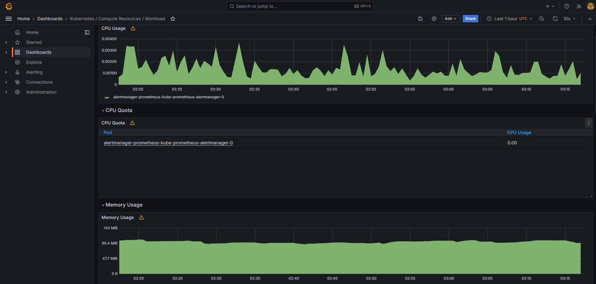
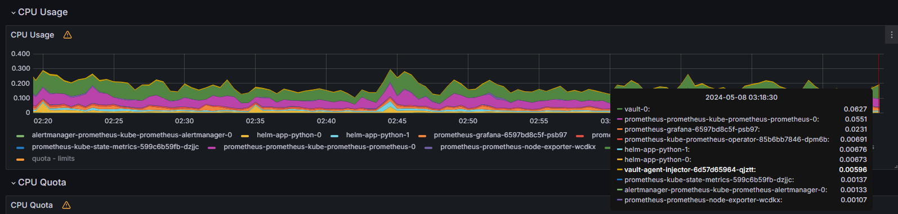
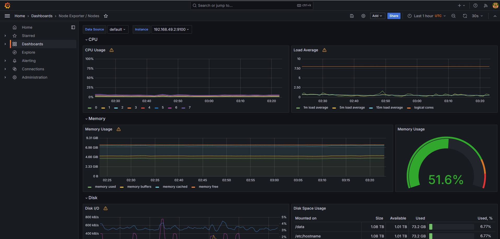
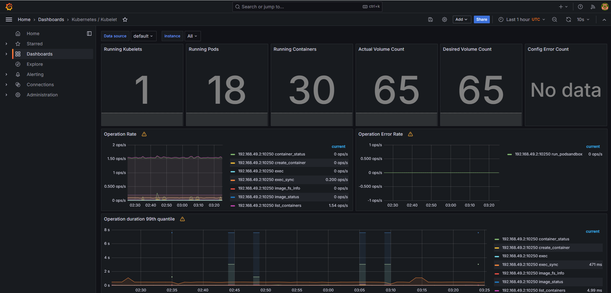
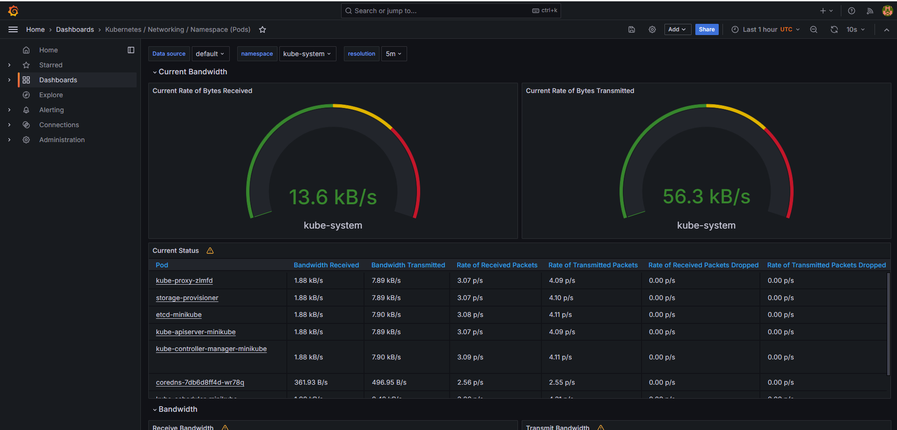
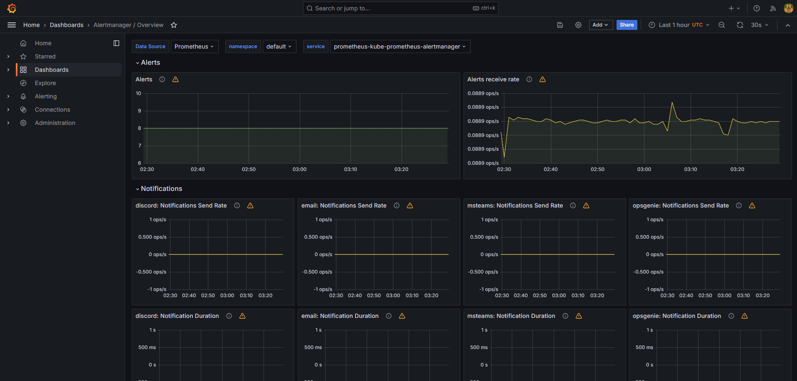
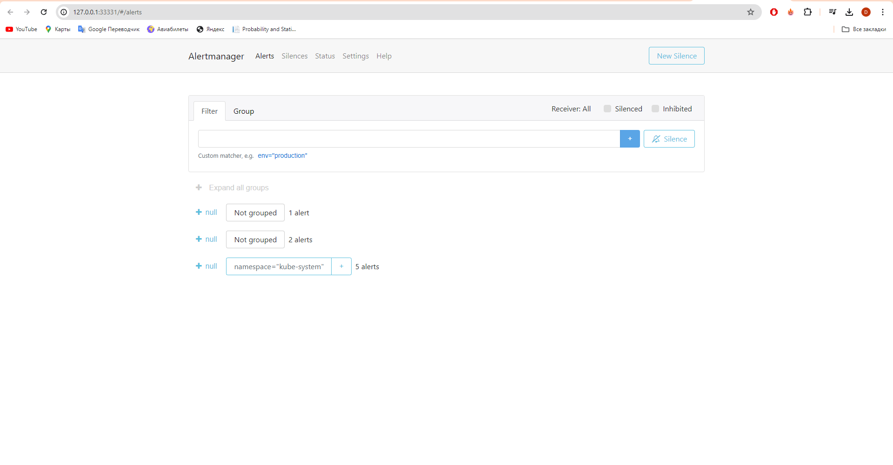
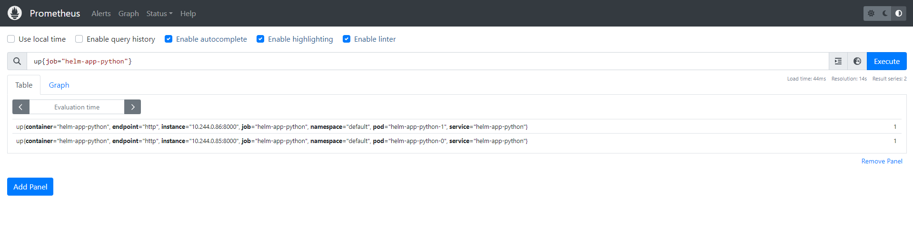

# Kubernetes Monitoring and Init Containers

## Kube Prometheus Stack

### Explanation of components

 - The Prometheus Operator

Simplifies and automates the configuration of Prometheus in Kubernetes

 - Highly available Prometheus

Collects and manages the metrics

 - Highly available Alertmanager

Handles the alerts. Deduplicates, groups and routes them to the receiver

 - Prometheus node-exporter

Exports hardware and OS metrics

 - Prometheus blackbox-exporter

Does blackbox probing over endpoints

 - Prometheus Adapter for Kubernetes Metrics APIs

Translates between the Prometheus metrics to Kubernetes APIs

 - kube-state-metrics

Generates the metric of the Kubernetes objects 

 - Grafana

Visualizes the data


### Charts

 - `kubectl get po,sts,svc,pvc,cm`

Pods, their status and age:

```bash
NAME                                                         READY   STATUS    RESTARTS        AGE
pod/alertmanager-prometheus-kube-prometheus-alertmanager-0   2/2     Running   0               135m
pod/helm-app-python-0                                        2/2     Running   0               5m18s
pod/helm-app-python-1                                        2/2     Running   1 (3m53s ago)   5m18s
pod/prometheus-grafana-6597bd8c5f-psb97                      3/3     Running   0               136m
pod/prometheus-kube-prometheus-operator-85b6bb7846-dpm6b     1/1     Running   0               136m
pod/prometheus-kube-state-metrics-599c6b59fb-dzjjc           1/1     Running   0               136m
pod/prometheus-prometheus-kube-prometheus-prometheus-0       2/2     Running   0               135m
pod/prometheus-prometheus-node-exporter-wcdkx                1/1     Running   0               136m
pod/vault-0                                                  1/1     Running   0               40m
pod/vault-agent-injector-6d57d65964-qjztt                    1/1     Running   0               40m
```

Stateful sets with age:

```bash

NAME                                                                    READY   AGE
statefulset.apps/alertmanager-prometheus-kube-prometheus-alertmanager   1/1     135m
statefulset.apps/helm-app-python                                        2/2     5m18s
statefulset.apps/prometheus-prometheus-kube-prometheus-prometheus       1/1     135m
statefulset.apps/vault                                                  1/1     40m
```

Services with their type, cluster IP and age:

```bash
NAME                                              TYPE        CLUSTER-IP       EXTERNAL-IP   PORT(S)                      AGE
service/alertmanager-operated                     ClusterIP   None             <none>        9093/TCP,9094/TCP,9094/UDP   135m
service/helm-app-python                           ClusterIP   10.104.122.77    <none>        8000/TCP                     5m18s
service/kubernetes                                ClusterIP   10.96.0.1        <none>        443/TCP                      168m
service/prometheus-grafana                        ClusterIP   10.108.65.193    <none>        80/TCP                       136m
service/prometheus-kube-prometheus-alertmanager   ClusterIP   10.98.110.117    <none>        9093/TCP,8080/TCP            136m
service/prometheus-kube-prometheus-operator       ClusterIP   10.102.232.87    <none>        443/TCP                      136m
service/prometheus-kube-prometheus-prometheus     ClusterIP   10.108.132.236   <none>        9090/TCP,8080/TCP            136m
service/prometheus-kube-state-metrics             ClusterIP   10.108.56.211    <none>        8080/TCP                     136m
service/prometheus-operated                       ClusterIP   None             <none>        9090/TCP                     135m
service/prometheus-prometheus-node-exporter       ClusterIP   10.96.83.112     <none>        9100/TCP                     136m
service/vault                                     ClusterIP   10.111.118.68    <none>        8200/TCP,8201/TCP            40m
service/vault-agent-injector-svc                  ClusterIP   10.111.141.50    <none>        443/TCP                      40m
service/vault-internal                            ClusterIP   None             <none>        8200/TCP,8201/TCP            40m
```

Volumes, statuses, capacity:

```bash
NAME                                          STATUS   VOLUME                                     CAPACITY   ACCESS MODES   STORAGECLASS   VOLUMEATTRIBUTESCLASS   AGE
persistentvolumeclaim/www-helm-app-python-0   Bound    pvc-adbdc0e7-175b-412b-bb46-9b85fbee077d   1Gi        RWO            standard       <unset>                 5m18s
persistentvolumeclaim/www-helm-app-python-1   Bound    pvc-2b3e4151-7b4a-4729-afbb-9f7dcbcc50b9   1Gi        RWO            standard       <unset>                 5m18s
```

Configmaps, their data and age:

```bash
NAME                                                                     DATA   AGE
configmap/config                                                         1      5m18s
configmap/kube-root-ca.crt                                               1      167m
configmap/prometheus-grafana                                             1      136m
configmap/prometheus-grafana-config-dashboards                           1      136m
configmap/prometheus-kube-prometheus-alertmanager-overview               1      136m
configmap/prometheus-kube-prometheus-apiserver                           1      136m
configmap/prometheus-kube-prometheus-cluster-total                       1      136m
configmap/prometheus-kube-prometheus-controller-manager                  1      136m
configmap/prometheus-kube-prometheus-etcd                                1      136m
configmap/prometheus-kube-prometheus-grafana-datasource                  1      136m
configmap/prometheus-kube-prometheus-grafana-overview                    1      136m
configmap/prometheus-kube-prometheus-k8s-coredns                         1      136m
configmap/prometheus-kube-prometheus-k8s-resources-cluster               1      136m
configmap/prometheus-kube-prometheus-k8s-resources-multicluster          1      136m
configmap/prometheus-kube-prometheus-k8s-resources-namespace             1      136m
configmap/prometheus-kube-prometheus-k8s-resources-node                  1      136m
configmap/prometheus-kube-prometheus-k8s-resources-pod                   1      136m
configmap/prometheus-kube-prometheus-k8s-resources-workload              1      136m
configmap/prometheus-kube-prometheus-k8s-resources-workloads-namespace   1      136m
configmap/prometheus-kube-prometheus-kubelet                             1      136m
configmap/prometheus-kube-prometheus-namespace-by-pod                    1      136m
configmap/prometheus-kube-prometheus-namespace-by-workload               1      136m
configmap/prometheus-kube-prometheus-node-cluster-rsrc-use               1      136m
configmap/prometheus-kube-prometheus-node-rsrc-use                       1      136m
configmap/prometheus-kube-prometheus-nodes                               1      136m
configmap/prometheus-kube-prometheus-nodes-darwin                        1      136m
configmap/prometheus-kube-prometheus-persistentvolumesusage              1      136m
configmap/prometheus-kube-prometheus-pod-total                           1      136m
configmap/prometheus-kube-prometheus-prometheus                          1      136m
configmap/prometheus-kube-prometheus-proxy                               1      136m
configmap/prometheus-kube-prometheus-scheduler                           1      136m
configmap/prometheus-kube-prometheus-workload-total                      1      136m
configmap/prometheus-prometheus-kube-prometheus-prometheus-rulefiles-0   35     135m
```

All of the above represent the objects that are running in Kubernetes currently

### Utilize Grafana Dashboards

1. Check CPU and Memory consumption of your StatefulSet.

 - CPU: 0.001
 - Memory: 95 MiB




2. Identify Pods with higher and lower CPU usage in the default namespace.

 - Highest: Vault
 - Lowest: Node exporter




3. Monitor node memory usage in percentage and megabytes.




4. Count the number of pods and containers managed by the Kubelet service.

 - 18 pods, 30 containers




5. Evaluate network usage of Pods in the default namespace.

 - Received: 13.6 kB/s
 - Transmitted: 56.3 kB/s




6. Determine the number of active alerts; also check the Web UI with minikube service monitoring-kube-prometheus-alertmanager.

 - 8 alerts






## Init Containers

 - `kubectl exec pod/helm-app-python-0 -- cat /work-dir/index.html`

```bash
Defaulted container "helm-app-python" out of: helm-app-python, vault-agent, install (init), vault-agent-init (init)
<html><head></head><body><header>
<title>http://info.cern.ch</title>
</header>

<h1>http://info.cern.ch - home of the first website</h1>
<p>From here you can:</p>
<ul>
<li><a href="http://info.cern.ch/hypertext/WWW/TheProject.html">Browse the first website</a></li>
<li><a href="http://line-mode.cern.ch/www/hypertext/WWW/TheProject.html">Browse the first website using the line-mode browser simulator</a></li>
<li><a href="http://home.web.cern.ch/topics/birth-web">Learn about the birth of the web</a></li>
<li><a href="http://home.web.cern.ch/about">Learn about CERN, the physics laboratory where the web was born</a></li>
</ul>
</body></html>
```

## App Metrics



## Init Containers Queue

 - `kubectl exec pod/helm-app-python-0 -- cat /work-dir/example`

```bash
Defaulted container "helm-app-python" out of: helm-app-python, vault-agent, install (init), add-line-1 (init), add-line-2 (init), vault-agent-init (init)
line 1
line 2
```
