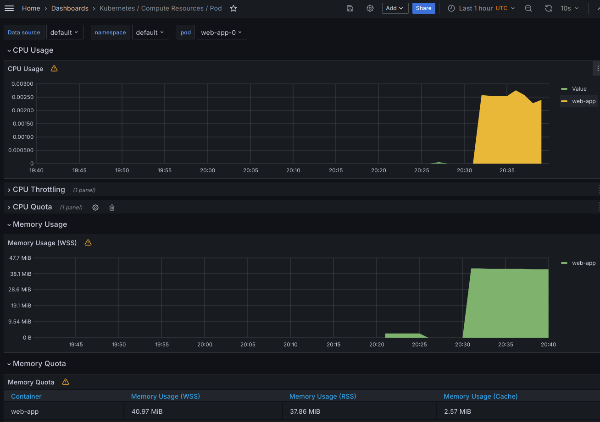
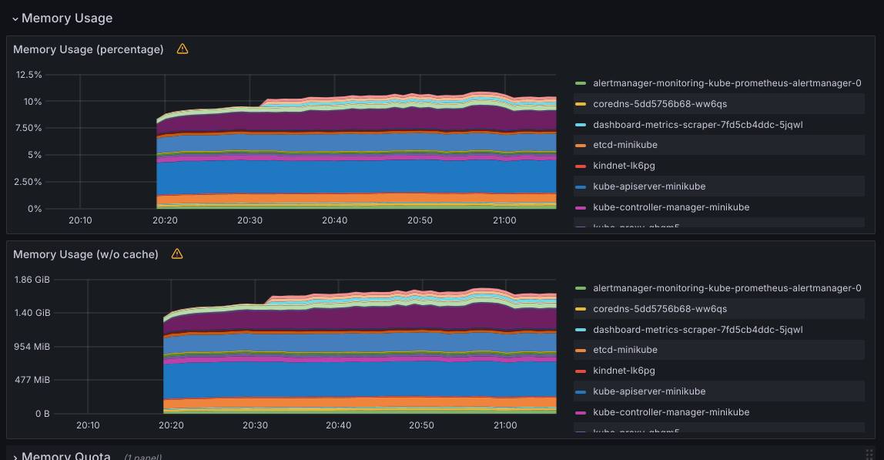
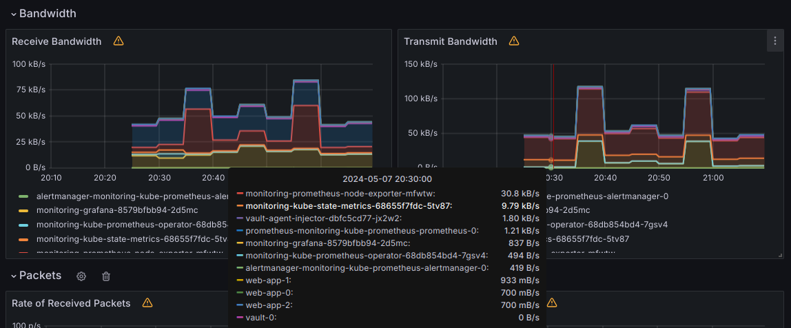
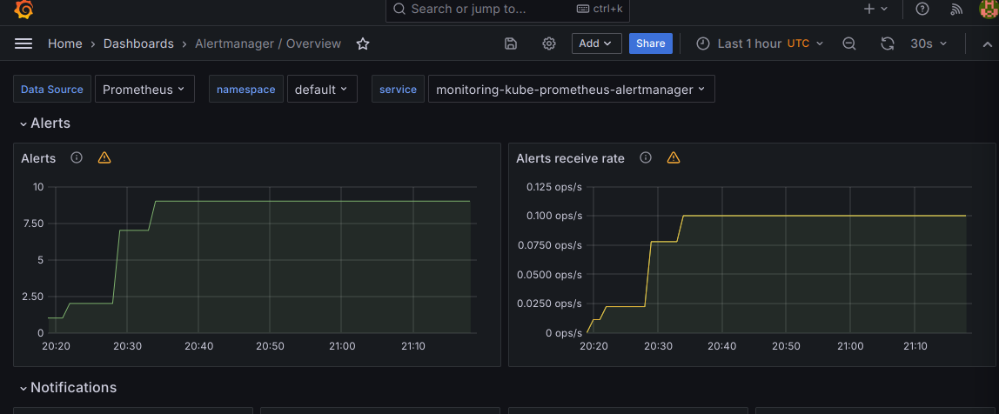
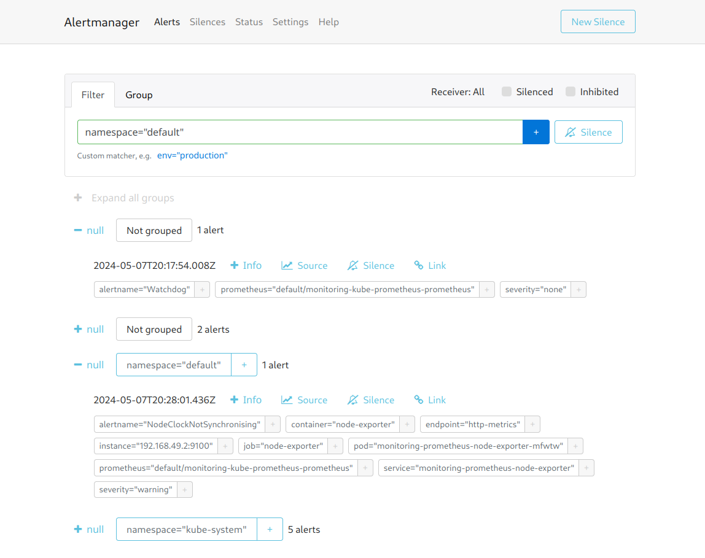

# Lab 14

## Kubernetes Monitoring

### Stack explanation

#### Alertmanager

Alertmanager handles alerts sent by Prometheus server and takes care of deduplicating, grouping, and routing them.

#### Grafana

Grafana allows you to query, visualize, alert on, and understand your metrics no matter where they are stored.

#### Prometheus Operator

This pod is responsible for managing the lifecycle of Prometheus instances, including creating, updating, and deleting
Prometheus instances based on the configuration.

#### Kube-state-metrics

Kube-state-metrics is a service that listens to the Kubernetes API server and generates metrics about the state of the
objects.

#### Prometheus Node Exporter

Prometheus exporter for hardware and OS metrics with pluggable metric collectors. For measuring various machine
resources such as memory, disk I/O, CPU, network, etc.

#### Vault and vault injector

Explored in previous labs. Used for secret management.

### Practice

#### Deployment

Output of `minikube kubectl -- get po,sts,svc,pvc`:

```shell
NAME                                                         READY   STATUS    RESTARTS   AGE
pod/alertmanager-monitoring-kube-prometheus-alertmanager-0   2/2     Running   0          15m
pod/monitoring-grafana-8579bfbb94-2d5mc                      3/3     Running   0          16m
pod/monitoring-kube-prometheus-operator-68db854bd4-7gsv4     1/1     Running   0          16m
pod/monitoring-kube-state-metrics-68655f7fdc-5tv87           1/1     Running   0          16m
pod/monitoring-prometheus-node-exporter-mfwtw                1/1     Running   0          16m
pod/prometheus-monitoring-kube-prometheus-prometheus-0       2/2     Running   0          15m
pod/vault-0                                                  1/1     Running   4          20d
pod/vault-agent-injector-dbfc5cd77-jx2w2                     1/1     Running   4          20d
pod/web-app-0                                                1/1     Running   0          22s
pod/web-app-1                                                1/1     Running   0          22s
pod/web-app-2                                                1/1     Running   0          22s

NAME                                                                    READY   AGE
statefulset.apps/alertmanager-monitoring-kube-prometheus-alertmanager   1/1     15m
statefulset.apps/prometheus-monitoring-kube-prometheus-prometheus       1/1     15m
statefulset.apps/vault                                                  1/1     20d
statefulset.apps/web-app                                                3/3     22s

NAME                                              TYPE        CLUSTER-IP       EXTERNAL-IP   PORT(S)                      AGE
service/alertmanager-operated                     ClusterIP   None             <none>        9093/TCP,9094/TCP,9094/UDP   15m
service/kubernetes                                ClusterIP   10.96.0.1        <none>        443/TCP                      34d
service/monitoring-grafana                        ClusterIP   10.103.79.49     <none>        80/TCP                       16m
service/monitoring-kube-prometheus-alertmanager   ClusterIP   10.109.161.202   <none>        9093/TCP,8080/TCP            16m
service/monitoring-kube-prometheus-operator       ClusterIP   10.97.108.36     <none>        443/TCP                      16m
service/monitoring-kube-prometheus-prometheus     ClusterIP   10.96.47.133     <none>        9090/TCP,8080/TCP            16m
service/monitoring-kube-state-metrics             ClusterIP   10.101.170.32    <none>        8080/TCP                     16m
service/monitoring-prometheus-node-exporter       ClusterIP   10.98.169.123    <none>        9100/TCP                     16m
service/prometheus-operated                       ClusterIP   None             <none>        9090/TCP                     15m
service/vault                                     ClusterIP   10.101.231.178   <none>        8200/TCP,8201/TCP            20d
service/vault-agent-injector-svc                  ClusterIP   10.109.243.250   <none>        443/TCP                      20d
service/vault-internal                            ClusterIP   None             <none>        8200/TCP,8201/TCP            20d
service/web-app                                   ClusterIP   10.98.211.227    <none>        8080/TCP                     22s

NAME                                  STATUS   VOLUME                                     CAPACITY   ACCESS MODES   STORAGECLASS   AGE
persistentvolumeclaim/www-web-app-0   Bound    pvc-ed528780-2e67-4787-abcb-9fb1d83262a6   1Gi        RWO            standard       6d13h
persistentvolumeclaim/www-web-app-1   Bound    pvc-62b951a9-44ac-4a18-9014-f85f1d729e42   1Gi        RWO            standard       6d12h
persistentvolumeclaim/www-web-app-2   Bound    pvc-11cecba2-d5d5-4386-b5f2-cfab5597285c   1Gi        RWO            standard       6d12h
```

#### CPU/memory usage

Per pod: around 0.003 of CPU and ~40MB



#### Pods with higher and lower CPU usage

After exploring the pods, the most CPU consuming ones are definetely Vault and Prometheus, each at ocassion grabbing ~
0.1 of CPU.

The least CPU consuming are prometheus node exporter and alertmanager with maximum claim on CPU of 0.002 each.

#### Node memory usage in percentage and megabytes

In total, pods can take about 1.6 Gigabytes of RAM at times, meaning about 10% of my machine's RAM.



#### Network usage

Most of the network usage is the result of prometheus-node-exporter, prometheus itself and grafana.



#### Alerts

There are 9 active alerts.



Some of them are alerts for things like clock being out of sync, some are just test alerts to verify that alerts work.
There are some other alerts too.



## Init containers

Output for `minikube kubectl -- exec pod/web-app-0 -- cat /work-dir/index.html` is:

```shell
Defaulted container "web-app" out of: web-app, install (init)
<html><head></head><body><header>
<title>http://info.cern.ch</title>
</header>

<h1>http://info.cern.ch - home of the first website</h1>
<p>From here you can:</p>
<ul>
<li><a href="http://info.cern.ch/hypertext/WWW/TheProject.html">Browse the first website</a></li>
<li><a href="http://line-mode.cern.ch/www/hypertext/WWW/TheProject.html">Browse the first website using the line-mode browser simulator</a></li>
<li><a href="http://home.web.cern.ch/topics/birth-web">Learn about the birth of the web</a></li>
<li><a href="http://home.web.cern.ch/about">Learn about CERN, the physics laboratory where the web was born</a></li>
</ul>
</body></html>
```

