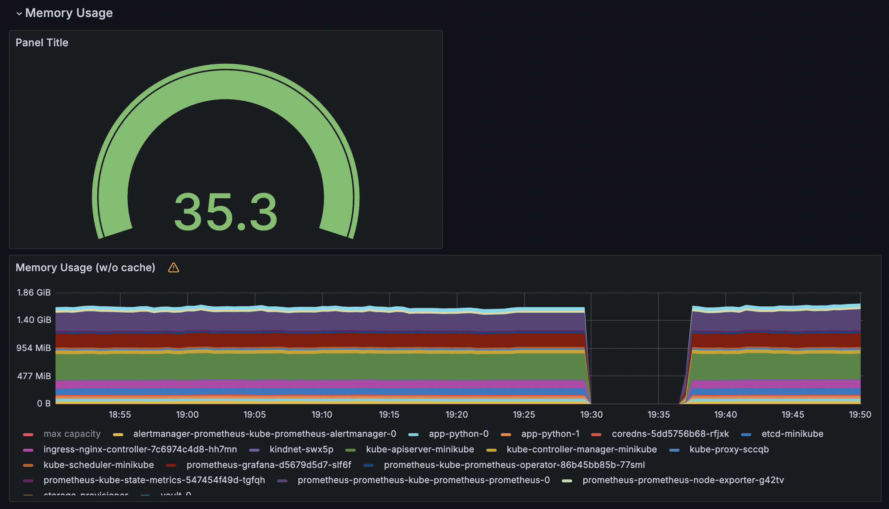
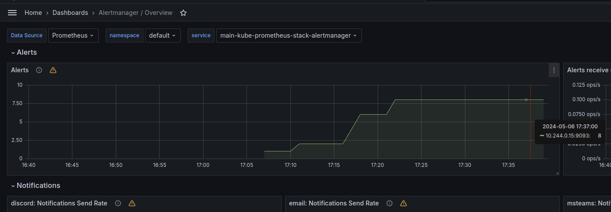

# Output of `kubectl get po,sts,svc,pvc,cm`

This is the list of the pods with the age and restarts amount.
```
NAME                                                         READY   STATUS      RESTARTS   AGE
pod/alertmanager-prometheus-kube-prometheus-alertmanager-0   2/2     Running     0          5m27s
pod/app-python-0                                             1/1     Running     5          4d18h
pod/app-python-1                                             1/1     Running     24         4d18h
pod/postinstall-hook                                         0/1     Completed   0          4d18h
pod/preinstall-hook                                          0/1     Completed   0          4d18h
pod/prometheus-grafana-d5679d5d7-slf6f                       3/3     Running     0          5m36s
pod/prometheus-kube-prometheus-operator-86b45bb85b-77sml     1/1     Running     0          5m36s
pod/prometheus-kube-state-metrics-547454f49d-tgfqh           1/1     Running     0          5m36s
pod/prometheus-prometheus-kube-prometheus-prometheus-0       2/2     Running     0          5m27s
pod/prometheus-prometheus-node-exporter-g42tv                1/1     Running     0          5m36s
pod/vault-0                                                  1/1     Running     6          20d
```

This is the list of the stateful sets with the age and readiness.
```
NAME                                                                    READY   AGE
statefulset.apps/alertmanager-prometheus-kube-prometheus-alertmanager   1/1     5m27s
statefulset.apps/app-python                                             2/2     4d18h
statefulset.apps/prometheus-prometheus-kube-prometheus-prometheus       1/1     5m27s
statefulset.apps/vault                                                  1/1     20d
```

This is a list of services with their types, IPs, ports and ages.
```
NAME                                              TYPE        CLUSTER-IP       EXTERNAL-IP   PORT(S)                      AGE
service/alertmanager-operated                     ClusterIP   None             <none>        9093/TCP,9094/TCP,9094/UDP   5m27s
service/app-python                                ClusterIP   10.104.127.151   <none>        8000/TCP                     4d18h
service/kubernetes                                ClusterIP   10.96.0.1        <none>        443/TCP                      35d
service/prometheus-grafana                        ClusterIP   10.104.66.202    <none>        80/TCP                       5m36s
service/prometheus-kube-prometheus-alertmanager   ClusterIP   10.108.101.44    <none>        9093/TCP,8080/TCP            5m36s
service/prometheus-kube-prometheus-operator       ClusterIP   10.108.99.72     <none>        443/TCP                      5m36s
service/prometheus-kube-prometheus-prometheus     ClusterIP   10.103.239.130   <none>        9090/TCP,8080/TCP            5m36s
service/prometheus-kube-state-metrics             ClusterIP   10.106.172.209   <none>        8080/TCP                     5m36s
service/prometheus-operated                       ClusterIP   None             <none>        9090/TCP                     5m27s
service/prometheus-prometheus-node-exporter       ClusterIP   10.102.113.13    <none>        9100/TCP                     5m36s
service/vault                                     ClusterIP   10.99.100.131    <none>        8200/TCP,8201/TCP            20d
service/vault-agent-injector-svc                  ClusterIP   10.104.114.41    <none>        443/TCP                      20d
service/vault-internal                            ClusterIP   None             <none>        8200/TCP,8201/TCP            20d
```

This is a list of persistent volume claims with statuses, volumes, capacity, access modes, storage classes, and ages.
```
NAME                                     STATUS   VOLUME                                     CAPACITY   ACCESS MODES   STORAGECLASS   AGE
persistentvolumeclaim/data-vault-0       Bound    pvc-d0d941e0-1edc-43ff-a8de-4871da8c3020   10Gi       RWO            standard       20d
persistentvolumeclaim/vol-app-python-0   Bound    pvc-0ffae8e0-e224-49b8-b173-1505d2babff0   1Gi        RWO            standard       4d19h
persistentvolumeclaim/vol-app-python-1   Bound    pvc-9573e548-5311-4fc9-82b1-dab9c8ba04b3   1Gi        RWO            standard       4d19h
persistentvolumeclaim/vol-app-python-2   Bound    pvc-07909155-961a-457f-b3d9-6139ade2b2f9   1Gi        RWO            standard       4d19h
```

This is the list of config maps. `configmap/config` is declared in `values.yaml`.
```
NAME                                                                     DATA   AGE
configmap/config                                                         1      4d18h
configmap/kube-root-ca.crt                                               1      35d
configmap/prometheus-grafana                                             1      5m36s
configmap/prometheus-grafana-config-dashboards                           1      5m36s
configmap/prometheus-kube-prometheus-alertmanager-overview               1      5m36s
configmap/prometheus-kube-prometheus-apiserver                           1      5m36s
configmap/prometheus-kube-prometheus-cluster-total                       1      5m36s
configmap/prometheus-kube-prometheus-controller-manager                  1      5m36s
configmap/prometheus-kube-prometheus-etcd                                1      5m36s
configmap/prometheus-kube-prometheus-grafana-datasource                  1      5m36s
configmap/prometheus-kube-prometheus-grafana-overview                    1      5m36s
configmap/prometheus-kube-prometheus-k8s-coredns                         1      5m36s
configmap/prometheus-kube-prometheus-k8s-resources-cluster               1      5m36s
configmap/prometheus-kube-prometheus-k8s-resources-multicluster          1      5m36s
configmap/prometheus-kube-prometheus-k8s-resources-namespace             1      5m36s
configmap/prometheus-kube-prometheus-k8s-resources-node                  1      5m36s
configmap/prometheus-kube-prometheus-k8s-resources-pod                   1      5m36s
configmap/prometheus-kube-prometheus-k8s-resources-workload              1      5m36s
configmap/prometheus-kube-prometheus-k8s-resources-workloads-namespace   1      5m36s
configmap/prometheus-kube-prometheus-kubelet                             1      5m36s
configmap/prometheus-kube-prometheus-namespace-by-pod                    1      5m36s
configmap/prometheus-kube-prometheus-namespace-by-workload               1      5m36s
configmap/prometheus-kube-prometheus-node-cluster-rsrc-use               1      5m36s
configmap/prometheus-kube-prometheus-node-rsrc-use                       1      5m36s
configmap/prometheus-kube-prometheus-nodes                               1      5m36s
configmap/prometheus-kube-prometheus-nodes-darwin                        1      5m36s
configmap/prometheus-kube-prometheus-persistentvolumesusage              1      5m36s
configmap/prometheus-kube-prometheus-pod-total                           1      5m36s
configmap/prometheus-kube-prometheus-prometheus                          1      5m36s
configmap/prometheus-kube-prometheus-proxy                               1      5m36s
configmap/prometheus-kube-prometheus-scheduler                           1      5m36s
configmap/prometheus-kube-prometheus-workload-total                      1      5m36s
configmap/prometheus-prometheus-kube-prometheus-prometheus-rulefiles-0   35     5m27s
```

# Dashboards analysis

a. Check CPU and Memory consumption of your StatefulSet.


CPU usage: ~0.01
Memory usage: ~90 MiB

b. Identify Pods with higher and lower CPU usage in the default namespace.


The highest: `prometheus-prometheus-kube-prometheus-prometheus-0`
The lowest: `alertmanager-prometheus-kube-prometheus-alertmanager-0`

c. Monitor node memory usage in percentage and megabytes.



d. Count the number of pods and containers managed by the Kubelet service.

Pods: 18
Containers: 25


e. Evaluate network usage of Pods in the default namespace.


f. Determine the number of active alerts

9 alerts



# Output of `kubectl exec pod/app-python-0 -- cat /static-files/index.html`

```
Defaulted container "app-python" out of: app-python, install (init)
<html><head></head><body><header>
<title>http://info.cern.ch</title>
</header>

<h1>http://info.cern.ch - home of the first website</h1>
<p>From here you can:</p>
<ul>
<li><a href="http://info.cern.ch/hypertext/WWW/TheProject.html">Browse the first website</a></li>
<li><a href="http://line-mode.cern.ch/www/hypertext/WWW/TheProject.html">Browse the first website using the line-mode browser simulator</a></li>
<li><a href="http://home.web.cern.ch/topics/birth-web">Learn about the birth of the web</a></li>
<li><a href="http://home.web.cern.ch/about">Learn about CERN, the physics laboratory where the web was born</a></li>
</ul>
</body></html>
```

# Output of `kubectl exec pod/app-python-0 -- cat /static-files/queue`

```
Defaulted container "app-python" out of: app-python, install (init), queue-1 (init), queue-2 (init)
hello
world
```
