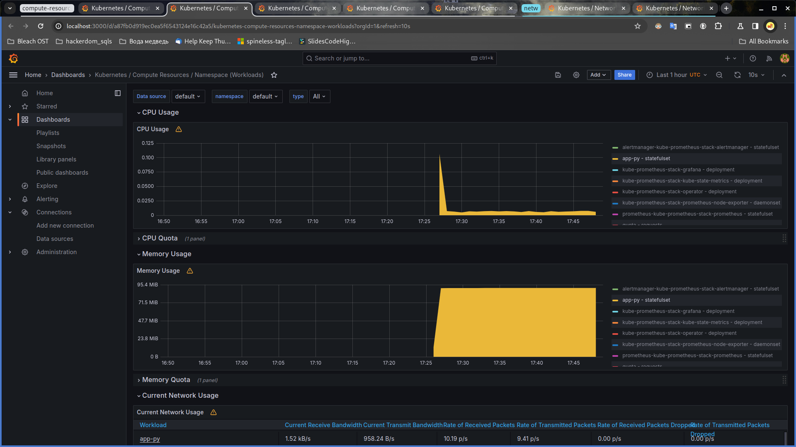
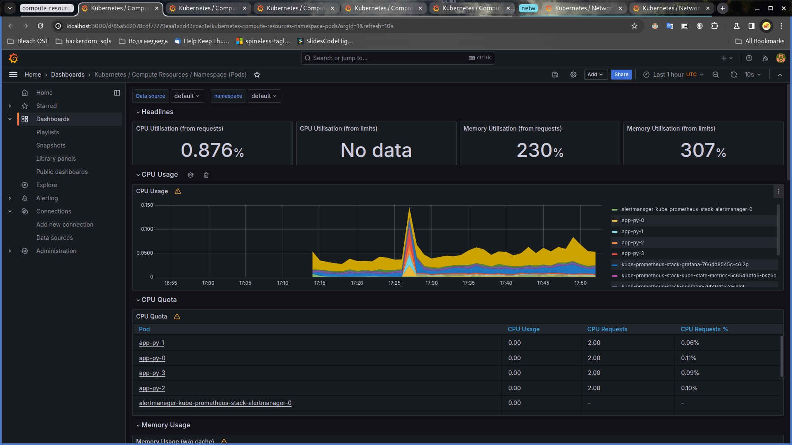
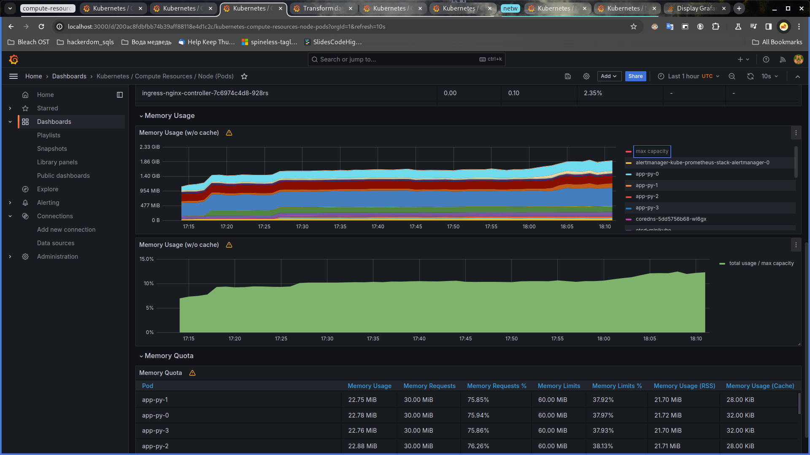
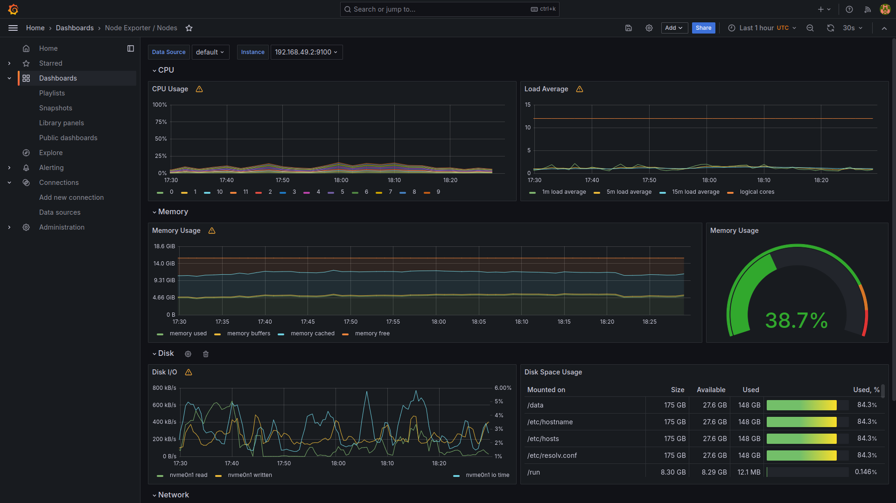
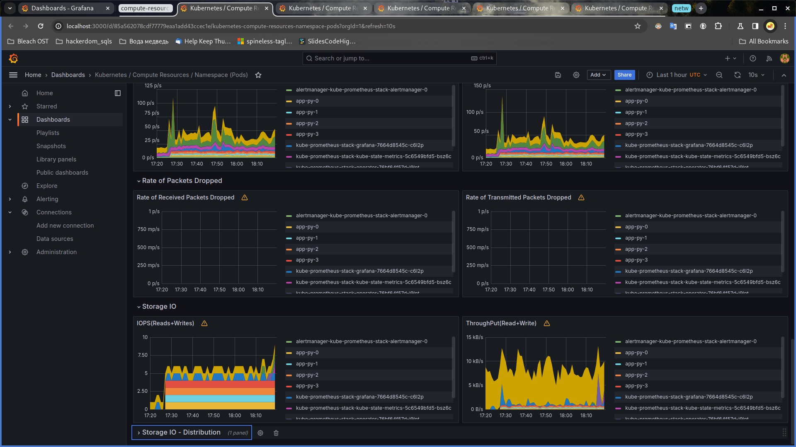
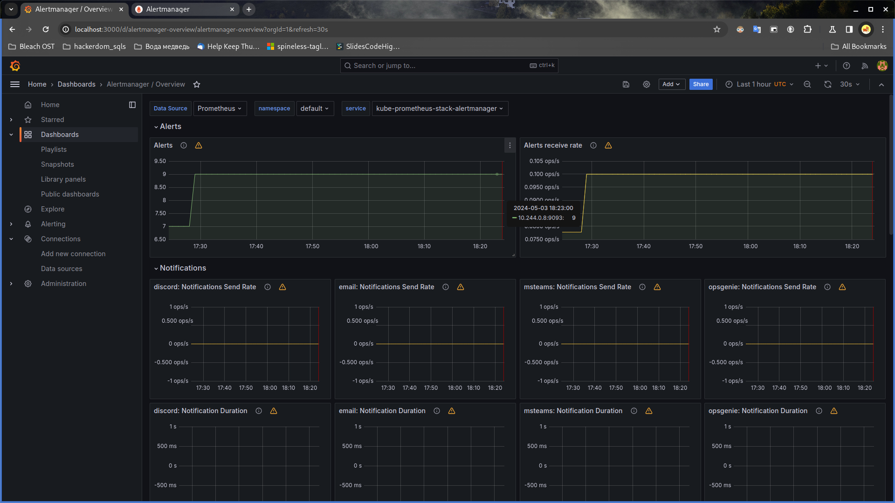
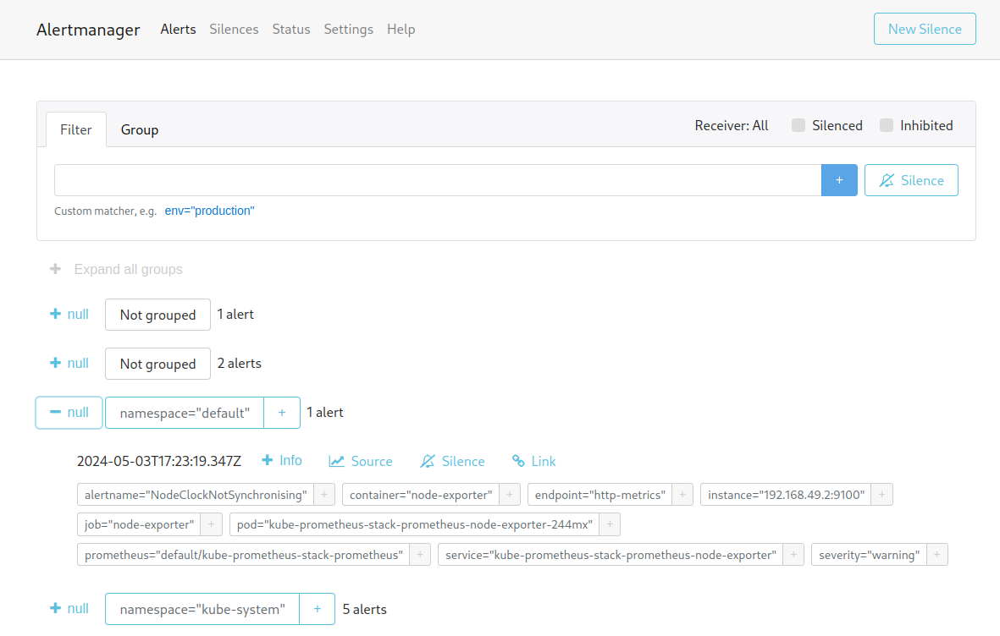

# Lab 14

## Kube-prometheus components

Kube-prometheus is a collection of manifests and config files to set up
prometheus and grafana to monitor Kubernetes clusters. It includes the
following components:

### Prometheus Operator

Prometheus operator is a tool to simplify deployment of Prometheus in
Kubernetes. It provides custom resources that allow to configure Prometheus
like other Kubernetes objects, enables Prometheus query generation based
on Kubernetes labels, etc.

### Prometheus

Prometheus is a general-purpose monitoring and alerting system. It gathers,
stores, queries, visualizes and produces alerts based on metrics.

### Prometheus Alertmanager

Alertmanager is a tool that manages alerts (e.g., performs deduplication
and grouping) and routes them to an appropriate receiver. Prometheus is
one of the supported alert providers.

### Node exporter

Node exporter is a tool that exports hardware and OS metrics. It allows
Prometheus to monitor metrics of the node (i.e., host) itself.

### Blackbox exporter

Blackbox exporter is a tool for probing blackbox endpoints. Probing results
are exported as prometheus metrics.

### Prometheus adapter

Prometheus adapter is a tool to adapt metrics between the Kubernetes Metrics
API and the Prometheus metrics format.

### kube-state-metrics

Kube-state-metrics is a tool that, via the Kubernetes API, monitors objects
inside Kubernetes components (such as deployments, nodes, and pods). Metrics
are accessible in the Prometheus format.

### Grafana

Grafana is a tool that allows to buid dashboards, query and visualize data,
generate alerts, etc.

## Helm charts up&running!

```sh
$ kubectl get po,sts,svc,pvc,cm
NAME                                                            READY   STATUS    RESTARTS   AGE
pod/alertmanager-kube-prometheus-stack-alertmanager-0           2/2     Running   0          113s
pod/app-py-0                                                    1/1     Running   0          14m
pod/app-py-1                                                    1/1     Running   0          14m
pod/app-py-2                                                    1/1     Running   0          14m
pod/app-py-3                                                    1/1     Running   0          14m
pod/kube-prometheus-stack-grafana-7664d8545c-slssj              3/3     Running   0          2m15s
pod/kube-prometheus-stack-kube-state-metrics-5c6549bfd5-9s85m   1/1     Running   0          2m15s
pod/kube-prometheus-stack-operator-76bf64f57d-7ftpf             1/1     Running   0          2m15s
pod/kube-prometheus-stack-prometheus-node-exporter-dfvm2        1/1     Running   0          2m15s
pod/prometheus-kube-prometheus-stack-prometheus-0               2/2     Running   0          113s

NAME                                                               READY   AGE
statefulset.apps/alertmanager-kube-prometheus-stack-alertmanager   1/1     113s
statefulset.apps/app-py                                            4/4     14m
statefulset.apps/prometheus-kube-prometheus-stack-prometheus       1/1     113s

NAME                                                     TYPE           CLUSTER-IP       EXTERNAL-IP   PORT(S)                      AGE
service/alertmanager-operated                            ClusterIP      None             <none>        9093/TCP,9094/TCP,9094/UDP   113s
service/app-py                                           LoadBalancer   10.106.60.186    <pending>     5000:32767/TCP               14m
service/kube-prometheus-stack-alertmanager               ClusterIP      10.96.17.136     <none>        9093/TCP,8080/TCP            2m15s
service/kube-prometheus-stack-grafana                    ClusterIP      10.98.65.92      <none>        80/TCP                       2m15s
service/kube-prometheus-stack-kube-state-metrics         ClusterIP      10.108.216.237   <none>        8080/TCP                     2m15s
service/kube-prometheus-stack-operator                   ClusterIP      10.107.243.233   <none>        443/TCP                      2m15s
service/kube-prometheus-stack-prometheus                 ClusterIP      10.98.39.10      <none>        9090/TCP,8080/TCP            2m15s
service/kube-prometheus-stack-prometheus-node-exporter   ClusterIP      10.102.157.82    <none>        9100/TCP                     2m15s
service/kubernetes                                       ClusterIP      10.96.0.1        <none>        443/TCP                      16m
service/prometheus-operated                              ClusterIP      None             <none>        9090/TCP                     113s

NAME                                        STATUS   VOLUME                                     CAPACITY   ACCESS MODES   STORAGECLASS   AGE
persistentvolumeclaim/persistent-app-py-0   Bound    pvc-753d24c5-d8a9-4c9a-afea-dac3ff69965d   1Mi        RWOP           standard       14m
persistentvolumeclaim/persistent-app-py-1   Bound    pvc-4df3ccff-299c-41a8-a25b-c61459279dc3   1Mi        RWOP           standard       14m
persistentvolumeclaim/persistent-app-py-2   Bound    pvc-fa161536-9a6c-441e-8a1b-f746e50b1609   1Mi        RWOP           standard       14m
persistentvolumeclaim/persistent-app-py-3   Bound    pvc-fe2932ba-75f0-439c-8086-4341989dac96   1Mi        RWOP           standard       14m

NAME                                                                DATA   AGE
configmap/app-py-config-map                                         1      14m
configmap/kube-prometheus-stack-alertmanager-overview               1      2m15s
configmap/kube-prometheus-stack-apiserver                           1      2m15s
configmap/kube-prometheus-stack-cluster-total                       1      2m15s
configmap/kube-prometheus-stack-controller-manager                  1      2m15s
configmap/kube-prometheus-stack-etcd                                1      2m15s
configmap/kube-prometheus-stack-grafana                             1      2m15s
configmap/kube-prometheus-stack-grafana-config-dashboards           1      2m15s
configmap/kube-prometheus-stack-grafana-datasource                  1      2m15s
configmap/kube-prometheus-stack-grafana-overview                    1      2m15s
configmap/kube-prometheus-stack-k8s-coredns                         1      2m15s
configmap/kube-prometheus-stack-k8s-resources-cluster               1      2m15s
configmap/kube-prometheus-stack-k8s-resources-multicluster          1      2m15s
configmap/kube-prometheus-stack-k8s-resources-namespace             1      2m15s
configmap/kube-prometheus-stack-k8s-resources-node                  1      2m15s
configmap/kube-prometheus-stack-k8s-resources-pod                   1      2m15s
configmap/kube-prometheus-stack-k8s-resources-workload              1      2m15s
configmap/kube-prometheus-stack-k8s-resources-workloads-namespace   1      2m15s
configmap/kube-prometheus-stack-kubelet                             1      2m15s
configmap/kube-prometheus-stack-namespace-by-pod                    1      2m15s
configmap/kube-prometheus-stack-namespace-by-workload               1      2m15s
configmap/kube-prometheus-stack-node-cluster-rsrc-use               1      2m15s
configmap/kube-prometheus-stack-node-rsrc-use                       1      2m15s
configmap/kube-prometheus-stack-nodes                               1      2m15s
configmap/kube-prometheus-stack-nodes-darwin                        1      2m15s
configmap/kube-prometheus-stack-persistentvolumesusage              1      2m15s
configmap/kube-prometheus-stack-pod-total                           1      2m15s
configmap/kube-prometheus-stack-prometheus                          1      2m15s
configmap/kube-prometheus-stack-proxy                               1      2m15s
configmap/kube-prometheus-stack-scheduler                           1      2m15s
configmap/kube-prometheus-stack-workload-total                      1      2m15s
configmap/kube-root-ca.crt                                          1      15m
configmap/prometheus-kube-prometheus-stack-prometheus-rulefiles-0   35     113s
$
```

The output includes information about:

-   pods: 4 pods from the statefulset for app-py, a pod for each of the following:
    prometheus, alertmanager, grafana, metrics, operator, node exporter (those
    correspond to components of kube-prometheus-stack);

-   Statefulsets: app-py, prometheus (from kube-prometheus-stack), and
    alertmanager (from kube-prometheus-stack);

-   Services: for app-py, Alertmanager, Grafana, state-metrics, operator, Prometheus,
    node exporter, and kubernetes;

-   Persistent volume claims: four items corresponding to app-py pods;

-   Config maps: one for app-py and several more for different components of
    kube-prometheus-stack.

## Kube-prometheus-stack metrics

### CPU and Memory usage

Current CPU usage is about 0.006%; overall memory usage is about 91.1 MiB.



### Pods with higher and lower CPU usage in the default namespace

Based on the plot, it appears that prometheus-kube-prometheus-stack-prometheus-0
and kube-prometheus-stack-grafana-... are the two pods with highest CPU usage;
among the rest, all pods utilize an insignificant amount of CPU.



### Monitor node memory usage in percentage and ~~megabytes~~ ~~mebibytes~~ gibibytes

The memory usage of all pods on the (only) node adds up to about 1.86GiB, which is
approximately 12% of the max capacity of the pods.



In total (including non-kubernetes processes), 42% of memory is used on the node.



### Count the number of pods and containers managed by the Kubelet service

33.


### Evaluate network usage of Pods in the default namespace

Detailed network usage per pod is as follows:




### Active alerts

There are 9 active alerts. They are accessible via the Alertmanager webUI.




