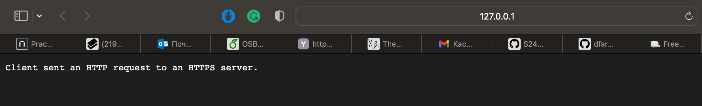

```bash
(venv) PS C:\Users\Ernest\Desktop\Matskevich\k8s\python-app> kubectl get pods -n default -l "release=prometheus"
NAME                                                   READY   STATUS    RESTARTS         AGE
prometheus-kube-prometheus-operator-6c55fbf4b5-2gtmg   1/1     Running   0                3m29s
prometheus-kube-state-metrics-655748c5fb-wgvmj         1/1     Running   10 (3m38s ago)   33m
prometheus-prometheus-node-exporter-6sr8d              1/1     Running   3 (3m45s ago)    33m
```

```bash
(venv) PS C:\Users\Ernest\Desktop\Matskevich\k8s\python-app> kubectl get po
NAME                                                     READY   STATUS            RESTARTS         AGE
alertmanager-prometheus-kube-prometheus-alertmanager-0   0/2     PodInitializing   0                4m6s
prometheus-grafana-6c8f6db6d7-9zgkf                      3/3     Running           0                36m
prometheus-kube-prometheus-operator-6c55fbf4b5-2gtmg     1/1     Running           0                5m43s
prometheus-kube-state-metrics-655748c5fb-wgvmj           1/1     Running           10 (5m52s ago)   36m
prometheus-prometheus-kube-prometheus-prometheus-0       0/2     PodInitializing   0                4m2s
prometheus-prometheus-node-exporter-6sr8d                1/1     Running           3 (5m59s ago)    36m
release-name-python-app-0                                1/1     Running           1                3h17m
release-name-python-app-765cdf987f-8784p                 1/1     Running           4 (5m31s ago)    4h5m
release-name-python-app-test-connection                  0/1     Completed         0                4h5m
```

```bash
(venv) PS C:\Users\Ernest\Desktop\Matskevich\k8s\python-app> kubectl get svc
NAME                                      TYPE        CLUSTER-IP       EXTERNAL-IP   PORT(S)                      AGE
alertmanager-operated                     ClusterIP   None             <none>        9093/TCP,9094/TCP,9094/UDP   10m
kubernetes                                ClusterIP   10.96.0.1        <none>        443/TCP                      18h
prometheus-grafana                        ClusterIP   10.106.71.142    <none>        80/TCP                       41m
prometheus-kube-prometheus-alertmanager   ClusterIP   10.108.141.208   <none>        9093/TCP,8080/TCP            41m
prometheus-kube-prometheus-operator       ClusterIP   10.96.205.166    <none>        443/TCP                      41m
prometheus-kube-prometheus-prometheus     ClusterIP   10.106.143.163   <none>        9090/TCP,8080/TCP            41m
prometheus-kube-state-metrics             ClusterIP   10.104.96.221    <none>        8080/TCP                     41m
prometheus-operated                       ClusterIP   None             <none>        9090/TCP                     9m51s
prometheus-prometheus-node-exporter       ClusterIP   10.99.179.246    <none>        9100/TCP                     41m
release-name-python-app                   ClusterIP   10.104.127.175   <none>        5000/TCP                     3h23m

```

```bash
(venv) PS C:\Users\Ernest\Desktop\Matskevich> kubectl get pvc
NAME                                    STATUS   VOLUME                                     CAPACITY   ACCESS MODES   STORAGECLASS   VOLUMEATTRIBUTESCLASS   AGE
app-storage-release-name-python-app-0   Bound    pvc-cbacf001-3e45-458c-a162-805dc18b0b6f   1Gi        RWO            standard       <unset>                 3h29m
```

```bash
(venv) PS C:\Users\Ernest\Desktop\Matskevich> kubectl get cm
NAME               DATA   AGE
kube-root-ca.crt   1      4m4s

```

During to work minikube often falled off and needed reload and rebuild all system. Also, absoulutely all commands executed about 5 minutes. I do not have problems with interent connection. Also, it's try to require many resources, but faced with lack of it (that was wierd, because I had all neccesary resorces...).
Some commands could print first error like ```Unable to connect to the server: EOF```, but then after run it again, provide good answer...

I completed job to run grafana via helm:

```bash
(venv) PS C:\Users\Ernest\Desktop\Matskevich\monitoring> helm install grafana grafana/grafana --namespace monitoring --set adminPassword=admin --create-namespace
NAME: grafana
LAST DEPLOYED: Sat Nov 16 23:55:20 2024
NAMESPACE: monitoring
STATUS: deployed
REVISION: 1
NOTES:
1. Get your 'admin' user password by running:

   kubectl get secret --namespace monitoring grafana -o jsonpath="{.data.admin-password}" | base64 --decode ; echo


2. The Grafana server can be accessed via port 80 on the following DNS name from within your cluster:

   grafana.monitoring.svc.cluster.local

   Get the Grafana URL to visit by running these commands in the same shell:
     kubectl --namespace monitoring port-forward $POD_NAME 3000

3. Login with the password from step 1 and the username: admin
#################################################################################
######   WARNING: Persistence is disabled!!! You will lose your data when   #####
######            the Grafana pod is terminated.                            #####
#################################################################################
```

And then tryed to export POD_NAME or open grafana in browser using ```minikube service monitoring-grafana``` command from 14.md, but it required to start minikube (again).
```bash
(venv) PS C:\Users\Ernest\Desktop\Matskevich> minikube start                     
* minikube v1.34.0 на Microsoft Windows 10 Pro 10.0.19045.5131 Build 19045.5131
* Используется драйвер docker на основе существующего профиля
* Starting "minikube" primary control-plane node in "minikube" cluster
* Pulling base image v0.0.45 ...
! Executing "docker container inspect minikube --format={{.State.Status}}" took an unusually long time: 5.6877925s
* Restarting the docker service may improve performance.
* Обновляется работающий docker "minikube" container ...
! Failing to connect to https://registry.k8s.io/ from inside the minikube container
* To pull new external images, you may need to configure a proxy: https://minikube.sigs.k8s.io/docs/reference/networking/proxy/
* Подготавливается Kubernetes v1.31.0 на containerd 1.7.21 ...
* Компоненты Kubernetes проверяются ...
  - Используется образ gcr.io/k8s-minikube/storage-provisioner:v5
* Включенные дополнения: storage-provisioner, default-storageclass
```
Below this text were printed some errors (and previous times they were fixed automatically and ```minikube status``` prined good output), that time at the end was output:
```bash
X Exiting due to GUEST_START: failed to start node: wait 6m0s for node: wait for healthy API server: apiserver healthz never reported healthy: context deadline exceeded
*
│                                                                                             │
  To start a cluster, run: "minikube start"
```

I tryed: reload Docker Desktop, restart minikube manually and with help commands, provide more memory for docker, delete old docker containers.

After running ```minikube start``` again, I got similar problem:

```bash
(venv) PS C:\Users\Ernest\Desktop\Matskevich> minikube start
* minikube v1.34.0 на Microsoft Windows 10 Pro 10.0.19045.5131 Build 19045.5131
* Используется драйвер docker на основе существующего профиля
* Starting "minikube" primary control-plane node in "minikube" cluster
* Pulling base image v0.0.45 ...
! Executing "docker container inspect minikube --format={{.State.Status}}" took an unusually long time: 8.1127517s
* Restarting the docker service may improve performance.
* Обновляется работающий docker "minikube" container ...
! Failing to connect to https://registry.k8s.io/ from inside the minikube container
* To pull new external images, you may need to configure a proxy: https://minikube.sigs.k8s.io/docs/reference/networking/proxy/
* Подготавливается Kubernetes v1.31.0 на containerd 1.7.21 ...
<SOME LONG ERRORS HERE>
*
╭─────────────────────────────────────────────────────────────────────────────────────────────╮
│                                                                                             │
│    * If the above advice does not help, please let us know:                                 │
│      https://github.com/kubernetes/minikube/issues/new/choose                               │
│                                                                                             │
│    * Please run `minikube logs --file=logs.txt` and attach logs.txt to the GitHub issue.    │
│                                                                                             │
╰─────────────────────────────────────────────────────────────────────────────────────────────╯
```

I am not sure, but its seems like issue was at the kubernetes side, becasue problem is to coonect to their packages/mirrors etc. + they suggest to create new issue at their repository.

I checked their repository, and they merged their last pull request just yesterday.
Pull Request was about minikube packages, so there is a big chance, that there is a mistake in their build and I used it when rerun minikube.



## Conclusion
I was at one-step form open Grafana web page and check metrics, but probably stuck at the problems with versions.