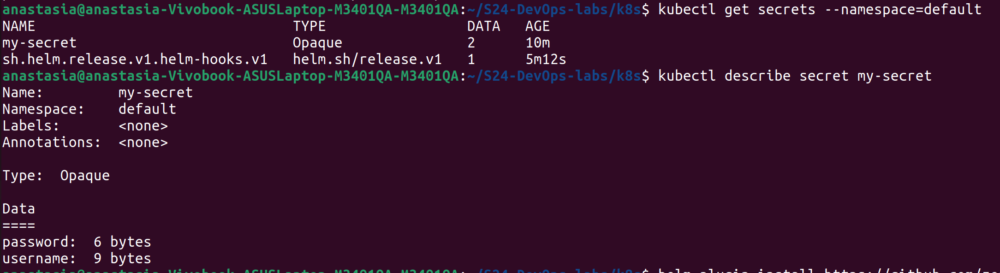
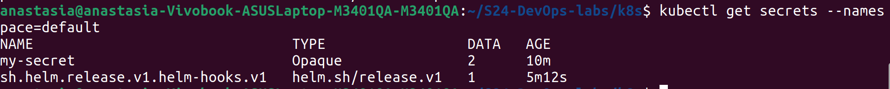
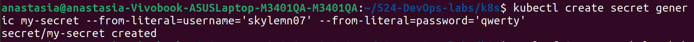
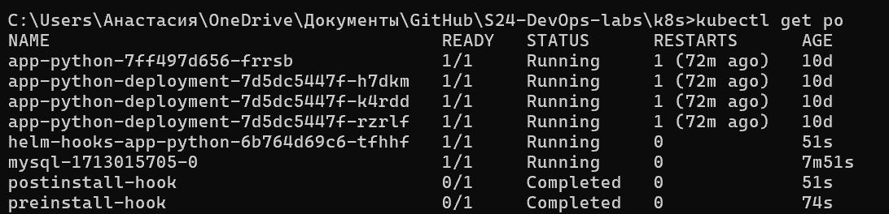
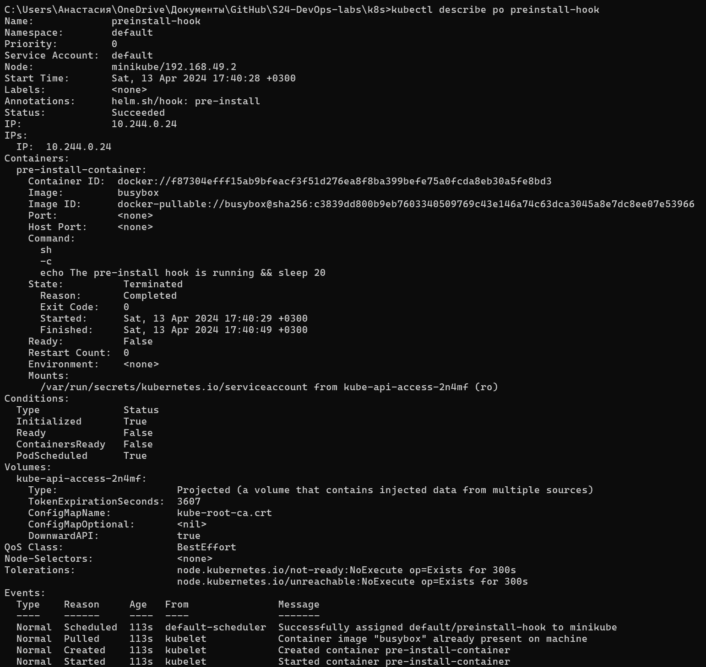
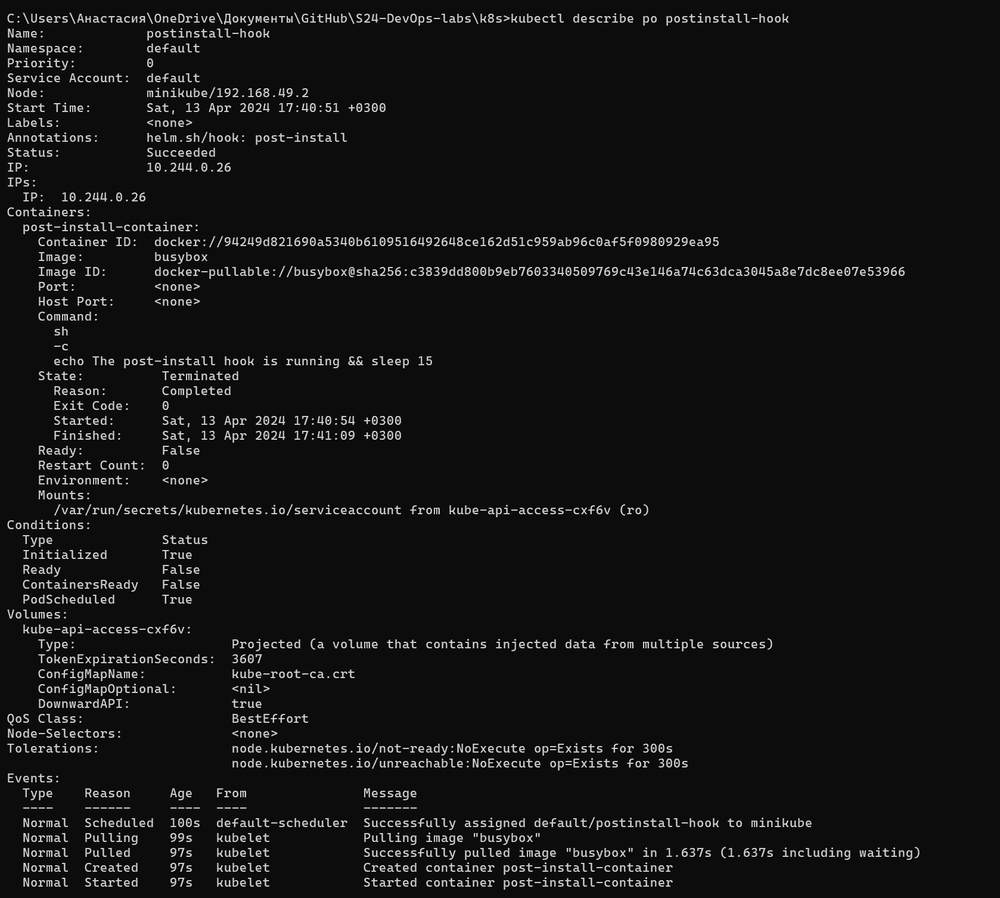
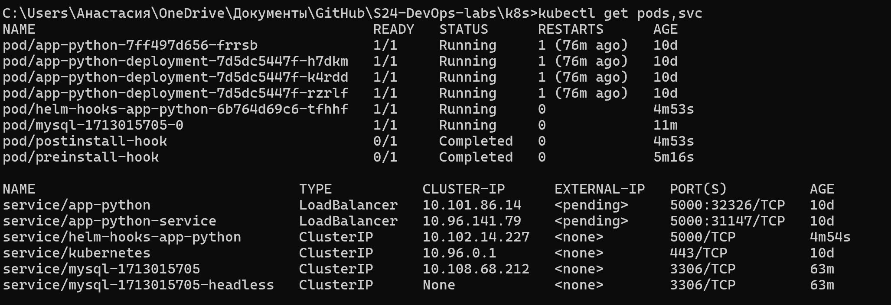

# Lab 14: Kubernetes Monitoring and Init Containers

## components description

1. **Grafana**: Visulizing tool for monitoring data through the application.

2. **Prometheus Operator**: Tool for simplifing the process of launching prometheus on kubernetes cluster.

3. **kube-state-metrics**: For observing the kubernetes API server and generates metrics about prometheus.

4. **Prometheus node-exporter**: Collects hardware and operating system metrics and data for promethrus.

5. **Alertmanager**: Routes and handles errors, directs them to the specified channel.

6. **Prometheus**: Handels and stores time-series data. Usually monitors kubernetes with alerts.

7. **Prometheus blackbox-exporter**: Examine endpoints or its availability via (HTTP, TCP, ..)

8. **Prometheus Adapter for Kubernetes Metrics APIs**: Collect metric from kubernetes and provides them to Prometheus.


## Commands output

```bash
ahmad@ahmad:~/Desktop/devops/k8s$ kubectl get po,sts,svc,pvc,cm
NAME                                                            READY   STATUS      RESTARTS   AGE
pod/alertmanager-kube-prometheus-stack-alertmanager-0           2/2     Running     0          3m55s
pod/app-python-web-app-0                                        1/1     Running     0          49s
pod/app-python-web-app-1                                        1/1     Running     0          49s
pod/kube-prometheus-stack-grafana-7664d8545c-l5dcq              3/3     Running     0          13m
pod/kube-prometheus-stack-kube-state-metrics-5c6549bfd5-vhk4r   1/1     Running     0          13m
pod/kube-prometheus-stack-operator-76bf64f57d-wb6zr             1/1     Running     0          13m
pod/kube-prometheus-stack-prometheus-node-exporter-m7n7q        1/1     Running     0          13m
pod/postinstall-hook                                            0/1     Completed   0          49s
pod/preinstall-hook                                             0/1     Completed   0          78s
pod/prometheus-kube-prometheus-stack-prometheus-0               2/2     Running     0          3m52s

NAME                                                               READY   AGE
statefulset.apps/alertmanager-kube-prometheus-stack-alertmanager   1/1     13m
statefulset.apps/app-python-web-app                                2/2     49s
statefulset.apps/prometheus-kube-prometheus-stack-prometheus       1/1     13m

NAME                                                     TYPE           CLUSTER-IP       EXTERNAL-IP   PORT(S)                      AGE
service/alertmanager-operated                            ClusterIP      None             <none>        9093/TCP,9094/TCP,9094/UDP   19m
service/app-python-web-app                               LoadBalancer   10.111.217.198   <pending>     5000:30414/TCP               49s
service/kube-prometheus-stack-alertmanager               ClusterIP      10.107.224.226   <none>        9093/TCP,8080/TCP            13m
service/kube-prometheus-stack-grafana                    ClusterIP      10.104.85.155    <none>        80/TCP                       13m
service/kube-prometheus-stack-kube-state-metrics         ClusterIP      10.98.160.177    <none>        8080/TCP                     13m
service/kube-prometheus-stack-operator                   ClusterIP      10.99.51.13      <none>        443/TCP                      13m
service/kube-prometheus-stack-prometheus                 ClusterIP      10.100.160.162   <none>        9090/TCP,8080/TCP            13m
service/kube-prometheus-stack-prometheus-node-exporter   ClusterIP      10.103.117.172   <none>        9100/TCP                     13m
service/kubernetes                                       ClusterIP      10.96.0.1        <none>        443/TCP                      6d3h
service/prometheus-operated                              ClusterIP      None             <none>        9090/TCP                     19m

NAME                                                       STATUS   VOLUME                                     CAPACITY   ACCESS MODES   STORAGECLASS   AGE
persistentvolumeclaim/ahmadmetadata-app-python-web-app-0   Bound    pvc-e2e7f69a-71fa-484c-9f10-1abe9cf23597   1Gi        RWO            standard       49s
persistentvolumeclaim/ahmadmetadata-app-python-web-app-1   Bound    pvc-aa3dfa1e-5c08-4c7e-b273-f1f25786eea8   1Gi        RWO            standard       49s

NAME                                                                DATA   AGE
configmap/config                                                    1      49s
configmap/kube-prometheus-stack-alertmanager-overview               1      13m
configmap/kube-prometheus-stack-apiserver                           1      13m
configmap/kube-prometheus-stack-cluster-total                       1      13m
configmap/kube-prometheus-stack-controller-manager                  1      13m
configmap/kube-prometheus-stack-etcd                                1      13m
configmap/kube-prometheus-stack-grafana                             1      13m
configmap/kube-prometheus-stack-grafana-config-dashboards           1      13m
configmap/kube-prometheus-stack-grafana-datasource                  1      13m
configmap/kube-prometheus-stack-grafana-overview                    1      13m
configmap/kube-prometheus-stack-k8s-coredns                         1      13m
configmap/kube-prometheus-stack-k8s-resources-cluster               1      13m
configmap/kube-prometheus-stack-k8s-resources-multicluster          1      13m
configmap/kube-prometheus-stack-k8s-resources-namespace             1      13m
configmap/kube-prometheus-stack-k8s-resources-node                  1      13m
configmap/kube-prometheus-stack-k8s-resources-pod                   1      13m
configmap/kube-prometheus-stack-k8s-resources-workload              1      13m
configmap/kube-prometheus-stack-k8s-resources-workloads-namespace   1      13m
configmap/kube-prometheus-stack-kubelet                             1      13m
configmap/kube-prometheus-stack-namespace-by-pod                    1      13m
configmap/kube-prometheus-stack-namespace-by-workload               1      13m
configmap/kube-prometheus-stack-node-cluster-rsrc-use               1      13m
configmap/kube-prometheus-stack-node-rsrc-use                       1      13m
configmap/kube-prometheus-stack-nodes                               1      13m
configmap/kube-prometheus-stack-nodes-darwin                        1      13m
configmap/kube-prometheus-stack-persistentvolumesusage              1      13m
configmap/kube-prometheus-stack-pod-total                           1      13m
configmap/kube-prometheus-stack-prometheus                          1      13m
configmap/kube-prometheus-stack-proxy                               1      13m
configmap/kube-prometheus-stack-scheduler                           1      13m
configmap/kube-prometheus-stack-workload-total                      1      13m
configmap/kube-root-ca.crt                                          1      35d
configmap/prometheus-kube-prometheus-stack-prometheus-rulefiles-0   35     13m
```

## Explaination for the output


The following part contains the list of running pods in the cluster

```bash
NAME                                                            READY   STATUS      RESTARTS   AGE
pod/alertmanager-kube-prometheus-stack-alertmanager-0           2/2     Running     0          3m55s
pod/app-python-web-app-0                                        1/1     Running     0          49s
pod/app-python-web-app-1                                        1/1     Running     0          49s
pod/kube-prometheus-stack-grafana-7664d8545c-l5dcq              3/3     Running     0          13m
pod/kube-prometheus-stack-kube-state-metrics-5c6549bfd5-vhk4r   1/1     Running     0          13m
pod/kube-prometheus-stack-operator-76bf64f57d-wb6zr             1/1     Running     0          13m
pod/kube-prometheus-stack-prometheus-node-exporter-m7n7q        1/1     Running     0          13m
pod/postinstall-hook                                            0/1     Completed   0          49s
pod/preinstall-hook                                             0/1     Completed   0          78s
pod/prometheus-kube-prometheus-stack-prometheus-0               2/2     Running     0          3m52s
```

This part is for statefulset apps in the cluster

```bash
NAME                                                               READY   AGE
statefulset.apps/alertmanager-kube-prometheus-stack-alertmanager   1/1     13m
statefulset.apps/app-python-web-app                                2/2     49s
statefulset.apps/prometheus-kube-prometheus-stack-prometheus       1/1     13m
```

This is the services with their corresponding IP addresses

```bash
NAME                                                     TYPE           CLUSTER-IP       EXTERNAL-IP   PORT(S)                      AGE
service/alertmanager-operated                            ClusterIP      None             <none>        9093/TCP,9094/TCP,9094/UDP   19m
service/app-python-web-app                               LoadBalancer   10.111.217.198   <pending>     5000:30414/TCP               49s
service/kube-prometheus-stack-alertmanager               ClusterIP      10.107.224.226   <none>        9093/TCP,8080/TCP            13m
service/kube-prometheus-stack-grafana                    ClusterIP      10.104.85.155    <none>        80/TCP                       13m
service/kube-prometheus-stack-kube-state-metrics         ClusterIP      10.98.160.177    <none>        8080/TCP                     13m
service/kube-prometheus-stack-operator                   ClusterIP      10.99.51.13      <none>        443/TCP                      13m
service/kube-prometheus-stack-prometheus                 ClusterIP      10.100.160.162   <none>        9090/TCP,8080/TCP            13m
service/kube-prometheus-stack-prometheus-node-exporter   ClusterIP      10.103.117.172   <none>        9100/TCP                     13m
service/kubernetes                                       ClusterIP      10.96.0.1        <none>        443/TCP                      6d3h
service/prometheus-operated                              ClusterIP      None             <none>        9090/TCP                     19m
```

This is the list of persistent volumes with their capacity

```bash
NAME                                                       STATUS   VOLUME                                     CAPACITY   ACCESS MODES   STORAGECLASS   AGE
persistentvolumeclaim/ahmadmetadata-app-python-web-app-0   Bound    pvc-e2e7f69a-71fa-484c-9f10-1abe9cf23597   1Gi        RWO            standard       49s
persistentvolumeclaim/ahmadmetadata-app-python-web-app-1   Bound    pvc-aa3dfa1e-5c08-4c7e-b273-f1f25786eea8   1Gi        RWO            standard       49s
```

all configs maps in the cluster

```bash
NAME                                                                DATA   AGE
configmap/config                                                    1      49s
configmap/kube-prometheus-stack-alertmanager-overview               1      13m
configmap/kube-prometheus-stack-apiserver                           1      13m
configmap/kube-prometheus-stack-cluster-total                       1      13m
configmap/kube-prometheus-stack-controller-manager                  1      13m
configmap/kube-prometheus-stack-etcd                                1      13m
configmap/kube-prometheus-stack-grafana                             1      13m
configmap/kube-prometheus-stack-grafana-config-dashboards           1      13m
configmap/kube-prometheus-stack-grafana-datasource                  1      13m
configmap/kube-prometheus-stack-grafana-overview                    1      13m
configmap/kube-prometheus-stack-k8s-coredns                         1      13m
configmap/kube-prometheus-stack-k8s-resources-cluster               1      13m
configmap/kube-prometheus-stack-k8s-resources-multicluster          1      13m
configmap/kube-prometheus-stack-k8s-resources-namespace             1      13m
configmap/kube-prometheus-stack-k8s-resources-node                  1      13m
configmap/kube-prometheus-stack-k8s-resources-pod                   1      13m
configmap/kube-prometheus-stack-k8s-resources-workload              1      13m
configmap/kube-prometheus-stack-k8s-resources-workloads-namespace   1      13m
configmap/kube-prometheus-stack-kubelet                             1      13m
configmap/kube-prometheus-stack-namespace-by-pod                    1      13m
configmap/kube-prometheus-stack-namespace-by-workload               1      13m
configmap/kube-prometheus-stack-node-cluster-rsrc-use               1      13m
configmap/kube-prometheus-stack-node-rsrc-use                       1      13m
configmap/kube-prometheus-stack-nodes                               1      13m
configmap/kube-prometheus-stack-nodes-darwin                        1      13m
configmap/kube-prometheus-stack-persistentvolumesusage              1      13m
configmap/kube-prometheus-stack-pod-total                           1      13m
configmap/kube-prometheus-stack-prometheus                          1      13m
configmap/kube-prometheus-stack-proxy                               1      13m
configmap/kube-prometheus-stack-scheduler                           1      13m
configmap/kube-prometheus-stack-workload-total                      1      13m
configmap/kube-root-ca.crt                                          1      35d
configmap/prometheus-kube-prometheus-stack-prometheus-rulefiles-0   35     13m
```


# Dashboards analysis

- Check CPU and Memory consumption of your StatefulSet.

    

- Identify Pods with higher and lower CPU usage in the default namespace.4

    Higher: alertmanager-kube-prometheus-stack-alertmanager-0
    Lower: quota - limits

    

- Monitor node memory usage in percentage and megabytes.

    

- Count the number of pods and containers managed by the Kubelet service.

    Pods: 9
    Containers: 56
    
    

- Evaluate network usage of Pods in the default namespace.

    

- Determine the number of active alerts

    8 alerts

    

## Init Containers

using command `kubectl exec pod/demo-0 -- cat /test.html`

