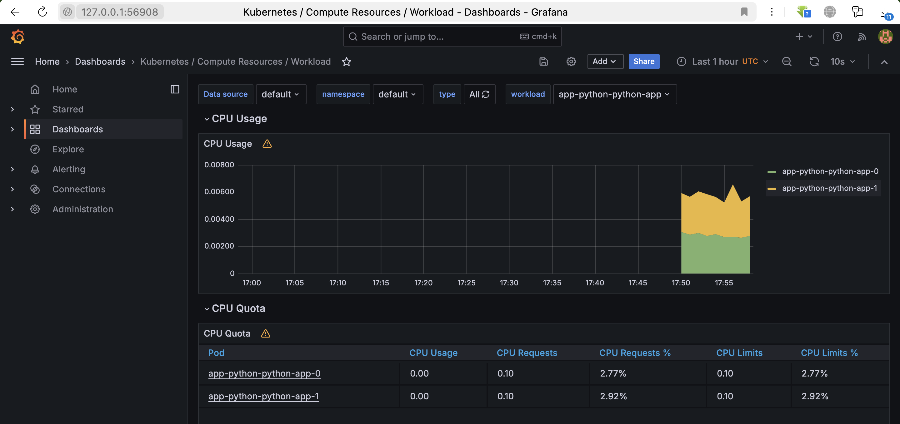
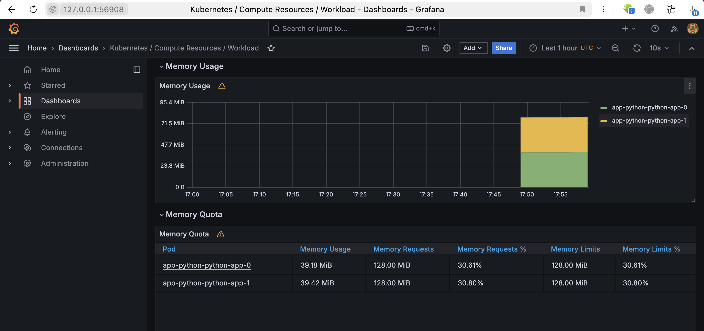
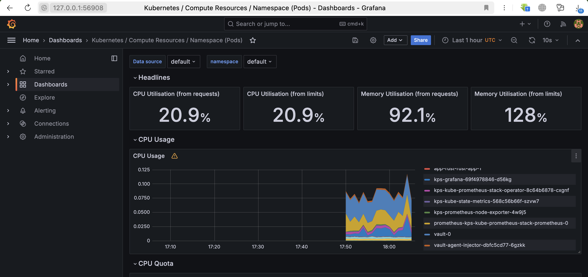
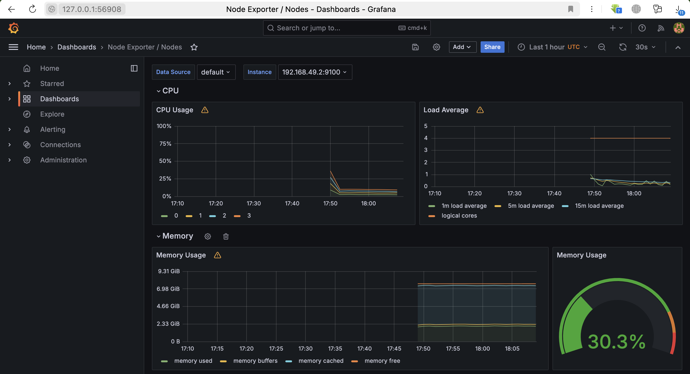
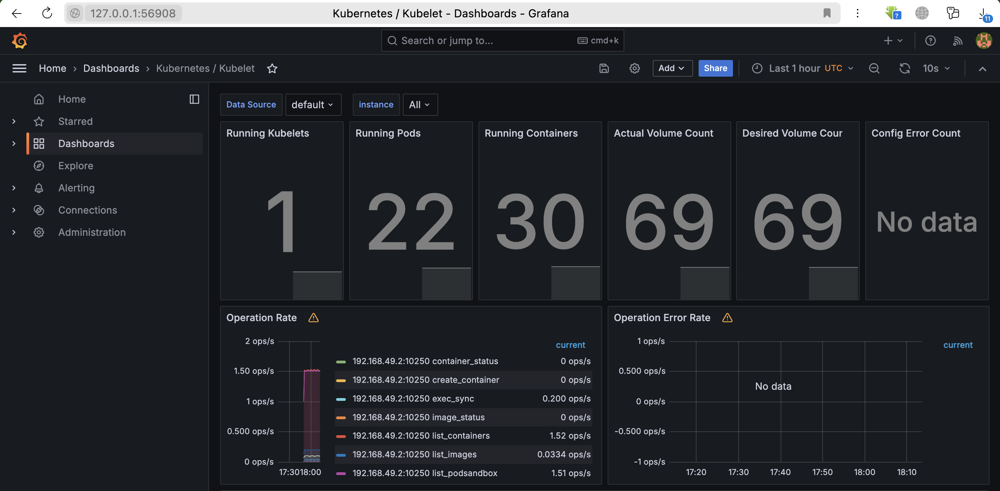
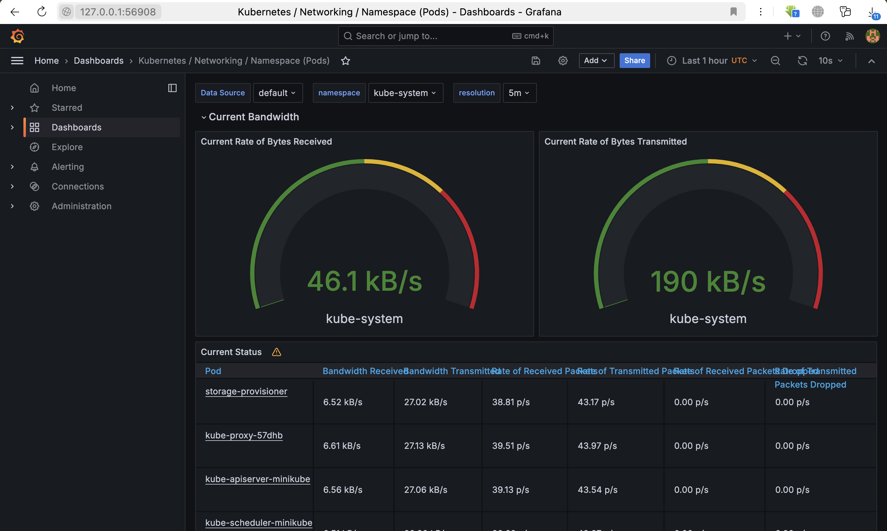
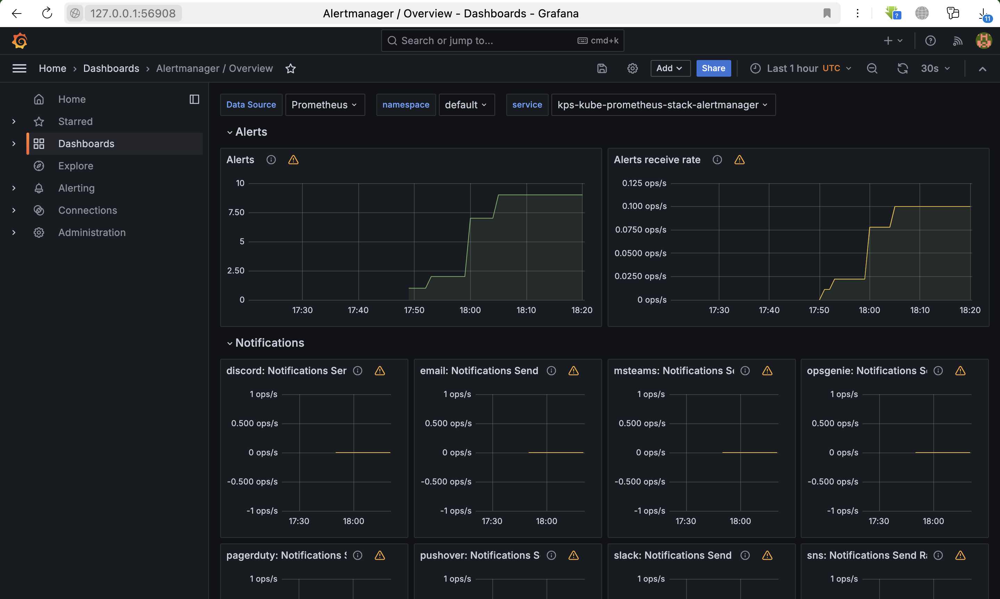
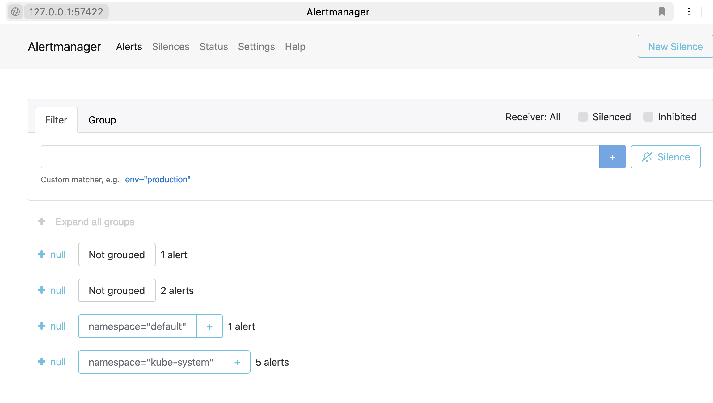

# Kubernetes Monitoring and Init Containers

## Components

- **Prometheus** handles app metrics; it used for event monitoring and alerting
- Prometheus **Alertmanager** manages and process alerts, and then directs them to communivation channels (reciever integrations)
- **Grafana** is app's data interactive visualizer via dashboards (also support customization)

- **Prometheus Operator** provides simple-to-use deployment of Prometheus stack to a k8s cluster
- Prometheus **node Exporter** collector of hardware+OS metrics
- Prometheus **Blackbox Exporter** probes endpoints over HTTP(S), DNS, TCP and ICMP to check service availability
- Prometheus **adapter for Kubernetes Metrics APIs** gathers metrics from k8s and provides them to Prometheus

- **kube-state-metrics** is a service to monitors the k8s API server and produces metrics about object states (health of the various components inside) for Prometheus

### Install Helm Charts
- `helm repo add prometheus-community https://prometheus-community.github.io/helm-charts` + `helm repo update`
- `helm install kps  prometheus-community/kube-prometheus-stack`
- `kubectl get po,sts,svc,pvc,cm`
  - list of pods currently running in cluster
    ```
    NAME                                                        READY   STATUS    RESTARTS        AGE
    pod/alertmanager-kps-kube-prometheus-stack-alertmanager-0   2/2     Running   0               12m
    pod/app-python-python-app-0                                 1/1     Running   2 (15m ago)     6d21h
    pod/app-python-python-app-1                                 1/1     Running   2 (15m ago)     6d21h
    pod/app-rust-rust-app-0                                     1/1     Running   1 (6d19h ago)   6d19h
    pod/app-rust-rust-app-1                                     1/1     Running   1 (6d19h ago)   6d19h
    pod/kps-grafana-5f85c9c989-bt78c                            3/3     Running   0               12m
    pod/kps-kube-prometheus-stack-operator-59ff8bc784-78kqv     1/1     Running   0               12m
    pod/kps-kube-state-metrics-6844d6bf6-wz4jx                  1/1     Running   0               12m
    pod/kps-prometheus-node-exporter-79sck                      1/1     Running   0               12m
    pod/prometheus-kps-kube-prometheus-stack-prometheus-0       2/2     Running   0               12m
    pod/vault-0                                                 1/1     Running   8 (6d19h ago)   22d
    pod/vault-agent-injector-dbfc5cd77-6gzkk                    1/1     Running   8 (6d19h ago)   22d
    ```
  - list of stateful sets with status+age
    ```
    NAME                                                                   READY   AGE
    statefulset.apps/alertmanager-kps-kube-prometheus-stack-alertmanager   1/1     12m
    statefulset.apps/app-python-python-app                                 2/2     6d21h
    statefulset.apps/app-rust-rust-app                                     2/2     6d19h
    statefulset.apps/prometheus-kps-kube-prometheus-stack-prometheus       1/1     12m
    statefulset.apps/vault                                                 1/1     22d
    ```
  - list of services with their cluster IPs and ports
    ```
    NAME                                             TYPE        CLUSTER-IP       EXTERNAL-IP   PORT(S)                      AGE
    service/alertmanager-operated                    ClusterIP   None             <none>        9093/TCP,9094/TCP,9094/UDP   12m
    service/app-python-python-app                    NodePort    10.111.113.249   <none>        8000:32296/TCP               6d21h
    service/app-rust-rust-app                        NodePort    10.99.173.235    <none>        8000:32029/TCP               6d19h
    service/kps-grafana                              ClusterIP   10.110.122.121   <none>        80/TCP                       12m
    service/kps-kube-prometheus-stack-alertmanager   ClusterIP   10.101.116.210   <none>        9093/TCP,8080/TCP            12m
    service/kps-kube-prometheus-stack-operator       ClusterIP   10.107.74.110    <none>        443/TCP                      12m
    service/kps-kube-prometheus-stack-prometheus     ClusterIP   10.105.82.254    <none>        9090/TCP,8080/TCP            12m
    service/kps-kube-state-metrics                   ClusterIP   10.110.11.127    <none>        8080/TCP                     12m
    service/kps-prometheus-node-exporter             ClusterIP   10.102.38.6      <none>        9100/TCP                     12m
    service/kubernetes                               ClusterIP   10.96.0.1        <none>        443/TCP                      28d
    service/prometheus-operated                      ClusterIP   None             <none>        9090/TCP                     12m
    service/vault                                    ClusterIP   10.99.225.149    <none>        8200/TCP,8201/TCP            22d
    service/vault-agent-injector-svc                 ClusterIP   10.106.108.95    <none>        443/TCP                      22d
    service/vault-internal                           ClusterIP   None             <none>        8200/TCP,8201/TCP            22d
    ```
  - list of persistent volume claims with capacity and storage class
    ```
    NAME                                                                 STATUS   VOLUME                                     CAPACITY   ACCESS MODES   STORAGECLASS   AGE
    persistentvolumeclaim/python-access-metric-app-python-python-app-0   Bound    pvc-1b3fc7c1-cb26-42fc-aa64-5f0ceb3baf9a   5Mi        RWO            standard       7d
    persistentvolumeclaim/python-access-metric-app-python-python-app-1   Bound    pvc-267ff7de-67ea-43e0-a93c-eabe5191dad2   5Mi        RWO            standard       6d21h
    persistentvolumeclaim/rust-access-metric-app-rust-rust-app-0         Bound    pvc-d0009f14-e9d8-4e72-b14b-c475389c0129   5Mi        RWO            standard       6d19h
    persistentvolumeclaim/rust-access-metric-app-rust-rust-app-1         Bound    pvc-1d2a4eb0-6b61-447b-aae5-9ef8fcfd61f2   5Mi        RWO            standard       6d19h
    ```
  - list of config maps with their data and age. Some of them are from the Prometheus stack
    ```
    NAME                                                                    DATA   AGE
    configmap/configmap                                                     2      6d21h
    configmap/kps-grafana                                                   1      12m
    configmap/kps-grafana-config-dashboards                                 1      12m
    configmap/kps-kube-prometheus-stack-alertmanager-overview               1      12m
    configmap/kps-kube-prometheus-stack-apiserver                           1      12m
    configmap/kps-kube-prometheus-stack-cluster-total                       1      12m
    configmap/kps-kube-prometheus-stack-controller-manager                  1      12m
    configmap/kps-kube-prometheus-stack-etcd                                1      12m
    configmap/kps-kube-prometheus-stack-grafana-datasource                  1      12m
    configmap/kps-kube-prometheus-stack-grafana-overview                    1      12m
    configmap/kps-kube-prometheus-stack-k8s-coredns                         1      12m
    configmap/kps-kube-prometheus-stack-k8s-resources-cluster               1      12m
    configmap/kps-kube-prometheus-stack-k8s-resources-multicluster          1      12m
    configmap/kps-kube-prometheus-stack-k8s-resources-namespace             1      12m
    configmap/kps-kube-prometheus-stack-k8s-resources-node                  1      12m
    configmap/kps-kube-prometheus-stack-k8s-resources-pod                   1      12m
    configmap/kps-kube-prometheus-stack-k8s-resources-workload              1      12m
    configmap/kps-kube-prometheus-stack-k8s-resources-workloads-namespace   1      12m
    configmap/kps-kube-prometheus-stack-kubelet                             1      12m
    configmap/kps-kube-prometheus-stack-namespace-by-pod                    1      12m
    configmap/kps-kube-prometheus-stack-namespace-by-workload               1      12m
    configmap/kps-kube-prometheus-stack-node-cluster-rsrc-use               1      12m
    configmap/kps-kube-prometheus-stack-node-rsrc-use                       1      12m
    configmap/kps-kube-prometheus-stack-nodes                               1      12m
    configmap/kps-kube-prometheus-stack-nodes-darwin                        1      12m
    configmap/kps-kube-prometheus-stack-persistentvolumesusage              1      12m
    configmap/kps-kube-prometheus-stack-pod-total                           1      12m
    configmap/kps-kube-prometheus-stack-prometheus                          1      12m
    configmap/kps-kube-prometheus-stack-proxy                               1      12m
    configmap/kps-kube-prometheus-stack-scheduler                           1      12m
    configmap/kps-kube-prometheus-stack-workload-total                      1      12m
    configmap/kube-root-ca.crt                                              1      28d
    configmap/prometheus-kps-kube-prometheus-stack-prometheus-rulefiles-0   35     12m
    ```

- `minikube service kps-grafana` (creds: `admin:prom-operator`)
    - CPU + Memory
    
    
    - Pods with higher (vaults + prometheus) and lower (alertmanager) CPU usage in the default namespace
    
    - memory usage in percentage and megabytes
    
    - number of pods and containers managed by the Kubelet service
    
    - network usage of Pods in the default namespace
    
    - alerts
    
    

## Init Containers + bonus task (Init Containers Queue)
- `kubectl exec app-python-python-app-0 -- cat /work-dir/index.html `
```
Defaulted container "python-app" out of: python-app, install-0 (init), ping-1 (init), pong-2 (init)
<html><head></head><body><header>
<title>http://info.cern.ch</title>
</header>

<h1>http://info.cern.ch - home of the first website</h1>
<p>From here you can:</p>
<ul>
<li><a href="http://info.cern.ch/hypertext/WWW/TheProject.html">Browse the first website</a></li>
<li><a href="http://line-mode.cern.ch/www/hypertext/WWW/TheProject.html">Browse the first website using the line-mode browser simulator</a></li>
<li><a href="http://home.web.cern.ch/topics/birth-web">Learn about the birth of the web</a></li>
<li><a href="http://home.web.cern.ch/about">Learn about CERN, the physics laboratory where the web was born</a></li>
</ul>
</body></html>
```

### App metrics
