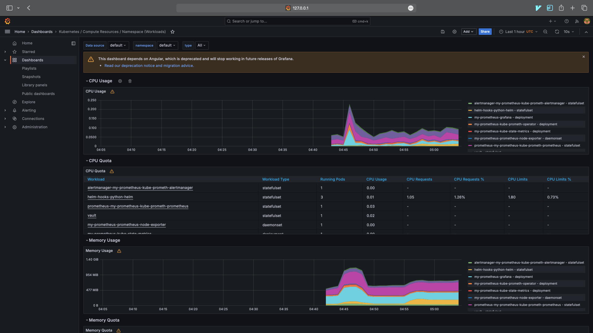
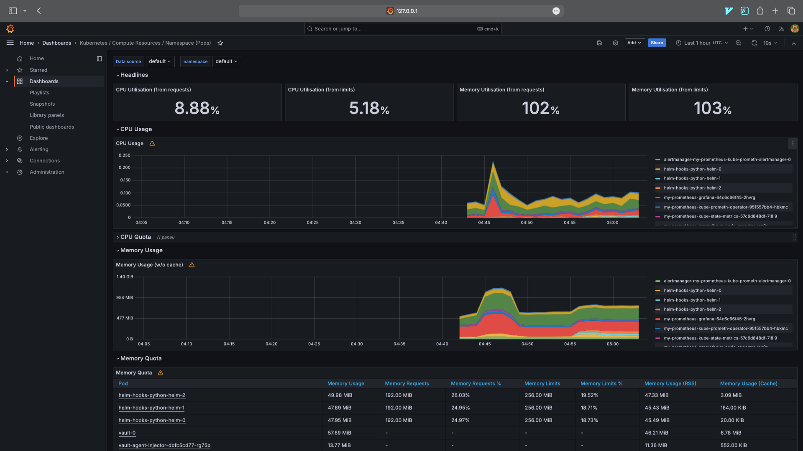
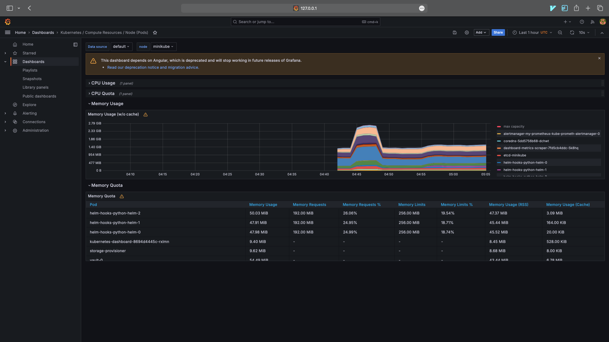
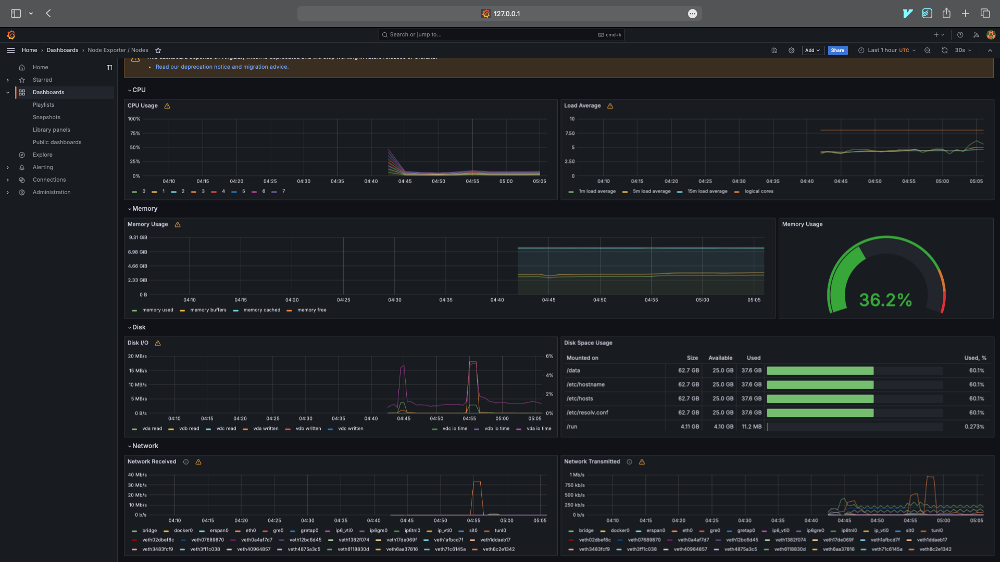
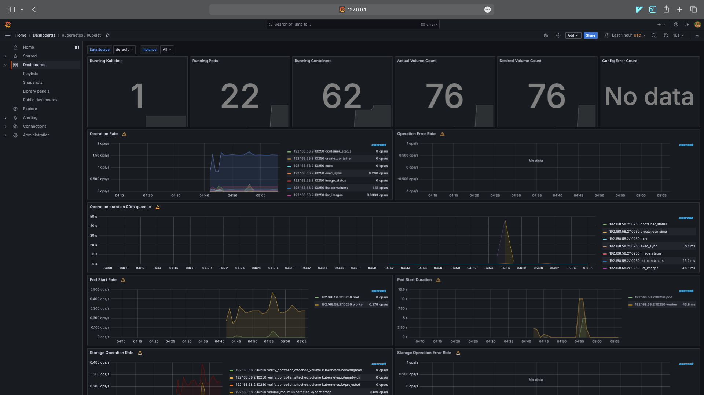
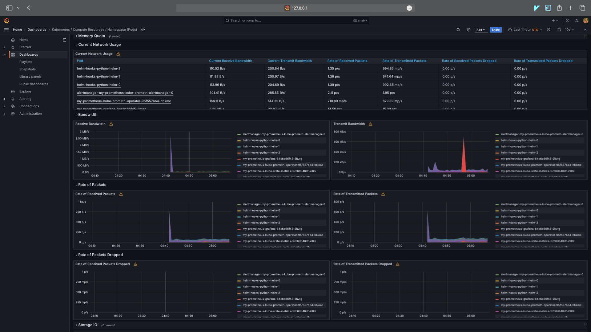
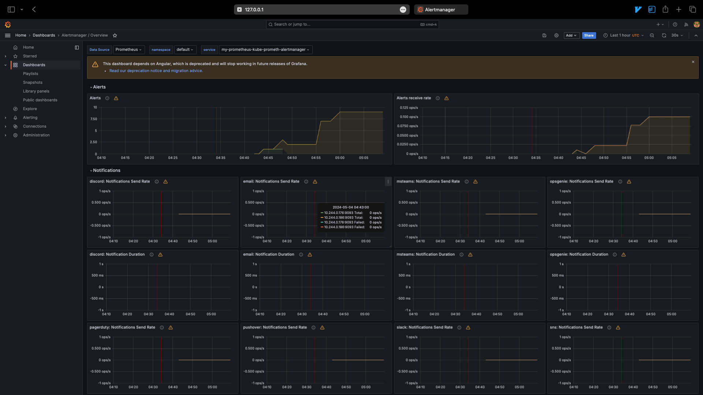
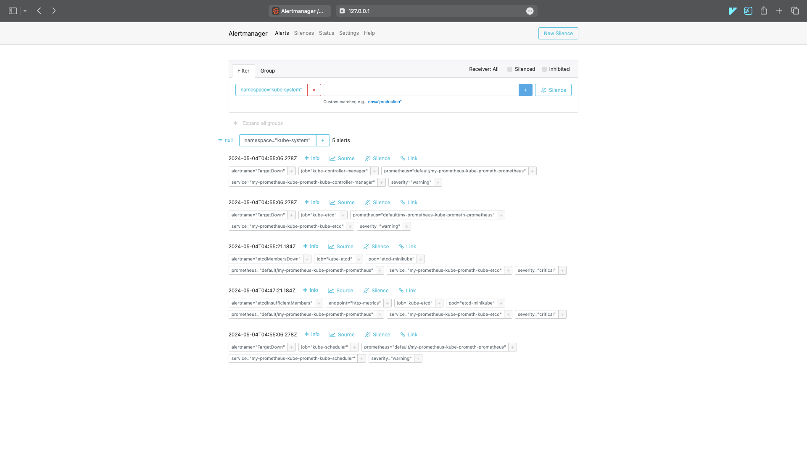

# Task 1: Kubernetes Cluster Monitoring with Prometheus

### Components of the Kube Prometheus Stack

- Prometheus Operator: This component streamlines the setup and ongoing maintenance of Prometheus configurations within a Kubernetes environment.

- Highly Available Prometheus: This setup ensures that metrics from various sources throughout the Kubernetes cluster are reliably gathered and stored, offering redundancy and increased uptime.

- Highly Available Alertmanager: This manages alert generation and notifications based on conditions detected by Prometheus, ensuring robust fault detection and alerting capabilities.

- Prometheus Node-Exporter: This tool is utilized to gather critical hardware and operating system metrics across the nodes of a Kubernetes cluster.

- Prometheus Blackbox-Exporter: It is responsible for performing tests on external services or endpoints, assessing their uptime and responsiveness, to ensure external services meet expected standards.

- Prometheus Adapter for Kubernetes Metrics APIs: This adapter fetches resource usage data from Kubernetes, making it available through Kubernetes custom metrics APIs, thereby facilitating scaling based on these metrics.

- Kube-State-Metrics: This generates detailed metrics on the status of various Kubernetes objects, which helps in comprehensively understanding the state and health of the cluster.

- Grafana: A visualization tool that brings metrics data to life through customizable dashboards, enabling detailed analysis and monitoring of the Kubernetes environment.

```text
❯ kubectl get po,sts,svc,pvc,cm
NAME                                                         READY   STATUS    RESTARTS      AGE
pod/alertmanager-my-prometheus-kube-prometh-alertmanager-0   2/2     Running   2 (27m ago)   30m
pod/helm-hooks-python-helm-0                                 2/2     Running   0             16m
pod/helm-hooks-python-helm-1                                 2/2     Running   0             15m
pod/helm-hooks-python-helm-2                                 2/2     Running   0             15m
pod/my-prometheus-grafana-64c6c66f45-2hvrg                   3/3     Running   3 (27m ago)   31m
pod/my-prometheus-kube-prometh-operator-95f557bb4-hbkmc      1/1     Running   1 (27m ago)   31m
pod/my-prometheus-kube-state-metrics-57c6d848df-7l8l9        1/1     Running   1 (27m ago)   31m
pod/my-prometheus-prometheus-node-exporter-rcc9r             1/1     Running   1 (27m ago)   31m
pod/prometheus-my-prometheus-kube-prometh-prometheus-0       2/2     Running   2 (27m ago)   30m
pod/vault-0                                                  1/1     Running   2 (27m ago)   5d22h
pod/vault-agent-injector-dbfc5cd77-rg75p                     1/1     Running   2 (27m ago)   5d22h

NAME                                                                    READY   AGE
statefulset.apps/alertmanager-my-prometheus-kube-prometh-alertmanager   1/1     30m
statefulset.apps/helm-hooks-python-helm                                 3/3     16m
statefulset.apps/prometheus-my-prometheus-kube-prometh-prometheus       1/1     30m
statefulset.apps/vault                                                  1/1     5d22h

NAME                                              TYPE        CLUSTER-IP       EXTERNAL-IP   PORT(S)                      AGE
service/alertmanager-operated                     ClusterIP   None             <none>        9093/TCP,9094/TCP,9094/UDP   30m
service/helm-hooks-python-helm                    NodePort    10.106.19.43     <none>        8080:30289/TCP               16m
service/kubernetes                                ClusterIP   10.96.0.1        <none>        443/TCP                      33d
service/my-prometheus-grafana                     ClusterIP   10.96.245.108    <none>        80/TCP                       31m
service/my-prometheus-kube-prometh-alertmanager   ClusterIP   10.99.28.125     <none>        9093/TCP,8080/TCP            31m
service/my-prometheus-kube-prometh-operator       ClusterIP   10.110.208.119   <none>        443/TCP                      31m
service/my-prometheus-kube-prometh-prometheus     ClusterIP   10.96.250.141    <none>        9090/TCP,8080/TCP            31m
service/my-prometheus-kube-state-metrics          ClusterIP   10.104.116.19    <none>        8080/TCP                     31m
service/my-prometheus-prometheus-node-exporter    ClusterIP   10.107.225.191   <none>        9100/TCP                     31m
service/prometheus-operated                       ClusterIP   None             <none>        9090/TCP                     30m
service/vault                                     ClusterIP   10.109.239.224   <none>        8200/TCP,8201/TCP            5d22h
service/vault-agent-injector-svc                  ClusterIP   10.108.162.209   <none>        443/TCP                      5d22h
service/vault-internal                            ClusterIP   None             <none>        8200/TCP,8201/TCP            5d22h

NAME                                                  STATUS   VOLUME                                     CAPACITY   ACCESS MODES   STORAGECLASS   AGE
persistentvolumeclaim/data-helm-hooks-python-helm-0   Bound    pvc-33d8a01a-983f-4e1f-88b2-eef240442948   1Gi        RWO            standard       5d13h
persistentvolumeclaim/data-helm-hooks-python-helm-1   Bound    pvc-a91ae8d2-3336-4b48-8356-bcf1438c37e7   1Gi        RWO            standard       5d13h
persistentvolumeclaim/data-helm-hooks-python-helm-2   Bound    pvc-47c9c1a9-b00d-4bf5-b9c1-6d46cacca9ab   1Gi        RWO            standard       5d13h

NAME                                                                     DATA   AGE
configmap/config                                                         1      16m
configmap/kube-root-ca.crt                                               1      33d
configmap/my-prometheus-grafana                                          1      31m
configmap/my-prometheus-grafana-config-dashboards                        1      31m
configmap/my-prometheus-kube-prometh-alertmanager-overview               1      31m
configmap/my-prometheus-kube-prometh-apiserver                           1      31m
configmap/my-prometheus-kube-prometh-cluster-total                       1      31m
configmap/my-prometheus-kube-prometh-controller-manager                  1      31m
configmap/my-prometheus-kube-prometh-etcd                                1      31m
configmap/my-prometheus-kube-prometh-grafana-datasource                  1      31m
configmap/my-prometheus-kube-prometh-grafana-overview                    1      31m
configmap/my-prometheus-kube-prometh-k8s-coredns                         1      31m
configmap/my-prometheus-kube-prometh-k8s-resources-cluster               1      31m
configmap/my-prometheus-kube-prometh-k8s-resources-multicluster          1      31m
configmap/my-prometheus-kube-prometh-k8s-resources-namespace             1      31m
configmap/my-prometheus-kube-prometh-k8s-resources-node                  1      31m
configmap/my-prometheus-kube-prometh-k8s-resources-pod                   1      31m
configmap/my-prometheus-kube-prometh-k8s-resources-workload              1      31m
configmap/my-prometheus-kube-prometh-k8s-resources-workloads-namespace   1      31m
configmap/my-prometheus-kube-prometh-kubelet                             1      31m
configmap/my-prometheus-kube-prometh-namespace-by-pod                    1      31m
configmap/my-prometheus-kube-prometh-namespace-by-workload               1      31m
configmap/my-prometheus-kube-prometh-node-cluster-rsrc-use               1      31m
configmap/my-prometheus-kube-prometh-node-rsrc-use                       1      31m
configmap/my-prometheus-kube-prometh-nodes                               1      31m
configmap/my-prometheus-kube-prometh-nodes-darwin                        1      31m
configmap/my-prometheus-kube-prometh-persistentvolumesusage              1      31m
configmap/my-prometheus-kube-prometh-pod-total                           1      31m
configmap/my-prometheus-kube-prometh-prometheus                          1      31m
configmap/my-prometheus-kube-prometh-proxy                               1      31m
configmap/my-prometheus-kube-prometh-scheduler                           1      31m
configmap/my-prometheus-kube-prometh-workload-total                      1      31m
configmap/prometheus-my-prometheus-kube-prometh-prometheus-rulefiles-0   35     30m
```

### Utilizing Grafana dashboards

#### CPU and Mem Usage



#### Pods CPU Usage



#### Node Memory Usage





#### Pods managed by Kubelet



#### Network usage



#### Active Alerts





## Task 2: Init Containers

```text
❯ kubectl exec helm-hooks-python-helm-0  -- cat /demo/example.html
Defaulted container "python-helm" out of: python-helm, vault-agent, download-file (init), modify-file (init), uppercase-file (init), vault-agent-init (init)
<!doctype html>
<html>
<head>
    <title>Example Domain</title>

    <meta charset="utf-8" />
    <meta http-equiv="Content-type" content="text/html; charset=utf-8" />
    <meta name="viewport" content="width=device-width, initial-scale=1" />
    <style type="text/css">
    body {
        background-color: #f0f0f2;
        margin: 0;
        padding: 0;
        font-family: -apple-system, system-ui, BlinkMacSystemFont, "Segoe UI", "Open Sans", "Helvetica Neue", Helvetica, Arial, sans-serif;
        
    }
    div {
        width: 600px;
        margin: 5em auto;
        padding: 2em;
        background-color: #fdfdff;
        border-radius: 0.5em;
        box-shadow: 2px 3px 7px 2px rgba(0,0,0,0.02);
    }
    a:link, a:visited {
        color: #38488f;
        text-decoration: none;
    }
    @media (max-width: 700px) {
        div {
            margin: 0 auto;
            width: auto;
        }
    }
    </style>    
</head>

<body>
<div>
    <h1>Example Domain</h1>
    <p>This domain is for use in illustrative examples in documents. You may use this
    domain in literature without prior coordination or asking for permission.</p>
    <p><a href="https://www.iana.org/domains/example">More information...</a></p>
</div>
</body>
</html>
```

## Bonus Task

```text
❯ kubectl exec helm-hooks-python-helm-0  -- cat /demo/example.html
Defaulted container "python-helm" out of: python-helm, vault-agent, download-file (init), modify-file (init), uppercase-file (init), vault-agent-init (init)
<!doctype html>
<html>
<head>
    <title>Example Domain</title>

    <meta charset="utf-8" />
    <meta http-equiv="Content-type" content="text/html; charset=utf-8" />
    <meta name="viewport" content="width=device-width, initial-scale=1" />
    <style type="text/css">
    body {
        background-color: #f0f0f2;
        margin: 0;
        padding: 0;
        font-family: -apple-system, system-ui, BlinkMacSystemFont, "Segoe UI", "Open Sans", "Helvetica Neue", Helvetica, Arial, sans-serif;
        
    }
    div {
        width: 600px;
        margin: 5em auto;
        padding: 2em;
        background-color: #fdfdff;
        border-radius: 0.5em;
        box-shadow: 2px 3px 7px 2px rgba(0,0,0,0.02);
    }
    a:link, a:visited {
        color: #38488f;
        text-decoration: none;
    }
    @media (max-width: 700px) {
        div {
            margin: 0 auto;
            width: auto;
        }
    }
    </style>    
</head>

<body>
<div>
    <h1>Example Domain</h1>
    <p>This domain is for use in illustrative examples in documents. You may use this
    domain in literature without prior coordination or asking for permission.</p>
    <p><a href="https://www.iana.org/domains/example">More information...</a></p>
</div>
</body>
</html>
Adding a new line
❯ kubectl exec helm-hooks-python-helm-0  -- cat /demo/example.html
Defaulted container "python-helm" out of: python-helm, vault-agent, download-file (init), modify-file (init), uppercase-file (init), vault-agent-init (init)
<!doctype html>
<html>
<head>
    <title>Example Domain</title>

    <meta charset="utf-8" />
    <meta http-equiv="Content-type" content="text/html; charset=utf-8" />
    <meta name="viewport" content="width=device-width, initial-scale=1" />
    <style type="text/css">
    body {
        background-color: #f0f0f2;
        margin: 0;
        padding: 0;
        font-family: -apple-system, system-ui, BlinkMacSystemFont, "Segoe UI", "Open Sans", "Helvetica Neue", Helvetica, Arial, sans-serif;
        
    }
    div {
        width: 600px;
        margin: 5em auto;
        padding: 2em;
        background-color: #fdfdff;
        border-radius: 0.5em;
        box-shadow: 2px 3px 7px 2px rgba(0,0,0,0.02);
    }
    a:link, a:visited {
        color: #38488f;
        text-decoration: none;
    }
    @media (max-width: 700px) {
        div {
            margin: 0 auto;
            width: auto;
        }
    }
    </style>    
</head>

<body>
<div>
    <h1>Example Domain</h1>
    <p>This domain is for use in illustrative examples in documents. You may use this
    domain in literature without prior coordination or asking for permission.</p>
    <p><a href="https://www.iana.org/domains/example">More information...</a></p>
</div>
</body>
</html>
Adding a new line
```

```text
❯ kubectl exec helm-hooks-python-helm-0  -- cat /demo/uppercase.html
Defaulted container "python-helm" out of: python-helm, vault-agent, download-file (init), modify-file (init), uppercase-file (init), vault-agent-init (init)
<!DOCTYPE HTML>
<HTML>
<HEAD>
    <TITLE>EXAMPLE DOMAIN</TITLE>

    <META CHARSET="UTF-8" />
    <META HTTP-EQUIV="CONTENT-TYPE" CONTENT="TEXT/HTML; CHARSET=UTF-8" />
    <META NAME="VIEWPORT" CONTENT="WIDTH=DEVICE-WIDTH, INITIAL-SCALE=1" />
    <STYLE TYPE="TEXT/CSS">
    BODY {
        BACKGROUND-COLOR: #F0F0F2;
        MARGIN: 0;
        PADDING: 0;
        FONT-FAMILY: -APPLE-SYSTEM, SYSTEM-UI, BLINKMACSYSTEMFONT, "SEGOE UI", "OPEN SANS", "HELVETICA NEUE", HELVETICA, ARIAL, SANS-SERIF;
        
    }
    DIV {
        WIDTH: 600PX;
        MARGIN: 5EM AUTO;
        PADDING: 2EM;
        BACKGROUND-COLOR: #FDFDFF;
        BORDER-RADIUS: 0.5EM;
        BOX-SHADOW: 2PX 3PX 7PX 2PX RGBA(0,0,0,0.02);
    }
    A:LINK, A:VISITED {
        COLOR: #38488F;
        TEXT-DECORATION: NONE;
    }
    @MEDIA (MAX-WIDTH: 700PX) {
        DIV {
            MARGIN: 0 AUTO;
            WIDTH: AUTO;
        }
    }
    </STYLE>    
</HEAD>

<BODY>
<DIV>
    <H1>EXAMPLE DOMAIN</H1>
    <P>THIS DOMAIN IS FOR USE IN ILLUSTRATIVE EXAMPLES IN DOCUMENTS. YOU MAY USE THIS
    DOMAIN IN LITERATURE WITHOUT PRIOR COORDINATION OR ASKING FOR PERMISSION.</P>
    <P><A HREF="HTTPS://WWW.IANA.ORG/DOMAINS/EXAMPLE">MORE INFORMATION...</A></P>
</DIV>
</BODY>
</HTML>
ADDING A NEW LINE
```
