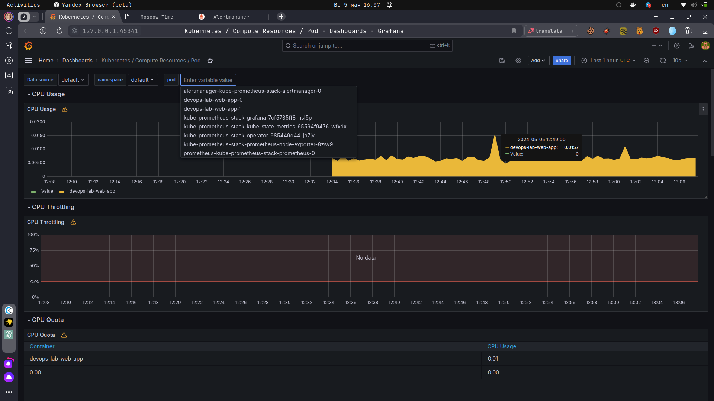
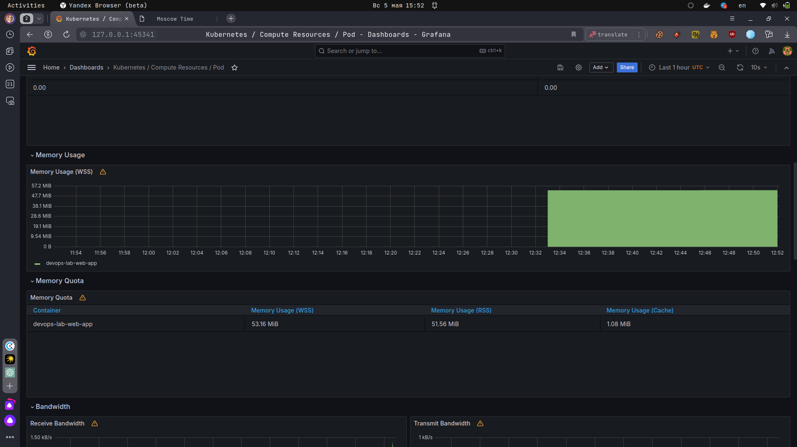
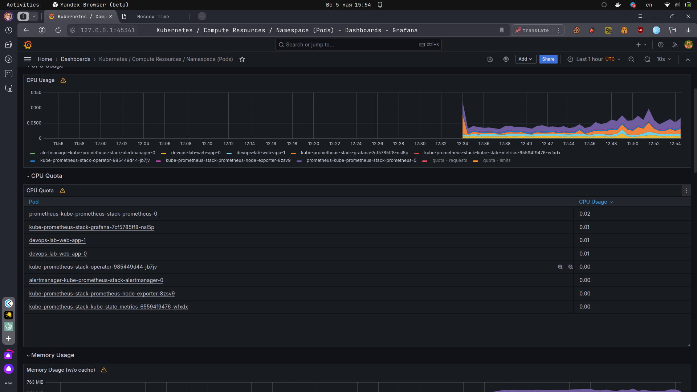
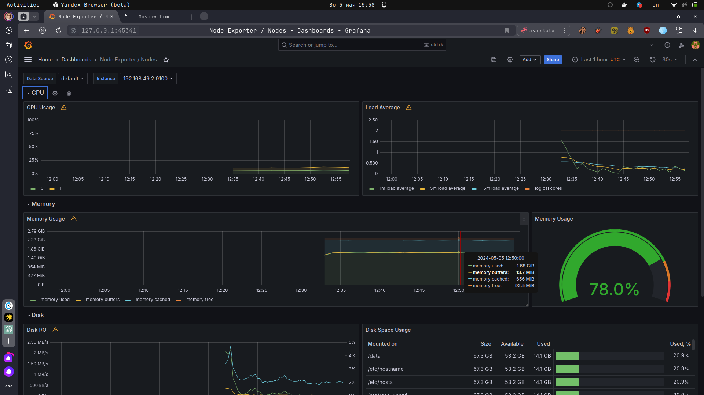
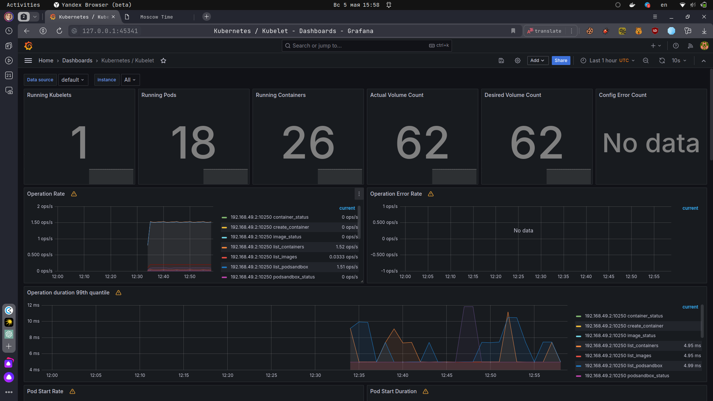
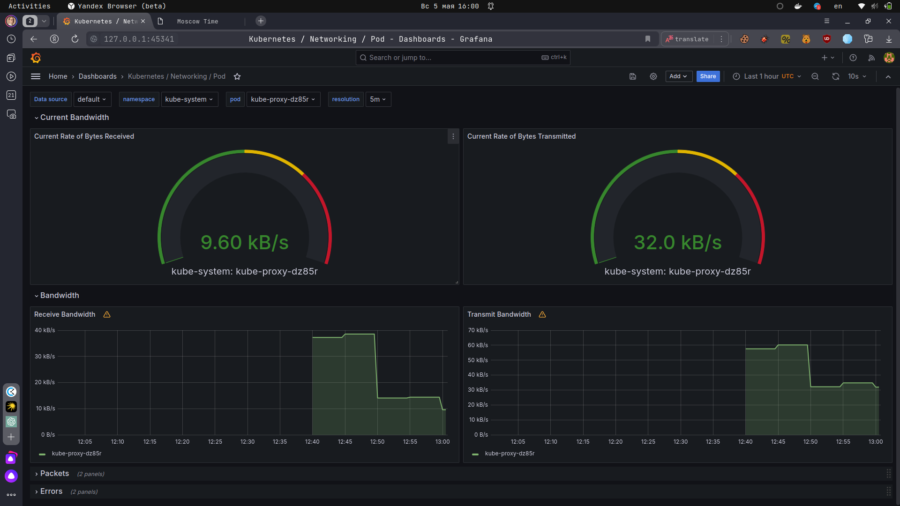
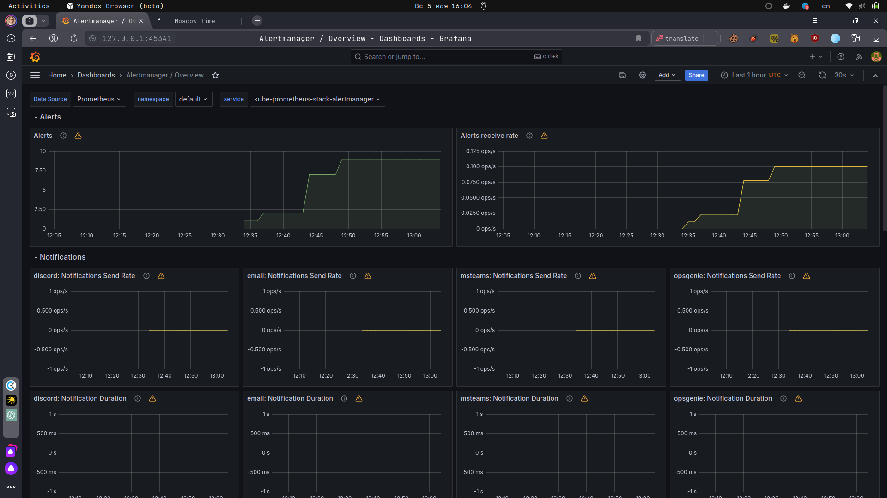
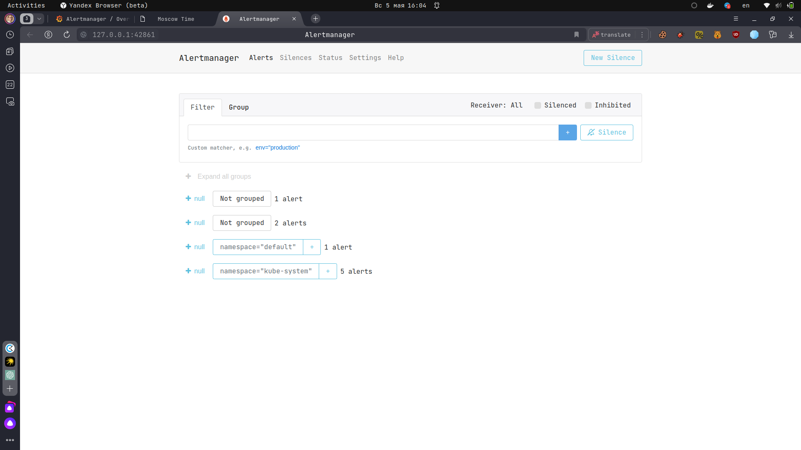

# The Kube Prometheus Stack 

The Kube Prometheus Stack is like a cool toolbox for keeping an eye on your Kubernetes cluster. Here's a breakdown of the main tools in the kit:

1. Prometheus: This guy is like a metrics hoarder, collecting data from all over your cluster and storing it for analysis.

2. Alertmanager: Think of this as the alarm clock that wakes you up when something goes wrong in your cluster. It sorts and sends out alerts so you know what's up.

3. Grafana: The artist of the group, Grafana takes all that data from Prometheus and turns it into pretty graphs and dashboards so you can see how your cluster is doing at a glance.

4. kube-state-metrics: This tool keeps tabs on the state of everything in your cluster – like deployments, pods, and nodes – and turns that info into metrics for Prometheus to use.

5. node-exporter: The node-exporter is like a spy on each node, gathering system-level stats like CPU usage, memory usage, and network activity for Prometheus to monitor.

6. kube-prometheus: This is like a ready-made monitoring setup for Kubernetes, with pre-configured rules and dashboards to make your life easier.

7. Prometheus Operator: This tool automates the management of Prometheus instances in your cluster, handling tasks like setting up, scaling, and updating them so you can focus on other things.

8. Thanos: Thanos extends Prometheus with long-term storage capabilities and global querying across multiple Prometheus instances, making it easier to store historical data and analyze it across clusters.

With these tools in your arsenal, you can keep a close watch on your Kubernetes cluster and stay on top of its performance and health with ease.

```bash
fatm1nd@fatm1nd-IdeaPad-5-14ARE05:~/Documents/Innopolis/devops-core-innopolis-course$ kubectl get po,sts,svc,pvc,cm
NAME                                                            READY   STATUS    RESTARTS   AGE
pod/alertmanager-kube-prometheus-stack-alertmanager-0           2/2     Running   0          49m
pod/devops-lab-web-app-0                                        1/1     Running   2          5d23h
pod/devops-lab-web-app-1                                        1/1     Running   2          5d23h
pod/kube-prometheus-stack-grafana-7cf5785ff8-nsl5p              3/3     Running   0          49m
pod/kube-prometheus-stack-kube-state-metrics-65594f9476-wfxdx   1/1     Running   0          49m
pod/kube-prometheus-stack-operator-985449d44-jb7jv              1/1     Running   0          49m
pod/kube-prometheus-stack-prometheus-node-exporter-8zsv9        1/1     Running   0          49m
pod/prometheus-kube-prometheus-stack-prometheus-0               2/2     Running   0          49m

NAME                                                               READY   AGE
statefulset.apps/alertmanager-kube-prometheus-stack-alertmanager   1/1     49m
statefulset.apps/devops-lab-web-app                                2/2     5d23h
statefulset.apps/prometheus-kube-prometheus-stack-prometheus       1/1     49m

NAME                                                     TYPE        CLUSTER-IP       EXTERNAL-IP   PORT(S)                      AGE
service/alertmanager-operated                            ClusterIP   None             <none>        9093/TCP,9094/TCP,9094/UDP   49m
service/devops-lab-web-app                               ClusterIP   10.111.87.229    <none>        5000/TCP                     5d23h
service/kube-prometheus-stack-alertmanager               ClusterIP   10.110.172.171   <none>        9093/TCP,8080/TCP            49m
service/kube-prometheus-stack-grafana                    ClusterIP   10.110.217.6     <none>        80/TCP                       49m
service/kube-prometheus-stack-kube-state-metrics         ClusterIP   10.104.179.95    <none>        8080/TCP                     49m
service/kube-prometheus-stack-operator                   ClusterIP   10.97.166.119    <none>        443/TCP                      49m
service/kube-prometheus-stack-prometheus                 ClusterIP   10.101.171.39    <none>        9090/TCP,8080/TCP            49m
service/kube-prometheus-stack-prometheus-node-exporter   ClusterIP   10.100.7.245     <none>        9100/TCP                     49m
service/kubernetes                                       ClusterIP   10.96.0.1        <none>        443/TCP                      36d
service/prometheus-operated                              ClusterIP   None             <none>        9090/TCP                     49m

NAME                                              STATUS   VOLUME                                     CAPACITY   ACCESS MODES   STORAGECLASS   AGE
persistentvolumeclaim/data-devops-lab-web-app-0   Bound    pvc-e6b82a30-7514-4381-bc60-b634882c9d2b   1Gi        RWO            standard       5d23h
persistentvolumeclaim/data-devops-lab-web-app-1   Bound    pvc-50c87e9a-c1d3-47b9-bc22-0ca65e67ea28   1Gi        RWO            standard       5d23h

NAME                                                                DATA   AGE
configmap/config                                                    1      5d23h
configmap/kube-prometheus-stack-alertmanager-overview               1      49m
configmap/kube-prometheus-stack-apiserver                           1      49m
configmap/kube-prometheus-stack-cluster-total                       1      49m
configmap/kube-prometheus-stack-controller-manager                  1      49m
configmap/kube-prometheus-stack-etcd                                1      49m
configmap/kube-prometheus-stack-grafana                             1      49m
configmap/kube-prometheus-stack-grafana-config-dashboards           1      49m
configmap/kube-prometheus-stack-grafana-datasource                  1      49m
configmap/kube-prometheus-stack-grafana-overview                    1      49m
configmap/kube-prometheus-stack-k8s-coredns                         1      49m
configmap/kube-prometheus-stack-k8s-resources-cluster               1      49m
configmap/kube-prometheus-stack-k8s-resources-multicluster          1      49m
configmap/kube-prometheus-stack-k8s-resources-namespace             1      49m
configmap/kube-prometheus-stack-k8s-resources-node                  1      49m
configmap/kube-prometheus-stack-k8s-resources-pod                   1      49m
configmap/kube-prometheus-stack-k8s-resources-workload              1      49m
configmap/kube-prometheus-stack-k8s-resources-workloads-namespace   1      49m
configmap/kube-prometheus-stack-kubelet                             1      49m
configmap/kube-prometheus-stack-namespace-by-pod                    1      49m
configmap/kube-prometheus-stack-namespace-by-workload               1      49m
configmap/kube-prometheus-stack-node-cluster-rsrc-use               1      49m
configmap/kube-prometheus-stack-node-rsrc-use                       1      49m
configmap/kube-prometheus-stack-nodes                               1      49m
configmap/kube-prometheus-stack-nodes-darwin                        1      49m
configmap/kube-prometheus-stack-persistentvolumesusage              1      49m
configmap/kube-prometheus-stack-pod-total                           1      49m
configmap/kube-prometheus-stack-prometheus                          1      49m
configmap/kube-prometheus-stack-proxy                               1      49m
configmap/kube-prometheus-stack-scheduler                           1      49m
configmap/kube-prometheus-stack-workload-total                      1      49m
configmap/kube-root-ca.crt                                          1      36d
configmap/prometheus-kube-prometheus-stack-prometheus-rulefiles-0   35     49m
```

## Inforamtion from Grafana

### CPU and Memory consumption

    CPU: 0.0157%
    Memory: 52.15Mb




### CPU Quota - Min and Max

    Max - prometheus-kube-prometheus-stack-prometheus-0 - 0.02
    Min - devops-lab-web-app-0 - 0.01



### Node memory usage in percentage and megabytes

    Memory Usage: (78%) 1.7Gb



### Pods and containers count

    Pods: 18
    Containers: 26



### Network

    Download speed: 9.6 Kb/s
    Upload speed: 32 Kb/s



### Alert Manager

Alerts: 9




## Init Contianer

I choose http://ipconfig.me/
It returns hust IP Address, it you're using `wget`

```
fatm1nd@fatm1nd-IdeaPad-5-14ARE05:~/Documents/Innopolis/devops-core-innopolis-course/k8s$ kubectl exec devops-lab-web-app-0 -- cat /www/web-site.html
Defaulted container "devops-lab-web-app" out of: devops-lab-web-app, download-file (init)
188.130.155.184
```