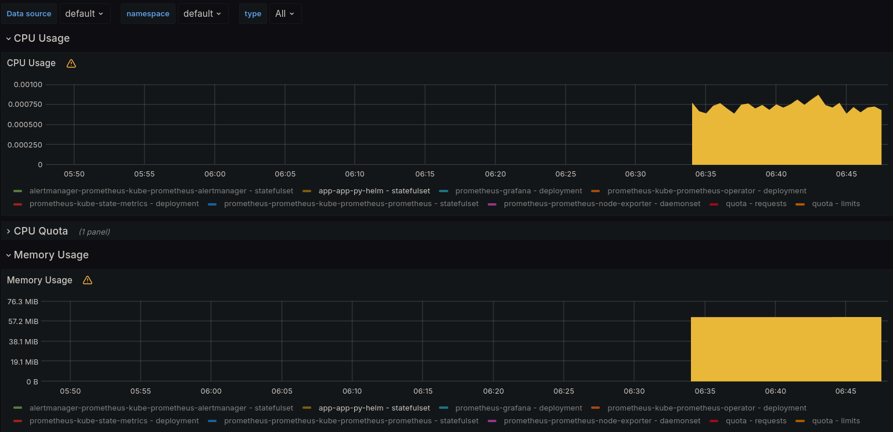
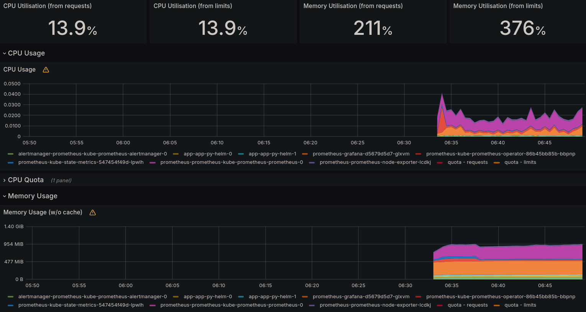
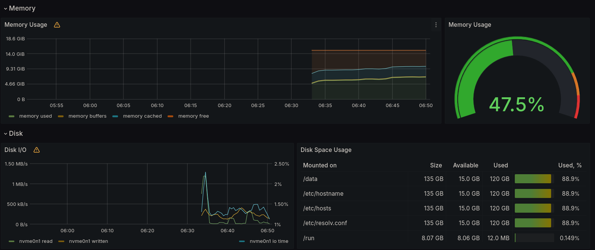
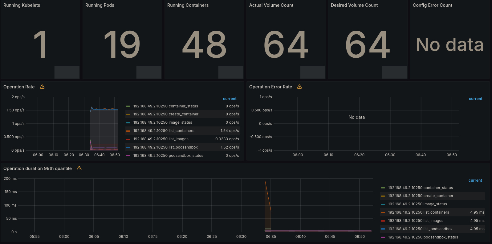
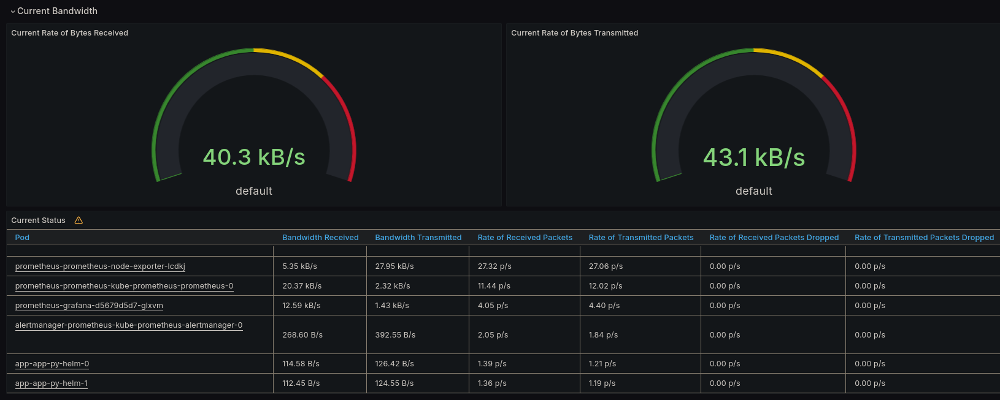
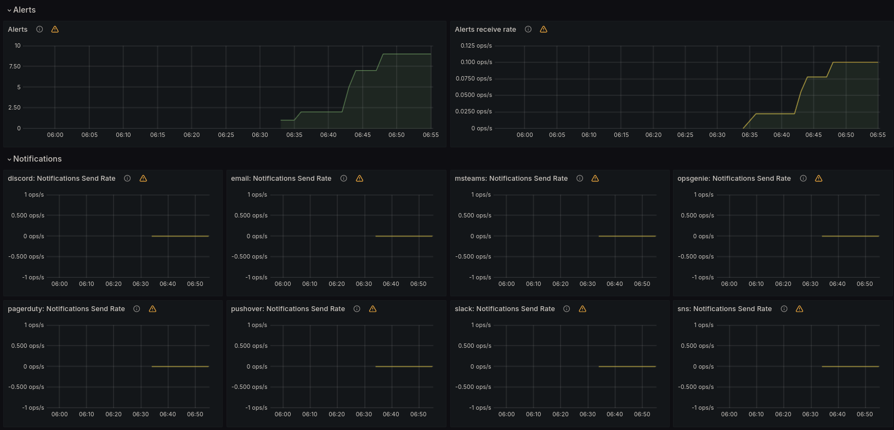
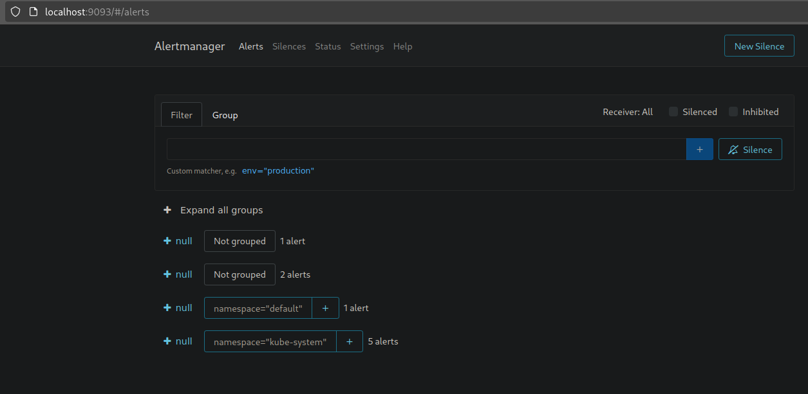

# Lab 14: Kubernetes Monitoring and Init Containers

## Task 1: Kubernetes Cluster Monitoring with Prometheus

### Components of the Kube Prometheus Stack

1. Prometheus: collect and store metrics.

2. Alertmanager: handles alerts from applications e.g. prometheus server; moreover, it deals with deduplicating, grouping, and routing alerts to the receiver integrations; also it does silencing and inhibition of alerts.

3. Node Exporter: it exports metrics from hardware and OS and sends them to prometheus.

4. kube-state-metrics: collects metrics from individual Kubernetes components such as health and the state.

5. Grafana: a tool for building dashboards, quering and visualizing data from different sources.

6. Prometheus Operator: simplify and automate the configuration of Prometheus based stack for Kubernetes clusters.
7. Blackbox exporter: allows blackbox probing of endpoints over HTTP, HTTPS, DNS, TCP, ICMP and gRPC.
8. Prometheus Adapter: adapts metrics between the Kubernetes Metrics API and the Prometheus metrics format.

### Output of `kubectl get po,sts,svc,pvc,cm`

```text
~/D/S/k8s (lab14)> kubectl get po,sts,svc,pvc,cm
NAME                                                         READY   STATUS    RESTARTS   AGE
pod/alertmanager-prometheus-kube-prometheus-alertmanager-0   2/2     Running   0          12m
pod/app-app-py-helm-0                                        1/1     Running   0          6m34s
pod/app-app-py-helm-1                                        1/1     Running   0          6m34s
pod/prometheus-grafana-d5679d5d7-glxvm                       3/3     Running   0          14m
pod/prometheus-kube-prometheus-operator-86b45bb85b-bbpnp     1/1     Running   0          14m
pod/prometheus-kube-state-metrics-547454f49d-lpwlh           1/1     Running   0          14m
pod/prometheus-prometheus-kube-prometheus-prometheus-0       2/2     Running   0          12m
pod/prometheus-prometheus-node-exporter-lcdkj                1/1     Running   0          14m

NAME                                                                    READY   AGE
statefulset.apps/alertmanager-prometheus-kube-prometheus-alertmanager   1/1     12m
statefulset.apps/app-app-py-helm                                        2/2     6m34s
statefulset.apps/prometheus-prometheus-kube-prometheus-prometheus       1/1     12m

NAME                                              TYPE           CLUSTER-IP       EXTERNAL-IP   PORT(S)                      AGE
service/alertmanager-operated                     ClusterIP      None             <none>        9093/TCP,9094/TCP,9094/UDP   12m
service/app-app-py-helm                           LoadBalancer   10.111.106.146   <pending>     5000:31321/TCP               6m34s
service/kubernetes                                ClusterIP      10.96.0.1        <none>        443/TCP                      38d
service/prometheus-grafana                        ClusterIP      10.103.67.75     <none>        80/TCP                       14m
service/prometheus-kube-prometheus-alertmanager   ClusterIP      10.106.217.222   <none>        9093/TCP,8080/TCP            14m
service/prometheus-kube-prometheus-operator       ClusterIP      10.101.189.151   <none>        443/TCP                      14m
service/prometheus-kube-prometheus-prometheus     ClusterIP      10.99.74.218     <none>        9090/TCP,8080/TCP            14m
service/prometheus-kube-state-metrics             ClusterIP      10.110.155.127   <none>        8080/TCP                     14m
service/prometheus-operated                       ClusterIP      None             <none>        9090/TCP                     12m
service/prometheus-prometheus-node-exporter       ClusterIP      10.96.50.226     <none>        9100/TCP                     14m

NAME                                              STATUS   VOLUME                                     CAPACITY   ACCESS MODES   STORAGECLASS   AGE
persistentvolumeclaim/appdata-app-app-py-helm-0   Bound    pvc-eef7c409-d173-4947-9e32-829652577d68   1Gi        RWO            standard       4d18h
persistentvolumeclaim/appdata-app-app-py-helm-1   Bound    pvc-5456e5d4-1385-47f0-b0df-da05dfda7601   1Gi        RWO            standard       4d18h

NAME                                                                     DATA   AGE
configmap/config                                                         1      6m34s
configmap/kube-root-ca.crt                                               1      38d
configmap/prometheus-grafana                                             1      14m
configmap/prometheus-grafana-config-dashboards                           1      14m
configmap/prometheus-kube-prometheus-alertmanager-overview               1      14m
configmap/prometheus-kube-prometheus-apiserver                           1      14m
configmap/prometheus-kube-prometheus-cluster-total                       1      14m
configmap/prometheus-kube-prometheus-controller-manager                  1      14m
configmap/prometheus-kube-prometheus-etcd                                1      14m
configmap/prometheus-kube-prometheus-grafana-datasource                  1      14m
configmap/prometheus-kube-prometheus-grafana-overview                    1      14m
configmap/prometheus-kube-prometheus-k8s-coredns                         1      14m
configmap/prometheus-kube-prometheus-k8s-resources-cluster               1      14m
configmap/prometheus-kube-prometheus-k8s-resources-multicluster          1      14m
configmap/prometheus-kube-prometheus-k8s-resources-namespace             1      14m
configmap/prometheus-kube-prometheus-k8s-resources-node                  1      14m
configmap/prometheus-kube-prometheus-k8s-resources-pod                   1      14m
configmap/prometheus-kube-prometheus-k8s-resources-workload              1      14m
configmap/prometheus-kube-prometheus-k8s-resources-workloads-namespace   1      14m
configmap/prometheus-kube-prometheus-kubelet                             1      14m
configmap/prometheus-kube-prometheus-namespace-by-pod                    1      14m
configmap/prometheus-kube-prometheus-namespace-by-workload               1      14m
configmap/prometheus-kube-prometheus-node-cluster-rsrc-use               1      14m
configmap/prometheus-kube-prometheus-node-rsrc-use                       1      14m
configmap/prometheus-kube-prometheus-nodes                               1      14m
configmap/prometheus-kube-prometheus-nodes-darwin                        1      14m
configmap/prometheus-kube-prometheus-persistentvolumesusage              1      14m
configmap/prometheus-kube-prometheus-pod-total                           1      14m
configmap/prometheus-kube-prometheus-prometheus                          1      14m
configmap/prometheus-kube-prometheus-proxy                               1      14m
configmap/prometheus-kube-prometheus-scheduler                           1      14m
configmap/prometheus-kube-prometheus-workload-total                      1      14m
configmap/prometheus-prometheus-kube-prometheus-prometheus-rulefiles-0   35     12m
```

Here are:

1. Pods: two pods of my application, and a pod for each of these: prometheus, alertmanager, grafana, metrics, operator, node exporter
2. Statefulsets: my app, prometheus, alertmanager
3. Services: alertmanager, app-py, kubernetes, grafana, operator, Prometheus, state-metrics, node exporter
4. Persistent volume claims: two for my app pods
5. Config maps: one for my app and many other services

### Information about the cluster

a. CPU and Memory consumption of my StatefulSet

Cpu consumption is about 0.0008%, memory 60MiB



b. Pods with higher and lower CPU usage in the default namespace.

The highest: graphana, the lowest: app-py



c. Monitor node memory usage in percentage and megabytes.

Memory usage is about ~2GiB



d. The number of pods and containers managed by the Kubelet service.

19 pods and 48 containers



e. Network usage of Pods in the default namespace.



f. The number of active alerts; also check the Web UI with minikube service monitoring-kube-prometheus-alertmanager.

9 alerts.





## Task 2

```text
~/D/S/k8s (lab14)> kubectl exec app-app-py-helm-1 -- cat /work-dir/index.html
Defaulted container "app-py-helm" out of: app-py-helm, install (init)
<html><head></head><body><header>
<title>http://info.cern.ch</title>
</header>

<h1>http://info.cern.ch - home of the first website</h1>
<p>From here you can:</p>
<ul>
<li><a href="http://info.cern.ch/hypertext/WWW/TheProject.html">Browse the first website</a></li>
<li><a href="http://line-mode.cern.ch/www/hypertext/WWW/TheProject.html">Browse the first website using the line-mode browser simulator</a></li>
<li><a href="http://home.web.cern.ch/topics/birth-web">Learn about the birth of the web</a></li>
<li><a href="http://home.web.cern.ch/about">Learn about CERN, the physics laboratory where the web was born</a></li>
</ul>
</body></html>
```

## Bonus task

### Init Container Queue:

```text
~/D/S/k8s (lab14) [1]> kubectl exec app-app-py-helm-0 -- cat /work-dir/queue
Defaulted container "app-py-helm" out of: app-py-helm, install (init), queue1 (init), queue2 (init)
lol  
LOL
HAHAHAHAH
```