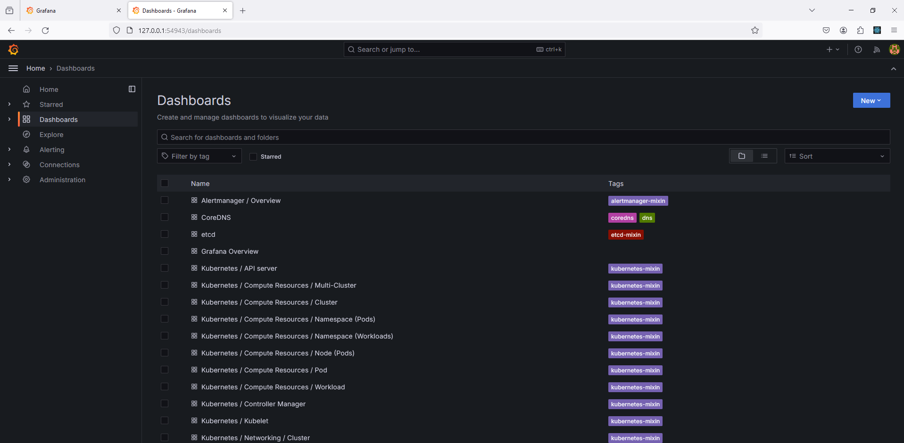
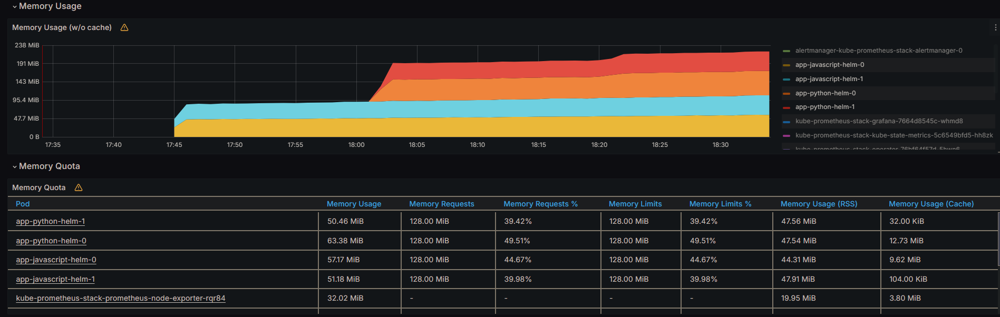
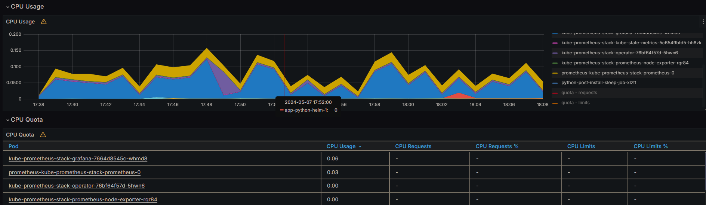
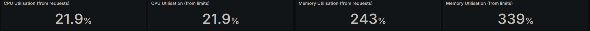
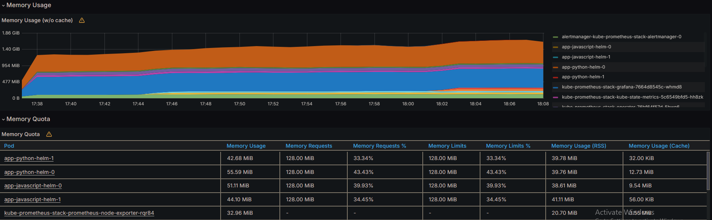
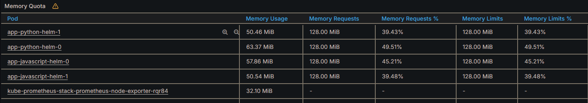
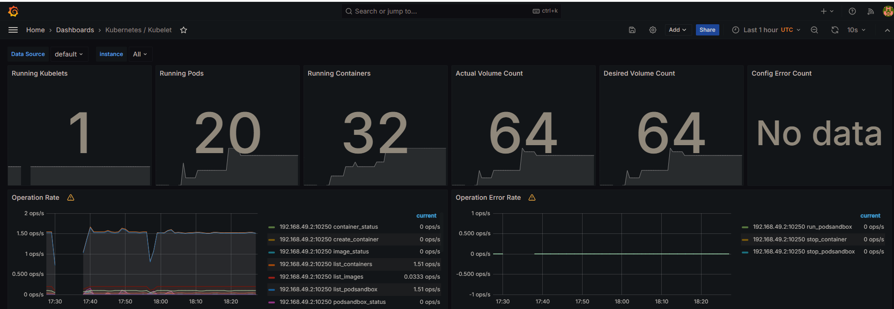
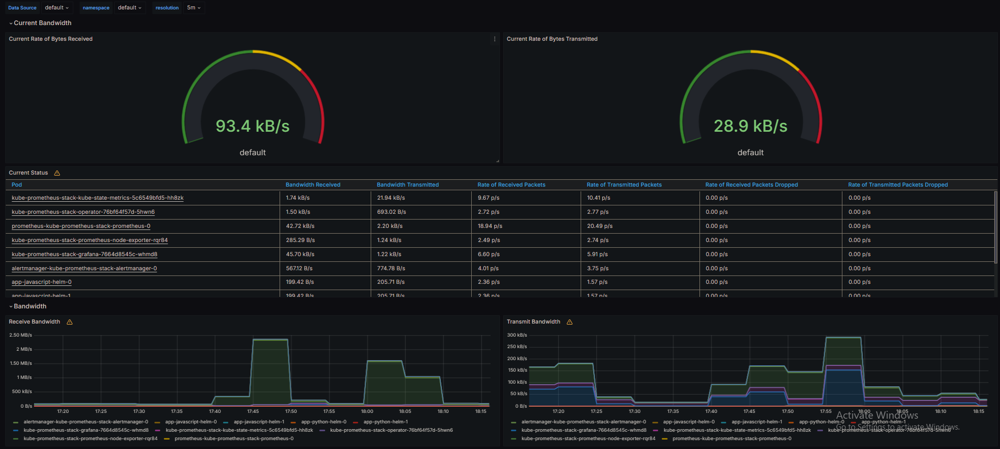
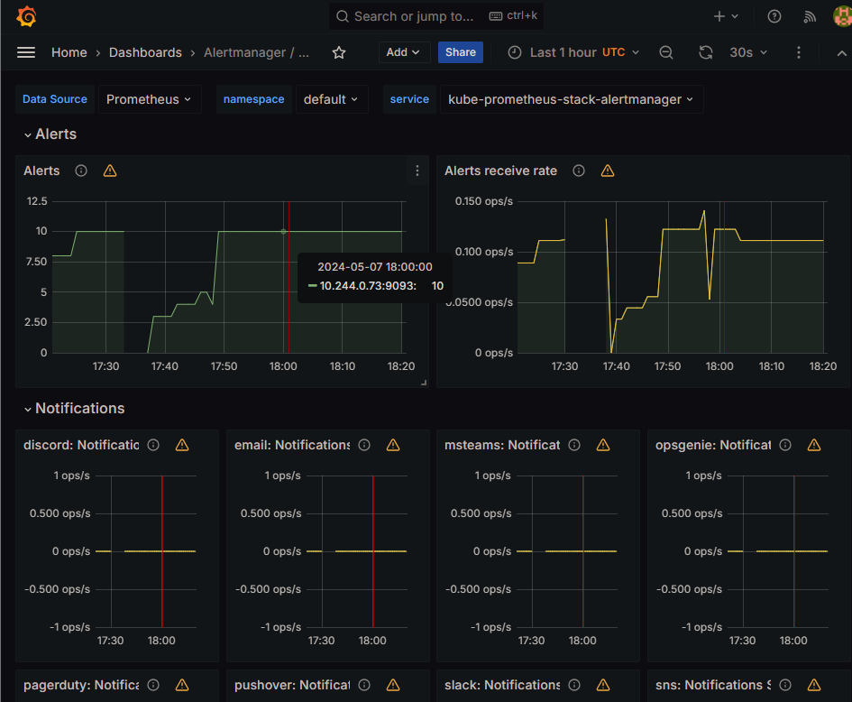

# Kubernetes Monitoring and Init Containers

## Task 1:

### 1.3 Here are the main components:

**Prometheus**: This is the core component. It's a time-series database that collects metrics from monitored targets by scraping metrics HTTP endpoints on these targets.

**Alertmanager**: This component handles alerts sent by Prometheus server and takes care of deduplicating, grouping, and routing them to the correct receiver (like email, PagerDuty, etc.). It also silences and inhibition of alerts.

**Node Exporter**: This is a Prometheus exporter for hardware and OS metrics with pluggable metric collectors. It allows you to measure various machine resources such as memory, disk I/O, CPU, network, etc.

**kube-state-metrics**: This service listens to the Kubernetes API server and generates metrics about the state of the objects in the cluster (like deployments, pods, nodes, etc.).

**Grafana**: A visualization tool that provides charts, graphs, and alerts for the web when connected to supported data sources (like Prometheus). It allows you to create dashboards for your data.

**Prometheus Operator**: This component simplifies the deployment and configuration of Prometheus, Alertmanager, and related monitoring components. It defines custom resources to manage the lifecycle of these components.

### 1.4 Install Helm Charts:

```bash
helm repo add prometheus-community https://prometheus-community.github.io/helm-charts
helm repo update
helm install kube-prometheus-stack prometheus-community/kube-prometheus-stack --version 57.2.0 --set-string kubePrometheusStack.appVersion=v0.72.0
```

```bash
NAME: kube-prometheus-stack
LAST DEPLOYED: Tue May  7 18:50:48 2024
NAMESPACE: default
STATUS: deployed
REVISION: 1
NOTES:
kube-prometheus-stack has been installed. Check its status by running:
  kubectl --namespace default get pods -l "release=kube-prometheus-stack"

Visit https://github.com/prometheus-operator/kube-prometheus for instructions on how to create & configure Alertmanager and Prometheus instances using the Operator.
```

### 1.5 Output of `kubectl get po,sts,svc,pvc,cm`:

```bash
PS D:\Innopolis\3\2\devops\S24-core-course-labs\k8s> kubectl get po,sts,svc,pvc,cm
NAME                                                            READY   STATUS      RESTARTS   AGE
pod/alertmanager-kube-prometheus-stack-alertmanager-0           2/2     Running     0          58m
pod/app-javascript-helm-0                                       1/1     Running     0          26m
pod/app-javascript-helm-1                                       1/1     Running     0          20m
pod/app-python-helm-0                                           1/1     Running     0          8m2s
pod/app-python-helm-1                                           1/1     Running     0          8m2s
pod/kube-prometheus-stack-grafana-7664d8545c-whmd8              3/3     Running     0          58m
pod/kube-prometheus-stack-kube-state-metrics-5c6549bfd5-hh8zk   1/1     Running     0          58m
pod/kube-prometheus-stack-operator-76bf64f57d-5hwn6             1/1     Running     0          58m
pod/kube-prometheus-stack-prometheus-node-exporter-rqr84        1/1     Running     0          58m
pod/post-install-sleep-job-hm27p                                0/1     Completed   0          26m
pod/pre-install-sleep-job-x468n                                 0/1     Completed   0          26m
pod/prometheus-kube-prometheus-stack-prometheus-0               2/2     Running     0          58m
pod/python-post-install-sleep-job-xlztt                         0/1     Completed   0          8m2s
pod/python-pre-install-sleep-job-k2l9f                          0/1     Completed   0          8m2s

NAME                                                               READY   AGE
statefulset.apps/alertmanager-kube-prometheus-stack-alertmanager   1/1     58m
statefulset.apps/app-javascript-helm                               2/2     26m
statefulset.apps/app-python-helm                                   2/2     8m2s
statefulset.apps/prometheus-kube-prometheus-stack-prometheus       1/1     58m

NAME                                                     TYPE           CLUSTER-IP       EXTERNAL-IP   PORT(S)                      AGE
service/alertmanager-operated                            ClusterIP      None             <none>        9093/TCP,9094/TCP,9094/UDP   147m
service/app-javascript-helm                              LoadBalancer   10.107.91.255    <pending>     5000:31114/TCP               26m
service/app-python-helm                                  LoadBalancer   10.100.220.173   <pending>     5000:32311/TCP               8m2s
service/kube-prometheus-stack-alertmanager               ClusterIP      10.105.232.221   <none>        9093/TCP,8080/TCP            58m
service/kube-prometheus-stack-grafana                    ClusterIP      10.108.49.243    <none>        80/TCP                       58m
service/kube-prometheus-stack-kube-state-metrics         ClusterIP      10.98.146.11     <none>        8080/TCP                     58m
service/kube-prometheus-stack-operator                   ClusterIP      10.99.10.36      <none>        443/TCP                      58m
service/kube-prometheus-stack-prometheus                 ClusterIP      10.103.84.9      <none>        9090/TCP,8080/TCP            58m
service/kube-prometheus-stack-prometheus-node-exporter   ClusterIP      10.101.68.63     <none>        9100/TCP                     58m
service/kubernetes                                       ClusterIP      10.96.0.1        <none>        443/TCP                      158m
service/prometheus-operated                              ClusterIP      None             <none>        9090/TCP                     147m

NAME                                                                     DATA   AGE
configmap/app-javascript-helm-configmap                                  3      26m
configmap/app-python-helm-configmap                                      3      8m2s
configmap/kube-prometheus-stack-57.2-alertmanager-overview               1      150m
configmap/kube-prometheus-stack-57.2-apiserver                           1      150m
configmap/kube-prometheus-stack-57.2-cluster-total                       1      150m
configmap/kube-prometheus-stack-57.2-controller-manager                  1      150m
configmap/kube-prometheus-stack-57.2-etcd                                1      150m
configmap/kube-prometheus-stack-57.2-grafana-datasource                  1      150m
configmap/kube-prometheus-stack-57.2-grafana-overview                    1      150m
configmap/kube-prometheus-stack-57.2-k8s-coredns                         1      150m
configmap/kube-prometheus-stack-57.2-k8s-resources-cluster               1      150m
configmap/kube-prometheus-stack-57.2-k8s-resources-multicluster          1      150m
configmap/kube-prometheus-stack-57.2-k8s-resources-namespace             1      150m
configmap/kube-prometheus-stack-57.2-k8s-resources-node                  1      150m
configmap/kube-prometheus-stack-57.2-k8s-resources-pod                   1      150m
configmap/kube-prometheus-stack-57.2-k8s-resources-workload              1      150m
configmap/kube-prometheus-stack-57.2-k8s-resources-workloads-namespace   1      150m
configmap/kube-prometheus-stack-57.2-kubelet                             1      150m
configmap/kube-prometheus-stack-57.2-namespace-by-pod                    1      150m
configmap/kube-prometheus-stack-57.2-namespace-by-workload               1      150m
configmap/kube-prometheus-stack-57.2-node-cluster-rsrc-use               1      150m
configmap/kube-prometheus-stack-57.2-node-rsrc-use                       1      150m
configmap/kube-prometheus-stack-57.2-nodes                               1      150m
configmap/kube-prometheus-stack-57.2-nodes-darwin                        1      150m
configmap/kube-prometheus-stack-57.2-persistentvolumesusage              1      150m
configmap/kube-prometheus-stack-57.2-pod-total                           1      150m
configmap/kube-prometheus-stack-57.2-prometheus                          1      150m
configmap/kube-prometheus-stack-57.2-proxy                               1      150m
configmap/kube-prometheus-stack-57.2-scheduler                           1      150m
configmap/kube-prometheus-stack-57.2-workload-total                      1      150m
configmap/kube-prometheus-stack-57.2.0-grafana                           1      150m
configmap/kube-prometheus-stack-57.2.0-grafana-config-dashboards         1      150m
configmap/kube-prometheus-stack-alertmanager-overview                    1      58m
configmap/kube-prometheus-stack-apiserver                                1      58m
configmap/kube-prometheus-stack-cluster-total                            1      58m
configmap/kube-prometheus-stack-controller-manager                       1      58m
configmap/kube-prometheus-stack-etcd                                     1      58m
configmap/kube-prometheus-stack-grafana                                  1      58m
configmap/kube-prometheus-stack-grafana-config-dashboards                1      58m
configmap/kube-prometheus-stack-grafana-datasource                       1      58m
configmap/kube-prometheus-stack-grafana-overview                         1      58m
configmap/kube-prometheus-stack-k8s-coredns                              1      58m
configmap/kube-prometheus-stack-k8s-resources-cluster                    1      58m
configmap/kube-prometheus-stack-k8s-resources-multicluster               1      58m
configmap/kube-prometheus-stack-k8s-resources-namespace                  1      58m
configmap/kube-prometheus-stack-k8s-resources-node                       1      58m
configmap/kube-prometheus-stack-k8s-resources-pod                        1      58m
configmap/kube-prometheus-stack-k8s-resources-workload                   1      58m
configmap/kube-prometheus-stack-k8s-resources-workloads-namespace        1      58m
configmap/kube-prometheus-stack-kubelet                                  1      58m
configmap/kube-prometheus-stack-namespace-by-pod                         1      58m
configmap/kube-prometheus-stack-namespace-by-workload                    1      58m
configmap/kube-prometheus-stack-node-cluster-rsrc-use                    1      58m
configmap/kube-prometheus-stack-node-rsrc-use                            1      58m
configmap/kube-prometheus-stack-nodes                                    1      58m
configmap/kube-prometheus-stack-nodes-darwin                             1      58m
configmap/kube-prometheus-stack-persistentvolumesusage                   1      58m
configmap/kube-prometheus-stack-pod-total                                1      58m
configmap/kube-prometheus-stack-prometheus                               1      58m
configmap/kube-prometheus-stack-proxy                                    1      58m
configmap/kube-prometheus-stack-scheduler                                1      58m
configmap/kube-prometheus-stack-workload-total                           1      58m
configmap/kube-root-ca.crt                                               1      158m
configmap/prometheus-kube-prometheus-stack-57.2-prometheus-rulefiles-0   35     147m
configmap/prometheus-kube-prometheus-stack-prometheus-rulefiles-0        35     58m
```

### 1.6 Utilize Grafana Dashboards:

1. Access Grafana using `minikube service kube-prometheus-stack-grafana`.



### 1.7 [Explore existing dashboards] Answers:

1. Check CPU and Memory consumption of your StatefulSet.

- CPU Utilization: `21.9%`
- Memory Utilization: `243%`





2. Identify Pods with higher and lower CPU usage in the default namespace.

- Highest among all the stateful statefulset: `kube-prometheus-stack-grafana-7664d8545c-whmd8`
- Highest among my apps: `app-python-helm-1`

Lowest: `app-javascript-helm-0`

3. Monitor node memory usage in percentage and megabytes.




4. Count the number of pods and containers managed by the Kubelet service.

- Number of Running Pods: `20`
- Number of Running Containers: `32`



5. Evaluate network usage of Pods in the default namespace.

- Rate of Bytes Received: `93.4 kB/s`
- Rate of Bytes Sent: `28.9 kB/s`



6. Determine the number of active alerts; also check the Web UI with `minikube service monitoring-kube-prometheus-alertmanager`:

- Number of Active Alerts: `10`



## Task 2: Init Containers
