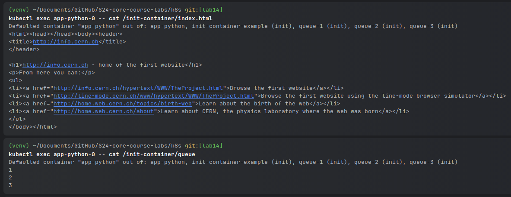

# Lab 14

## The Kube Prometheus Stack

### 1. Prometheus
- Role: Monitoring and time-series data storage.
- Function: Prometheus collects and stores metrics as time-series data, allowing users to query and visualize this data. Prometheus gathers metrics through a pull model over HTTP, scraping data from different Kubernetes nodes and services.

### 2. Grafana
- Role: Visualization and analytics platform.
- Function: Grafana allows users to create detailed dashboards that can display data in various graph formats, tables etc. Grafana supports querying Prometheus for real-time monitoring data.

### 3. Alertmanager
- Role: Alert management.
- Function: Alertmanager is responsible for deduplicating, grouping, and routing alerts to the correct receiver such as email, PagerDuty, or OpsGenie.

### 4. Node Exporter
- Role: Node-level metrics exporter.
- Function: Node Exporter runs on each node and exports metrics about the system's state, including CPU, disk, and memory usage, plus detailed metrics on system and kernel performance.

### 5. kube-state-metrics
- Role: Kubernetes state metrics exporter.
- Function: kube-state-metrics listens to the Kubernetes API server and generates metrics about the state of the objects within the cluster.

### 6. Prometheus Operator
- Role: Management of Prometheus components.
- Function: The Prometheus Operator simplifies the deployment and configuration of Prometheus, Alertmanager, and related monitoring components.

### 7. ServiceMonitor
- Role: Service monitoring.
- Function: ServiceMonitor is a CRD introduced by the Prometheus Operator. It specifies how groups of services should be monitored by Prometheus, defining the selectors and endpoints.

### Output of `kubectl get po,sts,svc,pvc,cm`

```
NAME                                                         READY   STATUS            RESTARTS   AGE
pod/alertmanager-monitoring-kube-prometheus-alertmanager-0   2/2     Running           0          5m49s
pod/app-python-0                                             0/1     PodInitializing   0          3m53s
pod/app-python-1                                             0/1     PodInitializing   0          3m53s
pod/monitoring-grafana-657659866f-7pq95                      3/3     Running           0          6m37s
pod/monitoring-kube-prometheus-operator-884ff87d6-gpn9v      1/1     Running           0          6m37s
pod/monitoring-kube-state-metrics-7fc7cf6558-84xsg           1/1     Running           0          6m37s
pod/monitoring-prometheus-node-exporter-wkcjs                1/1     Running           0          6m37s
pod/prometheus-monitoring-kube-prometheus-prometheus-0       0/2     PodInitializing   0          5m48s

NAME                                                                    READY   AGE
statefulset.apps/alertmanager-monitoring-kube-prometheus-alertmanager   1/1     5m49s
statefulset.apps/app-python                                             0/2     3m53s
statefulset.apps/prometheus-monitoring-kube-prometheus-prometheus       0/1     5m48s

NAME                                              TYPE           CLUSTER-IP       EXTERNAL-IP   PORT(S)                      AGE
service/alertmanager-operated                     ClusterIP      None             <none>        9093/TCP,9094/TCP,9094/UDP   5m49s
service/app-python                                LoadBalancer   10.107.104.127   <pending>     8000:31181/TCP               3m53s
service/kubernetes                                ClusterIP      10.96.0.1        <none>        443/TCP                      9m
service/monitoring-grafana                        ClusterIP      10.109.245.67    <none>        80/TCP                       6m37s
service/monitoring-kube-prometheus-alertmanager   ClusterIP      10.101.46.40     <none>        9093/TCP,8080/TCP            6m37s
service/monitoring-kube-prometheus-operator       ClusterIP      10.96.58.189     <none>        443/TCP                      6m37s
service/monitoring-kube-prometheus-prometheus     ClusterIP      10.110.110.188   <none>        9090/TCP,8080/TCP            6m37s
service/monitoring-kube-state-metrics             ClusterIP      10.106.161.47    <none>        8080/TCP                     6m37s
service/monitoring-prometheus-node-exporter       ClusterIP      10.105.188.212   <none>        9100/TCP                     6m37s
service/prometheus-operated                       ClusterIP      None             <none>        9090/TCP                     5m48s

NAME                                                STATUS   VOLUME                                     CAPACITY   ACCESS MODES   STORAGECLASS   AGE
persistentvolumeclaim/init-container-app-python-0   Bound    pvc-4544c3f3-2b68-4656-b397-96b259fe0140   10Mi       RWO            standard       3m53s
persistentvolumeclaim/init-container-app-python-1   Bound    pvc-3374f537-d54b-46e5-910c-1fa04e8dbaf7   10Mi       RWO            standard       3m53s
persistentvolumeclaim/vol-app-python-0              Bound    pvc-5a9903d1-085d-42e5-8037-c5bfc0a21a18   2Gi        RWO            standard       3m53s
persistentvolumeclaim/vol-app-python-1              Bound    pvc-9d3cb44e-27f7-45ef-ac52-d8c278178aed   2Gi        RWO            standard       3m53s

NAME                                                                     DATA   AGE
configmap/app-python                                                     1      3m53s
configmap/kube-root-ca.crt                                               1      8m46s
configmap/monitoring-grafana                                             1      6m37s
configmap/monitoring-grafana-config-dashboards                           1      6m37s
configmap/monitoring-kube-prometheus-alertmanager-overview               1      6m37s
configmap/monitoring-kube-prometheus-apiserver                           1      6m37s
configmap/monitoring-kube-prometheus-cluster-total                       1      6m37s
configmap/monitoring-kube-prometheus-controller-manager                  1      6m37s
configmap/monitoring-kube-prometheus-etcd                                1      6m37s
configmap/monitoring-kube-prometheus-grafana-datasource                  1      6m37s
configmap/monitoring-kube-prometheus-grafana-overview                    1      6m37s
configmap/monitoring-kube-prometheus-k8s-coredns                         1      6m37s
configmap/monitoring-kube-prometheus-k8s-resources-cluster               1      6m37s
configmap/monitoring-kube-prometheus-k8s-resources-multicluster          1      6m37s
configmap/monitoring-kube-prometheus-k8s-resources-namespace             1      6m37s
configmap/monitoring-kube-prometheus-k8s-resources-node                  1      6m37s
configmap/monitoring-kube-prometheus-k8s-resources-pod                   1      6m37s
configmap/monitoring-kube-prometheus-k8s-resources-workload              1      6m37s
configmap/monitoring-kube-prometheus-k8s-resources-workloads-namespace   1      6m37s
configmap/monitoring-kube-prometheus-kubelet                             1      6m37s
configmap/monitoring-kube-prometheus-namespace-by-pod                    1      6m37s
configmap/monitoring-kube-prometheus-namespace-by-workload               1      6m37s
configmap/monitoring-kube-prometheus-node-cluster-rsrc-use               1      6m37s
configmap/monitoring-kube-prometheus-node-rsrc-use                       1      6m37s
configmap/monitoring-kube-prometheus-nodes                               1      6m37s
configmap/monitoring-kube-prometheus-nodes-darwin                        1      6m37s
configmap/monitoring-kube-prometheus-persistentvolumesusage              1      6m37s
configmap/monitoring-kube-prometheus-pod-total                           1      6m37s
configmap/monitoring-kube-prometheus-prometheus                          1      6m37s
configmap/monitoring-kube-prometheus-proxy                               1      6m37s
configmap/monitoring-kube-prometheus-scheduler                           1      6m37s
configmap/monitoring-kube-prometheus-workload-total                      1      6m37s
configmap/prometheus-monitoring-kube-prometheus-prometheus-rulefiles-0   35     5m49s
```

1. List of pods (po)

A pod is a group of one or more containers, with shared storage/network, and a specification.
For example:
- pod/alertmanager-monitoring-kube-prometheus-alertmanager-0 indicates an Alertmanager pod deployed by a StatefulSet and it is running two containers which are both ready.

2. StatefulSets (sts)

StatefulSets manage the deployment and scaling of a set of Pods, and provide guarantees about the ordering and uniqueness of these Pods.
For example:
- statefulset.apps/prometheus-monitoring-kube-prometheus-prometheus is the StatefulSet for Prometheus

3. Services (svc)

Services are an abstract way to expose an application running on a set of Pods as a network service.
For example:
- service/app-python is a LoadBalancer type, meaning it's exposed externally.

4. PersistentVolumeClaims (pvc)
PersistentVolumeClaims are a request for storage by a user. They allow a user to specify the size, and sometimes the storage class, of the storage they require.
For example:
- persistentvolumeclaim/vol-app-python-0 is connected to a PersistentVolume with 2 Gi capacity, accessible in read-write mode by a single node.

5. ConfigMaps (cm)

ConfigMaps are key-value pairs or configuration files used in Kubernetes to store non-confidential data.
For example:
monitoring-grafana stores configuration specific to the Grafana instance in the monitoring namespace

## Task 2


