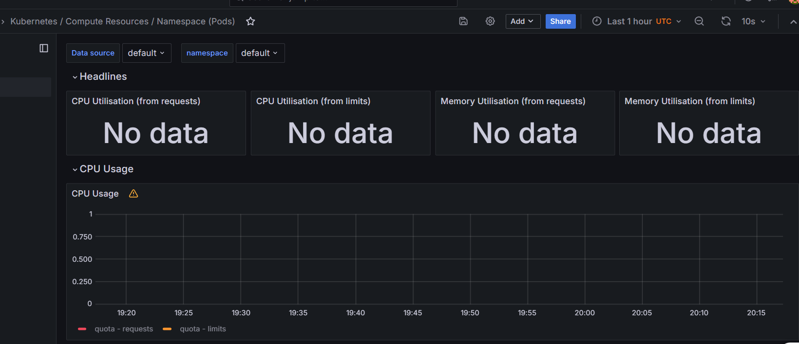

# Lab 14

## Kube Prometheus Stack components

- [**Prometheus Operator**](https://github.com/prometheus-operator/prometheus-operator): A plugin for Kubernetes that makes it easier to integrate Prometheus into our Kubernetes stack. It includes features like Custom Resources and Simplified Deployment Configuration that help simplify and automate the configuration of the Prometheus stack in a Kubernetes cluster.
- [**Prometheus**](https://prometheus.io/): A monitoring system used for collecting and visualizing metrics from applications and storing them in a time-series database that can then be used by tools like Grafana and Loki for logs aggregation and visualization.
- [**Prometheus Alertmanager**](https://github.com/prometheus/alertmanager): A service for handling and processing alerts sent by applications like Prometheus and forwarding them.
- [**Prometheus Node-exporter**](https://github.com/prometheus/node_exporter): A tool for collecting and exposing metrics about the node on which it runs. It is mainly used for exporting hardware-related metrics like CPU, memory, disk, network and more, as well as kernel information.
- [**Prometheus Adapter for Kubernetes Metrics APIs**](https://github.com/kubernetes-sigs/prometheus-adapter): Helps connect between Prometheus and Kubernetes by collecting metrics from Kubernetes APIs (such as information about pods, resources, and nodes) and publishing them in the Prometheus way.
- [**kube-state-metrics**](https://github.com/kubernetes/kube-state-metrics): Similar to the adapter above, but without outputting in the Prometheus way; just raw data and metrics in plain text.
- [**Prometheus Grafana**](https://grafana.com/): A web-based application for visualizing and exploring metrics.

## Command Output
```
PS D:\Roukaya\Repos\DevOps\S24-core-course-labs\k8s> kubectl get po,sts,svc,pvc,cm
NAME                                                         READY   STATUS    RESTARTS   AGE
pod/alertmanager-my-prometheus-kube-prometh-alertmanager-0   2/2     Running   0          25m
pod/my-prometheus-grafana-d8ccd6578-jqbsj                    3/3     Running   0          25m
pod/my-prometheus-kube-prometh-operator-575669f5d4-8zqq8     1/1     Running   0          25m
pod/my-prometheus-kube-state-metrics-755b9f88fb-cm4lw        1/1     Running   0          25m
pod/my-prometheus-prometheus-node-exporter-xmzj6             1/1     Running   0          25m
pod/my-stateful-app-moscow-time-0                            1/1     Running   0          107m
pod/prometheus-my-prometheus-kube-prometh-prometheus-0       2/2     Running   0          25m

NAME                                                                    READY   AGE
statefulset.apps/alertmanager-my-prometheus-kube-prometh-alertmanager   1/1     25m
statefulset.apps/my-stateful-app-moscow-time                            1/1     107m
statefulset.apps/prometheus-my-prometheus-kube-prometh-prometheus       1/1     25m

NAME                                              TYPE        CLUSTER-IP       EXTERNAL-IP   PORT(S)                      AGE
service/alertmanager-operated                     ClusterIP   None             <none>        9093/TCP,9094/TCP,9094/UDP   25m
service/kubernetes                                ClusterIP   10.96.0.1        <none>        443/TCP                      2d
service/my-prometheus-grafana                     ClusterIP   10.96.121.78     <none>        80/TCP                       25m
service/my-prometheus-kube-prometh-alertmanager   ClusterIP   10.109.78.214    <none>        9093/TCP,8080/TCP            25m
service/my-prometheus-kube-prometh-operator       ClusterIP   10.111.49.128    <none>        443/TCP                      25m
service/my-prometheus-kube-prometh-prometheus     ClusterIP   10.99.179.162    <none>        9090/TCP,8080/TCP            25m
service/my-prometheus-kube-state-metrics          ClusterIP   10.96.97.157     <none>        8080/TCP                     25m
service/my-prometheus-prometheus-node-exporter    ClusterIP   10.97.198.11     <none>        9100/TCP                     25m
service/my-stateful-app-moscow-time               ClusterIP   10.105.180.229   <none>        80/TCP                       107m
service/prometheus-operated                       ClusterIP   None             <none>        9090/TCP                     25m
service/roukaya-grafana-f476d8f7c-hf72t           NodePort    10.97.75.151     <none>        80:31557/TCP                 82m

NAME                                                         STATUS   VOLUME                                     CAPACITY   ACCESS MODES   STORAGECLASS   VOLUMEATTRIBUTESCLASS   AGE
persistentvolumeclaim/visits-my-stateful-app-moscow-time-0   Bound    pvc-22cfe6b2-01a2-4195-9168-06d477ecd635   256M       RWO            hostpath 
      <unset>                 110m

NAME                                                                     DATA   AGE
configmap/kube-root-ca.crt                                               1      2d
configmap/my-prometheus-grafana                                          1      25m
configmap/my-prometheus-grafana-config-dashboards                        1      25m
configmap/my-prometheus-kube-prometh-alertmanager-overview               1      25m
configmap/my-prometheus-kube-prometh-apiserver                           1      25m
configmap/my-prometheus-kube-prometh-cluster-total                       1      25m
configmap/my-prometheus-kube-prometh-controller-manager                  1      25m
configmap/my-prometheus-kube-prometh-etcd                                1      25m
configmap/my-prometheus-kube-prometh-grafana-datasource                  1      25m
configmap/my-prometheus-kube-prometh-grafana-overview                    1      25m
configmap/my-prometheus-kube-prometh-k8s-coredns                         1      25m
configmap/my-prometheus-kube-prometh-k8s-resources-cluster               1      25m
configmap/my-prometheus-kube-prometh-k8s-resources-multicluster          1      25m
configmap/my-prometheus-kube-prometh-k8s-resources-namespace             1      25m
configmap/my-prometheus-kube-prometh-k8s-resources-node                  1      25m
configmap/my-prometheus-kube-prometh-k8s-resources-pod                   1      25m
configmap/my-prometheus-kube-prometh-k8s-resources-workload              1      25m
configmap/my-prometheus-kube-prometh-k8s-resources-workloads-namespace   1      25m
configmap/my-prometheus-kube-prometh-kubelet                             1      25m
configmap/my-prometheus-kube-prometh-namespace-by-pod                    1      25m
configmap/my-prometheus-kube-prometh-namespace-by-workload               1      25m
configmap/my-prometheus-kube-prometh-node-cluster-rsrc-use               1      25m
configmap/my-prometheus-kube-prometh-node-rsrc-use                       1      25m
configmap/my-prometheus-kube-prometh-nodes                               1      25m
configmap/my-prometheus-kube-prometh-nodes-darwin                        1      25m
configmap/my-prometheus-kube-prometh-persistentvolumesusage              1      25m
configmap/my-prometheus-kube-prometh-pod-total                           1      25m
configmap/my-prometheus-kube-prometh-prometheus                          1      25m
configmap/my-prometheus-kube-prometh-proxy                               1      25m
configmap/my-prometheus-kube-prometh-scheduler                           1      25m
configmap/my-prometheus-kube-prometh-workload-total                      1      25m
configmap/prometheus-my-prometheus-kube-prometh-prometheus-rulefiles-0   35     25m
```

### Explanation of the output
This part contains the running pods in the cluster
```
NAME                                                         READY   STATUS    RESTARTS   AGE
pod/alertmanager-my-prometheus-kube-prometh-alertmanager-0   2/2     Running   0          25m
pod/my-prometheus-grafana-d8ccd6578-jqbsj                    3/3     Running   0          25m
pod/my-prometheus-kube-prometh-operator-575669f5d4-8zqq8     1/1     Running   0          25m
pod/my-prometheus-kube-state-metrics-755b9f88fb-cm4lw        1/1     Running   0          25m
pod/my-prometheus-prometheus-node-exporter-xmzj6             1/1     Running   0          25m
pod/my-stateful-app-moscow-time-0                            1/1     Running   0          107m
pod/prometheus-my-prometheus-kube-prometh-prometheus-0       2/2     Running   0          25m
```

This part is statefulset apps in the cluster
```
NAME                                                                    READY   AGE
statefulset.apps/alertmanager-my-prometheus-kube-prometh-alertmanager   1/1     25m
statefulset.apps/my-stateful-app-moscow-time                            1/1     107m
statefulset.apps/prometheus-my-prometheus-kube-prometh-prometheus       1/1     25m
```

This part contains the services and their corrosponding IP addresses
```
NAME                                              TYPE        CLUSTER-IP       EXTERNAL-IP   PORT(S)                      AGE
service/alertmanager-operated                     ClusterIP   None             <none>        9093/TCP,9094/TCP,9094/UDP   25m
service/kubernetes                                ClusterIP   10.96.0.1        <none>        443/TCP                      2d
service/my-prometheus-grafana                     ClusterIP   10.96.121.78     <none>        80/TCP                       25m
service/my-prometheus-kube-prometh-alertmanager   ClusterIP   10.109.78.214    <none>        9093/TCP,8080/TCP            25m
service/my-prometheus-kube-prometh-operator       ClusterIP   10.111.49.128    <none>        443/TCP                      25m
service/my-prometheus-kube-prometh-prometheus     ClusterIP   10.99.179.162    <none>        9090/TCP,8080/TCP            25m
service/my-prometheus-kube-state-metrics          ClusterIP   10.96.97.157     <none>        8080/TCP                     25m
service/my-prometheus-prometheus-node-exporter    ClusterIP   10.97.198.11     <none>        9100/TCP                     25m
service/my-stateful-app-moscow-time               ClusterIP   10.105.180.229   <none>        80/TCP                       107m
service/prometheus-operated                       ClusterIP   None             <none>        9090/TCP                     25m
service/roukaya-grafana-f476d8f7c-hf72t           NodePort    10.97.75.151     <none>        80:31557/TCP                 82m
```

This part contains the persistent volumes with their capacity
```
NAME                                                         STATUS   VOLUME                                     CAPACITY   ACCESS MODES   STORAGECLASS   VOLUMEATTRIBUTESCLASS   AGE
persistentvolumeclaim/visits-my-stateful-app-moscow-time-0   Bound    pvc-22cfe6b2-01a2-4195-9168-06d477ecd635   256M       RWO            hostpath 
      <unset>                 110m
```

This part contains all the config maps in the cluster
```
NAME                                                                     DATA   AGE
configmap/kube-root-ca.crt                                               1      2d
configmap/my-prometheus-grafana                                          1      25m
configmap/my-prometheus-grafana-config-dashboards                        1      25m
configmap/my-prometheus-kube-prometh-alertmanager-overview               1      25m
configmap/my-prometheus-kube-prometh-apiserver                           1      25m
configmap/my-prometheus-kube-prometh-cluster-total                       1      25m
configmap/my-prometheus-kube-prometh-controller-manager                  1      25m
configmap/my-prometheus-kube-prometh-etcd                                1      25m
configmap/my-prometheus-kube-prometh-grafana-datasource                  1      25m
configmap/my-prometheus-kube-prometh-grafana-overview                    1      25m
configmap/my-prometheus-kube-prometh-k8s-coredns                         1      25m
configmap/my-prometheus-kube-prometh-k8s-resources-cluster               1      25m
configmap/my-prometheus-kube-prometh-k8s-resources-multicluster          1      25m
configmap/my-prometheus-kube-prometh-k8s-resources-namespace             1      25m
configmap/my-prometheus-kube-prometh-k8s-resources-node                  1      25m
configmap/my-prometheus-kube-prometh-k8s-resources-pod                   1      25m
configmap/my-prometheus-kube-prometh-k8s-resources-workload              1      25m
configmap/my-prometheus-kube-prometh-k8s-resources-workloads-namespace   1      25m
configmap/my-prometheus-kube-prometh-kubelet                             1      25m
configmap/my-prometheus-kube-prometh-namespace-by-pod                    1      25m
configmap/my-prometheus-kube-prometh-namespace-by-workload               1      25m
configmap/my-prometheus-kube-prometh-node-cluster-rsrc-use               1      25m
configmap/my-prometheus-kube-prometh-node-rsrc-use                       1      25m
configmap/my-prometheus-kube-prometh-nodes                               1      25m
configmap/my-prometheus-kube-prometh-nodes-darwin                        1      25m
configmap/my-prometheus-kube-prometh-persistentvolumesusage              1      25m
configmap/my-prometheus-kube-prometh-pod-total                           1      25m
configmap/my-prometheus-kube-prometh-prometheus                          1      25m
configmap/my-prometheus-kube-prometh-proxy                               1      25m
configmap/my-prometheus-kube-prometh-scheduler                           1      25m
configmap/my-prometheus-kube-prometh-workload-total                      1      25m
configmap/prometheus-my-prometheus-kube-prometh-prometheus-rulefiles-0   35     25m
```
##
## Information about the cluster
The data are not showing in dashboards in grafana for some reason:


## Init Containers

They are containers that run before the main containers
```
PS D:\Roukaya\Repos\DevOps\S24-core-course-labs\k8s> kubectl exec pod/my-stateful-app-moscow-time-0 -- cat /test/cern.html        
Defaulted container "moscow-time" out of: moscow-time, init-container (init)
<html><head></head><body><header>
<title>http://info.cern.ch</title>
</header>

<h1>http://info.cern.ch - home of the first website</h1>
<p>From here you can:</p>
<ul>
<li><a href="http://info.cern.ch/hypertext/WWW/TheProject.html">Browse the first website</a></li>
<li><a href="http://line-mode.cern.ch/www/hypertext/WWW/TheProject.html">Browse the first website using the line-mode browser simulator</a></li>
<li><a href="http://home.web.cern.ch/topics/birth-web">Learn about the birth of the web</a></li>
<li><a href="http://home.web.cern.ch/about">Learn about CERN, the physics laboratory where the web was born</a></li>
</ul>
</body></html>
```