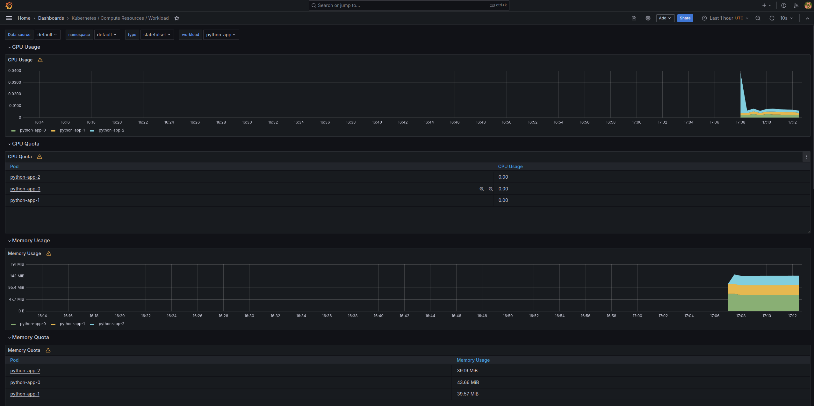
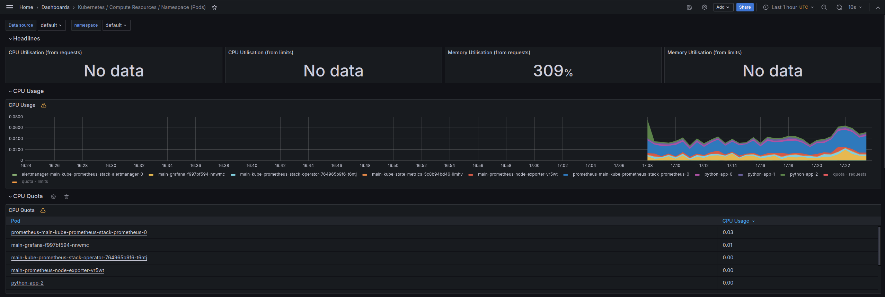
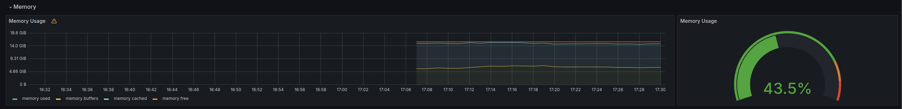
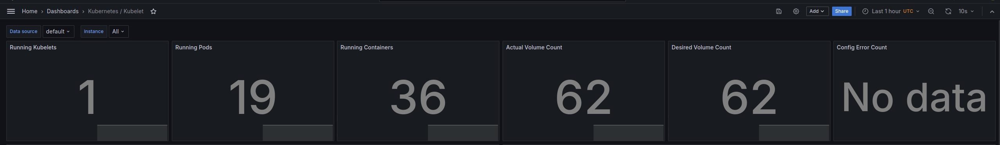
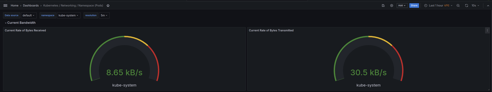

# Kubernetes Monitoring and Init Containers

## Output of `kubectl get po,sts,svc,pvc,cm`
```bash
NAME                                                         READY   STATUS    RESTARTS   AGE
pod/alertmanager-main-kube-prometheus-stack-alertmanager-0   2/2     Running   0          3m6s
pod/main-grafana-f997bf594-nnwmc                             3/3     Running   0          3m16s
pod/main-kube-prometheus-stack-operator-764965b9f6-t6ntj     1/1     Running   0          3m16s
pod/main-kube-state-metrics-5c8b94bd46-llmhv                 1/1     Running   0          3m16s
pod/main-prometheus-node-exporter-vr5wt                      1/1     Running   0          3m16s
pod/prometheus-main-kube-prometheus-stack-prometheus-0       2/2     Running   0          3m6s
pod/python-app-0                                             1/1     Running   0          2m9s
pod/python-app-1                                             1/1     Running   0          2m5s
pod/python-app-2                                             1/1     Running   0          115s

NAME                                                                    READY   AGE
statefulset.apps/alertmanager-main-kube-prometheus-stack-alertmanager   1/1     3m6s
statefulset.apps/prometheus-main-kube-prometheus-stack-prometheus       1/1     3m6s
statefulset.apps/python-app                                             3/3     2m9s

NAME                                              TYPE        CLUSTER-IP       EXTERNAL-IP   PORT(S)                      AGE
service/alertmanager-operated                     ClusterIP   None             <none>        9093/TCP,9094/TCP,9094/UDP   3m6s
service/kubernetes                                ClusterIP   10.96.0.1        <none>        443/TCP                      33d
service/main-grafana                              ClusterIP   10.105.250.46    <none>        80/TCP                       3m16s
service/main-kube-prometheus-stack-alertmanager   ClusterIP   10.105.26.40     <none>        9093/TCP,8080/TCP            3m16s
service/main-kube-prometheus-stack-operator       ClusterIP   10.107.215.239   <none>        443/TCP                      3m16s
service/main-kube-prometheus-stack-prometheus     ClusterIP   10.106.219.100   <none>        9090/TCP,8080/TCP            3m16s
service/main-kube-state-metrics                   ClusterIP   10.109.223.246   <none>        8080/TCP                     3m16s
service/main-prometheus-node-exporter             ClusterIP   10.104.88.74     <none>        9100/TCP                     3m16s
service/prometheus-operated                       ClusterIP   None             <none>        9090/TCP                     3m6s
service/python-app                                ClusterIP   10.105.54.92     <none>        8080/TCP                     2m9s

NAME                                            STATUS   VOLUME                                     CAPACITY   ACCESS MODES   STORAGECLASS   AGE
persistentvolumeclaim/data-mysql-1712692961-0   Bound    pvc-79b447cb-edb7-4d47-ab8f-b0da97d5e939   8Gi        RWO            standard       26d

NAME                                                                     DATA   AGE
configmap/kube-root-ca.crt                                               1      33d
configmap/main-grafana                                                   1      3m16s
configmap/main-grafana-config-dashboards                                 1      3m16s
configmap/main-kube-prometheus-stack-alertmanager-overview               1      3m16s
configmap/main-kube-prometheus-stack-apiserver                           1      3m16s
configmap/main-kube-prometheus-stack-cluster-total                       1      3m16s
configmap/main-kube-prometheus-stack-controller-manager                  1      3m16s
configmap/main-kube-prometheus-stack-etcd                                1      3m16s
configmap/main-kube-prometheus-stack-grafana-datasource                  1      3m16s
configmap/main-kube-prometheus-stack-grafana-overview                    1      3m16s
configmap/main-kube-prometheus-stack-k8s-coredns                         1      3m16s
configmap/main-kube-prometheus-stack-k8s-resources-cluster               1      3m16s
configmap/main-kube-prometheus-stack-k8s-resources-multicluster          1      3m16s
configmap/main-kube-prometheus-stack-k8s-resources-namespace             1      3m16s
configmap/main-kube-prometheus-stack-k8s-resources-node                  1      3m16s
configmap/main-kube-prometheus-stack-k8s-resources-pod                   1      3m16s
configmap/main-kube-prometheus-stack-k8s-resources-workload              1      3m16s
configmap/main-kube-prometheus-stack-k8s-resources-workloads-namespace   1      3m16s
configmap/main-kube-prometheus-stack-kubelet                             1      3m16s
configmap/main-kube-prometheus-stack-namespace-by-pod                    1      3m16s
configmap/main-kube-prometheus-stack-namespace-by-workload               1      3m16s
configmap/main-kube-prometheus-stack-node-cluster-rsrc-use               1      3m16s
configmap/main-kube-prometheus-stack-node-rsrc-use                       1      3m16s
configmap/main-kube-prometheus-stack-nodes                               1      3m16s
configmap/main-kube-prometheus-stack-nodes-darwin                        1      3m16s
configmap/main-kube-prometheus-stack-persistentvolumesusage              1      3m16s
configmap/main-kube-prometheus-stack-pod-total                           1      3m16s
configmap/main-kube-prometheus-stack-prometheus                          1      3m16s
configmap/main-kube-prometheus-stack-proxy                               1      3m16s
configmap/main-kube-prometheus-stack-scheduler                           1      3m16s
configmap/main-kube-prometheus-stack-workload-total                      1      3m16s
configmap/prometheus-main-kube-prometheus-stack-prometheus-rulefiles-0   35     3m6s
configmap/python-app                                                     1      2m9s
```

## Grafana Info

1. CPU and Memory usage of statefulset



2. Pods with higher and lower CPU usage
    - Highest usage: Prometheus
    - Lowest usage: python-app



3. Node memory usage and percentage

> 6.17 GiB or 42.5%



4. Count the number of pods and containers

> 19 pods, 36 containers



5. Network usage

> 8.65 kB/s received and 30.5 kB/s transmitted



6. Alerts

> 8 alerts


## Init Containers

1. Add init-volume
2. Add initContainer with busybox image and wget command

`kubectl exec python-app-0 -- cat /init-container/index.html` output
```bash
Defaulted container "python-app" out of: python-app, init-container (init)
<html><head></head><body><header>
<title>http://info.cern.ch</title>
</header>

<h1>http://info.cern.ch - home of the first website</h1>
<p>From here you can:</p>
<ul>
<li><a href="http://info.cern.ch/hypertext/WWW/TheProject.html">Browse the first website</a></li>
<li><a href="http://line-mode.cern.ch/www/hypertext/WWW/TheProject.html">Browse the first website using the line-mode browser simulator</a></li>
<li><a href="http://home.web.cern.ch/topics/birth-web">Learn about the birth of the web</a></li>
<li><a href="http://home.web.cern.ch/about">Learn about CERN, the physics laboratory where the web was born</a></li>
</ul>
</body></html>
```
