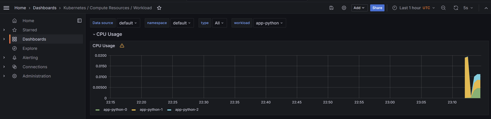
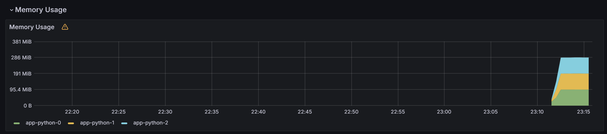
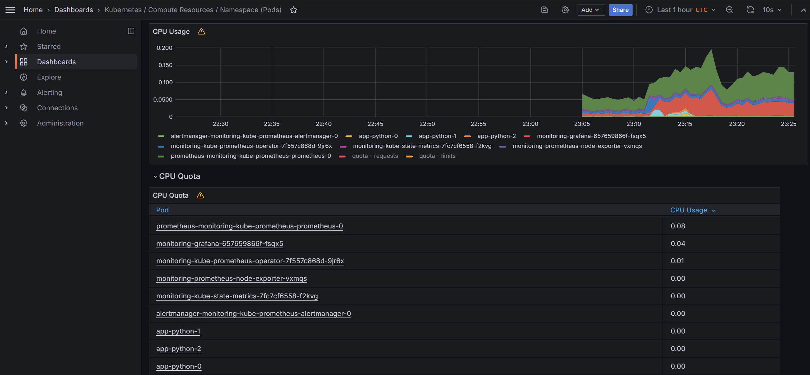
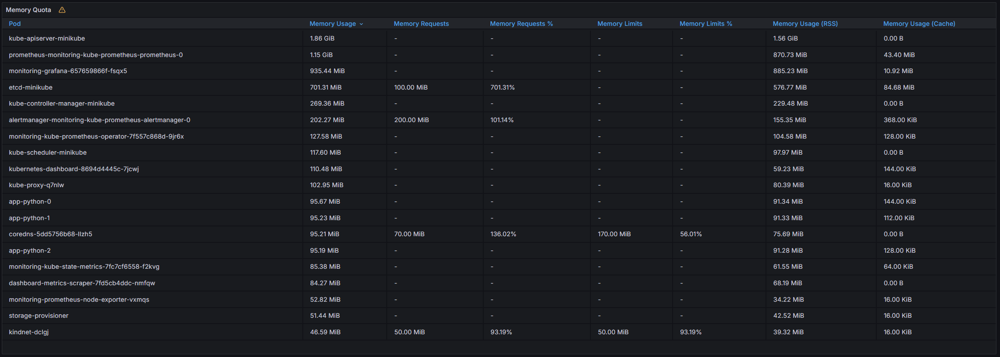
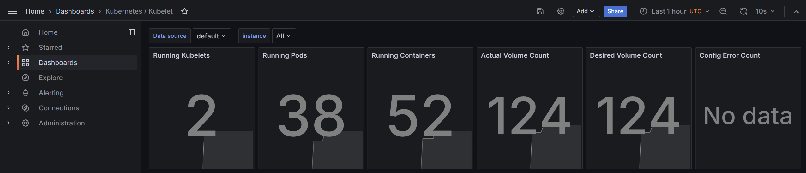
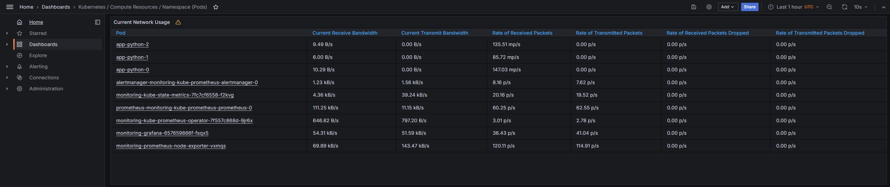
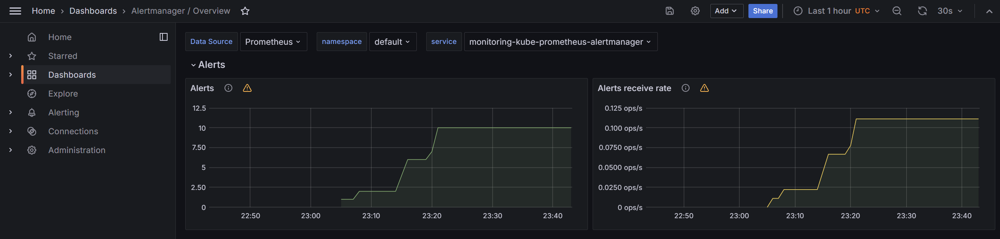

# Kube Prometheus Stack

Kube Prometheus Stack consists of the following components:

- Prometheus Operator, which is used to monitor Kubernetes cluster;
- Various plugins and scripts for Prometheus to collect different metrics and to allow monitoring various components of
  the cluster;
- Grafana dashboards for visualization of collected data.

##       

```bash
$ kubectl get po,sts,svc,pvc,cm                
NAME                                                         READY   STATUS    RESTARTS   AGE
pod/alertmanager-monitoring-kube-prometheus-alertmanager-0   2/2     Running   0          37m
pod/app-python-0                                             1/1     Running   0          27m
pod/app-python-1                                             1/1     Running   0          27m
pod/app-python-2                                             1/1     Running   0          27m
pod/monitoring-grafana-657659866f-fsqx5                      3/3     Running   0          38m
pod/monitoring-kube-prometheus-operator-7f557c868d-9jr6x     1/1     Running   0          38m
pod/monitoring-kube-state-metrics-7fc7cf6558-f2kvg           1/1     Running   0          38m
pod/monitoring-prometheus-node-exporter-vxmqs                1/1     Running   0          38m
pod/prometheus-monitoring-kube-prometheus-prometheus-0       2/2     Running   0          37m

NAME                                                                    READY   AGE
statefulset.apps/alertmanager-monitoring-kube-prometheus-alertmanager   1/1     37m
statefulset.apps/app-python                                             3/3     27m
statefulset.apps/prometheus-monitoring-kube-prometheus-prometheus       1/1     37m

NAME                                              TYPE        CLUSTER-IP       EXTERNAL-IP   PORT(S)                      AGE
service/alertmanager-operated                     ClusterIP   None             <none>        9093/TCP,9094/TCP,9094/UDP   37m
service/app-python                                ClusterIP   10.108.14.180    <none>        80/TCP                       27m
service/kubernetes                                ClusterIP   10.96.0.1        <none>        443/TCP                      13d
service/monitoring-grafana                        ClusterIP   10.102.160.56    <none>        80/TCP                       38m
service/monitoring-kube-prometheus-alertmanager   ClusterIP   10.110.114.198   <none>        9093/TCP,8080/TCP            38m
service/monitoring-kube-prometheus-operator       ClusterIP   10.108.74.175    <none>        443/TCP                      38m
service/monitoring-kube-prometheus-prometheus     ClusterIP   10.101.66.229    <none>        9090/TCP,8080/TCP            38m
service/monitoring-kube-state-metrics             ClusterIP   10.110.46.33     <none>        8080/TCP                     38m
service/monitoring-prometheus-node-exporter       ClusterIP   10.104.47.27     <none>        9100/TCP                     38m
service/prometheus-operated                       ClusterIP   None             <none>        9090/TCP                     37m

NAME                                                                     DATA   AGE
configmap/app-python                                                     1      27m
configmap/kube-root-ca.crt                                               1      13d
configmap/monitoring-grafana                                             1      38m
configmap/monitoring-grafana-config-dashboards                           1      38m
configmap/monitoring-kube-prometheus-alertmanager-overview               1      38m
configmap/monitoring-kube-prometheus-apiserver                           1      38m
configmap/monitoring-kube-prometheus-cluster-total                       1      38m
configmap/monitoring-kube-prometheus-controller-manager                  1      38m
configmap/monitoring-kube-prometheus-etcd                                1      38m
configmap/monitoring-kube-prometheus-grafana-datasource                  1      38m
configmap/monitoring-kube-prometheus-grafana-overview                    1      38m
configmap/monitoring-kube-prometheus-k8s-coredns                         1      38m
configmap/monitoring-kube-prometheus-k8s-resources-cluster               1      38m
configmap/monitoring-kube-prometheus-k8s-resources-multicluster          1      38m
configmap/monitoring-kube-prometheus-k8s-resources-namespace             1      38m
configmap/monitoring-kube-prometheus-k8s-resources-node                  1      38m
configmap/monitoring-kube-prometheus-k8s-resources-pod                   1      38m
configmap/monitoring-kube-prometheus-k8s-resources-workload              1      38m
configmap/monitoring-kube-prometheus-k8s-resources-workloads-namespace   1      38m
configmap/monitoring-kube-prometheus-kubelet                             1      38m
configmap/monitoring-kube-prometheus-namespace-by-pod                    1      38m
configmap/monitoring-kube-prometheus-namespace-by-workload               1      38m
configmap/monitoring-kube-prometheus-node-cluster-rsrc-use               1      38m
configmap/monitoring-kube-prometheus-node-rsrc-use                       1      38m
configmap/monitoring-kube-prometheus-nodes                               1      38m
configmap/monitoring-kube-prometheus-nodes-darwin                        1      38m
configmap/monitoring-kube-prometheus-persistentvolumesusage              1      38m
configmap/monitoring-kube-prometheus-pod-total                           1      38m
configmap/monitoring-kube-prometheus-prometheus                          1      38m
configmap/monitoring-kube-prometheus-proxy                               1      38m
configmap/monitoring-kube-prometheus-scheduler                           1      38m
configmap/monitoring-kube-prometheus-workload-total                      1      38m
configmap/prometheus-monitoring-kube-prometheus-prometheus-rulefiles-0   35     37m
```

There are 9 pods running, 3 of which belong to the app `app-python` and others are monitoring tools such as
AlertManager, Grafana, Prometheus Operator, etc.
There are also 3 Stateful Sets, for the AlertManager, the app, and main Kube Prometheus module.
To access the system, there are 10 services for each module; finally, there are configuration _ConfigMap_ files.

## Grafana Dashboards

1. CPU and Memory consumption of `app-python`

   

   

2. Pods CPU usage in the default namespace

   The highest usage is by `prometheus-monitoring-kube-prometheus-prometheus-0` and lowest by `app-python-0`:
   

3. Node memory usage (in % and megabytes)

   

4. Kubelet info

   The number of pods is 38 and containers is 52:
   

5. Pods network usage in the default namespace

   

6. Active alerts

   There are 10 active alerts:
   
   

## Init Container

```bash
$ kubectl exec pod/app-python-1 -- cat workdir/index.html
Defaulted container "app-python" out of: app-python, install (init)
<html><head></head><body><header>
<title>http://info.cern.ch</title>
</header>

<h1>http://info.cern.ch - home of the first website</h1>
<p>From here you can:</p>
<ul>
<li><a href="http://info.cern.ch/hypertext/WWW/TheProject.html">Browse the first website</a></li>
<li><a href="http://line-mode.cern.ch/www/hypertext/WWW/TheProject.html">Browse the first website using the line-mode browser simulator</a></li>
<li><a href="http://home.web.cern.ch/topics/birth-web">Learn about the birth of the web</a></li>
<li><a href="http://home.web.cern.ch/about">Learn about CERN, the physics laboratory where the web was born</a></li>
</ul>
</body></html>
```