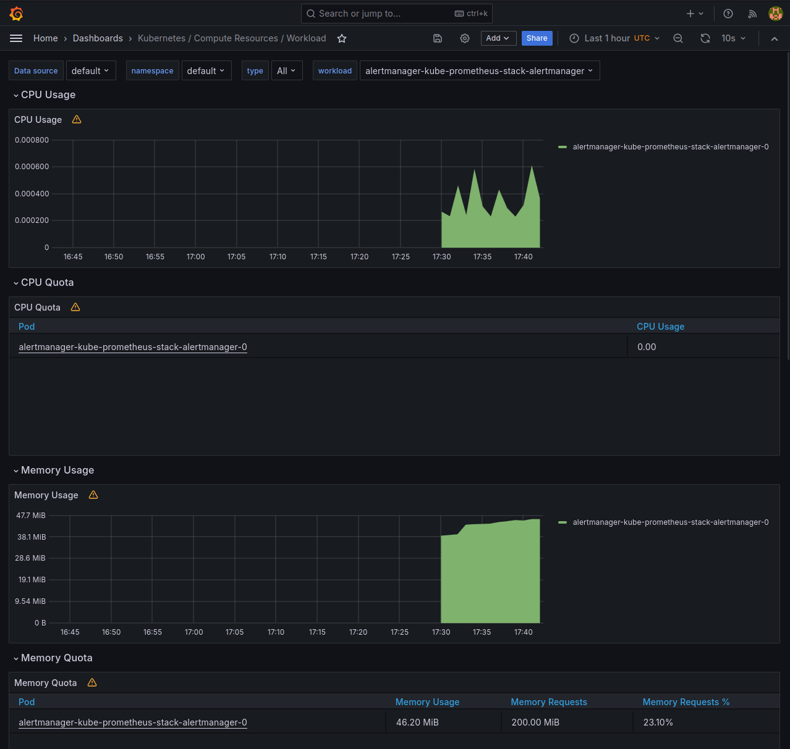
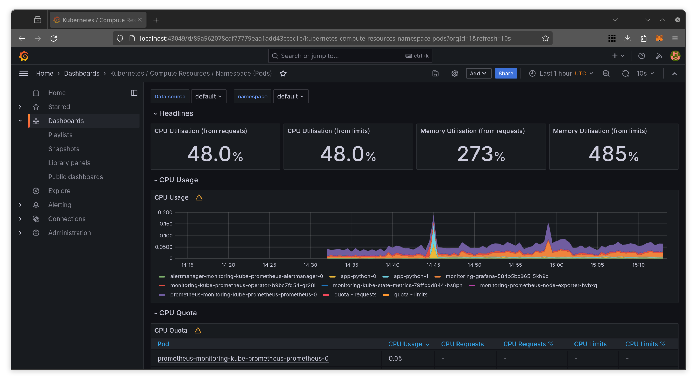
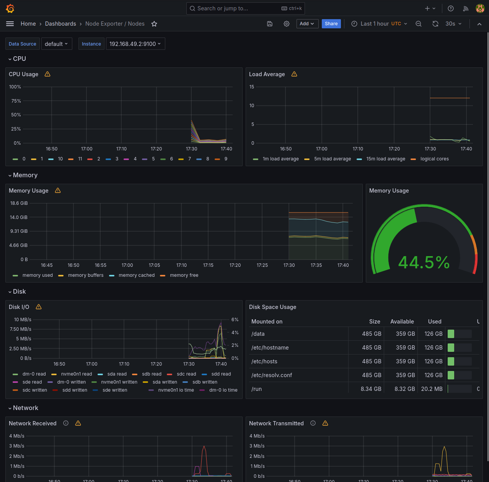
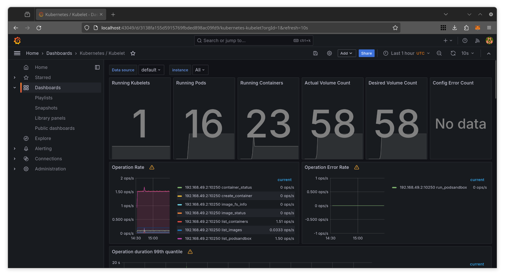
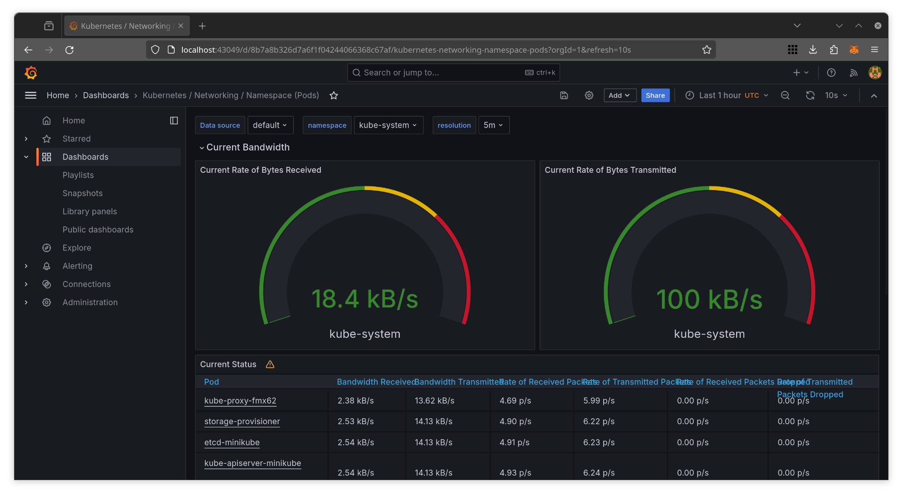
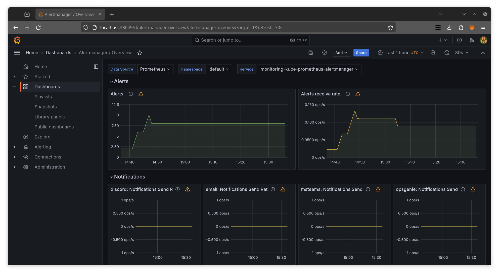
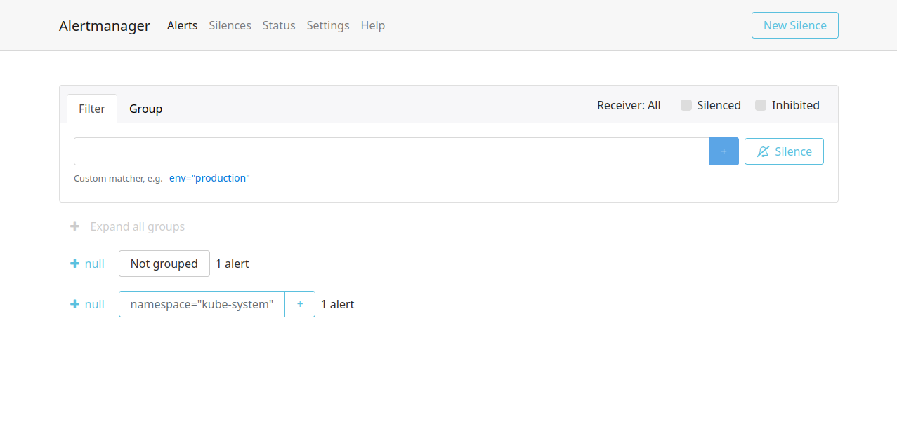
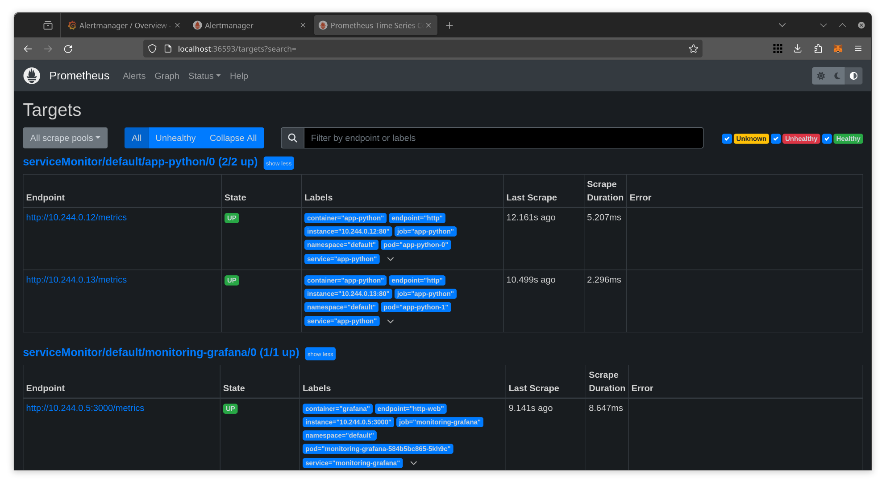

# Kubernetes Prometheus

## Components description

- **Grafana**: This tools helps in visualizing data through lots of dashboards.

- **Prometheus Operator**: This tool simplifies the process of launching a
  Prometheus system on a Kubernetes cluster.

- **Prometheus**: This component is responsible for gathering and storing metrics
  from applications.

- **Alertmanager**: This element manages alerts generated by Prometheus, sending
  them to predefined channels (for example, email).

- **Prometheus Node Exporter**: This module collects operating system and hardware
  metrics for Prometheus.

- **Prometheus Blackbox Exporter**: This tool examines endpoints via HTTP, HTTPS,
  DNS, TCP, and ICMP to verify the availability of services.

- **Prometheus Adapter for Kubernetes Metrics APIs**: This adapter accumulates
  metrics from Kubernetes and presents them to Prometheus.

- **kube-state-metrics**: This service observes the Kubernetes API server and
  generates metrics about the state of objects for Prometheus.

## Installation

Install prometheus stack:

```bash
$ helm repo add prometheus-community https://prometheus-community.github.io/helm-charts
"prometheus-community" has been added to your repositories

$ helm repo update
Hang tight while we grab the latest from your chart repositories...
...Successfully got an update from the "hashicorp" chart repository
...Successfully got an update from the "prometheus-community" chart repository
Update Complete. ⎈Happy Helming!⎈

$ helm install kube-prometheus-stack prometheus-community/kube-prometheus-stack --version 57.2.0 -f prometheus/config.yaml
NAME: kube-prometheus-stack
LAST DEPLOYED: Tue May  7 20:28:14 2024
NAMESPACE: default
STATUS: deployed
REVISION: 1
NOTES:
kube-prometheus-stack has been installed. Check its status by running:
  kubectl --namespace default get pods -l "release=kube-prometheus-stack"

Visit https://github.com/prometheus-operator/kube-prometheus for instructions on how to create & configure Alertmanager and Prometheus instances using the Operator.
```

Completely reinstall `app-python`:

```bash
$ helm uninstall app-python
release "app-python" uninstalled

$ helm secrets install app-python app-python -n default -f secrets.yaml
NAME: app-python
LAST DEPLOYED: Tue May  7 20:28:49 2024
NAMESPACE: default
STATUS: deployed
REVISION: 1
NOTES:
1. Get the application URL by running these commands:
  export POD_NAME=$(kubectl get pods --namespace default -l "app.kubernetes.io/name=app-python,app.kubernetes.io/instance=app-python" -o jsonpath="{.items[0].metadata.name}")
  export CONTAINER_PORT=$(kubectl get pod --namespace default $POD_NAME -o jsonpath="{.spec.containers[0].ports[0].containerPort}")
  echo "Visit http://127.0.0.1:8080 to use your application"
  kubectl --namespace default port-forward $POD_NAME 8080:$CONTAINER_PORT
removed 'secrets.yaml.dec'
```

I will also write explanation below as Bash comments:

```bash
$ kubectl get po,sts,svc,pvc,cm

# List of currently running Pods in the cluster

NAME                                                            READY   STATUS    RESTARTS   AGE
pod/alertmanager-kube-prometheus-stack-alertmanager-0           2/2     Running   0          92s
pod/app-python-0                                                1/1     Running   0          42s
pod/app-python-1                                                1/1     Running   0          42s
pod/app-python-2                                                1/1     Running   0          42s
pod/kube-prometheus-stack-grafana-5c878c597-h7pxn               3/3     Running   0          93s
pod/kube-prometheus-stack-kube-state-metrics-68c87d7759-24mlz   1/1     Running   0          93s
pod/kube-prometheus-stack-operator-54775b488d-kw52g             1/1     Running   0          93s
pod/kube-prometheus-stack-prometheus-node-exporter-cqvgd        1/1     Running   0          93s
pod/prometheus-kube-prometheus-stack-prometheus-0               2/2     Running   0          92s

# List of statefulsets

NAME                                                               READY   AGE
statefulset.apps/alertmanager-kube-prometheus-stack-alertmanager   1/1     92s
statefulset.apps/app-python                                        3/3     43s
statefulset.apps/prometheus-kube-prometheus-stack-prometheus       1/1     92s

# Services list, with type, IP/port

NAME                                                     TYPE        CLUSTER-IP       EXTERNAL-IP   PORT(S)                      AGE
service/alertmanager-operated                            ClusterIP   None             <none>        9093/TCP,9094/TCP,9094/UDP   92s
service/app-python                                       ClusterIP   10.109.237.141   <none>        8080/TCP                     43s
service/kube-prometheus-stack-alertmanager               ClusterIP   10.98.132.90     <none>        9093/TCP,8080/TCP            93s
service/kube-prometheus-stack-grafana                    ClusterIP   10.104.97.215    <none>        80/TCP                       93s
service/kube-prometheus-stack-kube-state-metrics         ClusterIP   10.96.224.57     <none>        8080/TCP                     93s
service/kube-prometheus-stack-operator                   ClusterIP   10.110.176.234   <none>        443/TCP                      93s
service/kube-prometheus-stack-prometheus                 ClusterIP   10.99.37.10      <none>        9090/TCP,8080/TCP            93s
service/kube-prometheus-stack-prometheus-node-exporter   ClusterIP   10.100.75.111    <none>        9100/TCP                     93s
service/kubernetes                                       ClusterIP   10.96.0.1        <none>        443/TCP                      85m
service/prometheus-operated                              ClusterIP   None             <none>        9090/TCP                     92s

# List of persistent volume claims, with status, capacity, attrs and age

NAME                                                   STATUS   VOLUME                                     CAPACITY   ACCESS MODES   STORAGECLASS   VOLUMEATTRIBUTESCLASS   AGE
persistentvolumeclaim/app-python-volume-app-python-0   Bound    pvc-55119d12-ec47-4a88-b1bf-4f70ce666b45   10M        RWO            standard       <unset>                 83m
persistentvolumeclaim/app-python-volume-app-python-1   Bound    pvc-925dc778-be26-4f94-bf9c-305716dd88b1   10M        RWO            standard       <unset>                 83m
persistentvolumeclaim/app-python-volume-app-python-2   Bound    pvc-2e43a359-6c89-4728-bf06-79e87150d145   10M        RWO            standard       <unset>                 83m
persistentvolumeclaim/workdir-app-python-0             Bound    pvc-a9561bf2-12e2-46b8-86a4-75da604fef5c   1Gi        RWO            standard       <unset>                 83m
persistentvolumeclaim/workdir-app-python-1             Bound    pvc-6410b313-ead8-4aa2-aa5b-bbd14e263278   1Gi        RWO            standard       <unset>                 83m
persistentvolumeclaim/workdir-app-python-2             Bound    pvc-56d09cb2-dcb7-4dd1-a9a2-3304c40e9c9e   1Gi        RWO            standard       <unset>                 83m

# List of configMaps
# https://kubernetes.io/docs/concepts/configuration/configmap/

# configmap/app-python-config - from Lab 12
# Remaining configMaps are related to kube-prometheus-stack

NAME                                                                DATA   AGE
configmap/app-python-config                                         1      43s
configmap/kube-prometheus-stack-alertmanager-overview               1      93s
configmap/kube-prometheus-stack-apiserver                           1      93s
configmap/kube-prometheus-stack-cluster-total                       1      93s
configmap/kube-prometheus-stack-controller-manager                  1      93s
configmap/kube-prometheus-stack-etcd                                1      93s
configmap/kube-prometheus-stack-grafana                             1      93s
configmap/kube-prometheus-stack-grafana-config-dashboards           1      93s
configmap/kube-prometheus-stack-grafana-datasource                  1      93s
configmap/kube-prometheus-stack-grafana-overview                    1      93s
configmap/kube-prometheus-stack-k8s-coredns                         1      93s
configmap/kube-prometheus-stack-k8s-resources-cluster               1      93s
configmap/kube-prometheus-stack-k8s-resources-multicluster          1      93s
configmap/kube-prometheus-stack-k8s-resources-namespace             1      93s
configmap/kube-prometheus-stack-k8s-resources-node                  1      93s
configmap/kube-prometheus-stack-k8s-resources-pod                   1      93s
configmap/kube-prometheus-stack-k8s-resources-workload              1      93s
configmap/kube-prometheus-stack-k8s-resources-workloads-namespace   1      93s
configmap/kube-prometheus-stack-kubelet                             1      93s
configmap/kube-prometheus-stack-namespace-by-pod                    1      93s
configmap/kube-prometheus-stack-namespace-by-workload               1      93s
configmap/kube-prometheus-stack-node-cluster-rsrc-use               1      93s
configmap/kube-prometheus-stack-node-rsrc-use                       1      93s
configmap/kube-prometheus-stack-nodes                               1      93s
configmap/kube-prometheus-stack-nodes-darwin                        1      93s
configmap/kube-prometheus-stack-persistentvolumesusage              1      93s
configmap/kube-prometheus-stack-pod-total                           1      93s
configmap/kube-prometheus-stack-prometheus                          1      93s
configmap/kube-prometheus-stack-proxy                               1      93s
configmap/kube-prometheus-stack-scheduler                           1      93s
configmap/kube-prometheus-stack-workload-total                      1      93s
configmap/kube-root-ca.crt                                          1      85m
configmap/prometheus-kube-prometheus-stack-prometheus-rulefiles-0   35     82s
```

## Cluster info

1. Check CPU and Memory consumption of your StatefulSet.

  CPU time: at most `0.006`
  Memory usage: `46.2MiB`

  

2. Identify Pods with higher and lower CPU usage in the default namespace.

  Highest CPU usage: `alertmanager-kube-prometheus-stack-alermanager-0`
  Lowest CPU usage: `prometheus-kube-prometheus-stack-prometheus-0`

  

3. Monitor node memory usage in percentage and megabytes.

  Memory usage (%): `44.5%`
  Memory usage (GiB): `7.1-7.2GiB`

  

4. Count the number of pods and containers managed by the Kubelet service.

  Running pods #: `17`
  Running containers #: `34`

  

5. Evaluate network usage of Pods in the default namespace.

  Download speed: `1.71kB/s`
  Upload speed: `78.5kB/s`

  

6. Determine the number of active alerts.

  Alerts #: `8` (I rechecked and it has been stabilized)

  

  

## Init Containers (already with queue for bonus points)

```bash
$ kubectl exec app-python-0 -- cat /work-dir/index.html
Defaulted container "app-python" out of: app-python, indexhtml (init), hello (init), world (init)
<html><head></head><body><header>
<title>http://info.cern.ch</title>
</header>

<h1>http://info.cern.ch - home of the first website</h1>
<p>From here you can:</p>
<ul>
<li><a href="http://info.cern.ch/hypertext/WWW/TheProject.html">Browse the first website</a></li>
<li><a href="http://line-mode.cern.ch/www/hypertext/WWW/TheProject.html">Browse the first website using the line-mode browser simulator</a></li>
<li><a href="http://home.web.cern.ch/topics/birth-web">Learn about the birth of the web</a></li>
<li><a href="http://home.web.cern.ch/about">Learn about CERN, the physics laboratory where the web was born</a></li>
</ul>
</body></html>

$ kubectl exec app-python-0 -- cat /work-dir/helloworld.txt
Defaulted container "app-python" out of: app-python, indexhtml (init), hello (init), world (init)
hello
world
```

## App metrics

`app-python` pods are listed as targets:



`app-python` pods metrics:


