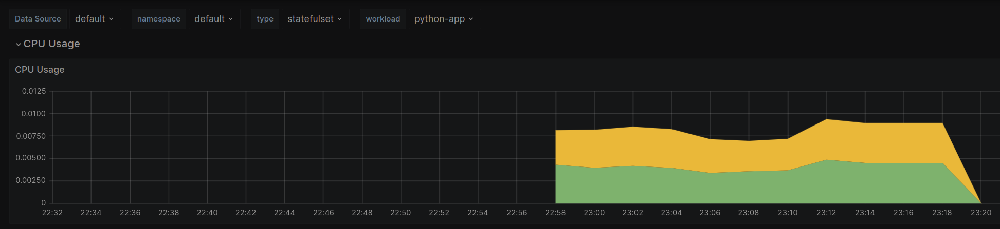
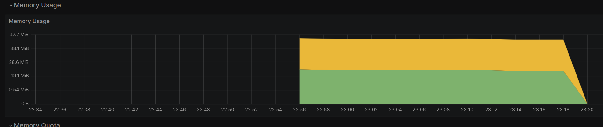
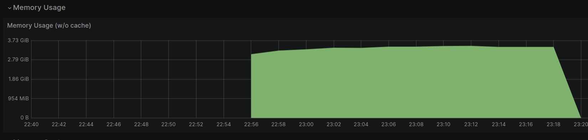
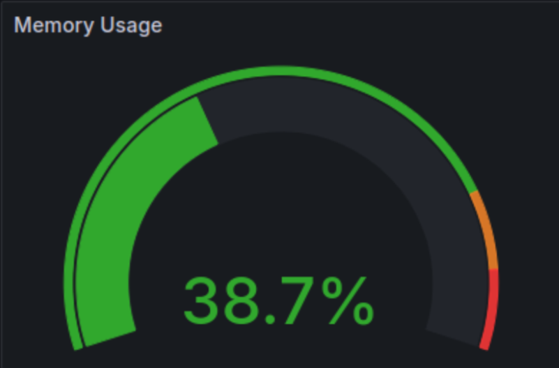
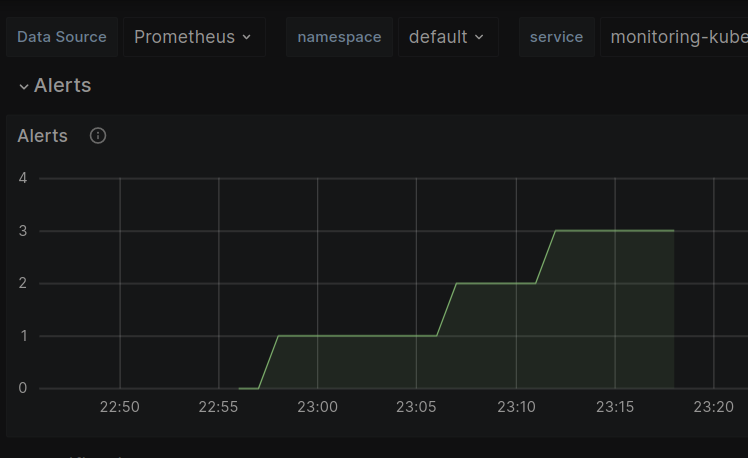
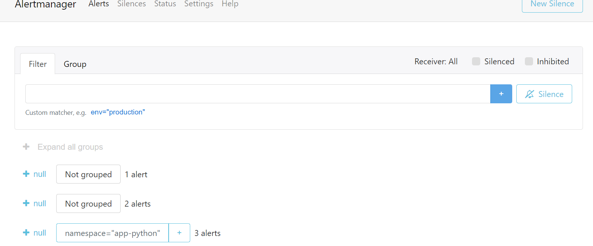
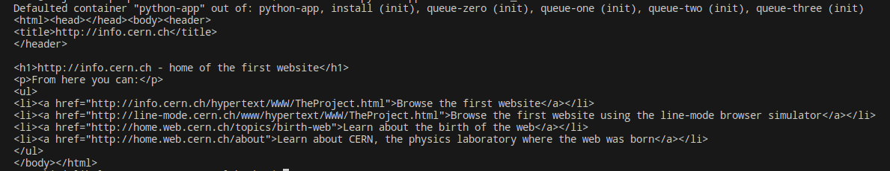

# Kubernetes Monitoring and Init Containers
## Task 1: Kubernetes Cluster Monitoring with Prometheus
### Understanding the Kube Prometheus Stack Components

1. **Prometheus Operator**: Manages Prometheus instances in Kubernetes, ensuring their provisioning and configuration.
  
2. **Prometheus**: Collects metrics from monitored targets for real-time monitoring.

3. **Alertmanager**: Handles and routes alerts sent by Prometheus for reliable alert processing.

4. **Prometheus node-exporter**: Gathers system-level metrics from Kubernetes nodes for health and performance insights.

5. **Prometheus blackbox-exporter**: Monitors external services by simulating interactions and collecting metrics.

6. **Prometheus Adapter for Kubernetes Metrics APIs**: Translates Kubernetes resource metrics for Prometheus scraping.

7. **kube-state-metrics**: Provides detailed insights into the state of Kubernetes objects for cluster health monitoring.

8. **Grafana**: Visualizes collected metrics through interactive dashboards for monitoring and analysis.


### Helm Charts Installation
The output of the command  `kubectl get po,sts,svc,pvc,cm` consists of:
- a list of pods running in the cluster
```shell
NAME                                                            READY   STATUS    RESTARTS   AGE
pod/alertmanager-kube-prometheus-stack-alertmanager-0           2/2     Running   0          8m22s
pod/app-python-0                                                1/1     Running   0          57s
pod/app-python-1                                                1/1     Running   0          57s
pod/prometheus-kube-prometheus-stack-prometheus-0               2/2     Running   0          8m21s
pod/kube-prometheus-stack-grafana-1se3204wg6-3wl23              3/3     Running   0          8m29s
pod/kube-prometheus-stack-kube-state-metrics-31205d2635-s2erk   1/1     Running   0          8m29s
pod/kube-prometheus-stack-prometheus-node-exporter-2wecr        1/1     Running   0          8m29s
pod/kube-prometheus-stack-operator-4523tg735c-ywhp4             1/1     Running   0          8m29s
```
- a list of stateful sets with their status and age
```shell
NAME                                                               READY   AGE
statefulset.apps/alertmanager-kube-prometheus-stack-alertmanager   1/1     8m28s
statefulset.apps/prometheus-kube-prometheus-stack-prometheus       1/1     8m22s
statefulset.apps/app-python                                        2/2     58s
```

- a list of services with their type, cluster IPs and port(s)
```shell
NAME                                                     TYPE        CLUSTER-IP       EXTERNAL-IP   PORT(S)                      AGE
service/alertmanager-operated                            ClusterIP   None             <none>        9093/TCP,9094/TCP,9094/UDP   8m428s
service/app-python                                       NodePort    10.96.226.226    <none>        5000:30389/TCP               58s
service/kubernetes                                       ClusterIP   10.96.0.1        <none>        443/TCP                      11m10s
service/kube-prometheus-stack-alertmanager               ClusterIP   10.110.138.119   <none>        9093/TCP,8080/TCP            8m30s
service/kube-prometheus-stack-grafana                    ClusterIP   10.106.15.176    <none>        80/TCP                       8m30s
service/kube-prometheus-stack-kube-state-metrics         ClusterIP   10.106.213.85    <none>        8080/TCP                     8m30s
service/kube-prometheus-stack-prometheus-node-exporter   ClusterIP   10.108.56.178    <none>        9100/TCP                     8m30s
service/kube-prometheus-stack-operator                   ClusterIP   10.104.143.233   <none>        443/TCP                      8m30s
service/kube-prometheus-stack-prometheus                 ClusterIP   10.101.121.147   <none>        9090/TCP,8080/TCP            8m30s
service/prometheus-operated                              ClusterIP   None             <none>        9090/TCP                     8m22s
```

- a list of volumes with their capacity, access mode, storage class and age
```shell
NAME                                      STATUS   VOLUME                                     CAPACITY   ACCESS MODES   STORAGECLASS   AGE
persistentvolumeclaim/data-app-python-0   Bound    pvc-2db458ed-c5vw-352g-37g6-sh3ksrn528f2   1Mi        RWO            standard       58s
persistentvolumeclaim/data-app-python-1   Bound    pvc-1935r278-f245-3s68-3g26-83f2r5vwk20h   1Mi        RWO            standard       58s
```

- a list of configmaps with their data and age
```shell
NAME                                                                DATA   AGE
configmap/config                                                    1      58s
configmap/kube-prometheus-stack-alertmanager-overview               1      8m30s
configmap/kube-prometheus-stack-cluster-total                       1      8m30s
configmap/kube-prometheus-stack-controller-manager                  1      8m30s
configmap/kube-prometheus-stack-etcd                                1      8m30s
configmap/kube-prometheus-stack-apiserver                           1      8m30s
configmap/kube-prometheus-stack-grafana                             1      8m30s
configmap/kube-prometheus-stack-grafana-config-dashboards           1      8m30s
configmap/kube-prometheus-stack-grafana-datasource                  1      8m30s
configmap/kube-prometheus-stack-grafana-overview                    1      8m30s
configmap/kube-prometheus-stack-k8s-coredns                         1      8m30s
configmap/kube-prometheus-stack-k8s-resources-multicluster          1      8m30s
configmap/kube-prometheus-stack-k8s-resources-namespace             1      8m30s
configmap/kube-prometheus-stack-k8s-resources-node                  1      8m30s
configmap/kube-prometheus-stack-k8s-resources-pod                   1      8m30s
configmap/kube-prometheus-stack-k8s-resources-workload              1      8m30s
configmap/kube-prometheus-stack-k8s-resources-cluster               1      8m30s
configmap/kube-prometheus-stack-k8s-resources-workloads-namespace   1      8m30s
configmap/kube-prometheus-stack-kubelet                             1      8m30s
configmap/kube-prometheus-stack-namespace-by-workload               1      8m30s
configmap/kube-prometheus-stack-namespace-by-pod                    1      8m30s
configmap/kube-prometheus-stack-node-cluster-rsrc-use               1      8m30s
configmap/kube-prometheus-stack-node-rsrc-use                       1      8m30s
configmap/kube-prometheus-stack-scheduler                           1      8m30s
configmap/kube-prometheus-stack-workload-total                      1      8m30s
configmap/kube-prometheus-stack-nodes                               1      8m30s
configmap/kube-prometheus-stack-nodes-darwin                        1      8m30s
configmap/kube-prometheus-stack-pod-total                           1      8m30s
configmap/kube-prometheus-stack-prometheus                          1      8m30s
configmap/kube-prometheus-stack-persistentvolumesusage              1      8m30s
configmap/kube-prometheus-stack-proxy                               1      8m30s
configmap/kube-root-ca.crt                                          1      11m10s
configmap/prometheus-kube-prometheus-stack-prometheus-rulefiles-0   35     8m24s
```

### Grafana Dashboards
a. CPU and Memory consumption.


b. Pods with higher and lower CPU usage in the default namespace.
The highest usage: prometheus
The lowest usage: prometheus-operator
c. Node memory usage in percentage and megabytes.


d. The number of pods and containers managed by the Kubelet service.

e. Network usage of Pods in the default namespace.

f. The number of active alerts.



### Init Container 
