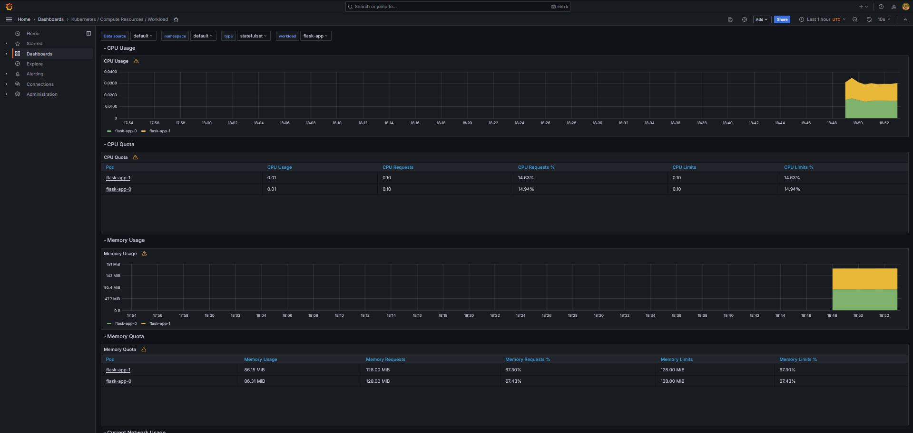
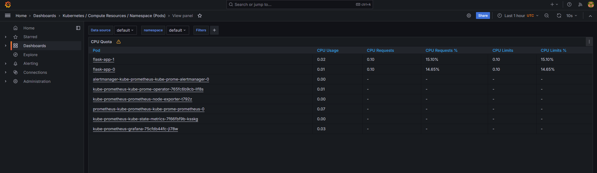
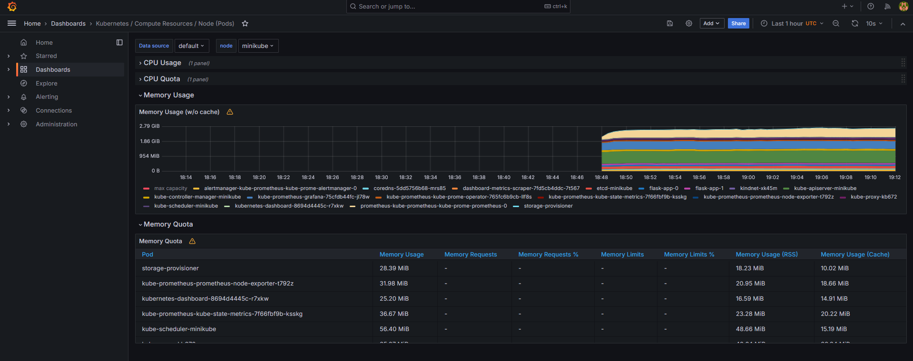
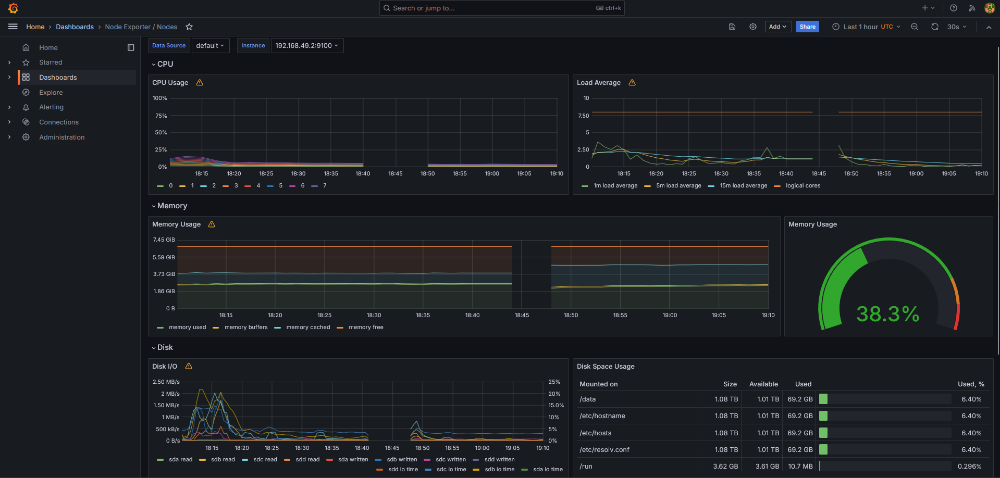
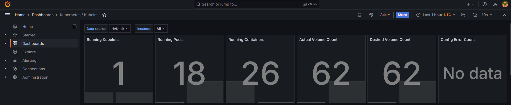
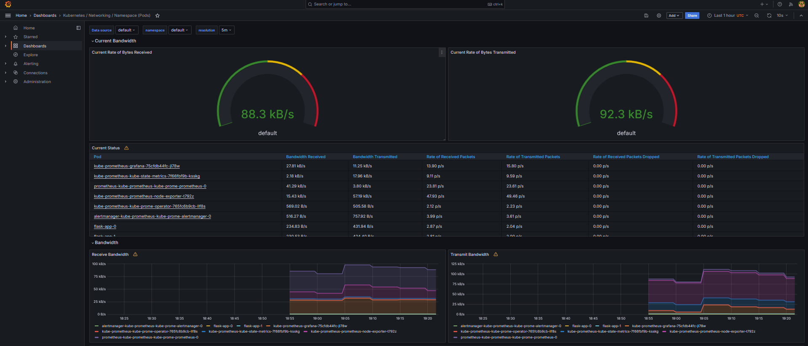
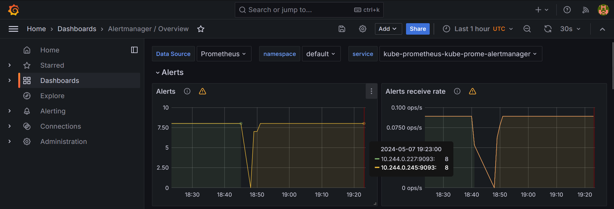
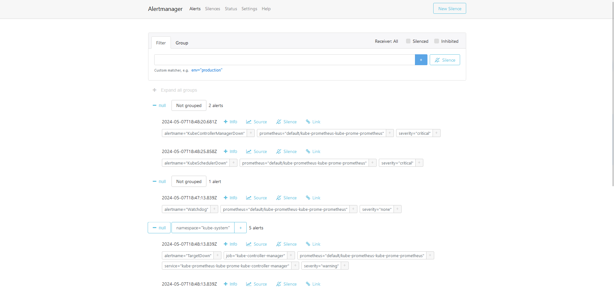

# Task 1.

## Kube Prometheus Stack

### Components

The Kube Prometheus Stack is tool for monitoring Kubernetes environments. Components:

1. **Prometheus Operator**: Main part of stack, manage Prometheus instances and monitoring components.

2. **Highly available Prometheus**: Prometheus is time series database and monitoring system that collect metrics from specified targets. "Highly available" means that stack ensures continuous monitoring even in failures.

3. **Highly available Alertmanager**: Alertmanager handles alerts sent by Prometheus and manages them.

4. **Prometheus node-exporter**: Collects system-level metrics from nodes, such as CPU and memory usage, disk and network utilization.

5. **Prometheus blackbox-exporter**: Probes endpoints over HTTP, HTTPS, DNS, TCP, and ICMP to determine their availability and response times. It's useful for monitoring services from the outside, simulating user usage.

6. **Prometheus Adapter for Kubernetes Metrics APIs**: Adapter for quering metrics from the Kubernetes Metrics API. It allows Prometheus to collect metrics about pods, nodes, and namespaces.

7. **kube-state-metrics**: Listens to the Kubernetes API and generates metrics about state of deployments, pods, and nodes.

8. **Grafana**: Grafana is visualization tool for dashboards and graphs of Kubernetes metrics.

## Commands

Command:
```bash
kubectl get po,sts,svc,pvc,cm
```

Output:
```bash
NAME                                                         READY   STATUS    RESTARTS   AGE
pod/alertmanager-kube-prometheus-kube-prome-alertmanager-0   2/2     Running   0          53m
pod/flask-app-0                                              1/1     Running   0          73s
pod/flask-app-1                                              1/1     Running   0          73s
pod/kube-prometheus-grafana-75cfdb44fc-jl78w                 3/3     Running   0          54m
pod/kube-prometheus-kube-prome-operator-765fc6b9cb-llf8s     1/1     Running   0          54m
pod/kube-prometheus-kube-state-metrics-7f66fbf9b-ksskg       1/1     Running   0          54m
pod/kube-prometheus-prometheus-node-exporter-t792z           1/1     Running   0          54m
pod/prometheus-kube-prometheus-kube-prome-prometheus-0       2/2     Running   0          53m

NAME                                                                    READY   AGE
statefulset.apps/alertmanager-kube-prometheus-kube-prome-alertmanager   1/1     53m
statefulset.apps/flask-app                                              2/2     73s
statefulset.apps/prometheus-kube-prometheus-kube-prome-prometheus       1/1     53m

NAME                                               TYPE        CLUSTER-IP       EXTERNAL-IP   PORT(S)                      AGE
service/alertmanager-operated                      ClusterIP   None             <none>        9093/TCP,9094/TCP,9094/UDP   53m
service/flask-app                                  ClusterIP   10.109.75.133    <none>        8080/TCP                     73s
service/kube-prometheus-grafana                    ClusterIP   10.102.193.44    <none>        80/TCP                       54m
service/kube-prometheus-kube-prome-alertmanager    ClusterIP   10.99.244.251    <none>        9093/TCP,8080/TCP            54m
service/kube-prometheus-kube-prome-operator        ClusterIP   10.101.163.168   <none>        443/TCP                      54m
service/kube-prometheus-kube-prome-prometheus      ClusterIP   10.102.33.14     <none>        9090/TCP,8080/TCP            54m
service/kube-prometheus-kube-state-metrics         ClusterIP   10.110.188.100   <none>        8080/TCP                     54m
service/kube-prometheus-prometheus-node-exporter   ClusterIP   10.109.125.121   <none>        9100/TCP                     54m
service/kubernetes                                 ClusterIP   10.96.0.1        <none>        443/TCP                      29d
service/prometheus-operated                        ClusterIP   None             <none>        9090/TCP                     53m

NAME                                           STATUS   VOLUME                                     CAPACITY   ACCESS MODES   STORAGECLASS   AGE
persistentvolumeclaim/app-volume-flask-app-0   Bound    pvc-2709b7d8-e76c-4a14-8603-518938fb33c6   10M        RWO            standard       4m38s
persistentvolumeclaim/app-volume-flask-app-1   Bound    pvc-6e1893a6-189b-4274-a26e-dbf53c6c5fb4   10M        RWO            standard       4m38s

NAME                                                                     DATA   AGE
configmap/app-config                                                     1      73s
configmap/kube-prometheus-grafana                                        1      54m
configmap/kube-prometheus-grafana-config-dashboards                      1      54m
configmap/kube-prometheus-kube-prome-alertmanager-overview               1      54m
configmap/kube-prometheus-kube-prome-apiserver                           1      54m
configmap/kube-prometheus-kube-prome-cluster-total                       1      54m
configmap/kube-prometheus-kube-prome-controller-manager                  1      54m
configmap/kube-prometheus-kube-prome-etcd                                1      54m
configmap/kube-prometheus-kube-prome-grafana-datasource                  1      54m
configmap/kube-prometheus-kube-prome-grafana-overview                    1      54m
configmap/kube-prometheus-kube-prome-k8s-coredns                         1      54m
configmap/kube-prometheus-kube-prome-k8s-resources-cluster               1      54m
configmap/kube-prometheus-kube-prome-k8s-resources-multicluster          1      54m
configmap/kube-prometheus-kube-prome-k8s-resources-namespace             1      54m
configmap/kube-prometheus-kube-prome-k8s-resources-node                  1      54m
configmap/kube-prometheus-kube-prome-k8s-resources-pod                   1      54m
configmap/kube-prometheus-kube-prome-k8s-resources-workload              1      54m
configmap/kube-prometheus-kube-prome-k8s-resources-workloads-namespace   1      54m
configmap/kube-prometheus-kube-prome-kubelet                             1      54m
configmap/kube-prometheus-kube-prome-namespace-by-pod                    1      54m
configmap/kube-prometheus-kube-prome-namespace-by-workload               1      54m
configmap/kube-prometheus-kube-prome-node-cluster-rsrc-use               1      54m
configmap/kube-prometheus-kube-prome-node-rsrc-use                       1      54m
configmap/kube-prometheus-kube-prome-nodes                               1      54m
configmap/kube-prometheus-kube-prome-nodes-darwin                        1      54m
configmap/kube-prometheus-kube-prome-persistentvolumesusage              1      54m
configmap/kube-prometheus-kube-prome-pod-total                           1      54m
configmap/kube-prometheus-kube-prome-prometheus                          1      54m
configmap/kube-prometheus-kube-prome-proxy                               1      54m
configmap/kube-prometheus-kube-prome-scheduler                           1      54m
configmap/kube-prometheus-kube-prome-workload-total                      1      54m
configmap/kube-root-ca.crt                                               1      37d
configmap/prometheus-kube-prometheus-kube-prome-prometheus-rulefiles-0   35     53m
```

***Explanations:***

1. **Pods**:
    - **alertmanager-kube-prometheus-kube-prome-alertmanager-0**: 2 containers, serving Alertmanager.
    - **flask-app-0**: instance of my app.
    - **flask-app-1**: another instance of my app.
    - **kube-prometheus-grafana-75cfdb44fc-jl78w**: 3 containers, serving Grafana.
    - **kube-prometheus-kube-prome-operator-765fc6b9cb-llf8s**: managing Prometheus instances.
    - **kube-prometheus-kube-state-metrics-7f66fbf9b-ksskg**: responsible for collecting Kubernetes state metrics.
    - **kube-prometheus-prometheus-node-exporter-t792z**: collecting node-level metrics.
    - **prometheus-kube-prometheus-kube-prome-prometheus-0**: 2 containers, representing the Prometheus server.

2. **StatefulSets (sts)**:
    - **alertmanager-kube-prometheus-kube-prome-alertmanager**: managing the Alertmanager pods.
    - **flask-app**: 2 pods for my app.
    - **prometheus-kube-prometheus-kube-prome-prometheus**: controlling the Prometheus pods.

3. **Services (svc)**:
    - **alertmanager-operated**: internal service for the Alertmanager.
    - **flask-app**: exposing my app internally.
    - **kube-prometheus-grafana**: providing access to Grafana.
    - **kube-prometheus-kube-prome-alertmanager**: internal service for the Alertmanager.
    - **kube-prometheus-kube-prome-operator**: internal service for the Prometheus Operator.
    - **kube-prometheus-kube-prome-prometheus**: internal service for Prometheus.
    - **kube-prometheus-kube-state-metrics**: internal service for kube-state-metrics.
    - **kube-prometheus-prometheus-node-exporter**: internal service for node-exporter.
    - **kubernetes**: standard service for Kubernetes.
    - **prometheus-operated**: internal service for Prometheus.

4. **PersistentVolumeClaims (pvc)**:
    - **app-volume-flask-app-0**: Persistent Volume Claim for my app-0.
    - **app-volume-flask-app-1**: PVC for my app-1.

5. **ConfigMaps (cm)**:
    - Various ConfigMaps storing configuration data used by different components such as Prometheus, Alertmanager, Grafana, and kube-state-metrics. These ConfigMaps contain dashboard configurations, API server information, resource utilization metrics, and more, aiding in the proper functioning and customization of the monitoring stack.


## Screens from dashboards

### a. Check CPU and Memory consumption of your StatefulSet.



### b. Identify Pods with higher and lower CPU usage in the default namespace.



### c. Monitor node memory usage in percentage and megabytes.




### d.Count the number of pods and containers managed by the Kubelet service.



### e. Evaluate network usage of Pods in the default namespace.



### f. Determine the number of active alerts; also check the Web UI with minikube service monitoring-kube-prometheus-alertmanager.




# Task 2.

Command:
```bash
ubectl exec pod/flask-app-0 -- cat /initcont_data/test.html
```

Output:
```bash
Defaulted container "flask-app" out of: flask-app, init-cont (init)
<html><head></head><body><header>
<title>http://info.cern.ch</title>
</header>

<h1>http://info.cern.ch - home of the first website</h1>
<p>From here you can:</p>
<ul>
<li><a href="http://info.cern.ch/hypertext/WWW/TheProject.html">Browse the first website</a></li>
<li><a href="http://line-mode.cern.ch/www/hypertext/WWW/TheProject.html">Browse the first website using the line-mode browser simulator</a></li>
<li><a href="http://home.web.cern.ch/topics/birth-web">Learn about the birth of the web</a></li>
<li><a href="http://home.web.cern.ch/about">Learn about CERN, the physics laboratory where the web was born</a></li>
</ul>
</body></html>
```