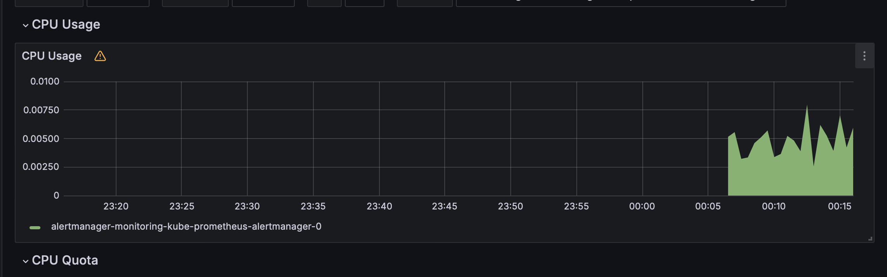
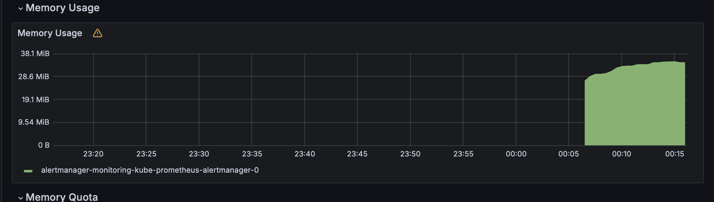
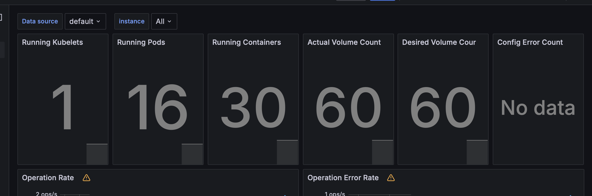
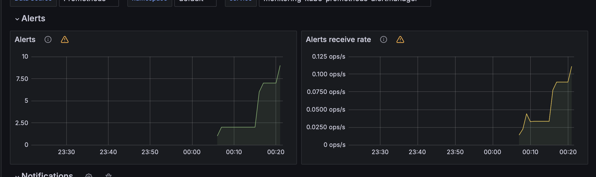
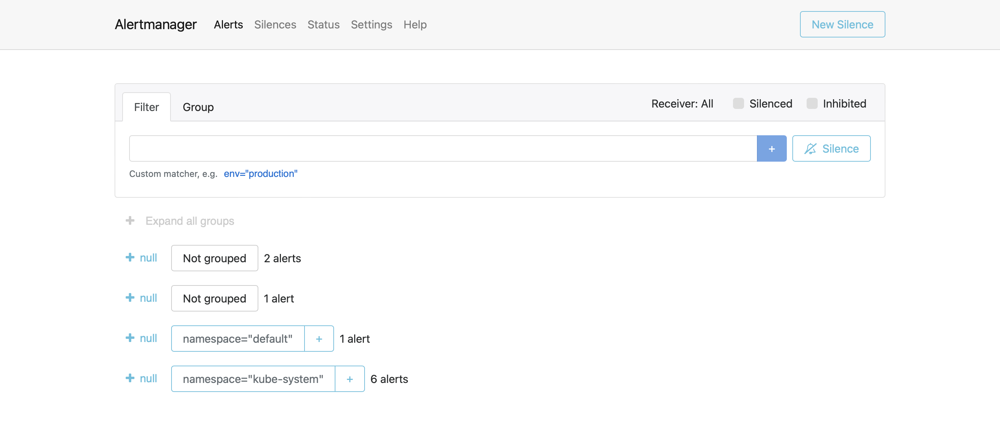

# Helm charts monitoring

```text
❯ helm install manual-flask ./manual-flask
NAME: manual-flask
LAST DEPLOYED: Tue May  7 03:03:37 2024
NAMESPACE: default
STATUS: deployed
REVISION: 1
NOTES:
1. Get the application URL by running these commands:
  export POD_NAME=$(kubectl get pods --namespace default -l "app.kubernetes.io/name=manual-flask,app.kubernetes.io/instance=manual-flask" -o jsonpath="{.items[0].metadata.name}")
  export CONTAINER_PORT=$(kubectl get pod --namespace default $POD_NAME -o jsonpath="{.spec.containers[0].ports[0].containerPort}")
  echo "Visit http://127.0.0.1:8080 to use your application"
  kubectl --namespace default port-forward $POD_NAME 8080:$CONTAINER_PORT
```

```text
❯ helm install monitoring prometheus-community/kube-prometheus-stack
NAME: monitoring
LAST DEPLOYED: Tue May  7 03:03:47 2024
NAMESPACE: default
STATUS: deployed
REVISION: 1
NOTES:
kube-prometheus-stack has been installed. Check its status by running:
  kubectl --namespace default get pods -l "release=monitoring"

Visit https://github.com/prometheus-operator/kube-prometheus for instructions on how to create & configure Alertmanager and Prometheus instances using the Operator.
```

```text
❯ kubectl get po,sts,svc,pvc,cm
NAME                                                         READY   STATUS    RESTARTS   AGE
pod/alertmanager-monitoring-kube-prometheus-alertmanager-0   2/2     Running   0          4m10s
pod/manual-flask-0                                           1/1     Running   0          4m51s
pod/manual-flask-1                                           1/1     Running   0          4m51s
pod/monitoring-grafana-657659866f-4c8lh                      3/3     Running   0          4m20s
pod/monitoring-kube-prometheus-operator-7f557c868d-p2hkk     1/1     Running   0          4m20s
pod/monitoring-kube-state-metrics-7fc7cf6558-fgf9v           1/1     Running   0          4m20s
pod/monitoring-prometheus-node-exporter-gh6q9                1/1     Running   0          4m20s
pod/prometheus-monitoring-kube-prometheus-prometheus-0       2/2     Running   0          4m10s

NAME                                                                    READY   AGE
statefulset.apps/alertmanager-monitoring-kube-prometheus-alertmanager   1/1     4m10s
statefulset.apps/manual-flask                                           2/2     4m51s
statefulset.apps/prometheus-monitoring-kube-prometheus-prometheus       1/1     4m10s

NAME                                              TYPE        CLUSTER-IP       EXTERNAL-IP   PORT(S)                      AGE
service/alertmanager-operated                     ClusterIP   None             <none>        9093/TCP,9094/TCP,9094/UDP   4m10s
service/kubernetes                                ClusterIP   10.96.0.1        <none>        443/TCP                      5m16s
service/manual-flask                              ClusterIP   10.110.128.169   <none>        5000/TCP                     4m51s
service/monitoring-grafana                        ClusterIP   10.106.18.240    <none>        80/TCP                       4m20s
service/monitoring-kube-prometheus-alertmanager   ClusterIP   10.105.71.92     <none>        9093/TCP,8080/TCP            4m20s
service/monitoring-kube-prometheus-operator       ClusterIP   10.103.79.162    <none>        443/TCP                      4m20s
service/monitoring-kube-prometheus-prometheus     ClusterIP   10.103.8.124     <none>        9090/TCP,8080/TCP            4m20s
service/monitoring-kube-state-metrics             ClusterIP   10.103.4.19      <none>        8080/TCP                     4m20s
service/monitoring-prometheus-node-exporter       ClusterIP   10.106.28.131    <none>        9100/TCP                     4m20s
service/prometheus-operated                       ClusterIP   None             <none>        9090/TCP                     4m10s

NAME                                            STATUS   VOLUME                                     CAPACITY   ACCESS MODES   STORAGECLASS   AGE
persistentvolumeclaim/data-manual-flask-0       Bound    pvc-7a5d2bc1-05e0-48fb-9d05-44d8c7a2965a   1Gi        RWO            standard       4m51s
persistentvolumeclaim/data-manual-flask-1       Bound    pvc-343fd949-0d1a-417e-b2cf-f2155dbe8c5b   1Gi        RWO            standard       4m51s
persistentvolumeclaim/work-dir-manual-flask-0   Bound    pvc-ea7bba71-03a0-4fbd-b4fe-4d914ec7cdf9   1Gi        RWO            standard       4m51s
persistentvolumeclaim/work-dir-manual-flask-1   Bound    pvc-0c8386f6-b615-4914-a82c-07bb7a0a9f7a   1Gi        RWO            standard       4m51s

NAME                                                                     DATA   AGE
configmap/config                                                         1      4m51s
configmap/kube-root-ca.crt                                               1      5m1s
configmap/monitoring-grafana                                             1      4m20s
configmap/monitoring-grafana-config-dashboards                           1      4m20s
configmap/monitoring-kube-prometheus-alertmanager-overview               1      4m20s
configmap/monitoring-kube-prometheus-apiserver                           1      4m20s
configmap/monitoring-kube-prometheus-cluster-total                       1      4m20s
configmap/monitoring-kube-prometheus-controller-manager                  1      4m20s
configmap/monitoring-kube-prometheus-etcd                                1      4m20s
configmap/monitoring-kube-prometheus-grafana-datasource                  1      4m20s
configmap/monitoring-kube-prometheus-grafana-overview                    1      4m20s
configmap/monitoring-kube-prometheus-k8s-coredns                         1      4m20s
configmap/monitoring-kube-prometheus-k8s-resources-cluster               1      4m20s
configmap/monitoring-kube-prometheus-k8s-resources-multicluster          1      4m20s
configmap/monitoring-kube-prometheus-k8s-resources-namespace             1      4m20s
configmap/monitoring-kube-prometheus-k8s-resources-node                  1      4m20s
configmap/monitoring-kube-prometheus-k8s-resources-pod                   1      4m20s
configmap/monitoring-kube-prometheus-k8s-resources-workload              1      4m20s
configmap/monitoring-kube-prometheus-k8s-resources-workloads-namespace   1      4m20s
configmap/monitoring-kube-prometheus-kubelet                             1      4m20s
configmap/monitoring-kube-prometheus-namespace-by-pod                    1      4m20s
configmap/monitoring-kube-prometheus-namespace-by-workload               1      4m20s
configmap/monitoring-kube-prometheus-node-cluster-rsrc-use               1      4m20s
configmap/monitoring-kube-prometheus-node-rsrc-use                       1      4m20s
configmap/monitoring-kube-prometheus-nodes                               1      4m20s
configmap/monitoring-kube-prometheus-nodes-darwin                        1      4m20s
configmap/monitoring-kube-prometheus-persistentvolumesusage              1      4m20s
configmap/monitoring-kube-prometheus-pod-total                           1      4m20s
configmap/monitoring-kube-prometheus-prometheus                          1      4m20s
configmap/monitoring-kube-prometheus-proxy                               1      4m20s
configmap/monitoring-kube-prometheus-scheduler                           1      4m20s
configmap/monitoring-kube-prometheus-workload-total                      1      4m20s
configmap/prometheus-monitoring-kube-prometheus-prometheus-rulefiles-0   35     4m10s
```

## 1.Check CPU and Memory consumption of your StatefulSet.




## 2. Identify Pods with higher and lower CPU usage in the default namespace.


## 3. Monitor node memory usage in percentage and megabytes.


## 4. Count the number of pods and containers managed by the Kubelet service.



## 5. Evaluate network usage of Pods in the default namespace.


## 6. Determine the number of active alerts; also check the Web UI with 




## Example of Init container

```text
❯ kubectl exec manual-flask-0 -- cat /work-dir/index.html
Defaulted container "manual-flask" out of: manual-flask, install (init), ping (init), pong (init)
<!doctype html>
<html data-adblockkey="MFwwDQYJKoZIhvcNAQEBBQADSwAwSAJBANDrp2lz7AOmADaN8tA50LsWcjLFyQFcb/P2Txc58oYOeILb3vBw7J6f4pamkAQVSQuqYsKx3YzdUHCvbVZvFUsCAwEAAQ==_acIh+gYDUVS3Bzp4Ia4sEiRFkrX/EsQ3TP/ToJtOJEOKBIsKcefyGJx/2QuA6SKYccDCHrqB/SZ1YUpUOYBucg==" lang="en" style="background: #2B2B2B;">
<head>
    <meta charset="utf-8">
    <meta name="viewport" content="width=device-width, initial-scale=1">
    <link rel="icon" href="data:image/png;base64,iVBORw0KGgoAAAANSUhEUgAAAAEAAAABCAIAAACQd1PeAAAADElEQVQI12P4//8/AAX+Av7czFnnAAAAAElFTkSuQmCC">
    <link rel="preconnect" href="https://www.google.com" crossorigin>
</head>
<body>
<div id="target" style="opacity: 0"></div>
<script>window.park = "eyJ1dWlkIjoiYjBjZDdlYjAtZDllMS00YmEyLTlhMGQtZjA2MjA3MTc5YjM3IiwicGFnZV90aW1lIjoxNzE1MDQyMjczLCJwYWdlX3VybCI6Imh0dHBzOi8vaG9zdGh0bWwubGl2ZS8iLCJwYWdlX21ldGhvZCI6IkdFVCIsInBhZ2VfcmVxdWVzdCI6e30sInBhZ2VfaGVhZGVycyI6e30sImhvc3QiOiJob3N0aHRtbC5saXZlIiwiaXAiOiIxODguMTMwLjE1NS4xODQifQo=";</script>
<script src="/bxHwrlZXj.js"></script>
</body>
</html>

```