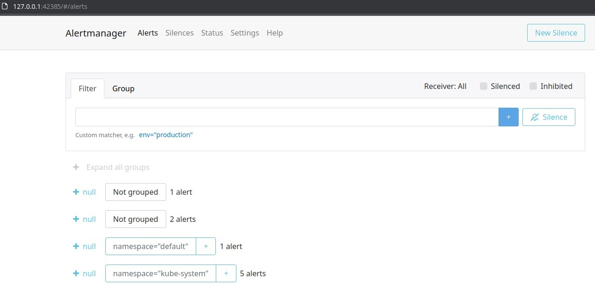

# Task 1: Kubernetes Cluster Monitoring with Prometheus

I've completed the first part of the Lab 14.

## **Components of the Kube Prometheus Stack**

**Prometheus** gathers and saves time-series data for monitoring purposes. It gathers metrics from specified targets.

**Grafana** is a platform for creating dashboards and visualizing data. It can get data from Prometheus and present it on dashboards.

**Alertmanager** deals with alerts from Prometheus. It manages alerts before sending them to external systems.

**kube-state-metrics** produces Kubernetes-specific metrics: deployments, nodes, pods. Prometheus then collect these metrics.

**Prometheus Node-Exporter** provides hardware and operating system metrics about nodes. These metrics help to monitor resource usage.

**Prometheus Adapter** gets metrics from Kubernetes API.

**Prometheus Blackbox Exporter** checks endpoints with HTTP, HTTPS, DNS, TCP, and ICMP, and generates metrics based on the results of these checks.

**Prometheus Operator** operates Prometheus instances and monitorings in a Kubernetes cluster. It simplifies deployment, management and scaling of Prometheus.

## **Helm charts**

Output of the `kubectl get po,sts,svc,pvc,cm` command with descriptions.

- list of pods running in the cluster:

```
NAME                                                            READY   STATUS    RESTARTS       AGE
pod/alertmanager-kube-prometheus-stack-alertmanager-0           2/2     Running   4 (81s ago)    100m
pod/app-python-0                                                1/1     Running   20 (72s ago)   89m
pod/app-python-1                                                1/1     Running   20 (72s ago)   89m
pod/app-python-deployment-f0s15s442-fojap                       1/1     Running   90 (30m ago)   5d10h
pod/app-python-deployment-f0s15s442-wffkl                       1/1     Running   92 (30m ago)   5d21h
pod/app-python-deployment-f0s15s442-dapfw                       1/1     Running   92 (30m ago)   5d21h
pod/kube-prometheus-stack-grafana-4220y5221o4-pogfp             3/3     Running   5 (81s ago)    114m
pod/kube-prometheus-stack-kube-state-metrics-g69921tpq5-wo7zk   1/1     Running   4 (72s ago)    114m
pod/kube-prometheus-stack-operator-76bf64f57d-bvr7t             1/1     Running   3 (72s ago)    114m
pod/kube-prometheus-stack-prometheus-node-exporter-po6ya        1/1     Running   2 (77s ago)    114m
pod/prometheus-kube-prometheus-stack-prometheus-0               2/2     Running   3 (77s ago)    89m
```

- list of stateful sets:

```
NAME                                                               READY   AGE
statefulset.apps/alertmanager-kube-prometheus-stack-alertmanager   1/1     100m
statefulset.apps/app-python                                        2/2     89m
statefulset.apps/prometheus-kube-prometheus-stack-prometheus       1/1     100m
```

- list of services:

```
NAME                                                     TYPE           CLUSTER-IP       EXTERNAL-IP   PORT(S)                      AGE
service/alertmanager-operated                            ClusterIP      None             <none>        9093/TCP,9094/TCP,9094/UDP   100m
service/app-python                                       LoadBalancer   10.99.50.101     <pending>     5000:31930/TCP               89m
service/kube-prometheus-stack-alertmanager               ClusterIP      10.122.85.101    <none>        9093/TCP,8080/TCP            114m
service/kube-prometheus-stack-grafana                    ClusterIP      10.99.191.14     <none>        80/TCP                       114m
service/kube-prometheus-stack-kube-state-metrics         ClusterIP      10.127.49.221    <none>        8080/TCP                     114m
service/kube-prometheus-stack-operator                   ClusterIP      10.101.129.219   <none>        443/TCP                      114m
service/kube-prometheus-stack-prometheus                 ClusterIP      10.100.30.289    <none>        9090/TCP,8080/TCP            114m
service/kube-prometheus-stack-prometheus-node-exporter   ClusterIP      10.102.190.225   <none>        9100/TCP                     114m
service/kubernetes                                       ClusterIP      10.96.0.1        <none>        443/TCP                      17d
service/prometheus-operated                              ClusterIP      None             <none>        9090/TCP                     100m
```

- list of persistent volume claims. these PVCs are bound to volumes, they store data used by the app pods:

```
NAME                                      STATUS   VOLUME                                     CAPACITY   ACCESS MODES   STORAGECLASS   AGE
persistentvolumeclaim/data-app-python-0   Bound    pvc-c74b792b-3957-68ec-bced-f739d5467698   1Gi        RWO            standard       5d10h
persistentvolumeclaim/data-app-python-1   Bound    pvc-23f6ce57-b515-57dd-db30-4ddee66b1243   1Gi        RWO            standard       5d10h
```

- list of configmaps:

```
NAME                                                                DATA   AGE
configmap/kube-prometheus-stack-alertmanager-overview               1      114m
configmap/kube-prometheus-stack-apiserver                           1      114m
configmap/kube-prometheus-stack-cluster-total                       1      114m
configmap/kube-prometheus-stack-controller-manager                  1      114m
configmap/kube-prometheus-stack-etcd                                1      114m
configmap/kube-prometheus-stack-grafana                             1      114m
configmap/kube-prometheus-stack-grafana-config-dashboards           1      114m
configmap/kube-prometheus-stack-grafana-datasource                  1      114m
configmap/kube-prometheus-stack-grafana-overview                    1      114m
configmap/kube-prometheus-stack-k8s-coredns                         1      114m
configmap/kube-prometheus-stack-k8s-resources-cluster               1      114m
configmap/kube-prometheus-stack-k8s-resources-multicluster          1      114m
configmap/kube-prometheus-stack-k8s-resources-namespace             1      114m
configmap/kube-prometheus-stack-k8s-resources-node                  1      114m
configmap/kube-prometheus-stack-k8s-resources-pod                   1      114m
configmap/kube-prometheus-stack-k8s-resources-workload              1      114m
configmap/kube-prometheus-stack-k8s-resources-workloads-namespace   1      114m
configmap/kube-prometheus-stack-kubelet                             1      114m
configmap/kube-prometheus-stack-namespace-by-pod                    1      114m
configmap/kube-prometheus-stack-namespace-by-workload               1      114m
configmap/kube-prometheus-stack-node-cluster-rsrc-use               1      114m
configmap/kube-prometheus-stack-node-rsrc-use                       1      114m
configmap/kube-prometheus-stack-nodes                               1      114m
configmap/kube-prometheus-stack-nodes-darwin                        1      114m
configmap/kube-prometheus-stack-persistentvolumesusage              1      114m
configmap/kube-prometheus-stack-pod-total                           1      114m
configmap/kube-prometheus-stack-prometheus                          1      114m
configmap/kube-prometheus-stack-proxy                               1      114m
configmap/kube-prometheus-stack-scheduler                           1      114m
configmap/kube-prometheus-stack-workload-total                      1      114m
configmap/kube-root-ca.crt                                          1      17d
configmap/prometheus-kube-prometheus-stack-prometheus-rulefiles-0   35     100m
```

## **Grafana dashboards**

**Check CPU and Memory consumption of your StatefulSet.**

CPU consumption: 0.004691%

Memory usage: 51.3 MB

**Identify Pods with higher and lower CPU usage in the default namespace.**

The highest usage: `prometheus-kube-prometheus-stack-prometheus-0`.

The lowest usage: `alertmanager-kube-prometheus-stack-alertmanager-0`.

**Monitor node memory usage in percentage and megabytes.**

Node memory usage: 67.8% (2.32 GiB)

**Count the number of pods and containers managed by the Kubelet service.**

No. of pods: 21

No. of containers: 53

**Evaluate network usage of Pods in the default namespace.**

Download speed: 55.1 kB/s

Upload speed: 218 kB/s

**Determine the number of active alerts; also check the Web UI with minikube service monitoring-kube-prometheus-alertmanager.**

10 active alerts.

Web UI:

