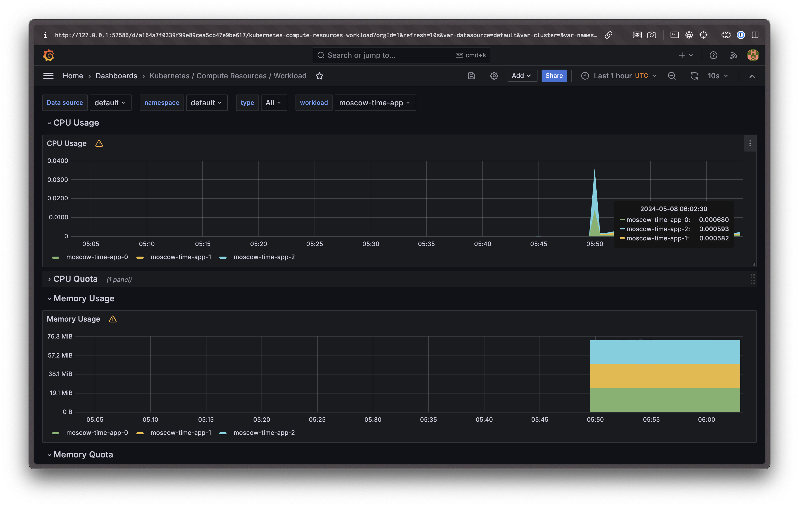
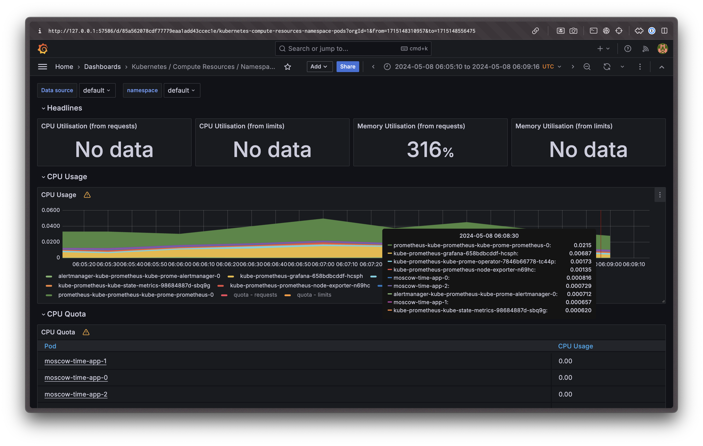
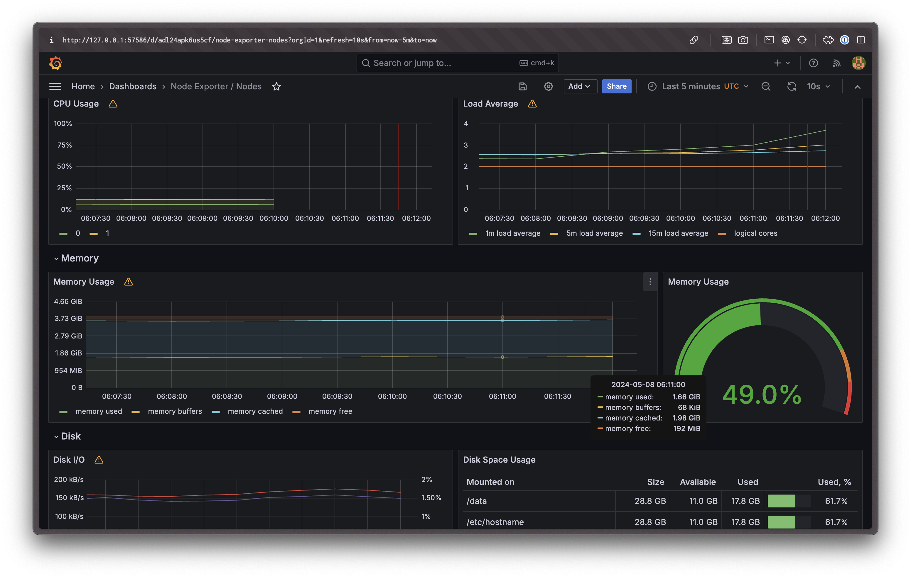
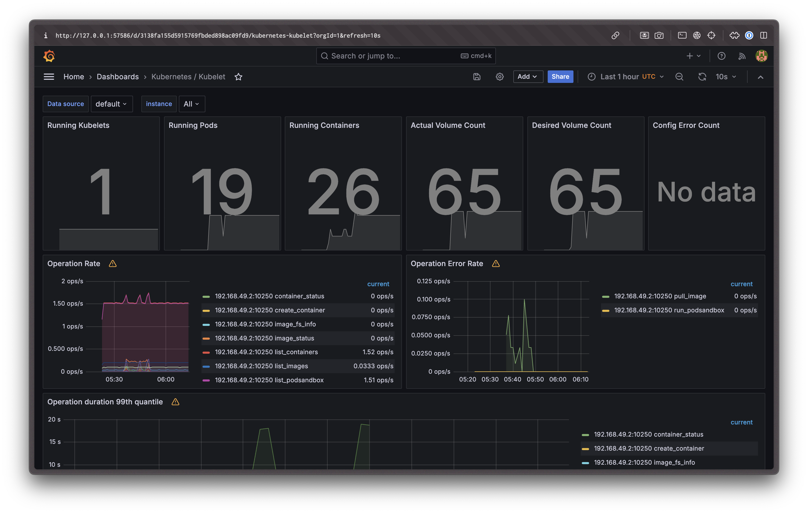
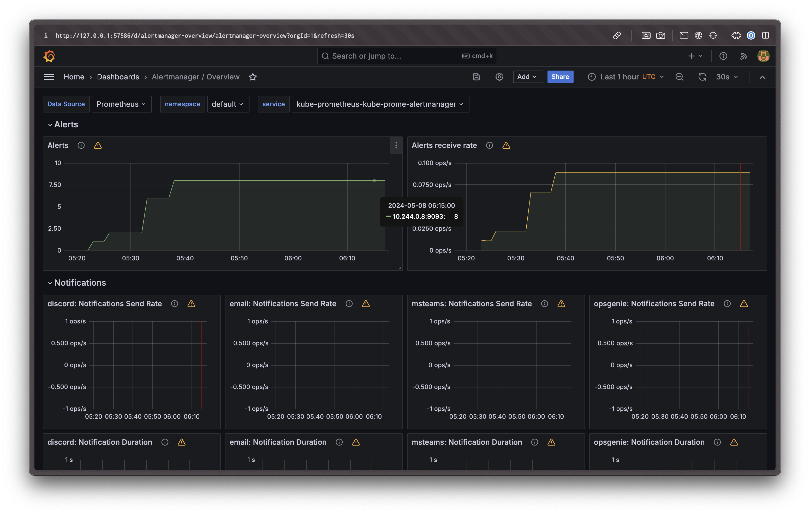
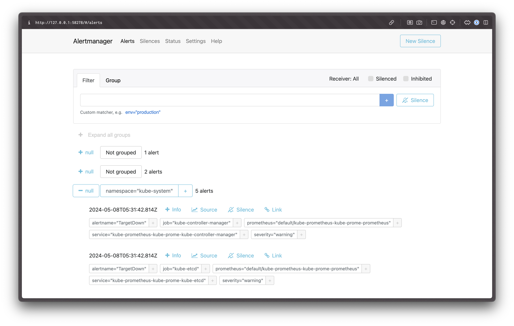

# Lab 14

## Kube Prometheus Stack components

- The Prometheus Operator — allows to deploy and manage Prometheus, Alertmanager, etc. to Kubernetes cluster, configuring resources, deployment and Prometheus target.
- Highly available Prometheus — Prometheus itself, which collects and stores metrics.
- Highly available Alertmanager — Prometheus Alertmanager, that tracks metrics and sends alerts in case of configured warnings.
- Prometheus node-exporter — Prometheus exporter that collects and exports metrics for hardware and OS.
- Prometheus blackbox-exporter — Prometheus exporter that allows to export metrics about any service that expose some endpoints (HTTP or gRPC, or etc.)
- Prometheus Adapter for Kubernetes Metrics APIs — implementation of the Kubernetes APIs to collect metrics from Kubernetes with Prometheus.
- kube-state-metrics — service that generates metrics for object states by using the Kubernetes API.
- Grafana — provides web-interface with pre-configured dashboards to visualize collected metrics.

## `kubectl get po,sts,svc,pvc,cm` output

```sh
$ kubectl get po,sts,svc,pvc,cm
NAME                                                         READY   STATUS    RESTARTS   AGE
pod/alertmanager-kube-prometheus-kube-prome-alertmanager-0   2/2     Running   0          29m
pod/kube-prometheus-grafana-658bdbcddf-hcsph                 3/3     Running   0          29m
pod/kube-prometheus-kube-prome-operator-7846b66778-tc44p     1/1     Running   0          29m
pod/kube-prometheus-kube-state-metrics-98684887d-sbq9g       1/1     Running   0          29m
pod/kube-prometheus-prometheus-node-exporter-n69hc           1/1     Running   0          29m
pod/moscow-time-app-0                                        1/1     Running   0          52s
pod/moscow-time-app-1                                        1/1     Running   0          52s
pod/moscow-time-app-2                                        1/1     Running   0          52s
pod/prometheus-kube-prometheus-kube-prome-prometheus-0       2/2     Running   0          29m

NAME                                                                    READY   AGE
statefulset.apps/alertmanager-kube-prometheus-kube-prome-alertmanager   1/1     29m
statefulset.apps/moscow-time-app                                        3/3     52s
statefulset.apps/prometheus-kube-prometheus-kube-prome-prometheus       1/1     29m

NAME                                               TYPE        CLUSTER-IP       EXTERNAL-IP   PORT(S)                      AGE
service/alertmanager-operated                      ClusterIP   None             <none>        9093/TCP,9094/TCP,9094/UDP   29m
service/kube-prometheus-grafana                    ClusterIP   10.100.110.143   <none>        80/TCP                       29m
service/kube-prometheus-kube-prome-alertmanager    ClusterIP   10.101.23.25     <none>        9093/TCP,8080/TCP            29m
service/kube-prometheus-kube-prome-operator        ClusterIP   10.100.61.9      <none>        443/TCP                      29m
service/kube-prometheus-kube-prome-prometheus      ClusterIP   10.96.99.141     <none>        9090/TCP,8080/TCP            29m
service/kube-prometheus-kube-state-metrics         ClusterIP   10.103.105.90    <none>        8080/TCP                     29m
service/kube-prometheus-prometheus-node-exporter   ClusterIP   10.106.129.92    <none>        9100/TCP                     29m
service/kubernetes                                 ClusterIP   10.96.0.1        <none>        443/TCP                      39m
service/moscow-time-app                            ClusterIP   10.101.145.174   <none>        8000/TCP                     52s
service/prometheus-operated                        ClusterIP   None             <none>        9090/TCP                     29m

NAME                                                         STATUS   VOLUME                                     CAPACITY   ACCESS MODES   STORAGECLASS   VOLUMEATTRIBUTESCLASS   AGE
persistentvolumeclaim/moscow-time-volume-moscow-time-app-0   Bound    pvc-9ed7d4ca-65d2-4107-a9f2-16b50d804c42   100Mi      RWO            standard       <unset>                 13m
persistentvolumeclaim/moscow-time-volume-moscow-time-app-1   Bound    pvc-455718f1-b5bd-455d-97f2-c64ff1464748   100Mi      RWO            standard       <unset>                 13m
persistentvolumeclaim/moscow-time-volume-moscow-time-app-2   Bound    pvc-71c72689-1f94-4f45-a2c5-53b112ad9769   100Mi      RWO            standard       <unset>                 13m

NAME                                                                     DATA   AGE
configmap/kube-prometheus-grafana                                        1      29m
configmap/kube-prometheus-grafana-config-dashboards                      1      29m
configmap/kube-prometheus-kube-prome-alertmanager-overview               1      29m
configmap/kube-prometheus-kube-prome-apiserver                           1      29m
configmap/kube-prometheus-kube-prome-cluster-total                       1      29m
configmap/kube-prometheus-kube-prome-controller-manager                  1      29m
configmap/kube-prometheus-kube-prome-etcd                                1      29m
configmap/kube-prometheus-kube-prome-grafana-datasource                  1      29m
configmap/kube-prometheus-kube-prome-grafana-overview                    1      29m
configmap/kube-prometheus-kube-prome-k8s-coredns                         1      29m
configmap/kube-prometheus-kube-prome-k8s-resources-cluster               1      29m
configmap/kube-prometheus-kube-prome-k8s-resources-multicluster          1      29m
configmap/kube-prometheus-kube-prome-k8s-resources-namespace             1      29m
configmap/kube-prometheus-kube-prome-k8s-resources-node                  1      29m
configmap/kube-prometheus-kube-prome-k8s-resources-pod                   1      29m
configmap/kube-prometheus-kube-prome-k8s-resources-workload              1      29m
configmap/kube-prometheus-kube-prome-k8s-resources-workloads-namespace   1      29m
configmap/kube-prometheus-kube-prome-kubelet                             1      29m
configmap/kube-prometheus-kube-prome-namespace-by-pod                    1      29m
configmap/kube-prometheus-kube-prome-namespace-by-workload               1      29m
configmap/kube-prometheus-kube-prome-node-cluster-rsrc-use               1      29m
configmap/kube-prometheus-kube-prome-node-rsrc-use                       1      29m
configmap/kube-prometheus-kube-prome-nodes                               1      29m
configmap/kube-prometheus-kube-prome-nodes-darwin                        1      29m
configmap/kube-prometheus-kube-prome-persistentvolumesusage              1      29m
configmap/kube-prometheus-kube-prome-pod-total                           1      29m
configmap/kube-prometheus-kube-prome-prometheus                          1      29m
configmap/kube-prometheus-kube-prome-proxy                               1      29m
configmap/kube-prometheus-kube-prome-scheduler                           1      29m
configmap/kube-prometheus-kube-prome-workload-total                      1      29m
configmap/kube-root-ca.crt                                               1      39m
configmap/moscow-time-config                                             1      52s
configmap/prometheus-kube-prometheus-kube-prome-prometheus-rulefiles-0   35     29m
```

Explanations for each part:

- `po` — shows all pods in the cluster. For example, `pod/moscow-time-app-0` is a pod with the application `moscow-time-app` and index `0`. We have 3 pods for this application, because we have a StatefulSet with 3 replicas (`replicaCount: 3`). Then we have pods for Prometheus, Grafana, Alertmanager, etc. created by the Kube Prometheus.
- `sts` — shows all StatefulSets in the cluster. For example, `statefulset.apps/moscow-time-app` is a StatefulSet for my application `moscow-time-app`. Other 2 StatefulSets are created by the Kube Prometheus.
- `svc` — shows all services in the cluster with their exposed ports and IP addresses within the cluster. For example, `service/moscow-time-app` is a service for my application `moscow-time-app` with the port `8000`. Other services are created by the Kube Prometheus.
- `pvc` — shows all PersistentVolumeClaims in the cluster. For example, `persistentvolumeclaim/moscow-time-volume-moscow-time-app-0` is a PVC for the pod `moscow-time-app-0`. Kube Prometheus chart didn't create any PVCs.
- `cm` — shows all ConfigMaps in the cluster, where all configuration files are stored for the pods. As we see, there are a lot of ConfigMaps created by the Kube Prometheus chart. It would be a nightmare to manage all these files manually :)

## Grafana Dashboards

a. Check CPU and Memory consumption of your StatefulSet.



- In total StatefulSet uses around 0.25% of CPU and 76 MiB of RAM.

b. Identify Pods with higher and lower CPU usage in the default namespace.



- Highest CPU: `prometheus-kube-prometheus-kube-prome-prometheus-0`.
- Lowest CPU: `kube-prometheus-kube-state-metrics-98684887d-sbq9g:`.

c. Monitor node memory usage in percentage and megabytes.



±3.7GiB or 49% of RAM is used.

d. Count the number of pods and containers managed by the Kubelet service.



Kubelet manages 19 pods and 26 containers.

e. Evaluate network usage of Pods in the default namespace.


Pods in the default namespace currently:

- Receive 37.3 kB/s
- Upload 26.3 kB/s

f. Determine the number of active alerts; also check the Web UI with `minikube service monitoring-kube-prometheus-alertmanager`.



Number of active alerts: 8.


