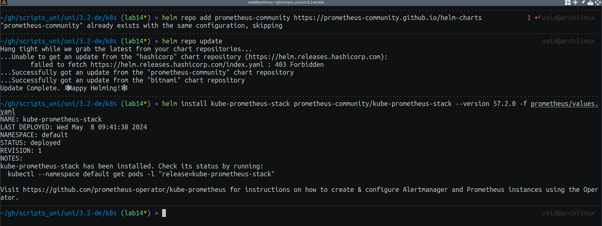
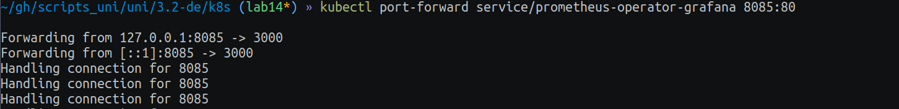
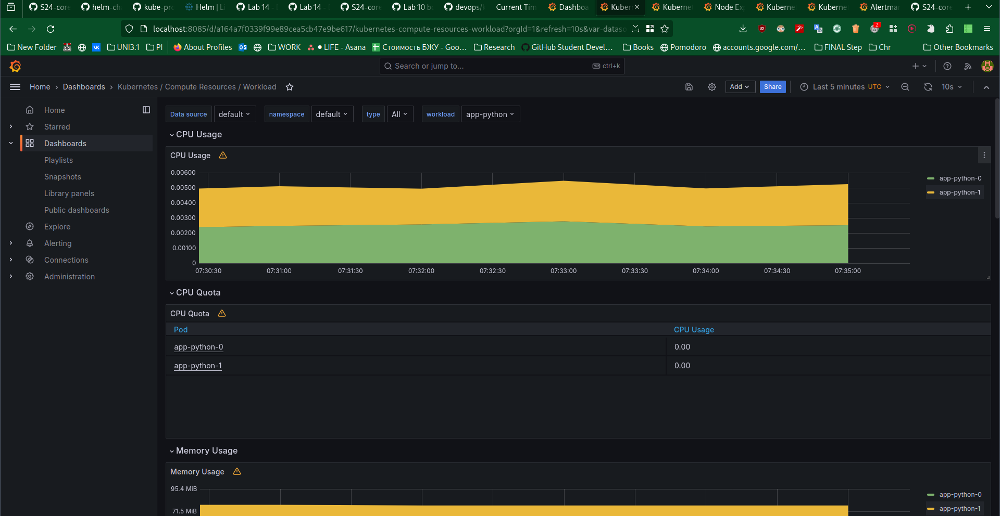
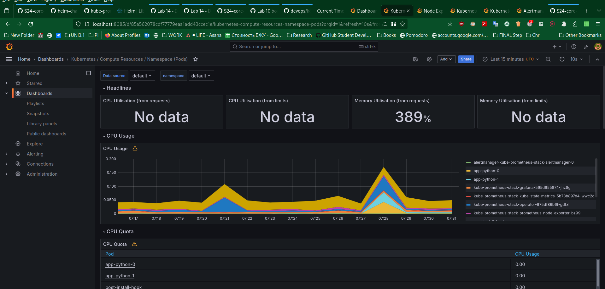
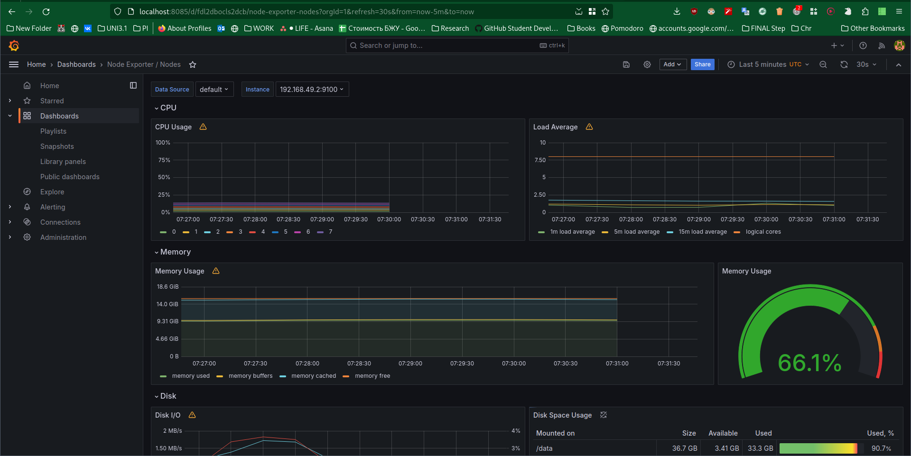
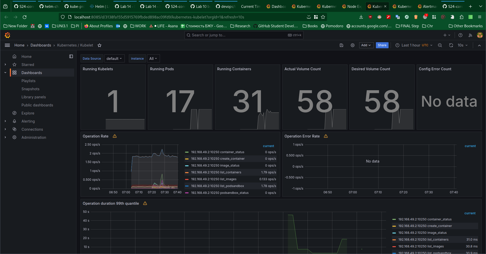
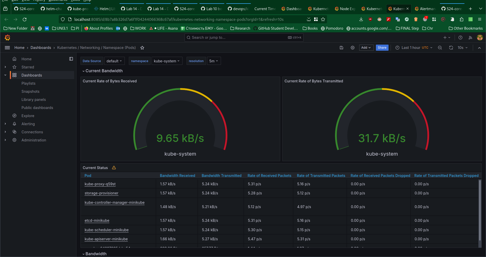
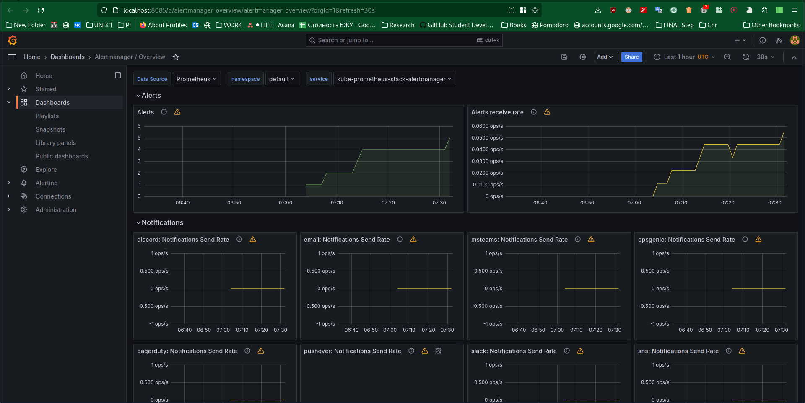
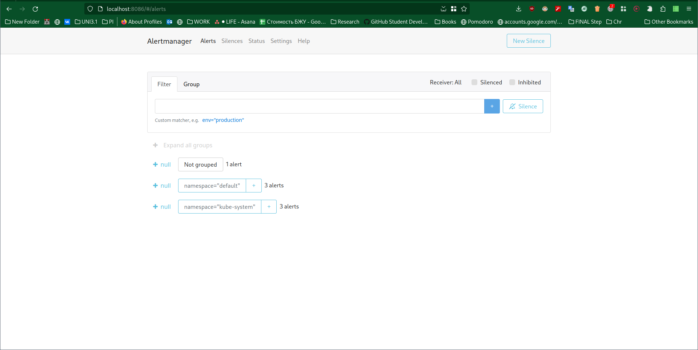
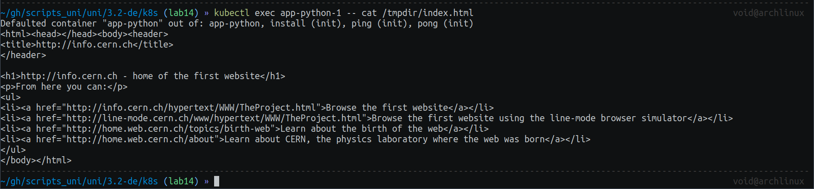

## Lab 14: Kubernetes Monitoring and Init Containers

### Task 1

Explanation of Components:


- Prometheus: A time-series monitoring tool that collects metrics from configured targets, stores them, and makes them available for querying and alerting.
- Prometheus Operator: Streamlines the deployment of a Prometheus stack to a Kubernetes cluster.
- Grafana: A visualization and monitoring tool that allows users to create dashboards and alerts for the metrics collected by Prometheus.
- Alertmanager: Receives alerts from Prometheus and sends them out to different receivers i.e. Telegram, email, etc.
- kube-state-metrics: A service that listens to the Kubernetes API server and generates metrics about the state of Kubernetes objects like Pods, Deployments, Nodes, etc.
- node-exporter: Exposes machine-level metrics about CPU, memory, disk usage, etc., from nodes in the Kubernetes cluster.
- kubelet: The primary "node agent" that runs on each node in the cluster. It ensures that containers are running in a Pod and performs various tasks such as health monitoring and resource management.


### Installing





```bash
kubectl get po,sts,svc,pvc,cm
```

Output:

``` bash
# List of running pods

NAME                                                            READY   STATUS      RESTARTS   AGE
pod/alertmanager-kube-prometheus-stack-alertmanager-0           2/2     Running     0          25m
pod/app-python-0                                                1/1     Running     0          26s
pod/app-python-1                                                1/1     Running     0          26s
pod/kube-prometheus-stack-grafana-595d955874-jhz8g              3/3     Running     0          26m
pod/kube-prometheus-stack-kube-state-metrics-5b78b897d4-wwc2d   1/1     Running     0          26m
pod/kube-prometheus-stack-operator-675df86b6f-gdfxl             1/1     Running     0          26m
pod/kube-prometheus-stack-prometheus-node-exporter-bz99l        1/1     Running     0          26m
pod/post-install-hook                                           1/1     Running     0          26s
pod/pre-install-hook                                            0/1     Completed   0          26s
pod/prometheus-kube-prometheus-stack-prometheus-0               2/2     Running     0          25m

# List of statefulsets

NAME                                                               READY   AGE
statefulset.apps/alertmanager-kube-prometheus-stack-alertmanager   1/1     25m
statefulset.apps/app-python                                        2/2     26s
statefulset.apps/prometheus-kube-prometheus-stack-prometheus       1/1     25m

# List of running services, with their type, ip, port

NAME                                                     TYPE           CLUSTER-IP       EXTERNAL-IP   PORT(S)                      AGE
service/alertmanager-operated                            ClusterIP      None             <none>        9093/TCP,9094/TCP,9094/UDP   25m
service/app-python                                       LoadBalancer   10.108.133.167   <pending>     80:30255/TCP                 26s
service/kube-prometheus-stack-alertmanager               ClusterIP      10.108.66.236    <none>        9093/TCP,8080/TCP            26m
service/kube-prometheus-stack-grafana                    ClusterIP      10.107.23.147    <none>        80/TCP                       26m
service/kube-prometheus-stack-kube-state-metrics         ClusterIP      10.99.182.63     <none>        8080/TCP                     26m
service/kube-prometheus-stack-operator                   ClusterIP      10.108.179.171   <none>        443/TCP                      26m
service/kube-prometheus-stack-prometheus                 ClusterIP      10.102.160.113   <none>        9090/TCP,8080/TCP            26m
service/kube-prometheus-stack-prometheus-node-exporter   ClusterIP      10.96.63.188     <none>        9100/TCP                     26m
service/kubernetes                                       ClusterIP      10.96.0.1        <none>        443/TCP                      30m
service/prometheus-operated                              ClusterIP      None             <none>        9090/TCP                     25m

# List of persistent volume claaims

NAME                                        STATUS   VOLUME                                     CAPACITY   ACCESS MODES   STORAGECLASS   AGE
persistentvolumeclaim/data-app-python-0     Bound    pvc-eb0f2508-b50d-4a7c-a025-f72cb0e3081f   1Mi        RWO            standard       7m12s
persistentvolumeclaim/data-app-python-1     Bound    pvc-2f9f5788-10b1-448c-bcf0-80b3e6d57de9   1Mi        RWO            standard       7m12s
persistentvolumeclaim/tmpdir-app-python-0   Bound    pvc-66e39cde-b5fe-490e-bb0e-3cfabd583d77   1Gi        RWO            standard       7m12s
persistentvolumeclaim/tmpdir-app-python-1   Bound    pvc-4e17ae91-189d-49d7-a8b5-b947459d1688   1Gi        RWO            standard       7m12s

# List of ConfigMaps

NAME                                                                DATA   AGE
configmap/kube-prometheus-stack-alertmanager-overview               1      26m
configmap/kube-prometheus-stack-apiserver                           1      26m
configmap/kube-prometheus-stack-cluster-total                       1      26m
configmap/kube-prometheus-stack-controller-manager                  1      26m
configmap/kube-prometheus-stack-etcd                                1      26m
configmap/kube-prometheus-stack-grafana                             1      26m
configmap/kube-prometheus-stack-grafana-config-dashboards           1      26m
configmap/kube-prometheus-stack-grafana-datasource                  1      26m
configmap/kube-prometheus-stack-grafana-overview                    1      26m
configmap/kube-prometheus-stack-k8s-coredns                         1      26m
configmap/kube-prometheus-stack-k8s-resources-cluster               1      26m
configmap/kube-prometheus-stack-k8s-resources-multicluster          1      26m
configmap/kube-prometheus-stack-k8s-resources-namespace             1      26m
configmap/kube-prometheus-stack-k8s-resources-node                  1      26m
configmap/kube-prometheus-stack-k8s-resources-pod                   1      26m
configmap/kube-prometheus-stack-k8s-resources-workload              1      26m
configmap/kube-prometheus-stack-k8s-resources-workloads-namespace   1      26m
configmap/kube-prometheus-stack-kubelet                             1      26m
configmap/kube-prometheus-stack-namespace-by-pod                    1      26m
configmap/kube-prometheus-stack-namespace-by-workload               1      26m
configmap/kube-prometheus-stack-node-cluster-rsrc-use               1      26m
configmap/kube-prometheus-stack-node-rsrc-use                       1      26m
configmap/kube-prometheus-stack-nodes                               1      26m
configmap/kube-prometheus-stack-nodes-darwin                        1      26m
configmap/kube-prometheus-stack-persistentvolumesusage              1      26m
configmap/kube-prometheus-stack-pod-total                           1      26m
configmap/kube-prometheus-stack-prometheus                          1      26m
configmap/kube-prometheus-stack-proxy                               1      26m
configmap/kube-prometheus-stack-scheduler                           1      26m
configmap/kube-prometheus-stack-workload-total                      1      26m
configmap/kube-root-ca.crt                                          1      30m
configmap/my-configmap                                              1      26s
configmap/prometheus-kube-prometheus-stack-prometheus-rulefiles-0   35     25m


```

### Checking Grafana



1. Check CPU and Memory consumption of your StatefulSet
- Cpu time: 0.005
- Mem usage: 80Mb


2. Identify Pods with higher and lower CPU usage in the default namespace.

- Highest CPU usage: `prometheus-kube-prometheus-stack-prometheus-0`
- Lowest CPU usage: `kube-prometheus-stack-kube-state-metrics-5b78b897d4-wwc2d`


3. Monitor node memory usage in percentage and megabytes
- Memory usage: 9.91Gib, 66.1%


4. Count the number of pods and containers managed by the Kubelet service
- Pods: 17
- Containers: 31


5. Evaluate network usage of Pods in the default namespace.

Download speed: 9.65 kB/s Upload speed: 31.7 kB/s



6. Determine the number of active alerts; also check the Web UI with `minikube service monitoring-kube-prometheus-alertmanager`.

Active alerts: 5




### Task 2



