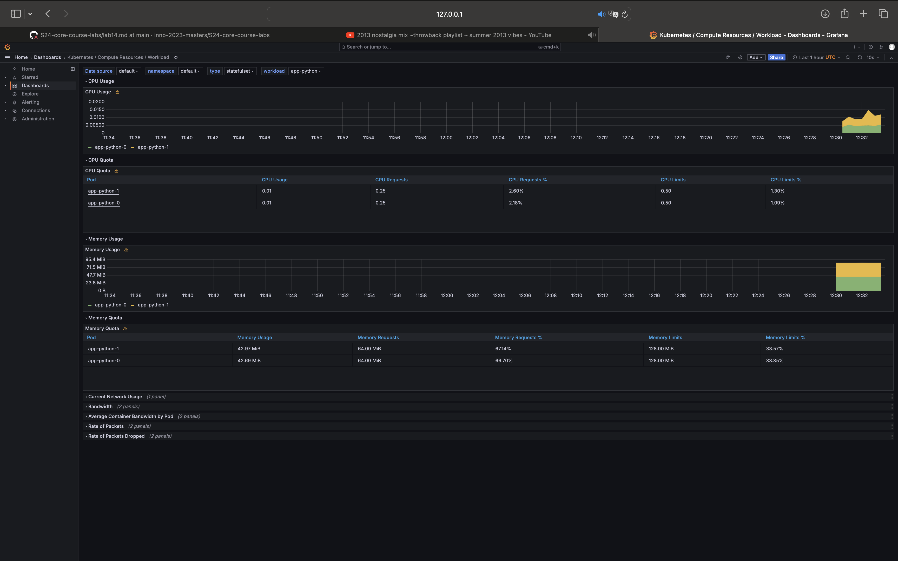
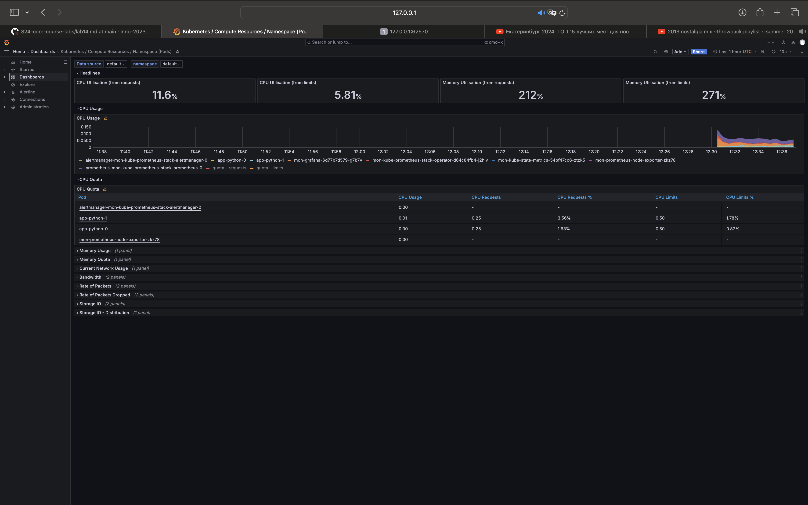
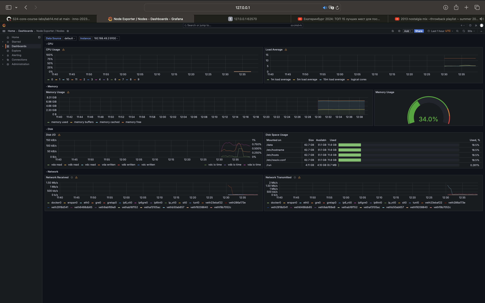
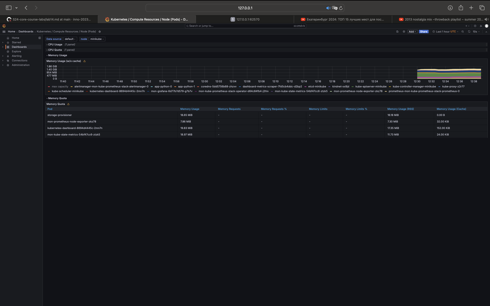
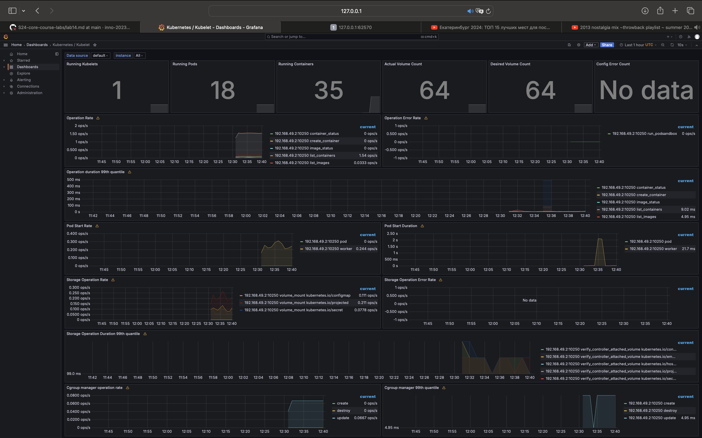
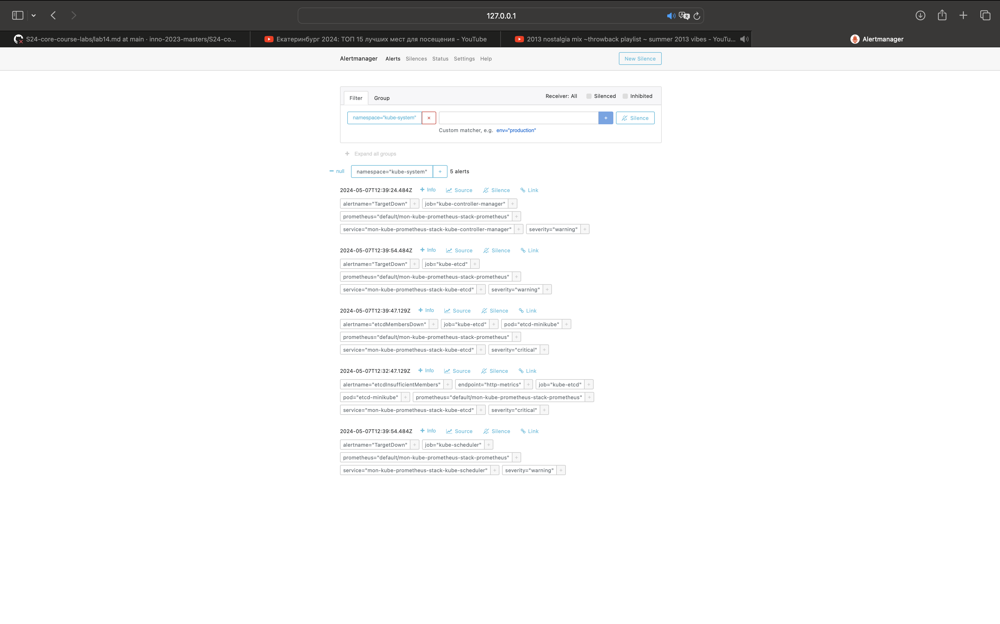

# Kubernetes Monitoring and Init Containers

## Task 1

### Kube Prometheus Stack's Components

- *Highly available Alertmanager:* responds to Prometheus' notifications.
- *Prometheus Adapter for Kubernetes Metrics APIs:* permits Prometheus to query metrics from kube-state-metrics and other metrics APIs provided by Kubernetes. Prometheus uses it to gather information unique to Kubernetes, like resource utilisation for pods.
- *Prometheus node-exporter:* gathers operating system and hardware metrics from the host computer and sends them to Prometheus.
- *Highly available Prometheus:* tool for tracking and warning. Snoops on stats from targets under watch.
- *Prometheus blackbox-exporter:* permits the monitoring of network endpoints and the monitoring of requests to services using simulation.
- *Grafana:* platform for analytics and visualisation. It offers a dashboard that can be customised to visualise metrics gathered from Prometheus and other sources of data.
- *The Prometheus Operator:* uses Kubernetes resources to administer and run Prometheus and other monitoring components.
- *kube-state-metrics:* gathers information about the state of Kubernetes objects by listening to the Kubernetes API server and producing metrics that reveal information about the functionality and health of the Kubernetes cluster.

``` bash
kubectl get po,sts,svc,pvc,cm    

# Here we can see the full list of pods with their status
NAME                                                         READY   STATUS    RESTARTS   AGE
pod/alertmanager-app-python-kube-prometheus-alertmanager-0   2/2     Running   0          13m
pod/app-python-0                                             1/1     Running   6          14m
pod/app-python-1                                             1/1     Running   18         14m
pod/app-python-grafana-77b9dfdfb7-dnfk8                      3/3     Running   0          14m
pod/app-python-kube-prometheus-operator-6f9659dd88-fctrj     1/1     Running   0          14m
pod/app-python-kube-state-metrics-66587cdfc8-hl9km           1/1     Running   0          14m
pod/app-python-prometheus-node-exporter-b7snd                1/1     Running   0          14m
pod/prometheus-app-python-kube-prometheus-prometheus-0       2/2     Running   0          13m

# Here we can see the full list of stateful sets with their age and status
NAME                                                                    READY   AGE
statefulset.apps/alertmanager-app-python-kube-prometheus-alertmanager   1/1     13m
statefulset.apps/app-python                                         2/2     61s
statefulset.apps/prometheus-app-python-kube-prometheus-prometheus       1/1     13m

# Here we can see the full list of services with their type, ips, port and age
NAME                                              TYPE           CLUSTER-IP       EXTERNAL-IP   PORT(S)                      AGE
service/alertmanager-operated                     ClusterIP      None             <none>        9093/TCP,9094/TCP,9094/UDP   13m
service/app-python                            LoadBalancer   10.100.18.232    <pending>     5000:31287/TCP               61s
service/app-python-grafana                        ClusterIP      10.110.121.39    <none>        80/TCP                       14m
service/app-python-kube-prometheus-alertmanager   ClusterIP      10.97.4.89       <none>        9093/TCP,8080/TCP            14m
service/app-python-kube-prometheus-operator       ClusterIP      10.107.178.231   <none>        443/TCP                      14m
service/app-python-kube-prometheus-prometheus     ClusterIP      10.102.255.78    <none>        9090/TCP,8080/TCP            14m
service/app-python-kube-state-metrics             ClusterIP      10.107.140.186   <none>        8080/TCP                     14m
service/app-python-prometheus-node-exporter       ClusterIP      10.97.222.219    <none>        9100/TCP                     14m
service/kubernetes                                ClusterIP      10.96.0.1        <none>        443/TCP                      15m
service/prometheus-operated                       ClusterIP      None             <none>        9090/TCP                     13m

# Here we can see the full list of persistent volumes with status, volume names and capacity
NAME                                            STATUS   VOLUME                                     CAPACITY   ACCESS MODES   STORAGECLASS   AGE
persistentvolumeclaim/app-volume-app-python-0   Bound    pvc-4c7a1e8b-9f63-2d4c-ac9e-5b1d3f8e0a7c   1Gi        RWO            standard       14m
persistentvolumeclaim/app-volume-app-python-1   Bound    pvc-5a3b6c7d-e8f9-4c2d-b1a0-9e8f7d6c5b3a   1Gi        RWO            standard       14m

# Here we can see the full list of services with data and age
NAME                                                                     DATA   AGE
configmap/app-pg                                                         1      61s
configmap/app-python-grafana                                             1      14m
configmap/app-python-grafana-config-dashboards                           1      14m
configmap/app-python-kube-prometheus-alertmanager-overview               1      14m
configmap/app-python-kube-prometheus-apiserver                           1      14m
configmap/app-python-kube-prometheus-cluster-total                       1      14m
configmap/app-python-kube-prometheus-controller-manager                  1      14m
configmap/app-python-kube-prometheus-etcd                                1      14m
configmap/app-python-kube-prometheus-grafana-datasource                  1      14m
configmap/app-python-kube-prometheus-grafana-overview                    1      14m
configmap/app-python-kube-prometheus-k8s-coredns                         1      14m
configmap/app-python-kube-prometheus-k8s-resources-cluster               1      14m
configmap/app-python-kube-prometheus-k8s-resources-multicluster          1      14m
configmap/app-python-kube-prometheus-k8s-resources-namespace             1      14m
configmap/app-python-kube-prometheus-k8s-resources-node                  1      14m
configmap/app-python-kube-prometheus-k8s-resources-pod                   1      14m
configmap/app-python-kube-prometheus-k8s-resources-workload              1      14m
configmap/app-python-kube-prometheus-k8s-resources-workloads-namespace   1      14m
configmap/app-python-kube-prometheus-kubelet                             1      14m
configmap/app-python-kube-prometheus-namespace-by-pod                    1      14m
configmap/app-python-kube-prometheus-namespace-by-workload               1      14m
configmap/app-python-kube-prometheus-node-cluster-rsrc-use               1      14m
configmap/app-python-kube-prometheus-node-rsrc-use                       1      14m
configmap/app-python-kube-prometheus-nodes                               1      14m
configmap/app-python-kube-prometheus-nodes-darwin                        1      14m
configmap/app-python-kube-prometheus-persistentvolumesusage              1      14m
configmap/app-python-kube-prometheus-pod-total                           1      14m
configmap/app-python-kube-prometheus-prometheus                          1      14m
configmap/app-python-kube-prometheus-proxy                               1      14m
configmap/app-python-kube-prometheus-scheduler                           1      14m
configmap/app-python-kube-prometheus-workload-total                      1      14m
configmap/kube-root-ca.crt                                               1      15m
configmap/prometheus-app-python-kube-prometheus-prometheus-rulefiles-0   35     13m
```

### Utilize Grafana Dashboards

a. Check CPU and Memory consumption of your StatefulSet


b. Identify Pods with higher and lower CPU usage in the default namespace


c. Monitor node memory usage in percentage and megabytes



d. Count the number of pods and containers managed by the Kubelet service



e. Evaluate network usage of Pods in the default namespace


f. Determine the number of active alerts; also check the Web UI with `minikube service monitoring-kube-prometheus-alertmanager`




## Task 2

```bash
kubectl exec pod/app-python-0 -- cat /work-dir/index.html
Defaulted container "app-python" out of: app-python, install (init)
<html><head></head><body><header>
<title>http://info.cern.ch</title>
</header>
<h1>http://info.cern.ch - home of the first website</h1>
<p>From here you can:</p>
<ul>
<li><a href="http://info.cern.ch/hypertext/WWW/TheProject.html">Browse the first website</a></li>
<li><a href="http://line-mode.cern.ch/www/hypertext/WWW/TheProject.html">Browse the first website using the line-mode browser simulator</a></li>
<li><a href="http://home.web.cern.ch/topics/birth-web">Learn about the birth of the web</a></li>
<li><a href="http://home.web.cern.ch/about">Learn about CERN, the physics laboratory where the web was born</a></li>
</ul>
</body></html>
```