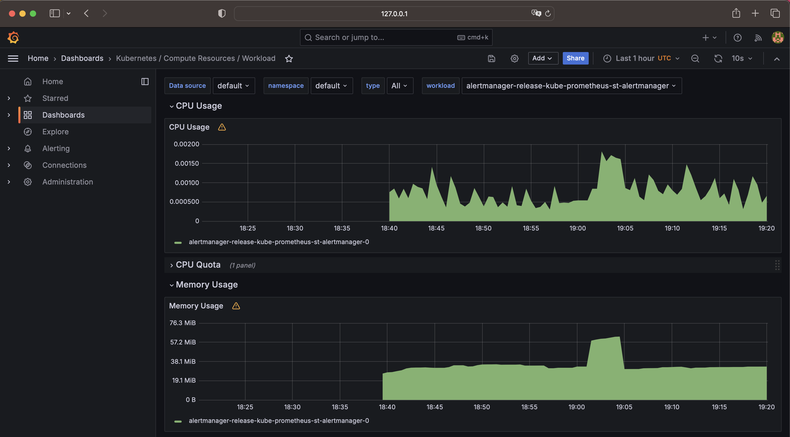
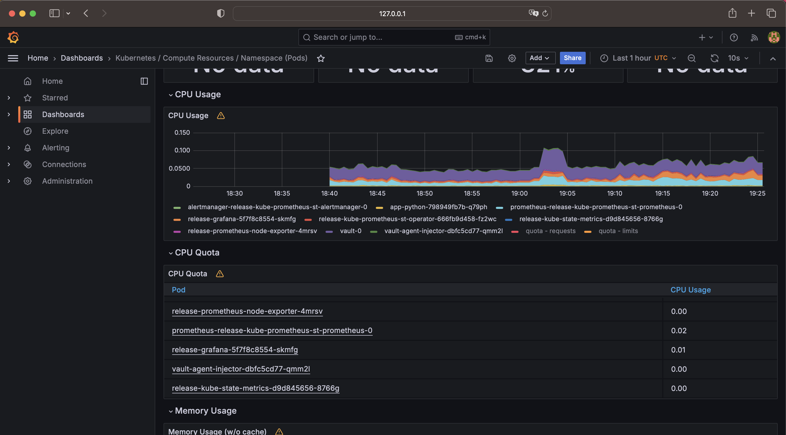
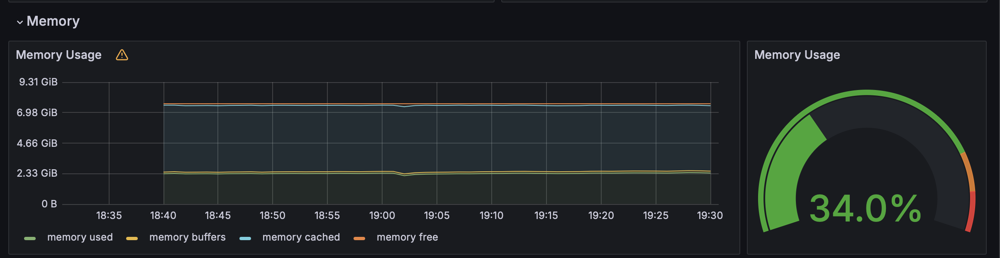
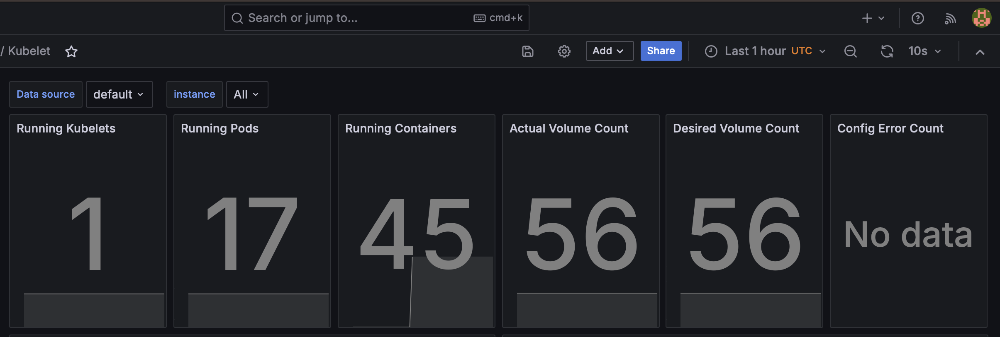
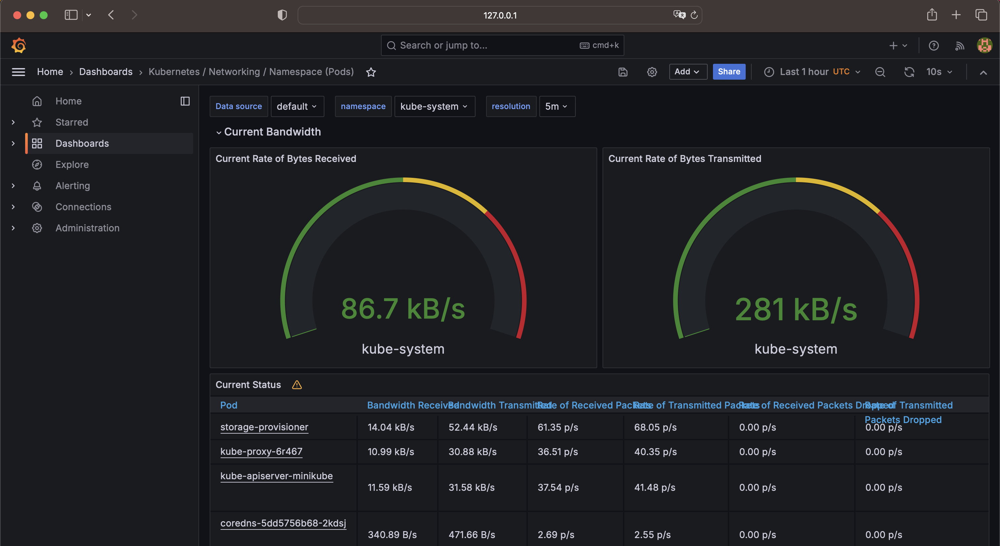
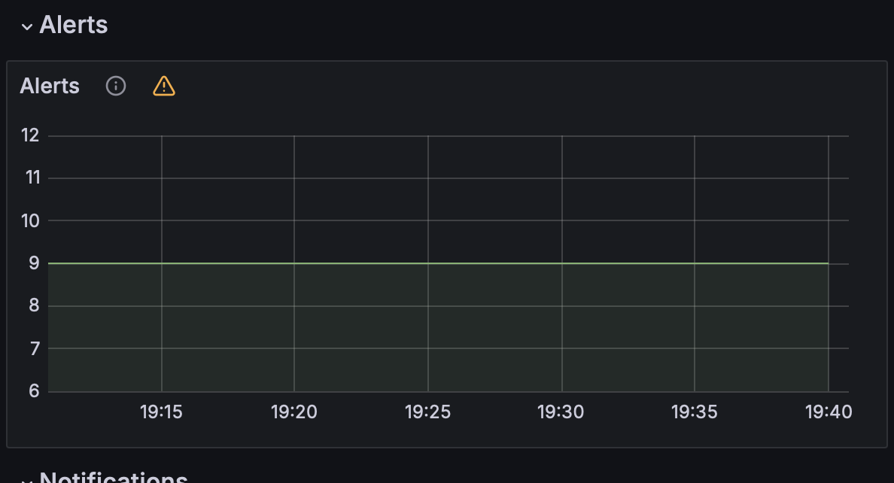
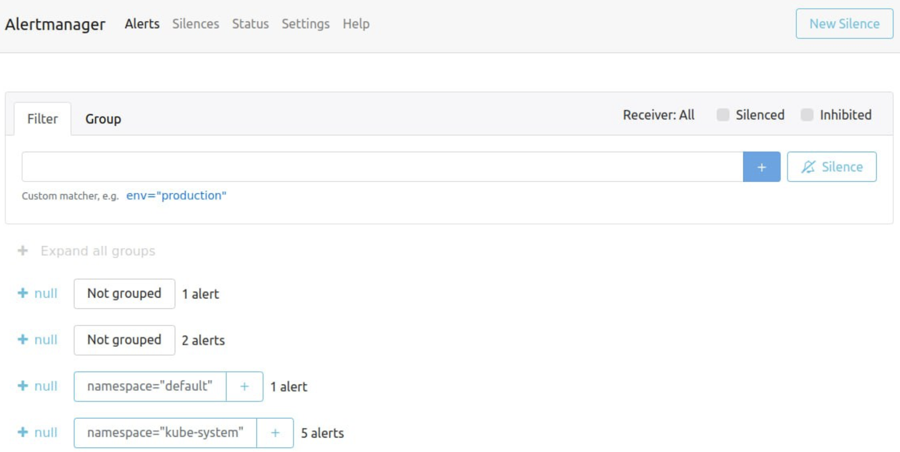

## Components of the Kube Prometheus Stack:

- **Grafana** visualizes metrics collected by the above components.
- **Prometheus Operator** automates Prometheus scaling and configuration.
- **Highly available Prometheus** collects and stores metrics from all sources.
- **Highly available Alertmanager** delivers Prometheus alerts and notifications.
- **Prometheus node-exporter** collects OS and hardware metrics from Kubernetes nodes.
- **Prometheus blackbox-exporter** checks endpoints and external sources for responses.
- **Prometheus Adapter** for Kubernetes Metrics APIs collects Kubernetes resource metrics.
- **kube-state-metrics** collects state and health information of the Kubernetes cluster.

```bash
(venv) anastasiamartynova@Anastasias-MacBook-Pro k8s % kubectl get po,sts,svc,pvc,cm                                
NAME                                                         READY   STATUS    RESTARTS      AGE
pod/alertmanager-release-kube-prometheus-st-alertmanager-0   2/2     Running   2 (42s ago)   25m
pod/app-python-0                                             1/1     Running   4 (42s ago)   25m
pod/app-python-1                                             1/1     Running   4 (42s ago)   25m
pod/prometheus-release-kube-prometheus-st-prometheus-0       2/2     Running   2 (42s ago)   25m
pod/release-grafana-5f7f8c8554-skmfg                         3/3     Running   3 (42s ago)   25m
pod/release-kube-prometheus-st-operator-666fb9d458-fz2wc     1/1     Running   1 (42s ago)   25m
pod/release-kube-state-metrics-d9d845656-8766g               1/1     Running   1 (42s ago)   25m
pod/release-prometheus-node-exporter-4mrsv                   1/1     Running   1 (42s ago)   25m
pod/vault-0                                                  1/1     Running   4 (42s ago)   21d
pod/vault-agent-injector-dbfc5cd77-qmm2l                     0/1     Running   4 (42s ago)   21d

NAME                                                                    READY   AGE
statefulset.apps/alertmanager-release-kube-prometheus-st-alertmanager   1/1     25m
statefulset.apps/prometheus-release-kube-prometheus-st-prometheus       1/1     25m
statefulset.apps/app-python                                             2/2     25m
statefulset.apps/vault                                                  1/1     21d

NAME                                              TYPE        CLUSTER-IP       EXTERNAL-IP   PORT(S)                      AGE
service/alertmanager-operated                     ClusterIP   None             <none>        9093/TCP,9094/TCP,9094/UDP   25m
service/app-python                                ClusterIP   10.111.125.59    <none>        80/TCP                       21d
service/kubernetes                                ClusterIP   10.96.0.1        <none>        443/TCP                      21d
service/prometheus-operated                       ClusterIP   None             <none>        9090/TCP                     25m
service/release-grafana                           ClusterIP   10.111.194.10    <none>        80/TCP                       25m
service/release-kube-prometheus-st-alertmanager   ClusterIP   10.100.124.49    <none>        9093/TCP,8080/TCP            25m
service/release-kube-prometheus-st-operator       ClusterIP   10.109.195.119   <none>        443/TCP                      25m
service/release-kube-prometheus-st-prometheus     ClusterIP   10.107.243.177   <none>        9090/TCP,8080/TCP            25m
service/release-kube-state-metrics                ClusterIP   10.107.14.93     <none>        8080/TCP                     25m
service/release-prometheus-node-exporter          ClusterIP   10.109.4.152     <none>        9100/TCP                     25m
service/vault                                     ClusterIP   10.96.137.124    <none>        8200/TCP,8201/TCP            21d
service/vault-agent-injector-svc                  ClusterIP   10.108.199.240   <none>        443/TCP                      21d
service/vault-internal                            ClusterIP   None             <none>        8200/TCP,8201/TCP            21d

NAME                                                                     DATA   AGE
configmap/kube-root-ca.crt                                               1      21d
configmap/prometheus-release-kube-prometheus-st-prometheus-rulefiles-0   35     25m
configmap/release-grafana                                                1      25m
configmap/release-grafana-config-dashboards                              1      25m
configmap/release-kube-prometheus-st-alertmanager-overview               1      25m
configmap/release-kube-prometheus-st-apiserver                           1      25m
configmap/release-kube-prometheus-st-cluster-total                       1      25m
configmap/release-kube-prometheus-st-controller-manager                  1      25m
configmap/release-kube-prometheus-st-etcd                                1      25m
configmap/release-kube-prometheus-st-grafana-datasource                  1      25m
configmap/release-kube-prometheus-st-grafana-overview                    1      25m
configmap/release-kube-prometheus-st-k8s-coredns                         1      25m
configmap/release-kube-prometheus-st-k8s-resources-cluster               1      25m
configmap/release-kube-prometheus-st-k8s-resources-multicluster          1      25m
configmap/release-kube-prometheus-st-k8s-resources-namespace             1      25m
configmap/release-kube-prometheus-st-k8s-resources-node                  1      25m
configmap/release-kube-prometheus-st-k8s-resources-pod                   1      25m
configmap/release-kube-prometheus-st-k8s-resources-workload              1      25m
configmap/release-kube-prometheus-st-k8s-resources-workloads-namespace   1      25m
configmap/release-kube-prometheus-st-kubelet                             1      25m
configmap/release-kube-prometheus-st-namespace-by-pod                    1      25m
configmap/release-kube-prometheus-st-namespace-by-workload               1      25m
configmap/release-kube-prometheus-st-node-cluster-rsrc-use               1      25m
configmap/release-kube-prometheus-st-node-rsrc-use                       1      25m
configmap/release-kube-prometheus-st-nodes                               1      25m
configmap/release-kube-prometheus-st-nodes-darwin                        1      25m
configmap/release-kube-prometheus-st-persistentvolumesusage              1      25m
configmap/release-kube-prometheus-st-pod-total                           1      25m
configmap/release-kube-prometheus-st-prometheus                          1      25m
configmap/release-kube-prometheus-st-proxy                               1      25m
configmap/release-kube-prometheus-st-scheduler                           1      25m
configmap/release-kube-prometheus-st-workload-total                      1      25m

```

Explanation:

Pods
- Alertmanager, Prometheus, Grafana, and related services are operational, indicating a healthy monitoring setup. Application Pods are active.

StatefulSets
- Alertmanager and Prometheus deployments are stable, with no pending updates, showing successful orchestration.

Services
- A mix of ClusterIP and LoadBalancer services ensures internal and potential external access to services, with most not exposing external IPs.

PersistentVolumeClaims
- Persistent storage is utilized for applications, with all volumes bound and functioning.

ConfigMaps
- Numerous ConfigMaps exist, configuring cluster components and Prometheus, including service discovery, metrics collection, dashboards, and alerts.

## Utilize Grafana Dashboards

(a) Check CPU and Memory consumption of your StatefulSet.
- ~0.001% CPU time, and ~38.1 MiB memory


(b) Identify Pods with higher and lower CPU usage in the default namespace.
- Highest CPU usage: prometheus 
- Lowest CPU usage: node-exporter


(c) Monitor node memory usage in percentage and megabytes.
- 34%, 2.33 GiB


(d) Count the number of pods and containers managed by the Kubelet service.
- Pods: 17
- Containers: 45


(e) Evaluate network usage of Pods in the default namespace.
- 86.7 kB/s for download
- 281.6 kB/s for upload


(f) Determine the number of active alerts; also check the Web UI with minikube service monitoring-kube-prometheus-alertmanager.
- Number of active alerts: 9

- Web UI



## Init Containers

```bash
(venv) anastasiamartynova@Anastasias-MacBook-Pro k8s % kubectl exec pod/app-python-0 -- cat /work-dir/index.html

Defaulted container "app-python" out of: app-python, get-page (init)
<html><head></head><body><header>
<title>http://info.cern.ch</title>
</header>

<h1>http://info.cern.ch - home of the first website</h1>
<p>From here you can:</p>
<ul>
<li><a href="http://info.cern.ch/hypertext/WWW/TheProject.html">Browse the first website</a></li>
<li><a href="http://line-mode.cern.ch/www/hypertext/WWW/TheProject.html">Browse the first website using the line-mode browser simulator</a></li>
<li><a href="http://home.web.cern.ch/topics/birth-web">Learn about the birth of the web</a></li>
<li><a href="http://home.web.cern.ch/about">Learn about CERN, the physics laboratory where the web was born</a></li>
</ul>
</body></html>
```