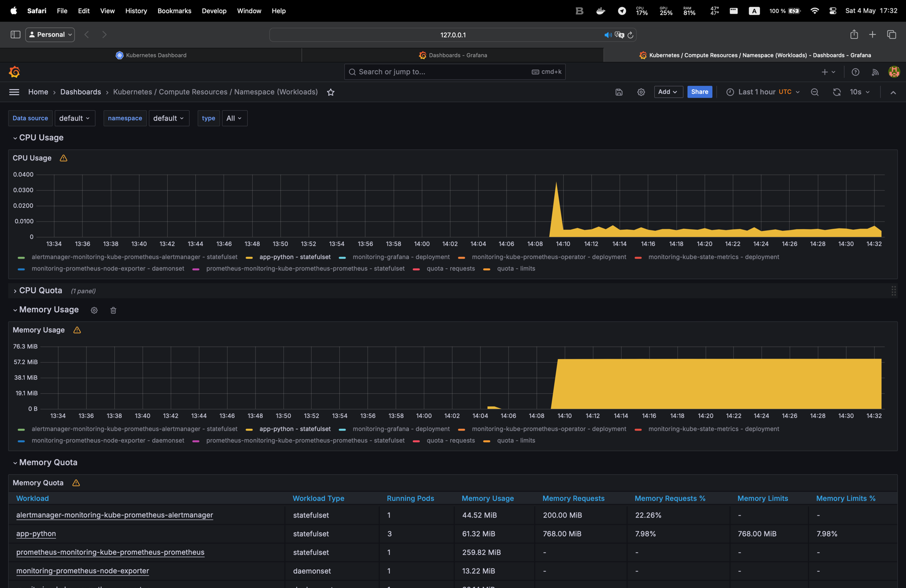
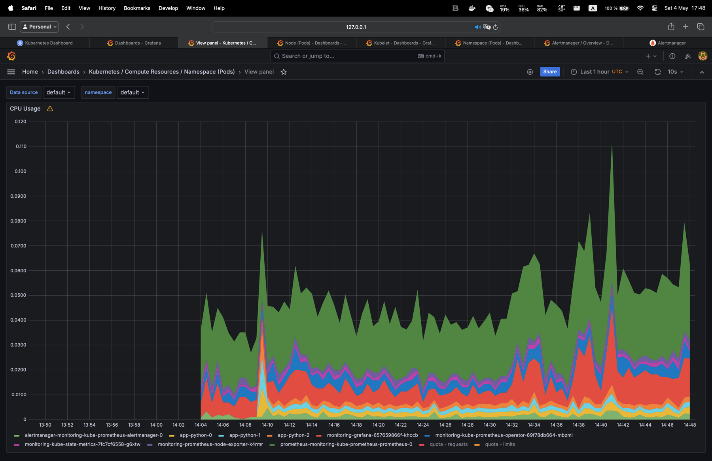
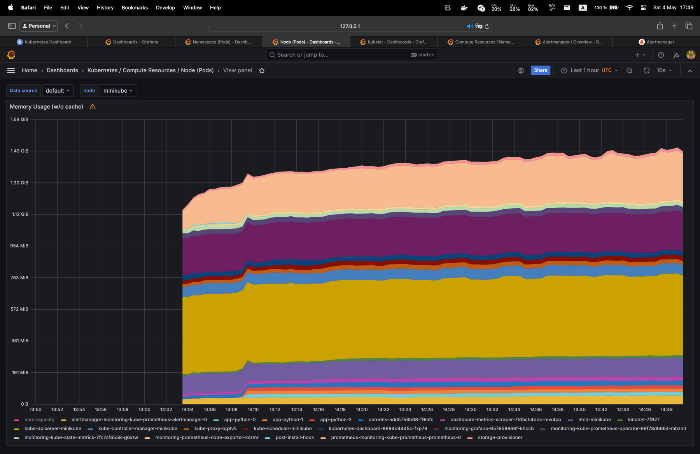
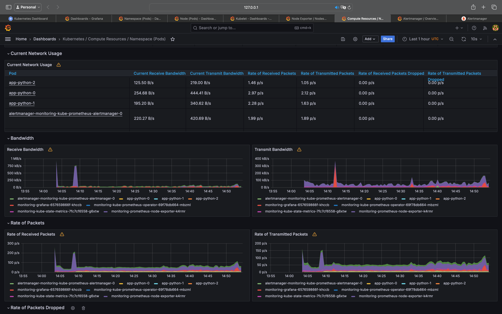
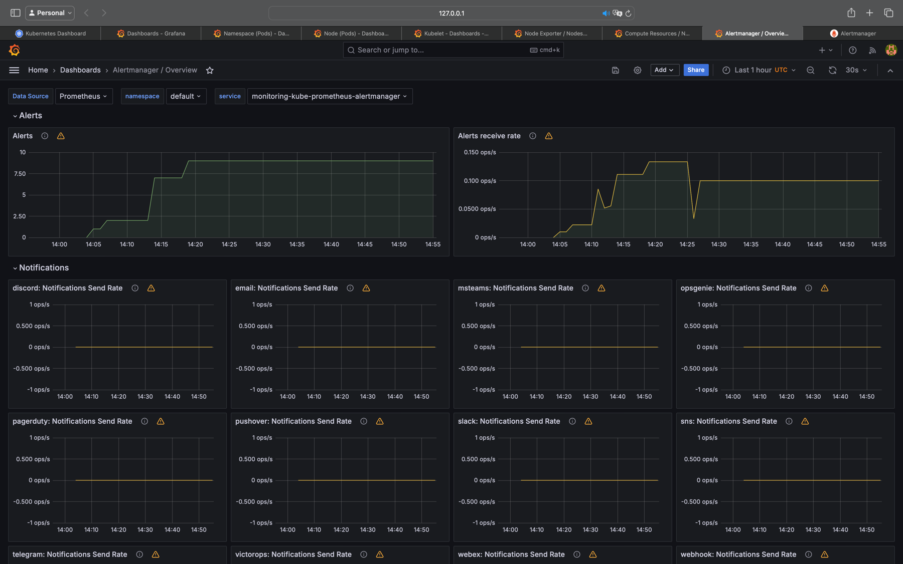
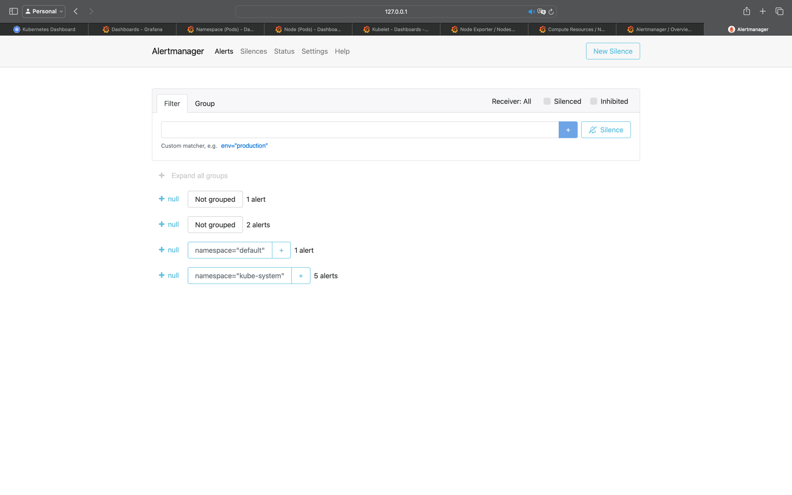

# Answers to Lab 14

## Kubernetes Cluster Monitoring with Prometheus

### The components of the Kube Prometheus Stack

`The Prometheus Operator` simplifies the deployment and management of Prometheus instances within Kubernetes.

`Highly available Prometheus` collects and stores metrics from different targets in the Kubernetes cluster.

`Highly available Alertmanager` handles alerting and notification based on the alerts received from Prometheus.

`Prometheus node-exporter` collects hardware and operating system metrics from Kubernetes nodes.

`Prometheus blackbox-exporter` performs checks on external services or endpoints to monitor their availability and
responsiveness.

`Prometheus Adapter for Kubernetes Metrics APIs` collects resource metrics from Kubernetes and exposes them through
custom
metrics APIs.

`kube-state-metrics` generates metrics about the state of Kubernetes objects, providing insights into the health of the
cluster.

`Grafana` visualizes the collected metrics in customizable dashboards and enables in-depth analysis of the Kubernetes
cluster.

### Output of `kubectl get` command

```bash
kubectl get po,sts,svc,pvc,cm

NAME                                                         READY   STATUS      RESTARTS   AGE
pod/alertmanager-monitoring-kube-prometheus-alertmanager-0   2/2     Running     0          8m21s
pod/app-python-0                                             1/1     Running     0          56s
pod/app-python-1                                             1/1     Running     0          56s
pod/app-python-2                                             1/1     Running     0          56s
pod/monitoring-grafana-657659866f-khccb                      3/3     Running     0          8m35s
pod/monitoring-kube-prometheus-operator-69f78db664-mbzml     1/1     Running     0          8m35s
pod/monitoring-kube-state-metrics-7fc7cf6558-g6xtw           1/1     Running     0          8m35s
pod/monitoring-prometheus-node-exporter-k4rmr                1/1     Running     0          8m35s
pod/post-install-hook                                        0/1     Completed   0          56s
pod/pre-install-hook                                         0/1     Completed   0          64s
pod/prometheus-monitoring-kube-prometheus-prometheus-0       2/2     Running     0          8m21s

NAME                                                                    READY   AGE
statefulset.apps/alertmanager-monitoring-kube-prometheus-alertmanager   1/1     8m21s
statefulset.apps/app-python                                             3/3     56s
statefulset.apps/prometheus-monitoring-kube-prometheus-prometheus       1/1     8m21s

NAME                                              TYPE        CLUSTER-IP       EXTERNAL-IP   PORT(S)                      AGE
service/alertmanager-operated                     ClusterIP   None             <none>        9093/TCP,9094/TCP,9094/UDP   8m21s
service/app-python                                NodePort    10.98.97.94      <none>        5000:30696/TCP               56s
service/kubernetes                                ClusterIP   10.96.0.1        <none>        443/TCP                      20d
service/monitoring-grafana                        ClusterIP   10.109.249.140   <none>        80/TCP                       8m35s
service/monitoring-kube-prometheus-alertmanager   ClusterIP   10.99.200.140    <none>        9093/TCP,8080/TCP            8m35s
service/monitoring-kube-prometheus-operator       ClusterIP   10.109.1.46      <none>        443/TCP                      8m35s
service/monitoring-kube-prometheus-prometheus     ClusterIP   10.108.140.195   <none>        9090/TCP,8080/TCP            8m35s
service/monitoring-kube-state-metrics             ClusterIP   10.102.115.244   <none>        8080/TCP                     8m35s
service/monitoring-prometheus-node-exporter       ClusterIP   10.97.11.107     <none>        9100/TCP                     8m35s
service/prometheus-operated                       ClusterIP   None             <none>        9090/TCP                     8m21s

NAME                                 STATUS   VOLUME                                     CAPACITY   ACCESS MODES   STORAGECLASS   AGE
persistentvolumeclaim/data-vault-0   Bound    pvc-fd11bad7-ce0a-46a3-8f0d-f2a640bdca28   10Gi       RWO            standard       20d

NAME                                                                     DATA   AGE
configmap/configmap                                                      2      56s
configmap/kube-root-ca.crt                                               1      20d
configmap/monitoring-grafana                                             1      8m35s
configmap/monitoring-grafana-config-dashboards                           1      8m35s
configmap/monitoring-kube-prometheus-alertmanager-overview               1      8m35s
configmap/monitoring-kube-prometheus-apiserver                           1      8m35s
configmap/monitoring-kube-prometheus-cluster-total                       1      8m35s
configmap/monitoring-kube-prometheus-controller-manager                  1      8m35s
configmap/monitoring-kube-prometheus-etcd                                1      8m35s
configmap/monitoring-kube-prometheus-grafana-datasource                  1      8m35s
configmap/monitoring-kube-prometheus-grafana-overview                    1      8m35s
configmap/monitoring-kube-prometheus-k8s-coredns                         1      8m35s
configmap/monitoring-kube-prometheus-k8s-resources-cluster               1      8m35s
configmap/monitoring-kube-prometheus-k8s-resources-multicluster          1      8m35s
configmap/monitoring-kube-prometheus-k8s-resources-namespace             1      8m35s
configmap/monitoring-kube-prometheus-k8s-resources-node                  1      8m35s
configmap/monitoring-kube-prometheus-k8s-resources-pod                   1      8m35s
configmap/monitoring-kube-prometheus-k8s-resources-workload              1      8m35s
configmap/monitoring-kube-prometheus-k8s-resources-workloads-namespace   1      8m35s
configmap/monitoring-kube-prometheus-kubelet                             1      8m35s
configmap/monitoring-kube-prometheus-namespace-by-pod                    1      8m35s
configmap/monitoring-kube-prometheus-namespace-by-workload               1      8m35s
configmap/monitoring-kube-prometheus-node-cluster-rsrc-use               1      8m35s
configmap/monitoring-kube-prometheus-node-rsrc-use                       1      8m35s
configmap/monitoring-kube-prometheus-nodes                               1      8m35s
configmap/monitoring-kube-prometheus-nodes-darwin                        1      8m35s
configmap/monitoring-kube-prometheus-persistentvolumesusage              1      8m35s
configmap/monitoring-kube-prometheus-pod-total                           1      8m35s
configmap/monitoring-kube-prometheus-prometheus                          1      8m35s
configmap/monitoring-kube-prometheus-proxy                               1      8m35s
configmap/monitoring-kube-prometheus-scheduler                           1      8m35s
configmap/monitoring-kube-prometheus-workload-total                      1      8m35s
configmap/prometheus-monitoring-kube-prometheus-prometheus-rulefiles-0   35     8m21s
```

### Grafana dashboards

#### CPU and Memory Usage



#### CPU Usage by Pod



#### Memory Usage by Node




#### Kubelet managed pods


#### Network usage



#### Active alerts





## Init Containers

```bash
kubectl exec pod/app-python-0 -- head -n 5 /work-dir/index.html

Defaulted container "app-python" out of: app-python, get-page (init)
<html><head></head><body><header>
<title>http://info.cern.ch</title>
</header>

<h1>http://info.cern.ch - home of the first website</h1>
```