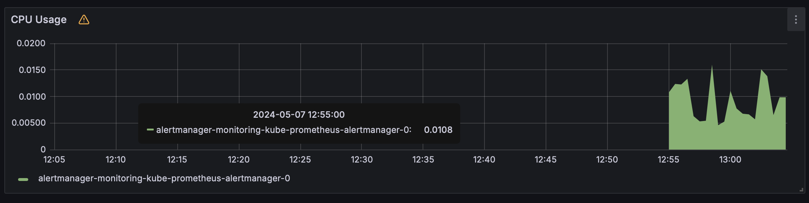
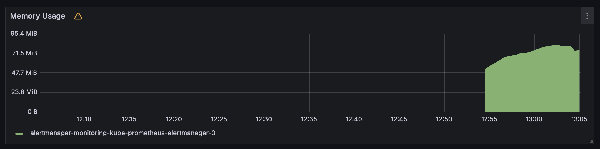
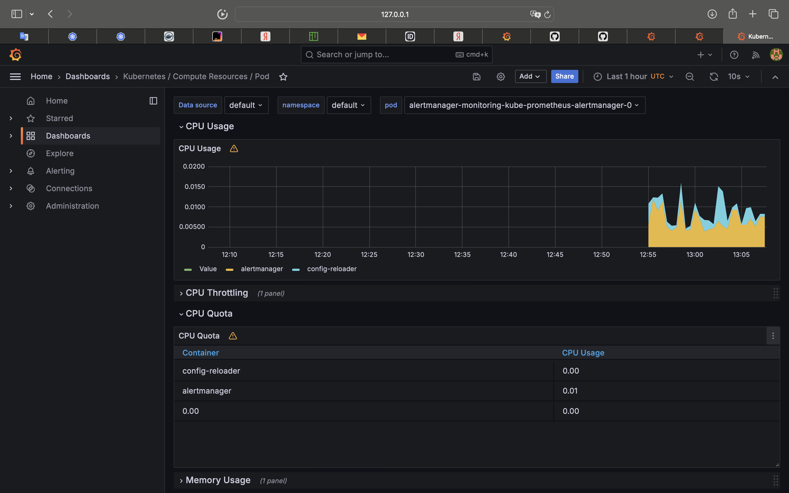
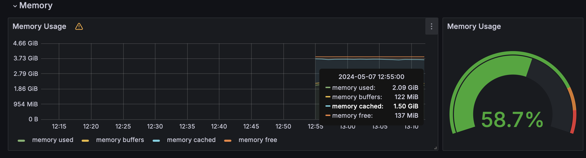
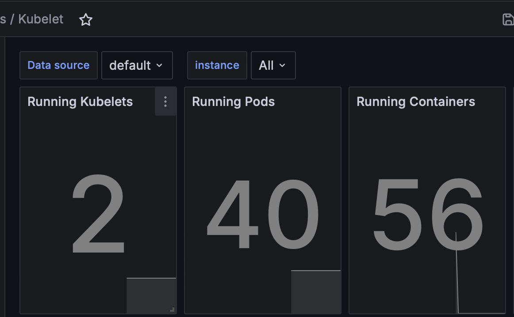
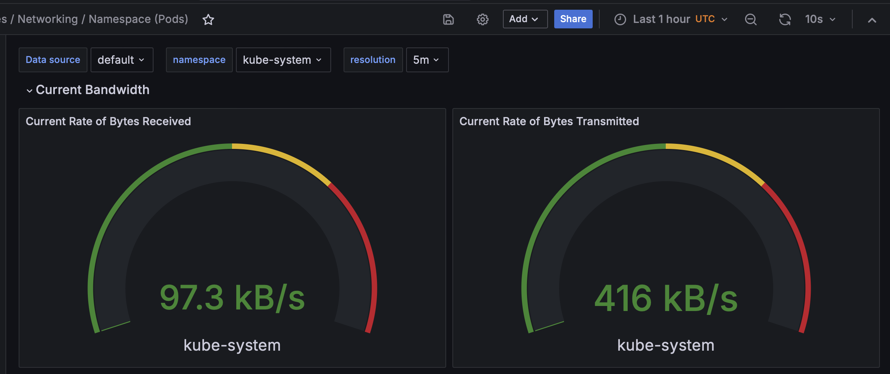
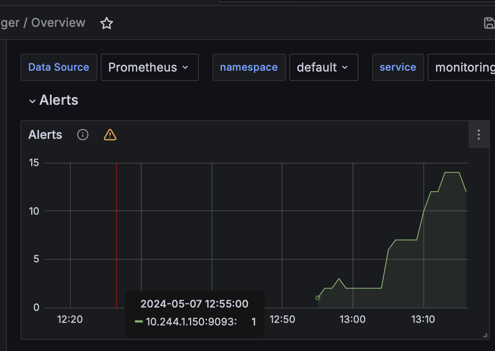
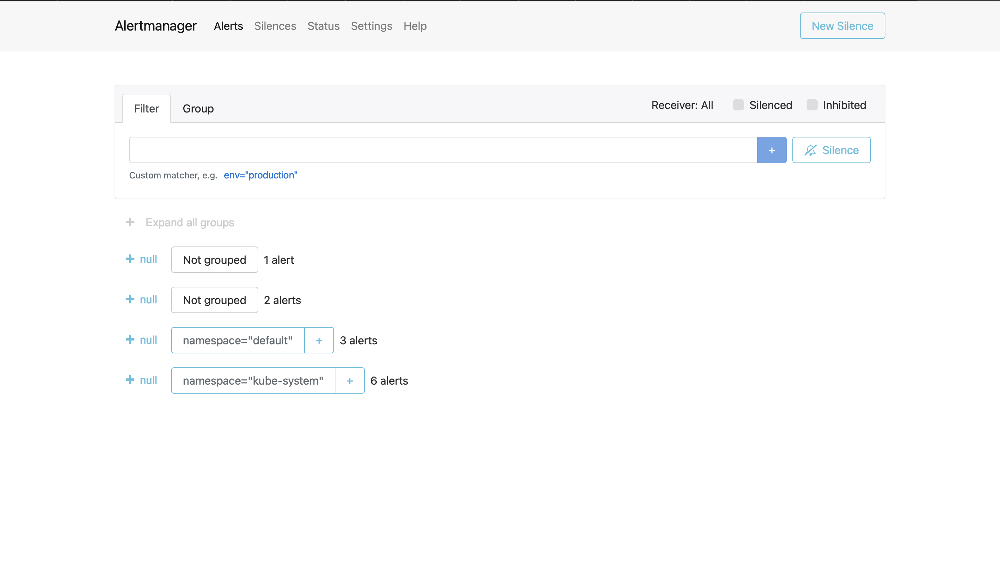
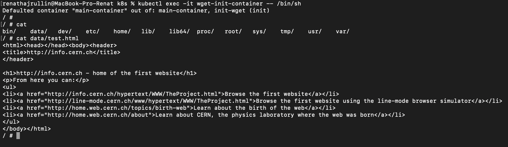

# Kube Prometheus Stack Components

## Prometheus Operator

- **Role:** Manages Prometheus components efficiently.
- **Function:** Automates the deployment and management of Prometheus instances and related monitoring components, such as Alertmanager and exporters.

## Prometheus

- **Role:** Gathers metrics for system monitoring.
- **Function:** Scrapes metrics from monitored targets (e.g., Kubernetes components, applications) at regular intervals, stores them in a time-series database, and provides a query language for retrieving and analyzing metrics data.

## Alertmanager

- **Role:** Manages alerts from client apps.
- **Function:** Receives alerts from Prometheus, applies grouping and routing rules to them, and sends notifications via various channels (e.g., email, Slack, PagerDuty) to alert administrators about potential issues in the monitored system.

## Prometheus node-exporter

- **Role:** Obtains OS/hardware metrics.
- **Function:** Collects metrics related to hardware and operating system resources (e.g., CPU usage, memory usage, disk I/O) from the nodes in the Kubernetes cluster and exposes them in a format that Prometheus can scrape.

## Prometheus blackbox-exporter

- **Role:** Conducts HTTP and TCP tests on endpoints.
- **Function:** Performs synthetic monitoring by probing endpoints over HTTP(S) or TCP to check their accessibility and measure response times, allowing administrators to monitor the availability and performance of external services.

## Prometheus Adapter for Kubernetes Metrics APIs

- **Role:** Enables collaboration between Kubernetes and Prometheus.
- **Function:** Provides compatibility between Kubernetes metrics APIs and Prometheus querying, allowing Prometheus to scrape and collect metrics from Kubernetes resources like pods, nodes, and services.

## kube-state-metrics

- **Role:** Assists in gathering Kubernetes component metrics.
- **Function:** Collects metrics about the state of Kubernetes objects (e.g., deployments, pods, services) by querying the Kubernetes API server and exposes them in a Prometheus-compatible format for monitoring and analysis.

## Grafana

- **Role:** Grafana visualizes data for effective monitoring.
- **Function:** Provides a web-based visualization platform for creating, customizing, and sharing dashboards that display metrics and data collected by Prometheus, allowing users to gain insights into the health and performance of their systems through graphs, charts, and alerts.

# Output
```shell
renathajrullin@MacBook-Pro-Renat k8s % kubectl get po,sts,svc,pvc,cm                                     
NAME                                                         READY   STATUS      RESTARTS   AGE
pod/alertmanager-monitoring-kube-prometheus-alertmanager-0   2/2     Running     0          96s
pod/monitoring-grafana-657659866f-kblkv                      3/3     Running     0          102s
pod/monitoring-kube-prometheus-operator-7f557c868d-5mbpc     1/1     Running     0          102s
pod/monitoring-kube-state-metrics-7fc7cf6558-gkzsp           1/1     Running     0          102s
pod/monitoring-prometheus-node-exporter-j7vmm                1/1     Running     0          102s
pod/postinstall-hook                                         0/1     Completed   0          6d17h
pod/preinstall-hook                                          0/1     Completed   0          6d17h
pod/prometheus-monitoring-kube-prometheus-prometheus-0       2/2     Running     0          91s
pod/time-web-0                                               1/1     Running     3          6d17h
pod/time-web-1                                               1/1     Running     9          6d17h
pod/vault-0                                                  1/1     Running     4          20d
pod/vault-agent-injector-dbfc5cd77-247mc                     1/1     Running     4          20d

NAME                                                                    READY   AGE
statefulset.apps/alertmanager-monitoring-kube-prometheus-alertmanager   1/1     97s
statefulset.apps/prometheus-monitoring-kube-prometheus-prometheus       1/1     92s
statefulset.apps/time-web                                               2/2     6d17h
statefulset.apps/vault                                                  1/1     20d

NAME                                              TYPE           CLUSTER-IP       EXTERNAL-IP   PORT(S)                      AGE
service/alertmanager-operated                     ClusterIP      None             <none>        9093/TCP,9094/TCP,9094/UDP   97s
service/kubernetes                                ClusterIP      10.96.0.1        <none>        443/TCP                      34d
service/monitoring-grafana                        ClusterIP      10.110.149.146   <none>        80/TCP                       102s
service/monitoring-kube-prometheus-alertmanager   ClusterIP      10.101.83.64     <none>        9093/TCP,8080/TCP            102s
service/monitoring-kube-prometheus-operator       ClusterIP      10.110.26.144    <none>        443/TCP                      102s
service/monitoring-kube-prometheus-prometheus     ClusterIP      10.103.129.50    <none>        9090/TCP,8080/TCP            102s
service/monitoring-kube-state-metrics             ClusterIP      10.111.106.48    <none>        8080/TCP                     102s
service/monitoring-prometheus-node-exporter       ClusterIP      10.106.160.98    <none>        9100/TCP                     102s
service/prometheus-operated                       ClusterIP      None             <none>        9090/TCP                     92s
service/time-web                                  ClusterIP      10.98.86.197     <none>        5000/TCP                     6d17h
service/time-web-service                          LoadBalancer   10.96.101.216    <pending>     5000:30293/TCP               34d
service/vault                                     ClusterIP      10.109.91.63     <none>        8200/TCP,8201/TCP            20d
service/vault-agent-injector-svc                  ClusterIP      10.111.171.160   <none>        443/TCP                      20d
service/vault-internal                            ClusterIP      None             <none>        8200/TCP,8201/TCP            20d

NAME                                                STATUS    VOLUME                                     CAPACITY   ACCESS MODES   STORAGECLASS       AGE
persistentvolumeclaim/data-time-web-0               Bound     pvc-d8c1385a-aa11-4fc6-8ff9-150087efa200   1Gi        RWO            standard           6d20h
persistentvolumeclaim/data-time-web-1               Bound     pvc-338619e9-9823-47e6-b239-d9fda3e60a92   1Gi        RWO            standard           6d20h
persistentvolumeclaim/data-time-web-stateful-0      Bound     pvc-99f26e86-65b2-4a51-ae24-6f61facb0a5c   1Gi        RWO            standard           6d20h
persistentvolumeclaim/data-time-web-stateful-1      Bound     pvc-1a78fe03-2831-453a-8174-0347ae9cc3ce   1Gi        RWO            standard           6d20h
persistentvolumeclaim/data-time-web-statefulset-0   Bound     pvc-8a1e25cc-fd3f-4c43-81b2-a403a327832e   1Gi        RWO            standard           6d20h
persistentvolumeclaim/data-time-web-statefulset-1   Bound     pvc-5ca20927-8c6d-435f-abda-5640cc172ead   1Gi        RWO            standard           6d20h
persistentvolumeclaim/www-time-web-stateful-0       Pending                                                                        my-storage-class   6d17h
persistentvolumeclaim/www-time-web-statefulset-0    Bound     pvc-35a9a73a-fabe-4600-a8bc-b35fc9a2fe7b   1Gi        RWO            standard           6d21h
persistentvolumeclaim/www-time-web-statefulset-1    Bound     pvc-cdc303d6-ce27-410b-b726-ace0d436db07   1Gi        RWO            standard           6d21h
persistentvolumeclaim/www-web-0                     Bound     pvc-659f8f36-d31b-48f3-ada1-2b4ad8498700   1Gi        RWO            standard           6d21h
persistentvolumeclaim/www-web-1                     Bound     pvc-13d733f0-5166-49a7-af9b-9bf38a2b517c   1Gi        RWO            standard           6d21h

NAME                                                                     DATA   AGE
configmap/config                                                         1      6d17h
configmap/kube-root-ca.crt                                               1      34d
configmap/monitoring-grafana                                             1      102s
configmap/monitoring-grafana-config-dashboards                           1      102s
configmap/monitoring-kube-prometheus-alertmanager-overview               1      102s
configmap/monitoring-kube-prometheus-apiserver                           1      102s
configmap/monitoring-kube-prometheus-cluster-total                       1      102s
configmap/monitoring-kube-prometheus-controller-manager                  1      102s
configmap/monitoring-kube-prometheus-etcd                                1      102s
configmap/monitoring-kube-prometheus-grafana-datasource                  1      102s
configmap/monitoring-kube-prometheus-grafana-overview                    1      102s
configmap/monitoring-kube-prometheus-k8s-coredns                         1      102s
configmap/monitoring-kube-prometheus-k8s-resources-cluster               1      102s
configmap/monitoring-kube-prometheus-k8s-resources-multicluster          1      102s
configmap/monitoring-kube-prometheus-k8s-resources-namespace             1      102s
configmap/monitoring-kube-prometheus-k8s-resources-node                  1      102s
configmap/monitoring-kube-prometheus-k8s-resources-pod                   1      102s
configmap/monitoring-kube-prometheus-k8s-resources-workload              1      102s
configmap/monitoring-kube-prometheus-k8s-resources-workloads-namespace   1      102s
configmap/monitoring-kube-prometheus-kubelet                             1      102s
configmap/monitoring-kube-prometheus-namespace-by-pod                    1      102s
configmap/monitoring-kube-prometheus-namespace-by-workload               1      102s
configmap/monitoring-kube-prometheus-node-cluster-rsrc-use               1      102s
configmap/monitoring-kube-prometheus-node-rsrc-use                       1      102s
configmap/monitoring-kube-prometheus-nodes                               1      102s
configmap/monitoring-kube-prometheus-nodes-darwin                        1      102s
configmap/monitoring-kube-prometheus-persistentvolumesusage              1      102s
configmap/monitoring-kube-prometheus-pod-total                           1      102s
configmap/monitoring-kube-prometheus-prometheus                          1      102s
configmap/monitoring-kube-prometheus-proxy                               1      102s
configmap/monitoring-kube-prometheus-scheduler                           1      102s
configmap/monitoring-kube-prometheus-workload-total                      1      102s
configmap/prometheus-monitoring-kube-prometheus-prometheus-rulefiles-0   35     96s
```

## Report
### Pods (po):
- **alertmanager-monitoring-kube-prometheus-alertmanager-0**:
  - **Status:** Running
  - **Purpose:** Manages and handles alerts from Prometheus.
- **monitoring-grafana-657659866f-kblkv**:
  - **Status:** Running
  - **Purpose:** Provides visualization and monitoring capabilities through Grafana.
- **monitoring-kube-prometheus-operator-7f557c868d-5mbpc**:
  - **Status:** Running
  - **Purpose:** Manages Prometheus components efficiently.
- **monitoring-kube-state-metrics-7fc7cf6558-gkzsp**:
  - **Status:** Running
  - **Purpose:** Assists in gathering Kubernetes component metrics.
- **monitoring-prometheus-node-exporter-j7vmm**:
  - **Status:** Running
  - **Purpose:** Collects OS and hardware-level metrics from nodes in the Kubernetes cluster.
- **postinstall-hook**:
  - **Status:** Completed
  - **Purpose:** Hook executed after installation completion.
- **preinstall-hook**:
  - **Status:** Completed
  - **Purpose:** Hook executed before installation begins.
- **prometheus-monitoring-kube-prometheus-prometheus-0**:
  - **Status:** Running
  - **Purpose:** Collects and stores metrics for system monitoring.

### StatefulSets (sts):
- **alertmanager-monitoring-kube-prometheus-alertmanager**:
  - **Status:** 1/1 Ready
  - **Purpose:** Manages the state of the Alertmanager pods.
- **prometheus-monitoring-kube-prometheus-prometheus**:
  - **Status:** 1/1 Ready
  - **Purpose:** Manages the state of the Prometheus pods.
- **time-web**:
  - **Status:** 2/2 Ready
  - **Purpose:** Manages the state of the time-web pods.
- **vault**:
  - **Status:** 1/1 Ready
  - **Purpose:** Manages the state of the Vault pods.

### Services (svc):
- **alertmanager-operated**:
  - **Type:** ClusterIP
  - **Purpose:** Internal service for the Alertmanager.
- **kubernetes**:
  - **Type:** ClusterIP
  - **Purpose:** Default Kubernetes service.
- **monitoring-grafana**:
  - **Type:** ClusterIP
  - **Purpose:** Provides access to Grafana.
- **monitoring-kube-prometheus-alertmanager**:
  - **Type:** ClusterIP
  - **Purpose:** Service for accessing the Alertmanager.
- **monitoring-kube-prometheus-operator**:
  - **Type:** ClusterIP
  - **Purpose:** Service for accessing the Prometheus operator.
- **monitoring-kube-prometheus-prometheus**:
  - **Type:** ClusterIP
  - **Purpose:** Service for accessing Prometheus.
- **monitoring-kube-state-metrics**:
  - **Type:** ClusterIP
  - **Purpose:** Service for accessing kube-state-metrics.
- **monitoring-prometheus-node-exporter**:
  - **Type:** ClusterIP
  - **Purpose:** Service for accessing node-exporter.
- **prometheus-operated**:
  - **Type:** ClusterIP
  - **Purpose:** Internal service for Prometheus.
- **time-web**:
  - **Type:** ClusterIP
  - **Purpose:** Service for accessing the time-web application.
- **time-web-service**:
  - **Type:** LoadBalancer
  - **Purpose:** External service for accessing the time-web application.
- **vault**:
  - **Type:** ClusterIP
  - **Purpose:** Service for accessing Vault.
- **vault-agent-injector-svc**:
  - **Type:** ClusterIP
  - **Purpose:** Service for the Vault agent injector.

### PersistentVolumeClaims (pvc):
- **data-time-web-0**:
  - **Status:** Bound
  - **Purpose:** Persistent volume claim for storing data for time-web pod 0.
- **data-time-web-1**:
  - **Status:** Bound
  - **Purpose:** Persistent volume claim for storing data for time-web pod 1.
- **data-time-web-stateful-0**:
  - **Status:** Bound
  - **Purpose:** Persistent volume claim for storing stateful data for time-web pod 0.
- **data-time-web-stateful-1**:
  - **Status:** Bound
  - **Purpose:** Persistent volume claim for storing stateful data for time-web pod 1.
- **www-time-web-stateful-0**:
  - **Status:** Pending
  - **Purpose:** Persistent volume claim for storing stateful data for time-web pod 0 (pending allocation).
- **www-time-web-statefulset-0**:
  - **Status:** Bound
  - **Purpose:** Persistent volume claim for storing stateful data for time-web statefulset 0.
- **www-time-web-statefulset-1**:
  - **Status:** Bound
  - **Purpose:** Persistent volume claim for storing stateful data for time-web statefulset 1.
- **www-web-0**:
  - **Status:** Bound
  - **Purpose:** Persistent volume claim for storing data for www-web pod 0.
- **www-web-1**:
  - **Status:** Bound
  - **Purpose:** Persistent volume claim for storing data for www-web pod 1.

### ConfigMaps (cm):
- **config**:
  - **Data:** 1
  - **Purpose:** ConfigMap used for storing configuration data.
- **kube-root-ca.crt**:
  - **Data:** 1
  - **Purpose:** ConfigMap containing the root certificate for Kubernetes.
- **monitoring-grafana**:
  - **Data:** 1
  - **Purpose:** ConfigMap containing configuration data for Grafana.
- **monitoring-grafana-config-dashboards**:
  - **Data:** 1
  - **Purpose:** ConfigMap containing dashboard configuration data for Grafana.
- Other config maps contain various configurations and data for monitoring components like Prometheus, Alertmanager, and kube-state-metrics.


# Dashboards

### Check CPU and Memory consumption of your StatefulSet:


### Identify Pods with higher and lower CPU usage in the default namespace:
- **altermanager**

### Monitor node memory usage in percentage and megabytes:
- **58.7%, ~3.75GiB**

### Count the number of pods and containers managed by the Kubelet service:
- **40 pods, 56 containers**

### Evaluate network usage of Pods in the default namespace:

### Determine the number of active alerts; also check the Web UI with 
```shell
minikube service monitoring-kube-prometheus-alertmanager
```

- **12 alerts**




# 2nd Task. Init Container
