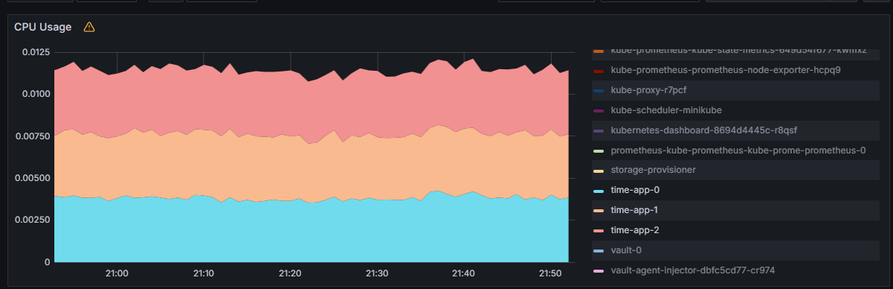
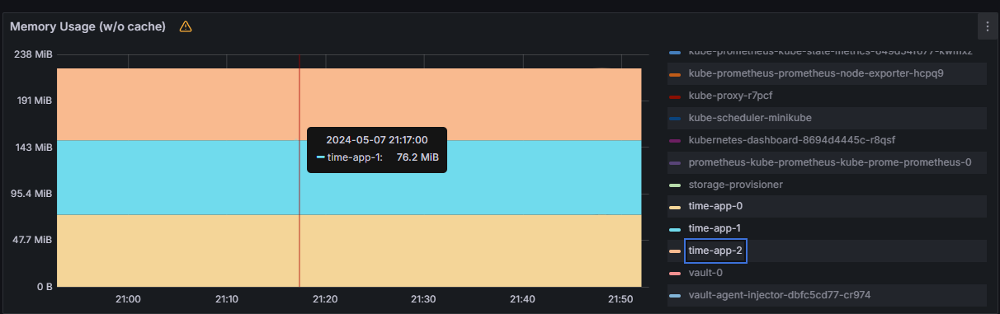
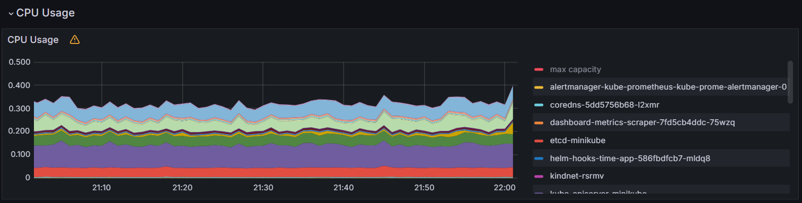
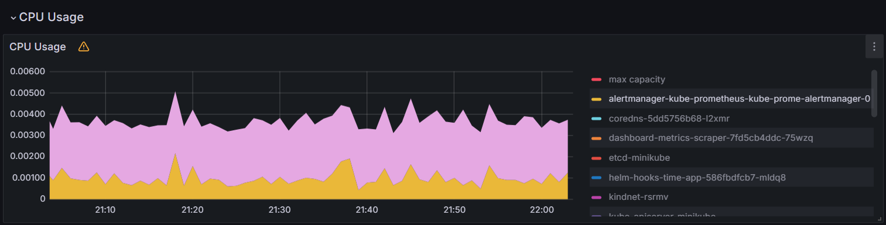
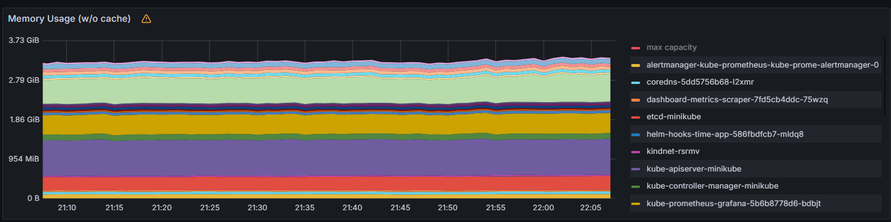
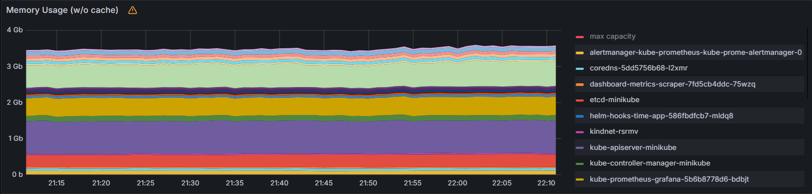
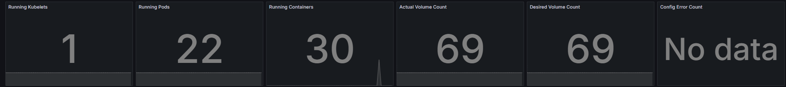
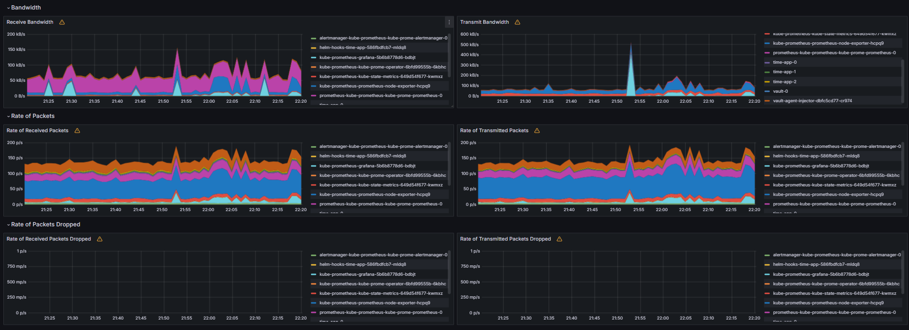
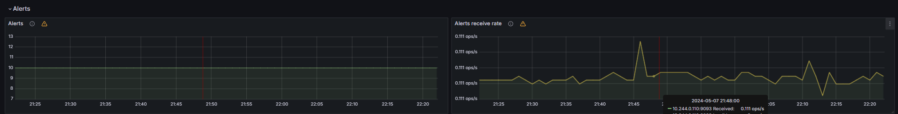
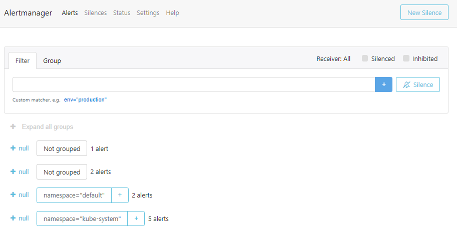

# Lab 14

## Output and explanation of `kubectl get po,sts,svc,pvc,cm`.

### Output

```bash
$ kubectl get po,sts,svc,pvc,cm
NAME                                                         READY   STATUS             RESTARTS       AGE
pod/alertmanager-kube-prometheus-kube-prome-alertmanager-0   2/2     Running            0              6h15m
pod/helm-hooks-time-app-586fbdfcb7-mldq8                     0/1     CrashLoopBackOff   95 (86s ago)   28d
pod/kube-prometheus-grafana-5b6b8778d6-bdbjt                 3/3     Running            0              6h15m
pod/kube-prometheus-kube-prome-operator-6bfd99555b-6kbhc     1/1     Running            0              6h15m
pod/kube-prometheus-kube-state-metrics-649d54f677-kwmxz      1/1     Running            0              6h15m
pod/kube-prometheus-prometheus-node-exporter-hcpq9           1/1     Running            0              6h15m
pod/prometheus-kube-prometheus-kube-prome-prometheus-0       2/2     Running            0              6h15m
pod/time-app-0                                               1/1     Running            0              5h27m
pod/time-app-1                                               1/1     Running            0              5h27m
pod/time-app-2                                               1/1     Running            0              5h26m
pod/vault-0                                                  1/1     Running            3              20d
pod/vault-agent-injector-dbfc5cd77-cr974                     1/1     Running            3              20d

NAME                                                                    READY   AGE
statefulset.apps/alertmanager-kube-prometheus-kube-prome-alertmanager   1/1     6h15m
statefulset.apps/prometheus-kube-prometheus-kube-prome-prometheus       1/1     6h15m
statefulset.apps/time-app                                               3/3     5h27m
statefulset.apps/vault                                                  1/1     20d

NAME                                               TYPE        CLUSTER-IP       EXTERNAL-IP   PORT(S)                      AGE
service/alertmanager-operated                      ClusterIP   None             <none>        9093/TCP,9094/TCP,9094/UDP   6h15m
service/helm-hooks-time-app                        ClusterIP   10.96.51.249     <none>        80/TCP                       28d
service/kube-prometheus-grafana                    ClusterIP   10.97.240.221    <none>        80/TCP                       6h15m
service/kube-prometheus-kube-prome-alertmanager    ClusterIP   10.99.32.105     <none>        9093/TCP,8080/TCP            6h15m
service/kube-prometheus-kube-prome-operator        ClusterIP   10.110.242.26    <none>        443/TCP                      6h15m
service/kube-prometheus-kube-prome-prometheus      ClusterIP   10.108.159.111   <none>        9090/TCP,8080/TCP            6h15m
service/kube-prometheus-kube-state-metrics         ClusterIP   10.99.82.207     <none>        8080/TCP                     6h15m
service/kube-prometheus-prometheus-node-exporter   ClusterIP   10.99.167.39     <none>        9100/TCP                     6h15m
service/kubernetes                                 ClusterIP   10.96.0.1        <none>        443/TCP                      28d
service/prometheus-operated                        ClusterIP   None             <none>        9090/TCP                     6h15m
service/time-app                                   NodePort    10.99.183.230    <none>        5000:32167/TCP               5h27m
service/vault                                      ClusterIP   10.96.206.124    <none>        8200/TCP,8201/TCP            20d
service/vault-agent-injector-svc                   ClusterIP   10.104.179.183   <none>        443/TCP                      20d
service/vault-internal                             ClusterIP   None             <none>        8200/TCP,8201/TCP            20d

NAME                                      STATUS   VOLUME                                     CAPACITY   ACCESS MODES   STORAGECLASS   AGE
persistentvolumeclaim/visits-time-app-0   Bound    pvc-32d7e0d9-345a-445b-b43e-b14b9264a97b   10Mi       RWO            standard       6d20h
persistentvolumeclaim/visits-time-app-1   Bound    pvc-e76fd44c-6506-45df-8dd3-367fbc96b93d   10Mi       RWO            standard       6d20h
persistentvolumeclaim/visits-time-app-2   Bound    pvc-71efc0f2-6bdc-4c97-ab85-975dd77b49f2   10Mi       RWO            standard       6d20h

NAME                                                                     DATA   AGE
configmap/config                                                         1      5h27m
configmap/kube-prometheus-grafana                                        1      6h15m
configmap/kube-prometheus-grafana-config-dashboards                      1      6h15m
configmap/kube-prometheus-kube-prome-alertmanager-overview               1      6h15m
configmap/kube-prometheus-kube-prome-apiserver                           1      6h15m
configmap/kube-prometheus-kube-prome-cluster-total                       1      6h15m
configmap/kube-prometheus-kube-prome-controller-manager                  1      6h15m
configmap/kube-prometheus-kube-prome-etcd                                1      6h15m
configmap/kube-prometheus-kube-prome-grafana-datasource                  1      6h15m
configmap/kube-prometheus-kube-prome-grafana-overview                    1      6h15m
configmap/kube-prometheus-kube-prome-k8s-coredns                         1      6h15m
configmap/kube-prometheus-kube-prome-k8s-resources-cluster               1      6h15m
configmap/kube-prometheus-kube-prome-k8s-resources-multicluster          1      6h15m
configmap/kube-prometheus-kube-prome-k8s-resources-namespace             1      6h15m
configmap/kube-prometheus-kube-prome-k8s-resources-node                  1      6h15m
configmap/kube-prometheus-kube-prome-k8s-resources-pod                   1      6h15m
configmap/kube-prometheus-kube-prome-k8s-resources-workload              1      6h15m
configmap/kube-prometheus-kube-prome-k8s-resources-workloads-namespace   1      6h15m
configmap/kube-prometheus-kube-prome-kubelet                             1      6h15m
configmap/kube-prometheus-kube-prome-namespace-by-pod                    1      6h15m
configmap/kube-prometheus-kube-prome-namespace-by-workload               1      6h15m
configmap/kube-prometheus-kube-prome-node-cluster-rsrc-use               1      6h15m
configmap/kube-prometheus-kube-prome-node-rsrc-use                       1      6h15m
configmap/kube-prometheus-kube-prome-nodes                               1      6h15m
configmap/kube-prometheus-kube-prome-nodes-darwin                        1      6h15m
configmap/kube-prometheus-kube-prome-persistentvolumesusage              1      6h15m
configmap/kube-prometheus-kube-prome-pod-total                           1      6h15m
configmap/kube-prometheus-kube-prome-prometheus                          1      6h15m
configmap/kube-prometheus-kube-prome-proxy                               1      6h15m
configmap/kube-prometheus-kube-prome-scheduler                           1      6h15m
configmap/kube-prometheus-kube-prome-workload-total                      1      6h15m
configmap/kube-root-ca.crt                                               1      28d
configmap/prometheus-kube-prometheus-kube-prome-prometheus-rulefiles-0   35     6h15m
```

### Description

#### Pods

Pods are the running instances of containers in Kubernetes. Each pod represents a single unit of deployment. The
report provides information about each pod, including its name, readiness status (number of ready containers / total
number of containers), current status, restart count, and age (how long the pod has been running).

#### StatefulSets

StatefulSets are used to manage stateful applications in Kubernetes. They ensure stable network identities
and ordered deployment of pods. The report displays information about StatefulSets, including their names and the number
of ready pods out of the desired number of pods. It also shows the age of the StatefulSet.

#### Services

Services provide network connectivity to pods and enable communication between them. The report lists services
along with their names, types (such as ClusterIP or NodePort), cluster IP addresses, external IP addresses (if
applicable), and the ports they expose. The age of each service is also provided.

#### PersistentVolumeClaims

PersistentVolumeClaims (PVCs) are used to request and access persistent storage in Kubernetes.
The report shows information about each PVC, including its name, status (whether it is bound to a persistent volume or
not), the volume it is bound to, its capacity, access modes, and age.

#### ConfigMaps

ConfigMaps store configuration data that can be used by pods in Kubernetes. The report displays information
about each ConfigMap, including its name and the number of data entries it contains. The age of each ConfigMap is also
provided.

## Detailed explanation of monitoring stack components

### The Prometheus Operator

The Prometheus Operator simplifies the deployment and configuration of Prometheus,
Alertmanager, and related monitoring components in a Kubernetes cluster. It uses Kubernetes custom resources to manage
these components.

### Highly available Prometheus

Prometheus is a time-series database and monitoring system. It collects metrics from
various sources and stores them for analysis and alerting. In a highly available setup, multiple Prometheus instances
are deployed to ensure redundancy and fault tolerance.

### Highly available Alertmanager

Alertmanager is responsible for handling and routing alerts generated by Prometheus. It
can group similar alerts, silence them, and send notifications to various receivers such as email, Slack, or PagerDuty.
Like Prometheus, Alertmanager can also be deployed in a highly available configuration.

### Prometheus node-exporter

The Prometheus node-exporter is an exporter that collects metrics about the host machine, such
as CPU usage, memory usage, disk space, and network statistics. It exposes these metrics to Prometheus for monitoring
and analysis.

### Prometheus blackbox-exporter

The Prometheus blackbox-exporter is used for endpoint monitoring and health checks. It can
detect endpoint failures and provide insights into the availability and performance of services. It integrates with
Alertmanager to send alerts based on predefined rules.

### Prometheus Adapter for Kubernetes Metrics APIs

The Prometheus Adapter is an extension API server that allows Prometheus
to collect metrics from Kubernetes resources. It enables the collection of resource metrics such as CPU and memory usage
from pods, nodes, and other Kubernetes objects.

### kube-state-metrics

kube-state-metrics is an exporter that provides metrics about the state of Kubernetes objects, such
as deployments, pods, and services. It exposes these metrics to Prometheus, allowing for monitoring and analysis of the
Kubernetes cluster.

### Grafana

Grafana is a popular open-source platform for visualizing and analyzing metrics. It integrates with Prometheus
to create dashboards and graphs that provide insights into the collected metrics. Grafana allows users to create custom
visualizations and alerts based on the Prometheus data.

## Answers to all 6 questions from point 5

### Check CPU and Memory consumption of your StatefulSet.

#### CPU



### Memory



### Identify Pods with higher and lower CPU usage in the default namespace.

#### All CPU



#### Lowest and highest



### Monitor node memory usage in percentage and megabytes.

#### Percentage



#### Megabytes



### Count the number of pods and containers managed by the Kubelet service.



### Evaluate network usage of Pods in the default namespace.



### Determine the number of active alerts; also check the Web UI with `minikube service monitoring-kube-prometheus-alertmanager`.

#### Alerts


#### Check

