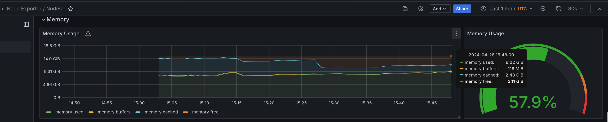
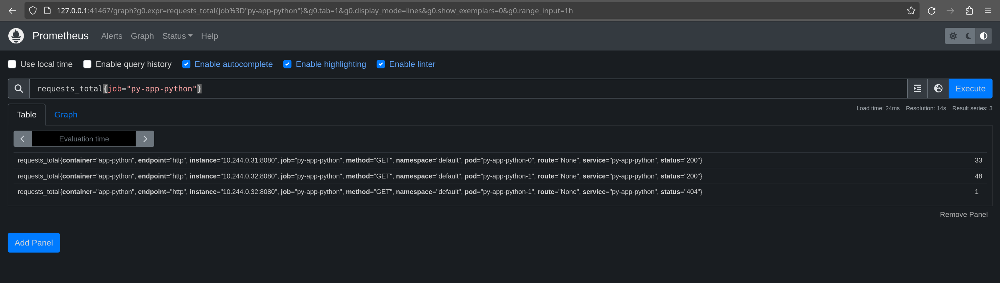

# Lab 14

## Description of components

- Prometheus: collects and stores metrics from the application;
- Prometheus node explorer: collects metrics from the operating system and makes
  it available for Prometheus;
- Prometheus Adapter for Kubernetes Metrics APIs: collects metrics from
  Kubernetes and makes it availabe for Prometheus;
- kube-state-metrics: collects metrics from deployed objects in the Kubernetes
  cluster and makes it available for Prometheus;
- Grafana: allows to visualize metrics from Prometheus (and other tools);
- Alertmanager: manages alerts generates by Prometheus and sends them further
  (e.g. via email);
- Prometheus Operator: simplifies deploying a Prometheus stack to a Kubernetes
  cluster.

## Installation

```
$ kubectl get po,sts,svc,pvc,cm
NAME                                                         READY   STATUS    RESTARTS   AGE
pod/alertmanager-monitoring-kube-prometheus-alertmanager-0   2/2     Running   0          7m43s
pod/monitoring-grafana-657659866f-kr8db                      3/3     Running   0          8m7s
pod/monitoring-kube-prometheus-operator-b57d5fdb4-flmtr      1/1     Running   0          8m7s
pod/monitoring-kube-state-metrics-ff67df946-7xspk            1/1     Running   0          8m7s
pod/monitoring-prometheus-node-exporter-2mf5m                1/1     Running   0          8m7s
pod/prometheus-monitoring-kube-prometheus-prometheus-0       2/2     Running   0          7m43s
pod/py-app-python-0                                          1/1     Running   0          7m6s
pod/py-app-python-1                                          1/1     Running   0          7m6s

NAME                                                                    READY   AGE
statefulset.apps/alertmanager-monitoring-kube-prometheus-alertmanager   1/1     7m43s
statefulset.apps/prometheus-monitoring-kube-prometheus-prometheus       1/1     7m43s
statefulset.apps/py-app-python                                          2/2     7m6s

NAME                                              TYPE        CLUSTER-IP       EXTERNAL-IP   PORT(S)                      AGE
service/alertmanager-operated                     ClusterIP   None             <none>        9093/TCP,9094/TCP,9094/UDP   7m43s
service/kubernetes                                ClusterIP   10.96.0.1        <none>        443/TCP                      33m
service/monitoring-grafana                        ClusterIP   10.100.0.98      <none>        80/TCP                       8m7s
service/monitoring-kube-prometheus-alertmanager   ClusterIP   10.104.171.162   <none>        9093/TCP,8080/TCP            8m7s
service/monitoring-kube-prometheus-operator       ClusterIP   10.97.214.200    <none>        443/TCP                      8m7s
service/monitoring-kube-prometheus-prometheus     ClusterIP   10.106.250.226   <none>        9090/TCP,8080/TCP            8m7s
service/monitoring-kube-state-metrics             ClusterIP   10.108.209.168   <none>        8080/TCP                     8m7s
service/monitoring-prometheus-node-exporter       ClusterIP   10.102.229.26    <none>        9100/TCP                     8m7s
service/prometheus-operated                       ClusterIP   None             <none>        9090/TCP                     7m43s
service/py-app-python                             ClusterIP   10.110.165.46    <none>        8080/TCP                     7m6s

NAME                                          STATUS   VOLUME                                     CAPACITY   ACCESS MODES   STORAGECLASS   AGE
persistentvolumeclaim/data-hs-app-haskell-0   Bound    pvc-8c69a243-eaf3-41ea-90b0-9b13c4ab59b4   1Gi        RWO            standard       32m
persistentvolumeclaim/data-hs-app-haskell-1   Bound    pvc-5ac63ca2-e5d6-4233-a2ab-f783f3f005f7   1Gi        RWO            standard       32m
persistentvolumeclaim/data-py-app-python-0    Bound    pvc-31f33c0b-209d-4b6f-a1b6-6699f72fd1c2   1Gi        RWO            standard       7m6s
persistentvolumeclaim/data-py-app-python-1    Bound    pvc-eae487a1-19ac-4e9a-b12f-c4712b61bd60   1Gi        RWO            standard       7m6s

NAME                                                                     DATA   AGE
configmap/config                                                         1      7m6s
configmap/kube-root-ca.crt                                               1      32m
configmap/monitoring-grafana                                             1      8m7s
configmap/monitoring-grafana-config-dashboards                           1      8m7s
configmap/monitoring-kube-prometheus-alertmanager-overview               1      8m7s
configmap/monitoring-kube-prometheus-apiserver                           1      8m7s
configmap/monitoring-kube-prometheus-cluster-total                       1      8m7s
configmap/monitoring-kube-prometheus-controller-manager                  1      8m7s
configmap/monitoring-kube-prometheus-etcd                                1      8m7s
configmap/monitoring-kube-prometheus-grafana-datasource                  1      8m7s
configmap/monitoring-kube-prometheus-grafana-overview                    1      8m7s
configmap/monitoring-kube-prometheus-k8s-coredns                         1      8m7s
configmap/monitoring-kube-prometheus-k8s-resources-cluster               1      8m7s
configmap/monitoring-kube-prometheus-k8s-resources-multicluster          1      8m7s
configmap/monitoring-kube-prometheus-k8s-resources-namespace             1      8m7s
configmap/monitoring-kube-prometheus-k8s-resources-node                  1      8m7s
configmap/monitoring-kube-prometheus-k8s-resources-pod                   1      8m7s
configmap/monitoring-kube-prometheus-k8s-resources-workload              1      8m7s
configmap/monitoring-kube-prometheus-k8s-resources-workloads-namespace   1      8m7s
configmap/monitoring-kube-prometheus-kubelet                             1      8m7s
configmap/monitoring-kube-prometheus-namespace-by-pod                    1      8m7s
configmap/monitoring-kube-prometheus-namespace-by-workload               1      8m7s
configmap/monitoring-kube-prometheus-node-cluster-rsrc-use               1      8m7s
configmap/monitoring-kube-prometheus-node-rsrc-use                       1      8m7s
configmap/monitoring-kube-prometheus-nodes                               1      8m7s
configmap/monitoring-kube-prometheus-nodes-darwin                        1      8m7s
configmap/monitoring-kube-prometheus-persistentvolumesusage              1      8m7s
configmap/monitoring-kube-prometheus-pod-total                           1      8m7s
configmap/monitoring-kube-prometheus-prometheus                          1      8m7s
configmap/monitoring-kube-prometheus-proxy                               1      8m7s
configmap/monitoring-kube-prometheus-scheduler                           1      8m7s
configmap/monitoring-kube-prometheus-workload-total                      1      8m7s
configmap/prometheus-monitoring-kube-prometheus-prometheus-rulefiles-0   35     7m43s
```

This command showed:

- installed pods: four pods for my Python and Haskell applications, and all
  other pods are from `kube-prometheus`;
- installed stateful sets: two from `kube-prometheus` and two from my apps;
- installed services: mostly from `kube-prometheus`, but two are from my apps;
- allocated persistent volumes: all for my apps, one per each pod;
- installed config maps: all coming from `kube-prometheus`.

## Cluster information

a. _Check CPU and Memory consumption of your StatefulSet._

   0.03% CPU time and 43.2 MiB of memory.

   
b. _Identify Pods with higher and lower CPU usage in the default namespace._

   - Highest usage: prometheus (1.6%)
   - Lowest usage: app-python (0.01%)

   
c. _Monitor node memory usage in percentage and megabytes._

   9.22 GiB, or 57.9%

   
d. _Count the number of pods and containers managed by the Kubelet service._

   15 pods, 22 containers.

   
e. _Evaluate network usage of Pods in the default namespace._

   69.9 kB/s download, 112 kB/s upload.

      
f. _Determine the number of active alerts_

   8 alerts.

   

## App metrics

Here's an example of metrics from my app:



## Init containers

```
$ kubectl exec py-app-python-0 -- head -c 260 /init-container/index.html
Defaulted container "app-python" out of: app-python, init-example (init)
<!DOCTYPE html><html lang="en"><head><meta charset="utf-8"><title>SnejUgal</title><meta name="viewport" content="width=device-width"><meta name="theme-color" content="#090a0d"><meta name="description" content="A 20-year-old human passionate about technology.">
```

## Init container queue

```
$ kubectl exec py-app-python-0 -- cat /init-container/queue
Defaulted container "app-python" out of: app-python, init-example (init), init-queue-2 (init), init-queue-3 (init)
hi
hej-hej
```

The first init container still downloads my website :)
