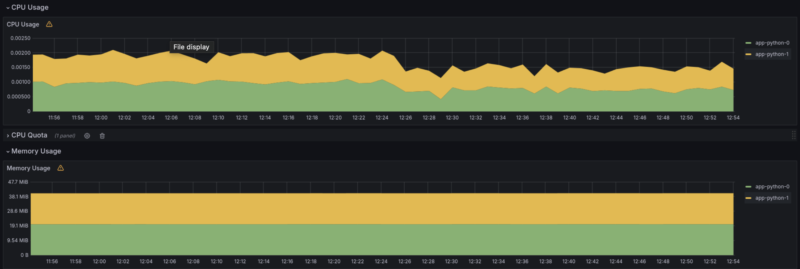
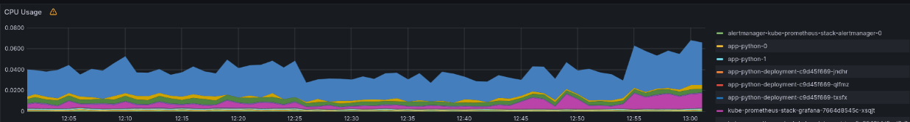
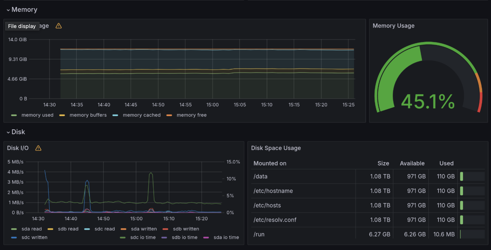
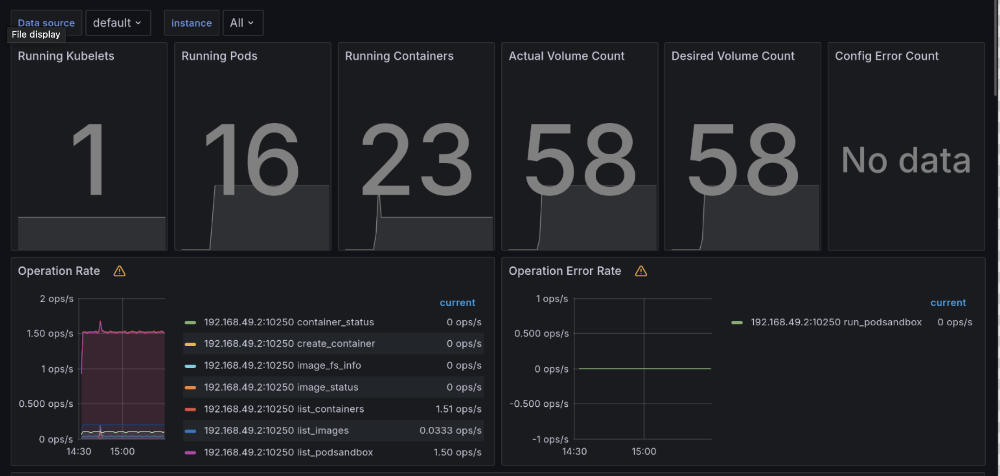
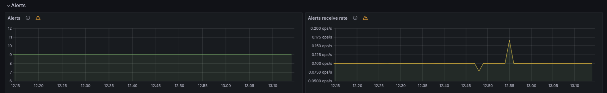
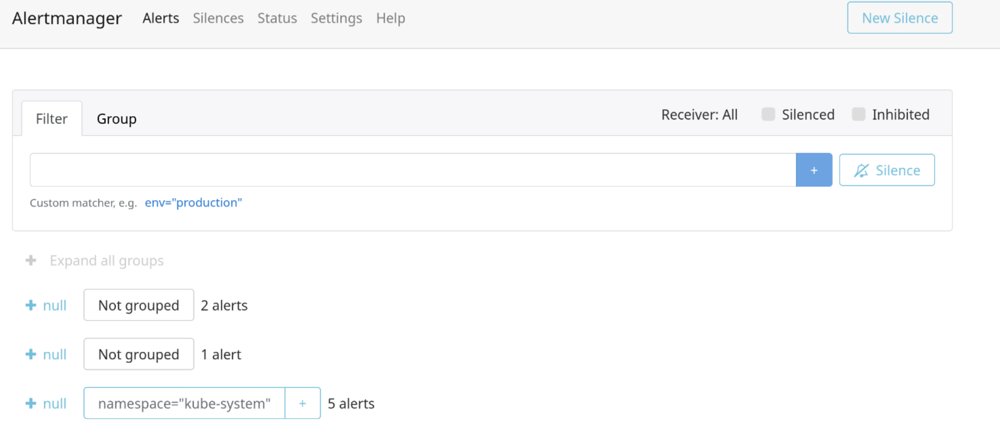

# Task 1: Kubernetes Cluster Monitoring with Prometheus

## Explanation of monitoring stack components
- Prometheus: Gathers and stores time-series data, monitoring Kubernetes resources and triggering alerts.
- Alertmanager: Efficiently handles and routes alerts, ensuring prompt responses to issues.
- Grafana: Provides visualization and dashboarding capabilities, enabling users to create custom views for analyzing cluster metrics.
- Prometheus Operator: Simplifies Prometheus configuration management, easing deployment and maintenance of Prometheus instances.
- Prometheus node-exporter: Collects metrics about the host machine, including CPU usage, memory usage, disk usage, and network activity.
- Prometheus blackbox-exporter: Performs HTTP and TCP probes against endpoints to determine their availability and response times.
- Prometheus Adapter for Kubernetes Metrics APIs: Enables Prometheus to query metrics from the Kubernetes Metrics APIs, gathering data about Kubernetes objects such as pods, nodes, and containers.
- kube-state-metrics: Exposes metrics related to the state of Kubernetes objects, aiding in cluster analysis and troubleshooting.

## Output and explanation of `kubectl get po,sts,svc,pvc,cm`

```bash
NAME                                                            READY   STATUS    RESTARTS       AGE
pod/alertmanager-kube-prometheus-stack-alertmanager-0           2/2     Running   4 (75s ago)    97m
pod/app-python-0                                                1/1     Running   24 (56s ago)   90m
pod/app-python-1                                                1/1     Running   24 (56s ago)   90m
pod/app-python-deployment-c9d45f669-jndhr                       1/1     Running   87 (34m ago)   4d17h
pod/app-python-deployment-c9d45f669-qlfmz                       1/1     Running   90 (34m ago)   6d1h
pod/app-python-deployment-c9d45f669-txsfx                       1/1     Running   90 (34m ago)   6d1h
pod/kube-prometheus-stack-grafana-7664d8545c-xsqjt              3/3     Running   6 (75s ago)    104m
pod/kube-prometheus-stack-kube-state-metrics-5c6549bfd5-vl7z7   1/1     Running   5 (56s ago)    104m
pod/kube-prometheus-stack-operator-76bf64f57d-bvr7t             1/1     Running   4 (56s ago)    104m
pod/kube-prometheus-stack-prometheus-node-exporter-gs4cq        1/1     Running   3 (75s ago)    104m
pod/prometheus-kube-prometheus-stack-prometheus-0               2/2     Running   4 (75s ago)    97m

NAME                                                               READY   AGE
statefulset.apps/alertmanager-kube-prometheus-stack-alertmanager   1/1     97m
statefulset.apps/app-python                                        2/2     90m
statefulset.apps/prometheus-kube-prometheus-stack-prometheus       1/1     97m

NAME                                                     TYPE           CLUSTER-IP       EXTERNAL-IP   PORT(S)                      AGE
service/alertmanager-operated                            ClusterIP      None             <none>        9093/TCP,9094/TCP,9094/UDP   97m
service/app-python                                       LoadBalancer   10.96.56.242     <pending>     5000:31930/TCP               90m
service/kube-prometheus-stack-alertmanager               ClusterIP      10.103.224.32    <none>        9093/TCP,8080/TCP            104m
service/kube-prometheus-stack-grafana                    ClusterIP      10.97.101.80     <none>        80/TCP                       104m
service/kube-prometheus-stack-kube-state-metrics         ClusterIP      10.107.18.141    <none>        8080/TCP                     104m
service/kube-prometheus-stack-operator                   ClusterIP      10.106.149.223   <none>        443/TCP                      104m
service/kube-prometheus-stack-prometheus                 ClusterIP      10.98.133.149    <none>        9090/TCP,8080/TCP            104m
service/kube-prometheus-stack-prometheus-node-exporter   ClusterIP      10.104.185.149   <none>        9100/TCP                     104m
service/kubernetes                                       ClusterIP      10.96.0.1        <none>        443/TCP                      18d
service/prometheus-operated                              ClusterIP      None             <none>        9090/TCP                     97m

NAME                                      STATUS   VOLUME                                     CAPACITY   ACCESS MODES   STORAGECLASS   AGE
persistentvolumeclaim/data-app-python-0   Bound    pvc-b39a681a-0841-47da-afcf-e628c6796587   1Gi        RWO            standard       4d18h
persistentvolumeclaim/data-app-python-1   Bound    pvc-89e7bf49-a404-49ee-ae19-2ffe5aa910c6   1Gi        RWO            standard       4d18h

NAME                                                                DATA   AGE
configmap/kube-prometheus-stack-alertmanager-overview               1      104m
configmap/kube-prometheus-stack-apiserver                           1      104m
configmap/kube-prometheus-stack-cluster-total                       1      104m
configmap/kube-prometheus-stack-controller-manager                  1      104m
configmap/kube-prometheus-stack-etcd                                1      104m
configmap/kube-prometheus-stack-grafana                             1      104m
configmap/kube-prometheus-stack-grafana-config-dashboards           1      104m
configmap/kube-prometheus-stack-grafana-datasource                  1      104m
configmap/kube-prometheus-stack-grafana-overview                    1      104m
configmap/kube-prometheus-stack-k8s-coredns                         1      104m
configmap/kube-prometheus-stack-k8s-resources-cluster               1      104m
configmap/kube-prometheus-stack-k8s-resources-multicluster          1      104m
configmap/kube-prometheus-stack-k8s-resources-namespace             1      104m
configmap/kube-prometheus-stack-k8s-resources-node                  1      104m
configmap/kube-prometheus-stack-k8s-resources-pod                   1      104m
configmap/kube-prometheus-stack-k8s-resources-workload              1      104m
configmap/kube-prometheus-stack-k8s-resources-workloads-namespace   1      104m
configmap/kube-prometheus-stack-kubelet                             1      104m
configmap/kube-prometheus-stack-namespace-by-pod                    1      104m
configmap/kube-prometheus-stack-namespace-by-workload               1      104m
configmap/kube-prometheus-stack-node-cluster-rsrc-use               1      104m
configmap/kube-prometheus-stack-node-rsrc-use                       1      104m
configmap/kube-prometheus-stack-nodes                               1      104m
configmap/kube-prometheus-stack-nodes-darwin                        1      104m
configmap/kube-prometheus-stack-persistentvolumesusage              1      104m
configmap/kube-prometheus-stack-pod-total                           1      104m
configmap/kube-prometheus-stack-prometheus                          1      104m
configmap/kube-prometheus-stack-proxy                               1      104m
configmap/kube-prometheus-stack-scheduler                           1      104m
configmap/kube-prometheus-stack-workload-total                      1      104m
configmap/kube-root-ca.crt                                          1      18d
configmap/prometheus-kube-prometheus-stack-prometheus-rulefiles-0   35     97m
```

Explanation:

- Pods (po):
  - `lertmanager-kube-prometheus-stack-alertmanager-0`: Manages alerts for the Prometheus stack.
  - `app-python-0`, `app-python-1`: Pods running a Python application created in Lab 13.
  - `pod/app-python-deployment-c9d45f669-jndhr`, `pod/app-python-deployment-c9d45f669-qlfmz`, `pod/app-python-deployment-c9d45f669-txsfx`: Pods created in previous labs related to Kubernetes.
  - `kube-prometheus-stack-grafana-7664d8545c-xsqjt`: Runs Grafana for visualization and monitoring.
  - `kube-prometheus-stack-kube-state-metrics-5c6549bfd5-vl7z7`: Collects metrics about the state of Kubernetes objects.
  - `kube-prometheus-stack-operator-76bf64f57d-bvr7t`: Manages the Prometheus Operator.
  - `kube-prometheus-stack-prometheus-node-exporter-gs4cq`: Collects metrics about the host machine and exposes them for Prometheus.
  - `prometheus-kube-prometheus-stack-prometheus-0`: Runs Prometheus, the core monitoring component.
- StatefulSets (sts):
  - `alertmanager-kube-prometheus-stack-alertmanager`: Manages the Alertmanager component of the kube-prometheus-stack.
  - `prometheus-kube-prometheus-stack-prometheus`: Manages the Prometheus component of the kube-prometheus-stack.
  - `app-python`: Custom StatefulSet from Lab 13.
- Services (svc):
  - `alertmanager-operated`: Exposes ports for communication with the Alertmanager pods.
  - `app-python`: Exposes port 5000 for accessing the app-python pods.
  - `kube-prometheus-stack-alertmanager`, `kube-prometheus-stack-grafana`, `kube-prometheus-stack-kube-state-metrics`, `kube-prometheus-stack-operator`, `kube-prometheus-stack-prometheus`, and `kube-prometheus-stack-prometheus-node-exporter`: Provide internal communication for the Prometheus stack components.
- PersistentVolumeClaims (pvc):
  - `data-app-python-0` and `data-app-python-1`: Bound to volumes for storing data used by the app-python-0 and app-python-1 pods, respectively.
- ConfigMaps (cm):
  - Several ConfigMaps along with the number of data entries they contain and their age.

## Answers to questions

a. Check CPU and Memory consumption of your StatefulSet

CPU consumption: 0,002%
Memory consumption: 40.4 MB



b. Identify Pods with higher and lower CPU usage in the default namespace.

Hihest usage: prometheus
Lowest usage: alertmanager




c. Monitor node memory usage in percentage and megabytes.

45.1% (6.05 GiB)



d. Count the number of pods and containers managed by the Kubelet service.

16 pods
23 containers


e. Evaluate network usage of Pods in the default namespace.

Download speed: 18.4 kB/s
Upload speed: 100 kB/s


f. Determine the number of active alerts; also check the Web UI with `minikube service monitoring-kube-prometheus-alertmanager`.

Active alerts: 9


Web UI: 


