# Task 1
## 1.4 
> Provide the output of the `kubectl get po,sts,svc,pvc,cm` command in the report and explain each part.

### Output:
```bash
NAME                                                         READY   STATUS    RESTARTS      AGE
pod/alertmanager-prometheus-kube-prometheus-alertmanager-0   2/2     Running   0             15m
pod/flask-app-0                                              1/1     Running   1 (20m ago)   6d19h
pod/flask-app-1                                              1/1     Running   1 (20m ago)   6d19h
pod/prometheus-grafana-d5679d5d7-ndsh6                       3/3     Running   0             16m
pod/prometheus-kube-prometheus-operator-86b45bb85b-b7kfk     1/1     Running   0             16m
pod/prometheus-kube-state-metrics-547454f49d-p7ntb           1/1     Running   0             16m
pod/prometheus-prometheus-kube-prometheus-prometheus-0       2/2     Running   0             15m
pod/prometheus-prometheus-node-exporter-785zg                1/1     Running   0             16m
pod/vault-0                                                  1/1     Running   3 (20m ago)   20d
pod/vault-agent-injector-dbfc5cd77-b6xm4                     1/1     Running   3 (20m ago)   20d

NAME                                                                    READY   AGE
statefulset.apps/alertmanager-prometheus-kube-prometheus-alertmanager   1/1     15m
statefulset.apps/flask-app                                              2/2     6d19h
statefulset.apps/prometheus-prometheus-kube-prometheus-prometheus       1/1     15m
statefulset.apps/vault                                                  1/1     20d

NAME                                              TYPE        CLUSTER-IP       EXTERNAL-IP   PORT(S)                      AGE
service/alertmanager-operated                     ClusterIP   None             <none>        9093/TCP,9094/TCP,9094/UDP   15m
service/flask-app                                 ClusterIP   10.101.151.70    <none>        5000/TCP                     6d19h
service/kubernetes                                ClusterIP   10.96.0.1        <none>        443/TCP                      20d
service/prometheus-grafana                        ClusterIP   10.97.62.23      <none>        80/TCP                       16m
service/prometheus-kube-prometheus-alertmanager   ClusterIP   10.100.102.47    <none>        9093/TCP,8080/TCP            16m
service/prometheus-kube-prometheus-operator       ClusterIP   10.102.236.215   <none>        443/TCP                      16m
service/prometheus-kube-prometheus-prometheus     ClusterIP   10.103.154.16    <none>        9090/TCP,8080/TCP            16m
service/prometheus-kube-state-metrics             ClusterIP   10.96.154.37     <none>        8080/TCP                     16m
service/prometheus-operated                       ClusterIP   None             <none>        9090/TCP                     15m
service/prometheus-prometheus-node-exporter       ClusterIP   10.102.64.172    <none>        9100/TCP                     16m
service/vault                                     ClusterIP   10.106.21.9      <none>        8200/TCP,8201/TCP            20d
service/vault-agent-injector-svc                  ClusterIP   10.96.239.200    <none>        443/TCP                      20d
service/vault-internal                            ClusterIP   None             <none>        8200/TCP,8201/TCP            20d

NAME                                              STATUS   VOLUME                                     CAPACITY   ACCESS MODES   STORAGECLASS   AGE
persistentvolumeclaim/visits-volume-flask-app-0   Bound    pvc-5666fdb0-6250-4883-8d1d-217afaf6ec70   1Gi        RWO            standard       6d20h
persistentvolumeclaim/visits-volume-flask-app-1   Bound    pvc-b3fe5976-b138-436a-98cf-3e4eca42fff0   1Gi        RWO            standard       6d20h

NAME                                                                     DATA   AGE
configmap/config                                                         1      6d19h
configmap/kube-root-ca.crt                                               1      20d
configmap/prometheus-kube-prometheus-namespace-by-pod                    1      16m
configmap/prometheus-kube-prometheus-namespace-by-workload               1      16m
configmap/prometheus-kube-prometheus-node-cluster-rsrc-use               1      16m
configmap/prometheus-kube-prometheus-node-rsrc-use                       1      16m
configmap/prometheus-kube-prometheus-nodes                               1      16m
configmap/prometheus-kube-prometheus-nodes-darwin                        1      16m
configmap/prometheus-kube-prometheus-persistentvolumesusage              1      16m
configmap/prometheus-kube-prometheus-pod-total                           1      16m
configmap/prometheus-kube-prometheus-prometheus                          1      16m
configmap/prometheus-kube-prometheus-proxy                               1      16m
configmap/prometheus-kube-prometheus-scheduler                           1      16m
configmap/prometheus-kube-prometheus-workload-total                      1      16m
configmap/prometheus-prometheus-kube-prometheus-prometheus-rulefiles-0   35     15m
```

### Explanation
`kubectl get [RESOURSE]` command shows all resources of a specific type. Let's go through all resources obtained
#### Pods
```bash
NAME                                                         READY   STATUS    RESTARTS      AGE
pod/alertmanager-prometheus-kube-prometheus-alertmanager-0   2/2     Running   0             15m
pod/flask-app-0                                              1/1     Running   1 (20m ago)   6d19h
pod/flask-app-1                                              1/1     Running   1 (20m ago)   6d19h
pod/prometheus-grafana-d5679d5d7-ndsh6                       3/3     Running   0             16m
pod/prometheus-kube-prometheus-operator-86b45bb85b-b7kfk     1/1     Running   0             16m
pod/prometheus-kube-state-metrics-547454f49d-p7ntb           1/1     Running   0             16m
pod/prometheus-prometheus-kube-prometheus-prometheus-0       2/2     Running   0             15m
pod/prometheus-prometheus-node-exporter-785zg                1/1     Running   0             16m
pod/vault-0                                                  1/1     Running   3 (20m ago)   20d
pod/vault-agent-injector-dbfc5cd77-b6xm4                     1/1     Running   3 (20m ago)   20d
```
Pods are the smallest and simplest Kubernetes objects. They represent a single instance of a running process in the cluster. Each pod encapsulates one or more containers.

**Pods related to the application (Flask App):**
```bash
NAME                                                         READY   STATUS    RESTARTS      AGE
...
pod/flask-app-0                                              1/1     Running   1 (20m ago)   6d19h
pod/flask-app-1  
...
```
- **flask-app-0** and **flask-app-1**:
  - These containers host instances of the Flask application.
  - They serve the application logic, handling incoming HTTP requests and providing responses.

**Pods related to Prometheus stack:**
```bash
NAME                                                         READY   STATUS    RESTARTS      AGE
pod/alertmanager-prometheus-kube-prometheus-alertmanager-0   2/2     Running   0             15m                                            1/1     Running   1 (20m ago)   6d19h
...
pod/prometheus-grafana-d5679d5d7-ndsh6                       3/3     Running   0             16m
pod/prometheus-kube-prometheus-operator-86b45bb85b-b7kfk     1/1     Running   0             16m
pod/prometheus-kube-state-metrics-547454f49d-p7ntb           1/1     Running   0             16m
pod/prometheus-prometheus-kube-prometheus-prometheus-0       2/2     Running   0             15m
pod/prometheus-prometheus-node-exporter-785zg                1/1     Running   0             16m
```
- **alertmanager-prometheus-kube-prometheus-alertmanager-0**:
  - This container hosts the Alertmanager component of the Prometheus stack.
  - Alertmanager is responsible for handling alerts and sending notifications based on defined alerting rules.
  
- **prometheus-grafana-d5679d5d7-ndsh6**:
  - This container hosts the Grafana component of the Prometheus stack.
  - Grafana is used for visualization and monitoring dashboard creation.
  - It allows users to create custom dashboards to visualize metrics collected by Prometheus, providing insights into the health and performance of the Kubernetes cluster and applications.

- **prometheus-kube-prometheus-operator-86b45bb85b-b7kfk**:
  - This container hosts the kube-prometheus operator, responsible for managing the Prometheus stack components.
  - The operator simplifies the deployment and management of Prometheus and related components within the Kubernetes cluster, automating tasks such as scaling, updates, and configuration.

- **prometheus-kube-state-metrics-547454f49d-p7ntb**:
  - This container hosts kube-state-metrics, which generates metrics about the state of various Kubernetes objects.
  - Kube-state-metrics provides metrics about nodes, pods, and other Kubernetes resources, which can be used for monitoring and troubleshooting purposes.

- **prometheus-prometheus-kube-prometheus-prometheus-0**:
  - This container hosts the Prometheus server component, responsible for collecting, storing, and querying metrics from monitored targets.
  - Prometheus collects metrics from various sources and allows users to create custom alerting rules and queries to monitor the health and performance of the Kubernetes cluster.

- **prometheus-prometheus-node-exporter-785zg**:
  - This container hosts node-exporter, a Prometheus exporter that collects system-level metrics from Kubernetes nodes.
  - Node-exporter collects metrics such as CPU usage, memory usage, disk utilization, and network statistics from each node in the cluster, providing insights into the overall health and performance of the infrastructure.

**Pods related to Vault:**
```bash
NAME                                                         READY   STATUS    RESTARTS      AGE
...
pod/vault-0                                                  1/1     Running   3 (20m ago)   20d
pod/vault-agent-injector-dbfc5cd77-b6xm4                     1/1     Running   3 (20m ago)   20d
```
These pods are presented, because of one of the previous labs. They were used to manage secrets.
- **vault-0**:
  - This container hosts the main Vault instance, a tool for managing secrets and sensitive data within the Kubernetes cluster.
  - Vault provides a secure way to store and access sensitive information such as passwords, API keys, and encryption keys, ensuring that they are securely managed and accessed by authorized applications and users.

- **vault-agent-injector-dbfc5cd77-b6xm4**:
  - This container hosts the Vault agent injector, which facilitates injecting Vault secrets into Kubernetes pods.
  - The Vault agent injector automates the process of injecting secrets into applications running in Kubernetes, ensuring secure access to sensitive data without exposing it in configuration files or environment variables.

#### Statefulsets
```bash
NAME                                                                    READY   AGE
statefulset.apps/alertmanager-prometheus-kube-prometheus-alertmanager   1/1     15m
statefulset.apps/flask-app                                              2/2     6d19h
statefulset.apps/prometheus-prometheus-kube-prometheus-prometheus       1/1     15m
statefulset.apps/vault                                                  1/1     20d
```
StatefulSets are a valuable resource for managing stateful applications and ensuring their availability and reliability within a Kubernetes environment. They provide unique identities for each pod and stable, persistent storage.


**StatefulSets related to the application (Flask App):**
```bash
NAME                                                                    READY   AGE
statefulset.apps/flask-app                                              2/2     6d19h
```
- **flask-app**:
  - This StatefulSet manages instances of the Flask application.
  - It ensures that the specified number of replicas (in this case, 2) of the Flask app are running and maintained within the Kubernetes cluster.
  - StatefulSets are useful for stateful applications that require stable, unique network identifiers and persistent storage.

**StatefulSets related to the Prometheus stack:**
```bash
NAME                                                                    READY   AGE
statefulset.apps/alertmanager-prometheus-kube-prometheus-alertmanager   1/1     15m
statefulset.apps/prometheus-prometheus-kube-prometheus-prometheus       1/1     15m
```
- **alertmanager-prometheus-kube-prometheus-alertmanager**:
  - This StatefulSet manages the Alertmanager component of the Prometheus stack.
  - It ensures that a single instance of the Alertmanager is running and maintained within the Kubernetes cluster.

- **prometheus-prometheus-kube-prometheus-prometheus**:
  - This StatefulSet manages the Prometheus server component of the Prometheus stack.
  - It ensures that a single instance of the Prometheus server is running and maintained within the Kubernetes cluster.

**StatefulSet related to Vault:**
```bash
NAME                                                                    READY   AGE
statefulset.apps/vault                                                  1/1     20d
```
- **vault**:
  - This StatefulSet manages instances of the Vault application.
  - It ensures that the specified number of replicas (in this case, 1) of the Vault application are running and maintained within the Kubernetes cluster.

#### Services

```bash
NAME                                              TYPE        CLUSTER-IP       EXTERNAL-IP   PORT(S)                      AGE
service/alertmanager-operated                     ClusterIP   None             <none>        9093/TCP,9094/TCP,9094/UDP   15m
service/flask-app                                 ClusterIP   10.101.151.70    <none>        5000/TCP                     6d19h
service/kubernetes                                ClusterIP   10.96.0.1        <none>        443/TCP                      20d
service/prometheus-grafana                        ClusterIP   10.97.62.23      <none>        80/TCP                       16m
service/prometheus-kube-prometheus-alertmanager   ClusterIP   10.100.102.47    <none>        9093/TCP,8080/TCP            16m
service/prometheus-kube-prometheus-operator       ClusterIP   10.102.236.215   <none>        443/TCP                      16m
service/prometheus-kube-prometheus-prometheus     ClusterIP   10.103.154.16    <none>        9090/TCP,8080/TCP            16m
service/prometheus-kube-state-metrics             ClusterIP   10.96.154.37     <none>        8080/TCP                     16m
service/prometheus-operated                       ClusterIP   None             <none>        9090/TCP                     15m
service/prometheus-prometheus-node-exporter       ClusterIP   10.102.64.172    <none>        9100/TCP                     16m
service/vault                                     ClusterIP   10.106.21.9      <none>        8200/TCP,8201/TCP            20d
service/vault-agent-injector-svc                  ClusterIP   10.96.239.200    <none>        443/TCP                      20d
service/vault-internal                            ClusterIP   None             <none>        8200/TCP,8201/TCP            20d
```
Services in Kubernetes enable communication between various components within the cluster and provide access to applications running within it. They can be of different types such as ClusterIP, NodePort, or LoadBalancer, depending on the requirements of the application.


**Services related to the application (Flask App):**
```bash
NAME                                              TYPE        CLUSTER-IP       EXTERNAL-IP   PORT(S)                      AGE
service/flask-app                                 ClusterIP   10.101.151.70    <none>        5000/TCP                     6d19h
```
- **flask-app**:
  - This service exposes the Flask application internally within the Kubernetes cluster.
  - It is of type ClusterIP, meaning it is only accessible within the cluster.
  - The service listens on port 5000, which is the port the Flask application is running on.

**Services related to Prometheus stack:**
```bash
NAME                                              TYPE        CLUSTER-IP       EXTERNAL-IP   PORT(S)                      AGE
service/alertmanager-operated                     ClusterIP   None             <none>        9093/TCP,9094/TCP,9094/UDP   15m
service/prometheus-grafana                        ClusterIP   10.97.62.23      <none>        80/TCP                       16m
service/prometheus-kube-prometheus-alertmanager   ClusterIP   10.100.102.47    <none>        9093/TCP,8080/TCP            16m
service/prometheus-kube-prometheus-operator       ClusterIP   10.102.236.215   <none>        443/TCP                      16m
service/prometheus-kube-prometheus-prometheus     ClusterIP   10.103.154.16    <none>        9090/TCP,8080/TCP            16m
service/prometheus-kube-state-metrics             ClusterIP   10.96.154.37     <none>        8080/TCP                     16m
service/prometheus-operated                       ClusterIP   None             <none>        9090/TCP                     15m
service/prometheus-prometheus-node-exporter       ClusterIP   10.102.64.172    <none>        9100/TCP                     16m
```
- **alertmanager-operated**:
  - This service is related to the Alertmanager component of the Prometheus stack.
  - It is of type ClusterIP and does not have an external IP.
  - It exposes ports 9093, 9094 (TCP), and 9094 (UDP) for internal use within the cluster.

- **prometheus-grafana**:
  - This service is related to the Grafana component of the Prometheus stack.
  - It is of type ClusterIP and does not have an external IP.
  - It exposes port 80 for internal use within the cluster.

- **prometheus-kube-prometheus-alertmanager**:
  - This service is related to the Alertmanager component of the Prometheus stack.
  - It is of type ClusterIP and does not have an external IP.
  - It exposes ports 9093 and 8080 for internal use within the cluster.

- **prometheus-kube-prometheus-operator**:
  - This service is related to the kube-prometheus operator component of the Prometheus stack.
  - It is of type ClusterIP and does not have an external IP.
  - It exposes port 443 for internal use within the cluster.

- **prometheus-kube-prometheus-prometheus**:
  - This service is related to the Prometheus server component of the Prometheus stack.
  - It is of type ClusterIP and does not have an external IP.
  - It exposes ports 9090 and 8080 for internal use within the cluster.

- **prometheus-kube-state-metrics**:
  - This service is related to the kube-state-metrics component of the Prometheus stack.
  - It is of type ClusterIP and does not have an external IP.
  - It exposes port 8080 for internal use within the cluster.

- **prometheus-operated**:
  - This service is related to the Prometheus component of the Prometheus stack.
  - It is of type ClusterIP and does not have an external IP.
  - It exposes port 9090 for internal use within the cluster.

- **prometheus-prometheus-node-exporter**:
  - This service is related to the node-exporter component of the Prometheus stack.
  - It is of type ClusterIP and does not have an external IP.
  - It exposes port 9100 for internal use within the cluster.

**Service related to Vault:**
```bash
NAME                                              TYPE        CLUSTER-IP       EXTERNAL-IP   PORT(S)                      AGE
service/vault                                     ClusterIP   10.106.21.9      <none>        8200/TCP,8201/TCP            20d
service/vault-agent-injector-svc                  ClusterIP   10.96.239.200    <none>        443/TCP                      20d
service/vault-internal                            ClusterIP   None             <none>        8200/TCP,8201/TCP            20d
```
- **vault**:
  - This service is related to the Vault component.
  - It is of type ClusterIP and does not have an external IP.
  - It exposes ports 8200 and 8201 for internal use within the cluster.

- **vault-agent-injector-svc**:
  - This service is related to the Vault agent injector component.
  - It is of type ClusterIP and does not have an external IP.
  - It exposes port 443 for internal use within the cluster.

- **vault-internal**:
  - This service is related to the internal communication within the Vault component.
  - It is of type ClusterIP and does not have an external IP.
  - It exposes ports 8200 and 8201 for internal use within the cluster.

#### Persistent Volume Claims
```bash
NAME                                              STATUS   VOLUME                                     CAPACITY   ACCESS MODES   STORAGECLASS   AGE
persistentvolumeclaim/visits-volume-flask-app-0   Bound    pvc-5666fdb0-6250-4883-8d1d-217afaf6ec70   1Gi        RWO            standard       6d20h
persistentvolumeclaim/visits-volume-flask-app-1   Bound    pvc-b3fe5976-b138-436a-98cf-3e4eca42fff0   1Gi        RWO            standard       6d20h
```
These Persistent Volume Claims are bound to specific volumes within the Kubernetes cluster. They provide storage resources to the associated pods, ensuring that the data stored within those pods persists even if the pods are terminated or rescheduled. The PVCs specify the desired storage capacity, access modes, and storage class. Only `flask-app` uses them.

#### Configmaps
```bash
NAME                                                                     DATA   AGE
configmap/config                                                         1      6d19h
configmap/kube-root-ca.crt                                               1      20d
configmap/prometheus-kube-prometheus-namespace-by-pod                    1      16m
configmap/prometheus-kube-prometheus-namespace-by-workload               1      16m
configmap/prometheus-kube-prometheus-node-cluster-rsrc-use               1      16m
configmap/prometheus-kube-prometheus-node-rsrc-use                       1      16m
configmap/prometheus-kube-prometheus-nodes                               1      16m
configmap/prometheus-kube-prometheus-nodes-darwin                        1      16m
configmap/prometheus-kube-prometheus-persistentvolumesusage              1      16m
configmap/prometheus-kube-prometheus-pod-total                           1      16m
configmap/prometheus-kube-prometheus-prometheus                          1      16m
configmap/prometheus-kube-prometheus-proxy                               1      16m
configmap/prometheus-kube-prometheus-scheduler                           1      16m
configmap/prometheus-kube-prometheus-workload-total                      1      16m
configmap/prometheus-prometheus-kube-prometheus-prometheus-rulefiles-0   35     15m
```

These ConfigMaps hold configuration data in key-value pairs and are used to decouple configuration artifacts from image content to keep containerized applications portable. They can be mounted as files or environment variables in the pod. Each ConfigMap contains specific configuration data used by different components within the Kubernetes cluster, such as Prometheus rules, namespace mappings, and resource usage metrics.


- **`configmap/config`**:
  - This ConfigMap is related to the previous labs. It contains data from `config.json`.


- **`configmap/kube-root-ca.crt`**:
  - This ConfigMap stores the root certificate authority (CA) used for secure communication within the Kubernetes cluster. It is essential for establishing trust between various components and ensuring secure communication.


- **`configmap/prometheus-kube-prometheus-namespace-by-pod`**:
  - This ConfigMap contains mappings of namespaces to pods within the Kubernetes cluster. It provides information about which pods are deployed in each namespace, enabling monitoring and management tools to organize and track resources effectively.


- **`configmap/prometheus-kube-prometheus-namespace-by-workload`**:
  - This ConfigMap contains mappings of namespaces to workloads within the Kubernetes cluster. It provides information about the distribution of workloads (such as deployments, stateful sets, and daemon sets) across namespaces, facilitating workload-specific monitoring and management.


- **`configmap/prometheus-kube-prometheus-node-cluster-rsrc-use`**:
  - This ConfigMap stores metrics related to the cluster-wide resource usage of nodes within the Kubernetes cluster. It includes data such as CPU and memory utilization across all nodes, providing insights into the overall resource consumption of the cluster.


- **`configmap/prometheus-kube-prometheus-node-rsrc-use`**:
  - This ConfigMap contains metrics related to the resource usage of individual nodes within the Kubernetes cluster. It provides detailed information about CPU, memory, and other resource utilization metrics for each node, enabling administrators to identify performance bottlenecks or resource-intensive workloads.


- **`configmap/prometheus-kube-prometheus-nodes`**:
  - This ConfigMap stores metadata about nodes within the Kubernetes cluster. It includes information such as node names, addresses, and labels, facilitating node-specific monitoring and management tasks.


- **`configmap/prometheus-kube-prometheus-nodes-darwin`**:
  - This ConfigMap contains metadata about nodes within the Kubernetes cluster, specifically tailored for environments running on Darwin-based operating systems (e.g., macOS). It provides the same information as the "prometheus-kube-prometheus-nodes" ConfigMap but may include additional platform-specific details.


- **`configmap/prometheus-kube-prometheus-persistentvolumesusage`**:
  - This ConfigMap stores metrics related to the usage of persistent volumes (PVs) within the Kubernetes cluster. It includes data such as capacity, utilization, and availability of persistent storage resources, enabling administrators to monitor and manage storage usage effectively.


- **`configmap/prometheus-kube-prometheus-pod-total`**:
  - This ConfigMap contains metrics related to the total number of pods deployed within the Kubernetes cluster. It provides insights into the overall pod count, including running, pending, and terminated pods, helping administrators understand the workload distribution and resource allocation across the cluster.


- **`configmap/prometheus-kube-prometheus-prometheus`**:
  - This ConfigMap stores configuration files for the Prometheus server component within the Kubernetes cluster. It includes rules, targets, and other settings used to customize Prometheus' behavior and define the monitoring and alerting workflows.


- **`configmap/prometheus-kube-prometheus-proxy`**:
  - This ConfigMap contains configuration data for the Prometheus proxy component within the Kubernetes cluster. It includes settings related to proxying requests, routing traffic, and handling authentication for Prometheus server instances, ensuring secure and efficient communication.


- **`configmap/prometheus-kube-prometheus-scheduler`**:
  - This ConfigMap stores metrics related to the scheduler component of the Kubernetes cluster. It includes data such as scheduling latency, throughput, and resource allocation efficiency, enabling administrators to monitor and optimize scheduling performance.


- **`configmap/prometheus-kube-prometheus-workload-total`**:
  - This ConfigMap contains metrics related to the total number of workloads (e.g., deployments, stateful sets, daemon sets) deployed within the Kubernetes cluster. It provides insights into the overall workload count and distribution, helping administrators manage and scale applications effectively.


- **`configmap/prometheus-prometheus-kube-prometheus-prometheus-rulefiles-0`**:
  - This ConfigMap stores Prometheus rule files used for defining alerting rules within the Kubernetes cluster. It includes rules for monitoring various aspects of the cluster and applications, enabling Prometheus to generate alerts based on predefined conditions.

## 1.5
> Check CPU and Memory consumption of your StatefulSet.

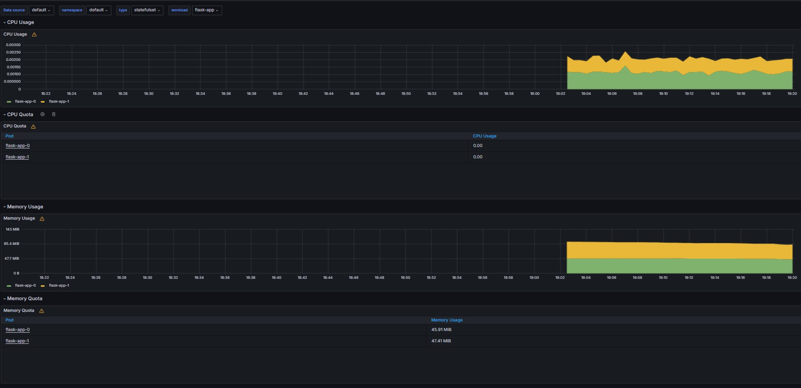

> Identify Pods with higher and lower CPU usage in the default namespace.

Plot of CPU Usage:
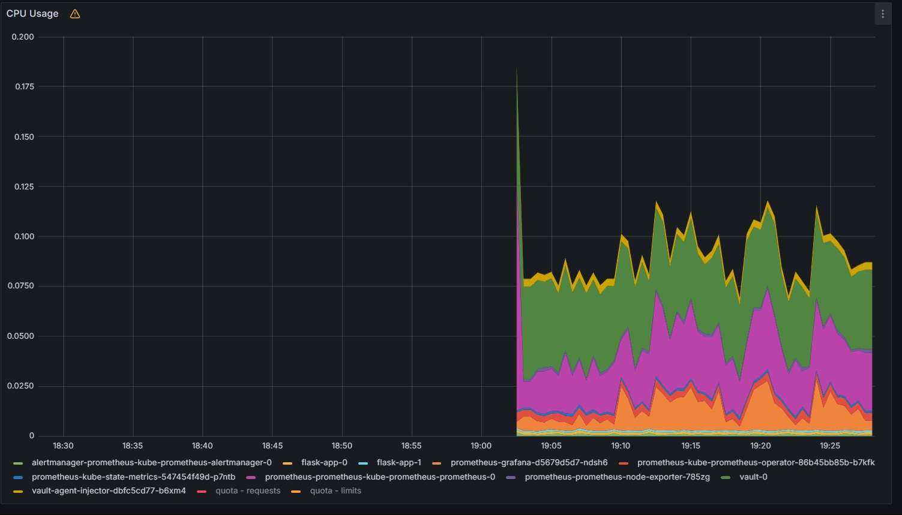

List of pods sorted by CPU usage:


> Monitor node memory usage in percentage and megabytes.

Node memory usage in megabytes:
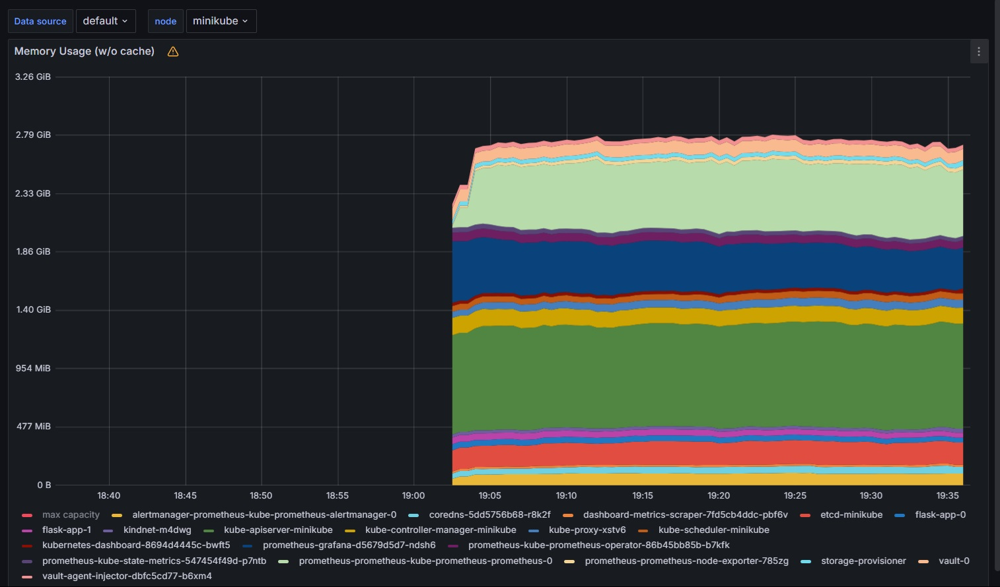

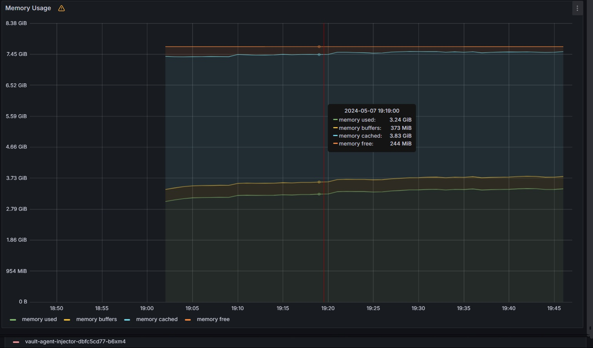

Node memory usage in percentage:
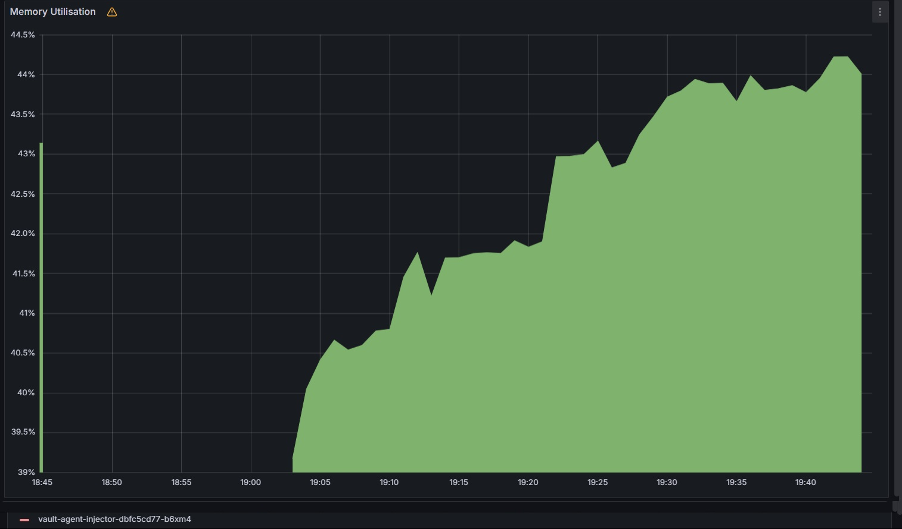

> Count the number of pods and containers managed by the Kubelet service.

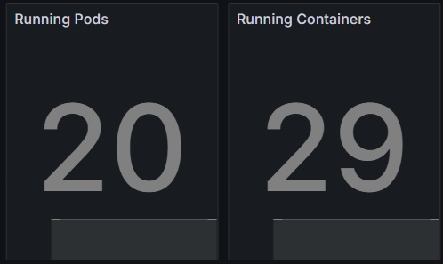

> Evaluate network usage of Pods in the default namespace.

Bandwidth and packages:
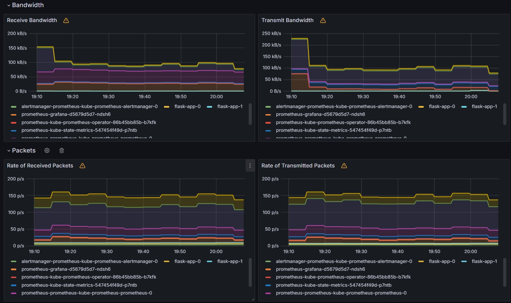

Status:
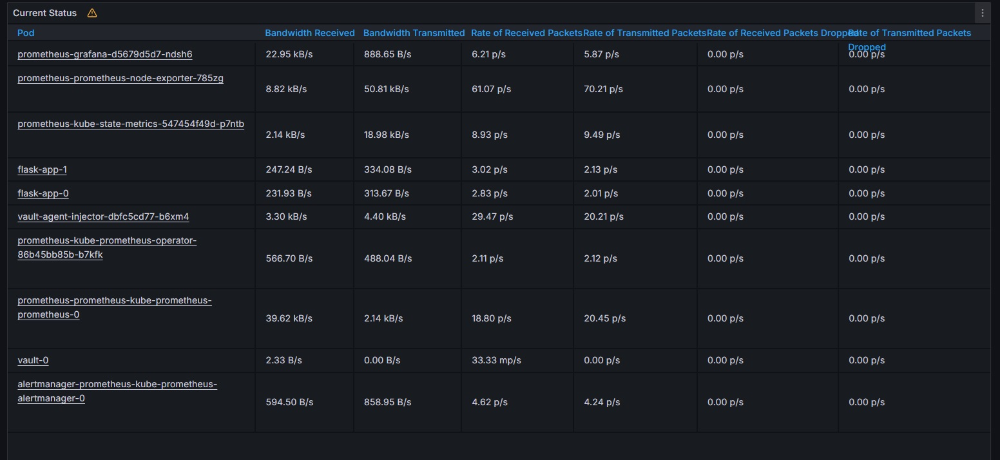

Rate of Bytes received/transmitted
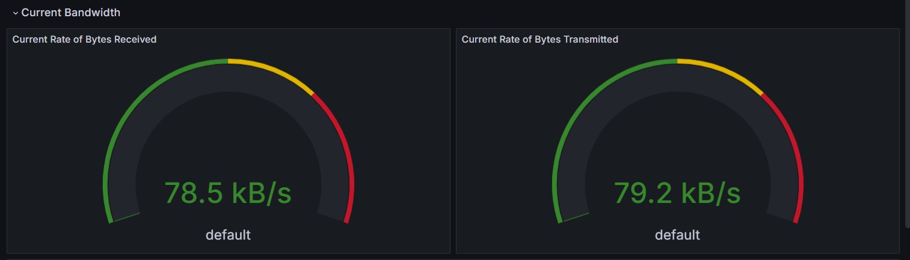

> Determine the number of active alerts; also check the Web UI with `minikube service monitoring-kube-prometheus-alertmanager`

Active alerts:
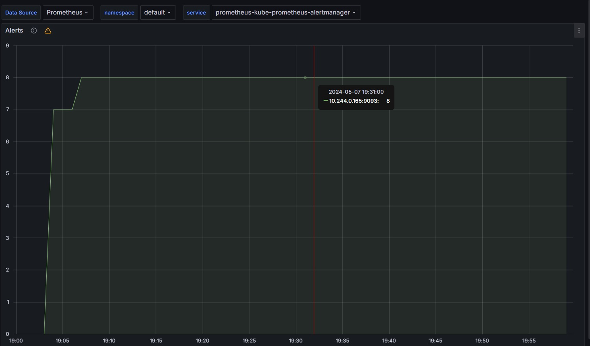

`minikube service monitoring-kube-prometheus-alertmanager`:
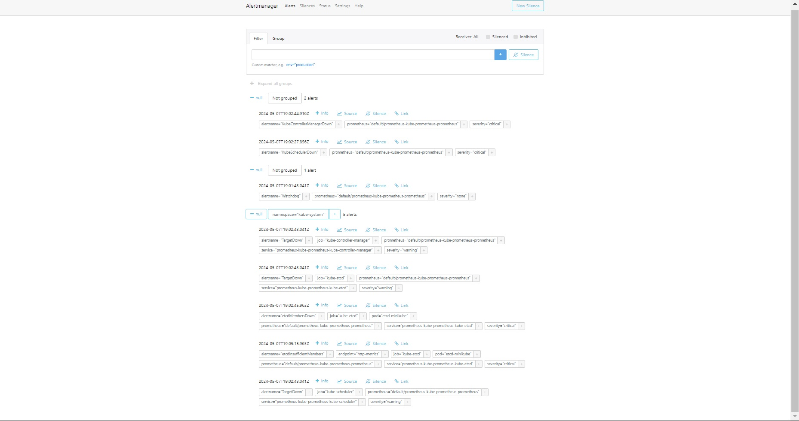

# Task 2
## `flask-app-0`
**Command:**
```bash
kubectl exec pod/flask-app-0 -- cat /init_data/index.html
```

**Output:**
```bash
Defaulted container "flask-app" out of: flask-app, install (init)
<html><head></head><body><header>
<title>http://info.cern.ch</title>
</header>

<h1>http://info.cern.ch - home of the first website</h1>
<p>From here you can:</p>
<ul>
<li><a href="http://info.cern.ch/hypertext/WWW/TheProject.html">Browse the first website</a></li>
<li><a href="http://line-mode.cern.ch/www/hypertext/WWW/TheProject.html">Browse the first website using the line-mode browser simulator</a></li>
<li><a href="http://home.web.cern.ch/topics/birth-web">Learn about the birth of the web</a></li>
<li><a href="http://home.web.cern.ch/about">Learn about CERN, the physics laboratory where the web was born</a></li>
</ul>
</body></html>
```
## flask-app-1
**Command:**
```bash
kubectl exec pod/flask-app-1 -- cat /init_data/index.html
```

**Output**
```bash
Defaulted container "flask-app" out of: flask-app, install (init)
<html><head></head><body><header>
<title>http://info.cern.ch</title>
</header>

<h1>http://info.cern.ch - home of the first website</h1>
<p>From here you can:</p>
<ul>
<li><a href="http://info.cern.ch/hypertext/WWW/TheProject.html">Browse the first website</a></li>
<li><a href="http://line-mode.cern.ch/www/hypertext/WWW/TheProject.html">Browse the first website using the line-mode browser simulator</a></li>
<li><a href="http://home.web.cern.ch/topics/birth-web">Learn about the birth of the web</a></li>
<li><a href="http://home.web.cern.ch/about">Learn about CERN, the physics laboratory where the web was born</a></li>
</ul>
</body></html>
```