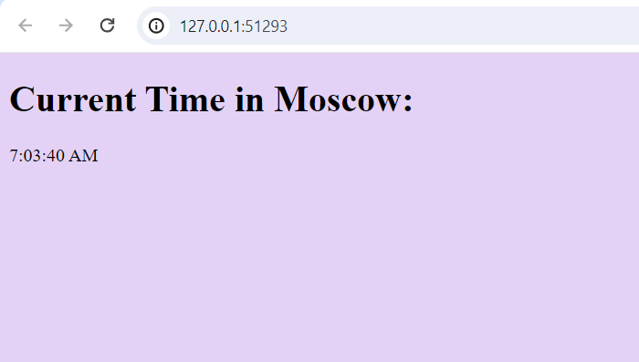
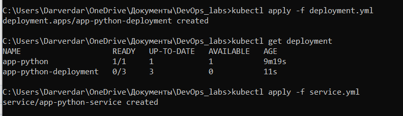
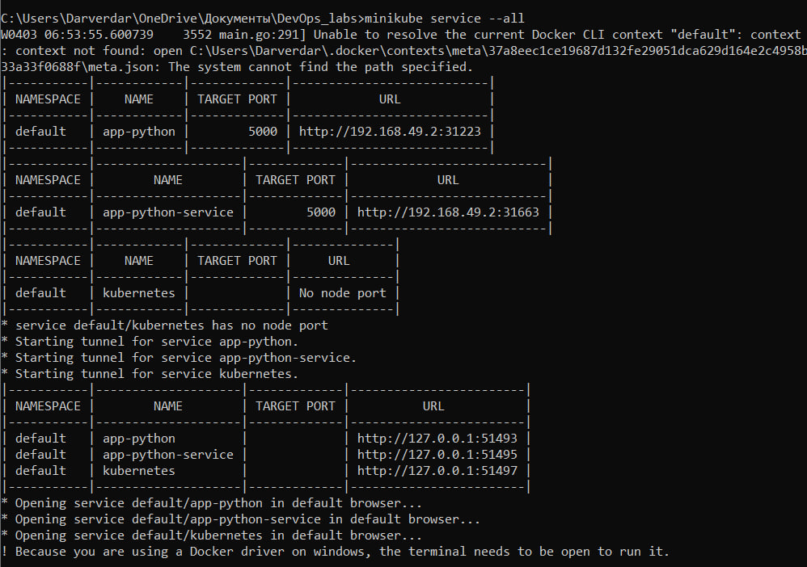
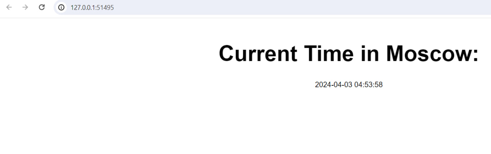
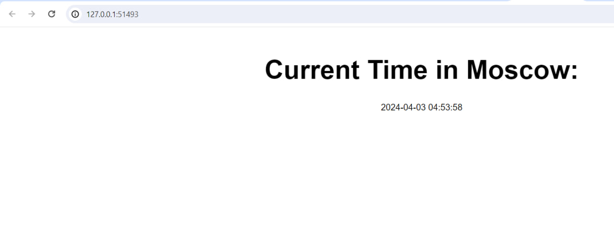
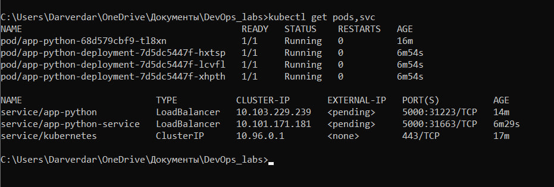
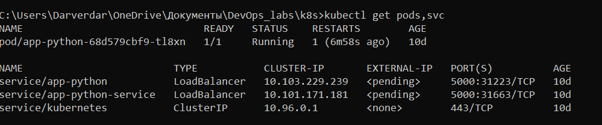
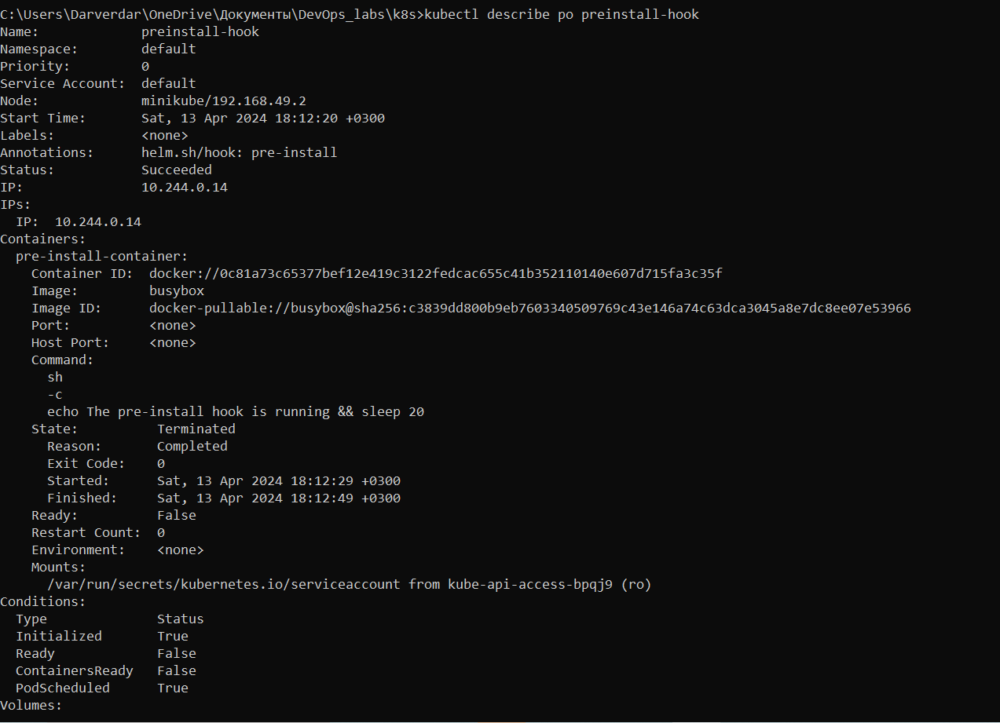

### Helm chart with monitoring installation

Install monitoring
```console
$ helm install monitoring prometheus-community/kube-prometheus-stack
```

Install my app
```console
$ helm secrets install moscowtime-web ./moscowtime-web/ -n default -f ./secrets.yaml
```

Check installation
```console
$ kubectl get po,sts,svc,pvc,cm
NAME                                                         READY   STATUS    RESTARTS   AGE
pod/alertmanager-monitoring-kube-prometheus-alertmanager-0   2/2     Running   0          97s
pod/monitoring-grafana-657659866f-phtmz                      3/3     Running   0          99s
pod/monitoring-kube-prometheus-operator-7f557c868d-p2zwx     1/1     Running   0          99s
pod/monitoring-kube-state-metrics-7fc7cf6558-7mftb           1/1     Running   0          99s
pod/monitoring-prometheus-node-exporter-xwkb2                1/1     Running   0          99s
pod/moscowtime-web-0                                         1/1     Running   0          36s
pod/moscowtime-web-1                                         1/1     Running   0          36s
pod/prometheus-monitoring-kube-prometheus-prometheus-0       2/2     Running   0          97s

NAME                                                                    READY   AGE
statefulset.apps/alertmanager-monitoring-kube-prometheus-alertmanager   1/1     97s
statefulset.apps/moscowtime-web                                         2/2     36s
statefulset.apps/prometheus-monitoring-kube-prometheus-prometheus       1/1     97s

NAME                                              TYPE        CLUSTER-IP       EXTERNAL-IP   PORT(S)                      AGE
service/alertmanager-operated                     ClusterIP   None             <none>        9093/TCP,9094/TCP,9094/UDP   97s
service/kubernetes                                ClusterIP   10.96.0.1        <none>        443/TCP                      33d
service/monitoring-grafana                        ClusterIP   10.110.20.252    <none>        80/TCP                       99s
service/monitoring-kube-prometheus-alertmanager   ClusterIP   10.101.99.191    <none>        9093/TCP,8080/TCP            99s
service/monitoring-kube-prometheus-operator       ClusterIP   10.109.72.27     <none>        443/TCP                      99s
service/monitoring-kube-prometheus-prometheus     ClusterIP   10.107.59.14     <none>        9090/TCP,8080/TCP            99s
service/monitoring-kube-state-metrics             ClusterIP   10.108.173.104   <none>        8080/TCP                     99s
service/monitoring-prometheus-node-exporter       ClusterIP   10.101.12.85     <none>        9100/TCP                     99s
service/moscowtime-web                            ClusterIP   10.96.233.35     <none>        8080/TCP                     36s
service/prometheus-operated                       ClusterIP   None             <none>        9090/TCP                     97s

NAME                                              STATUS   VOLUME                                     CAPACITY   ACCESS MODES   STORAGECLASS   AGE
persistentvolumeclaim/data-moscowtime-web-0       Bound    pvc-b2a851c9-c11e-417c-9006-0d0c51a61126   1Gi        RWO            standard       18m
persistentvolumeclaim/data-moscowtime-web-1       Bound    pvc-037c4360-31e6-4d2c-b0f3-509038f672af   1Gi        RWO            standard       18m
persistentvolumeclaim/visits-moscowtime-web-0     Bound    pvc-62687229-716a-4088-8f3a-f074e14a7db1   1Gi        RWO            standard       61m
persistentvolumeclaim/visits-moscowtime-web-1     Bound    pvc-63906eb1-765c-4f88-8cb3-d2f937e50af9   1Gi        RWO            standard       61m
persistentvolumeclaim/work-dir-moscowtime-web-0   Bound    pvc-a2f5874a-8b0b-4430-a719-ae032c4d4c55   1Gi        RWO            standard       115m
persistentvolumeclaim/work-dir-moscowtime-web-1   Bound    pvc-08237514-0b81-46fc-bac0-a1c1376c5598   1Gi        RWO            standard       115m

NAME                                                                     DATA   AGE
configmap/config                                                         1      36s
configmap/kube-root-ca.crt                                               1      33d
configmap/monitoring-grafana                                             1      99s
configmap/monitoring-grafana-config-dashboards                           1      99s
configmap/monitoring-kube-prometheus-alertmanager-overview               1      99s
configmap/monitoring-kube-prometheus-apiserver                           1      99s
configmap/monitoring-kube-prometheus-cluster-total                       1      99s
configmap/monitoring-kube-prometheus-controller-manager                  1      99s
configmap/monitoring-kube-prometheus-etcd                                1      99s
configmap/monitoring-kube-prometheus-grafana-datasource                  1      99s
configmap/monitoring-kube-prometheus-grafana-overview                    1      99s
configmap/monitoring-kube-prometheus-k8s-coredns                         1      99s
configmap/monitoring-kube-prometheus-k8s-resources-cluster               1      99s
configmap/monitoring-kube-prometheus-k8s-resources-multicluster          1      99s
configmap/monitoring-kube-prometheus-k8s-resources-namespace             1      99s
configmap/monitoring-kube-prometheus-k8s-resources-node                  1      99s
configmap/monitoring-kube-prometheus-k8s-resources-pod                   1      99s
configmap/monitoring-kube-prometheus-k8s-resources-workload              1      99s
configmap/monitoring-kube-prometheus-k8s-resources-workloads-namespace   1      99s
configmap/monitoring-kube-prometheus-kubelet                             1      99s
configmap/monitoring-kube-prometheus-namespace-by-pod                    1      99s
configmap/monitoring-kube-prometheus-namespace-by-workload               1      99s
configmap/monitoring-kube-prometheus-node-cluster-rsrc-use               1      99s
configmap/monitoring-kube-prometheus-node-rsrc-use                       1      99s
configmap/monitoring-kube-prometheus-nodes                               1      99s
configmap/monitoring-kube-prometheus-nodes-darwin                        1      99s
configmap/monitoring-kube-prometheus-persistentvolumesusage              1      99s
configmap/monitoring-kube-prometheus-pod-total                           1      99s
configmap/monitoring-kube-prometheus-prometheus                          1      99s
configmap/monitoring-kube-prometheus-proxy                               1      99s
configmap/monitoring-kube-prometheus-scheduler                           1      99s
configmap/monitoring-kube-prometheus-workload-total                      1      99s
configmap/prometheus-monitoring-kube-prometheus-prometheus-rulefiles-0   35     88s
```

Parts explanation:
1. list of pods currently running in the cluster.
1. list of stateful sets with their status and age
1. list of services with their cluster IPs and ports
1. list of volume claims
1. list of config maps with their data and age

### Metrics

#### a. Check CPU and Memory consumption of your StatefulSet
> Dashboards > Kubernetes / Compute Resources / Workload



#### b. Identify Pods with higher and lower CPU usage in the default namespace
> Dashboards > Kubernetes / Compute Resources / Namespace (Pods)


#### c. Monitor node memory usage in percentage and megabytes.
> Dashboards > Node Exporter / Nodes


#### d. Count the number of pods and containers managed by the Kubelet service.
> Dashboards > Kubernetes / Kubelet


#### e. Evaluate network usage of Pods in the default namespace.
> Dashboards > Kubernetes / Networking / Namespace (Pods)


#### f. Determine the number of active alerts; also check the Web UI with minikube service `monitoring-kube-prometheus-alertmanager`.
> Dashboards > Alertmanager / Overview



### Init containers

```console
$ kubectl exec moscowtime-web-0 -- cat /work-dir/
index.html
Defaulted container "moscowtime-web" out of: moscowtime-web, install (init), ping (init), pong (init)
<html><head></head><body><header>
<title>http://info.cern.ch</title>
</header>

<h1>http://info.cern.ch - home of the first website</h1>
<p>From here you can:</p>
<ul>
<li><a href="http://info.cern.ch/hypertext/WWW/TheProject.html">Browse the first website</a></li>
<li><a href="http://line-mode.cern.ch/www/hypertext/WWW/TheProject.html">Browse the first website using the line-mode browser simulator</a></li>
<li><a href="http://home.web.cern.ch/topics/birth-web">Learn about the birth of the web</a></li>
<li><a href="http://home.web.cern.ch/about">Learn about CERN, the physics laboratory where the web was born</a></li>
</ul>
</body></html>
````

Proof that init containers run in sequence:
```console
Defaulted container "moscowtime-web" out of: moscowtime-web, install (init), ping (init), pong (init)
ping
pong
```